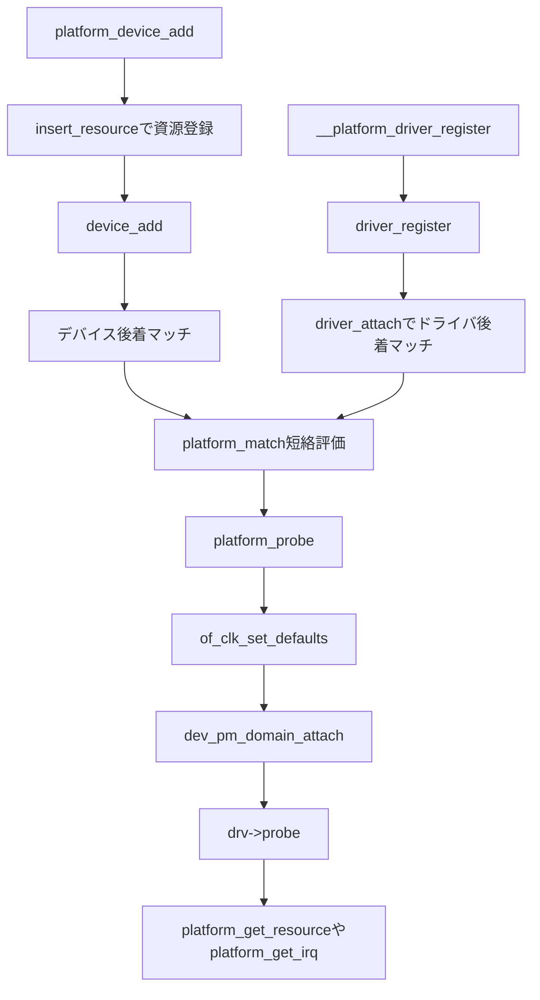

# 第13章 platform バスによるマッチと probe の実例

> 本章で読むソース
>
> - [`drivers/base/platform.c` L55-L67](https://github.com/gregkh/linux/blob/v6.18.38/drivers/base/platform.c#L55-L67)
> - [`drivers/base/platform.c` L171-L239](https://github.com/gregkh/linux/blob/v6.18.38/drivers/base/platform.c#L171-L239)
> - [`drivers/base/platform.c` L260-L270](https://github.com/gregkh/linux/blob/v6.18.38/drivers/base/platform.c#L260-L270)
> - [`drivers/base/platform.c` L656-L734](https://github.com/gregkh/linux/blob/v6.18.38/drivers/base/platform.c#L656-L734)
> - [`drivers/base/platform.c` L860-L867](https://github.com/gregkh/linux/blob/v6.18.38/drivers/base/platform.c#L860-L867)
> - [`drivers/base/platform.c` L1305-L1330](https://github.com/gregkh/linux/blob/v6.18.38/drivers/base/platform.c#L1305-L1330)
> - [`drivers/base/platform.c` L1351-L1386](https://github.com/gregkh/linux/blob/v6.18.38/drivers/base/platform.c#L1351-L1386)
> - [`drivers/base/platform.c` L1447-L1460](https://github.com/gregkh/linux/blob/v6.18.38/drivers/base/platform.c#L1447-L1460)

## この章の狙い

**platform バス**が discoverable でないデバイスを、Device Tree や ACPI や board コードからの登録で扱う具体例であることを示す。
第3部で学んだ match と probe の汎用機構が、`platform_bus_type` でどう実装されるかを追う。
`platform_device_add` と `__platform_driver_register` から `platform_match` と `platform_probe` へ合流する経路を固定する。

## 前提

[Device Tree からの platform device 列挙](../part02-enumeration/08-device-tree-platform.md) で DT からの `platform_device` 生成を読んでいること。
[デバイスプロパティと fwnode / software node](../part02-enumeration/07-device-property-fwnode.md) で `fwnode` が OF/ACPI マッチの入力になることを押さえていること。
[ドライバ登録と二方向マッチと async probe](10-driver-match-async-probe.md) の二方向マッチと [deferred probe](12-deferred-probe.md) の `-EPROBE_DEFER` 処理も接続点として参照する。

## platform_bus_type の操作集合

`platform_bus_type` は match、uevent、probe、remove、shutdown、DMA 設定、PM を束ねる。
`driver_override` が有効であり、ユーザー空間からのドライバ指定も扱える。

[`drivers/base/platform.c` L1447-L1460](https://github.com/gregkh/linux/blob/v6.18.38/drivers/base/platform.c#L1447-L1460)

```c
const struct bus_type platform_bus_type = {
	.name		= "platform",
	.dev_groups	= platform_dev_groups,
	.driver_override = true,
	.match		= platform_match,
	.uevent		= platform_uevent,
	.probe		= platform_probe,
	.remove		= platform_remove,
	.shutdown	= platform_shutdown,
	.dma_configure	= platform_dma_configure,
	.dma_cleanup	= platform_dma_cleanup,
	.pm		= &platform_dev_pm_ops,
};
EXPORT_SYMBOL_GPL(platform_bus_type);
```

## platform_match の短絡順序

`platform_match` は次の順で評価し、途中で確定したら後続へ進まない。

1. `device_match_driver_override`
2. `of_driver_match_device`
3. `acpi_driver_match_device`
4. `id_table`（存在すればその結果をそのまま返す）
5. `name` 比較

`driver_override` が設定されていれば、一致ドライバだけを許し、不一致でも後続へフォールバックしない。
OF または ACPI が一致すればそこで成功する。
`id_table` が存在する場合、不一致でも `name` へフォールバックしない。

[`drivers/base/platform.c` L1305-L1330](https://github.com/gregkh/linux/blob/v6.18.38/drivers/base/platform.c#L1305-L1330)

```c
static int platform_match(struct device *dev, const struct device_driver *drv)
{
	struct platform_device *pdev = to_platform_device(dev);
	struct platform_driver *pdrv = to_platform_driver(drv);
	int ret;

	/* When driver_override is set, only bind to the matching driver */
	ret = device_match_driver_override(dev, drv);
	if (ret >= 0)
		return ret;

	/* Attempt an OF style match first */
	if (of_driver_match_device(dev, drv))
		return 1;

	/* Then try ACPI style match */
	if (acpi_driver_match_device(dev, drv))
		return 1;

	/* Then try to match against the id table */
	if (pdrv->id_table)
		return platform_match_id(pdrv->id_table, pdev) != NULL;

	/* fall-back to driver name match */
	return (strcmp(pdev->name, drv->name) == 0);
}
```

第8章と第9章で作られた `fwnode` が、OF/ACPI マッチの入力としてここで効く。
DT の compatible 文字列や ACPI の HID が、汎用の `driver_match_device` から `platform_match` 経由で評価される。

## platform_device_add とリソース登録

`platform_device_add` は親と `platform_bus_type` を設定し、名前を決めてから各リソースを親 resource tree へ `insert_resource` する。
その後 `device_add` を呼び、二方向マッチのデバイス後着経路へ入る。
失敗時は自動 ID と挿入済み資源を巻き戻す。

[`drivers/base/platform.c` L656-L734](https://github.com/gregkh/linux/blob/v6.18.38/drivers/base/platform.c#L656-L734)

```c
int platform_device_add(struct platform_device *pdev)
{
	struct device *dev = &pdev->dev;
	u32 i;
	int ret;

	if (!dev->parent)
		dev->parent = &platform_bus;

	dev->bus = &platform_bus_type;

	switch (pdev->id) {
	default:
		dev_set_name(dev, "%s.%d", pdev->name,  pdev->id);
		break;
	case PLATFORM_DEVID_NONE:
		dev_set_name(dev, "%s", pdev->name);
		break;
	case PLATFORM_DEVID_AUTO:
		/*
		 * Automatically allocated device ID. We mark it as such so
		 * that we remember it must be freed, and we append a suffix
		 * to avoid namespace collision with explicit IDs.
		 */
		ret = ida_alloc(&platform_devid_ida, GFP_KERNEL);
		if (ret < 0)
			return ret;
		pdev->id = ret;
		pdev->id_auto = true;
		dev_set_name(dev, "%s.%d.auto", pdev->name, pdev->id);
		break;
	}

	for (i = 0; i < pdev->num_resources; i++) {
		struct resource *p, *r = &pdev->resource[i];

		if (r->name == NULL)
			r->name = dev_name(dev);

		p = r->parent;
		if (!p) {
			if (resource_type(r) == IORESOURCE_MEM)
				p = &iomem_resource;
			else if (resource_type(r) == IORESOURCE_IO)
				p = &ioport_resource;
		}

		if (p) {
			ret = insert_resource(p, r);
			if (ret) {
				dev_err(dev, "failed to claim resource %d: %pR\n", i, r);
				goto failed;
			}
		}
	}

	pr_debug("Registering platform device '%s'. Parent at %s\n", dev_name(dev),
		 dev_name(dev->parent));

	ret = device_add(dev);
	if (ret)
		goto failed;

	return 0;

 failed:
	if (pdev->id_auto) {
		ida_free(&platform_devid_ida, pdev->id);
		pdev->id = PLATFORM_DEVID_AUTO;
	}

	while (i--) {
		struct resource *r = &pdev->resource[i];
		if (r->parent)
			release_resource(r);
	}

	return ret;
}
```

## __platform_driver_register と二方向マッチ

`__platform_driver_register` は `owner` と `platform_bus_type` を設定して `driver_register` を呼ぶ。
`driver_register` は `bus_add_driver` と `driver_attach` を経由し、既存デバイスへのドライバ後着マッチへ入る。

[`drivers/base/platform.c` L860-L867](https://github.com/gregkh/linux/blob/v6.18.38/drivers/base/platform.c#L860-L867)

```c
int __platform_driver_register(struct platform_driver *drv,
				struct module *owner)
{
	drv->driver.owner = owner;
	drv->driver.bus = &platform_bus_type;

	return driver_register(&drv->driver);
}
```

デバイス登録とドライバ登録のどちらが先でも、第10章の二方向マッチが `platform_match` を通じて合流する。

## platform_probe の前処理

`platform_probe` は `drv->probe` を呼ぶ前に OF clock の既定値設定と PM domain の attach を行う。
`platform_driver_probe` で登録された古い形式のドライバは `platform_probe_fail` が設定され、clock も PM も準備せず `-ENXIO` を返す。

[`drivers/base/platform.c` L1351-L1386](https://github.com/gregkh/linux/blob/v6.18.38/drivers/base/platform.c#L1351-L1386)

```c
static int platform_probe(struct device *_dev)
{
	struct platform_driver *drv = to_platform_driver(_dev->driver);
	struct platform_device *dev = to_platform_device(_dev);
	int ret;

	/*
	 * A driver registered using platform_driver_probe() cannot be bound
	 * again later because the probe function usually lives in __init code
	 * and so is gone. For these drivers .probe is set to
	 * platform_probe_fail in __platform_driver_probe(). Don't even prepare
	 * clocks and PM domains for these to match the traditional behaviour.
	 */
	if (unlikely(drv->probe == platform_probe_fail))
		return -ENXIO;

	ret = of_clk_set_defaults(_dev->of_node, false);
	if (ret < 0)
		return ret;

	ret = dev_pm_domain_attach(_dev, PD_FLAG_ATTACH_POWER_ON |
					 PD_FLAG_DETACH_POWER_OFF);
	if (ret)
		goto out;

	if (drv->probe)
		ret = drv->probe(dev);

out:
	if (drv->prevent_deferred_probe && ret == -EPROBE_DEFER) {
		dev_warn(_dev, "probe deferral not supported\n");
		ret = -ENXIO;
	}

	return ret;
}
```

`prevent_deferred_probe` が有効なドライバでは `-EPROBE_DEFER` を `-ENXIO` に変換する。
第12章の deferred probe リストへ入らず、マッチ拒否として扱われる接続点である。

## probe 内のリソース取得

### platform_get_resource

`platform_get_resource` は `pdev->resource` 配列を type と通し番号で線形検索する。
メモリや I/O のベースアドレス取得に使う定型 API である。

[`drivers/base/platform.c` L55-L67](https://github.com/gregkh/linux/blob/v6.18.38/drivers/base/platform.c#L55-L67)

```c
struct resource *platform_get_resource(struct platform_device *dev,
				       unsigned int type, unsigned int num)
{
	u32 i;

	for (i = 0; i < dev->num_resources; i++) {
		struct resource *r = &dev->resource[i];

		if (type == resource_type(r) && num-- == 0)
			return r;
	}
	return NULL;
}
```

### platform_get_irq と fwnode 経路

`platform_get_irq` は `platform_get_irq_optional` を呼び、失敗時にエラーメッセージを付けるラッパーである。
`platform_get_irq_optional` はまず `dev_fwnode` から OF なら `of_irq_get` を試す。
fwnode 経路で IRQ が得られなければ `IORESOURCE_IRQ` リソースへフォールバックする。
単なる resource 配列検索だけではない。

[`drivers/base/platform.c` L171-L239](https://github.com/gregkh/linux/blob/v6.18.38/drivers/base/platform.c#L171-L239)

```c
int platform_get_irq_optional(struct platform_device *dev, unsigned int num)
{
	int ret;
#ifdef CONFIG_SPARC
	/* sparc does not have irqs represented as IORESOURCE_IRQ resources */
	if (!dev || num >= dev->archdata.num_irqs)
		goto out_not_found;
	ret = dev->archdata.irqs[num];
	goto out;
#else
	struct fwnode_handle *fwnode = dev_fwnode(&dev->dev);
	struct resource *r;

	if (is_of_node(fwnode)) {
		ret = of_irq_get(to_of_node(fwnode), num);
		if (ret > 0 || ret == -EPROBE_DEFER)
			goto out;
	}

	r = platform_get_resource(dev, IORESOURCE_IRQ, num);
	if (is_acpi_device_node(fwnode)) {
		if (r && r->flags & IORESOURCE_DISABLED) {
			ret = acpi_irq_get(ACPI_HANDLE_FWNODE(fwnode), num, r);
			if (ret)
				goto out;
		}
	}

	/*
	 * The resources may pass trigger flags to the irqs that need
	 * to be set up. It so happens that the trigger flags for
	 * IORESOURCE_BITS correspond 1-to-1 to the IRQF_TRIGGER*
	 * settings.
	 */
	if (r && r->flags & IORESOURCE_BITS) {
		struct irq_data *irqd;

		irqd = irq_get_irq_data(r->start);
		if (!irqd)
			goto out_not_found;
		irqd_set_trigger_type(irqd, r->flags & IORESOURCE_BITS);
	}

	if (r) {
		ret = r->start;
		goto out;
	}

	/*
	 * For the index 0 interrupt, allow falling back to GpioInt
	 * resources. While a device could have both Interrupt and GpioInt
	 * resources, making this fallback ambiguous, in many common cases
	 * the device will only expose one IRQ, and this fallback
	 * allows a common code path across either kind of resource.
	 */
	if (num == 0 && is_acpi_device_node(fwnode)) {
		ret = acpi_dev_gpio_irq_get(to_acpi_device_node(fwnode), num);
		/* Our callers expect -ENXIO for missing IRQs. */
		if (ret >= 0 || ret == -EPROBE_DEFER)
			goto out;
	}

#endif
out_not_found:
	ret = -ENXIO;
out:
	if (WARN(!ret, "0 is an invalid IRQ number\n"))
		return -EINVAL;
	return ret;
}
```

[`drivers/base/platform.c` L260-L270](https://github.com/gregkh/linux/blob/v6.18.38/drivers/base/platform.c#L260-L270)

```c
int platform_get_irq(struct platform_device *dev, unsigned int num)
{
	int ret;

	ret = platform_get_irq_optional(dev, num);
	if (ret < 0)
		return dev_err_probe(&dev->dev, ret,
				     "IRQ index %u not found\n", num);

	return ret;
}
```

`of_irq_get` が `-EPROBE_DEFER` を返せば、そのまま上位の deferred probe へ伝播する。

## 発展注記

**auxiliary バス**は、親ドライバが `auxiliary_device` を公開し `auxiliary_driver` とバインドする別経路である。
複数サブデバイスを親の probe 内で段階的に立ち上げる用途に使われる。

**component フレームワーク**は、複数の component を master ドライバの `bind_all` で束ねる仕組みである。
表示系など、複数 IP ブロックの準備完了を待ってから master を動かす場面で使われる。

本章の範囲では platform バスの match と probe を押さえ、これらは別のバスと束ね機構として存在する点だけ示す。

## 処理の流れ



## 高速化と最適化の工夫

`platform_device_add` が各リソースを親 resource tree へ `insert_resource` するのは、アドレス範囲の衝突を登録時に検出するためである。
probe 時やランタイムまで発見を遅らせると、複数デバイスが同じ物理アドレスを掴んだ状態が長く残る。
登録段階で global resource tree と突き合わせることで、衝突は早期に失敗として返る。

## まとめ

platform バスは discoverable でない on-chip デバイスを扱う具体例である。
`platform_match` は override、OF、ACPI、id_table、name の短絡順序でマッチする。
`platform_device_add` は資源を resource tree へ挿入してから `device_add` し、`__platform_driver_register` は `driver_register` へ合流する。
`platform_probe` は clock と PM を準備してから `drv->probe` を呼び、`platform_get_irq` は fwnode 経路を優先する。

## 関連する章

- [Device Tree からの platform device 列挙](../part02-enumeration/08-device-tree-platform.md)
- [ドライバ登録と二方向マッチと async probe](10-driver-match-async-probe.md)
- [deferred probe](12-deferred-probe.md)
- [really_probe とバインドの中核](11-really-probe.md)
