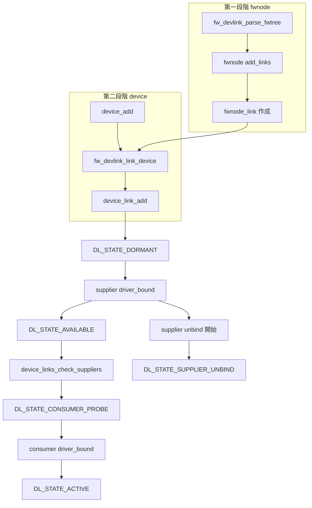

# 第14章 device links と fw_devlink

> 本章で読むソース
>
> - [`include/linux/device.h` L322-L329](https://github.com/gregkh/linux/blob/v6.18.38/include/linux/device.h#L322-L329)
> - [`include/linux/device.h` L758-L770](https://github.com/gregkh/linux/blob/v6.18.38/include/linux/device.h#L758-L770)
> - [`drivers/base/core.c` L727-L748](https://github.com/gregkh/linux/blob/v6.18.38/drivers/base/core.c#L727-L748)
> - [`drivers/base/core.c` L782-L788](https://github.com/gregkh/linux/blob/v6.18.38/drivers/base/core.c#L782-L788)
> - [`drivers/base/core.c` L334-L375](https://github.com/gregkh/linux/blob/v6.18.38/drivers/base/core.c#L334-L375)
> - [`drivers/base/core.c` L904-L914](https://github.com/gregkh/linux/blob/v6.18.38/drivers/base/core.c#L904-L914)
> - [`drivers/base/core.c` L1050-L1099](https://github.com/gregkh/linux/blob/v6.18.38/drivers/base/core.c#L1050-L1099)
> - [`drivers/base/core.c` L1330-L1349](https://github.com/gregkh/linux/blob/v6.18.38/drivers/base/core.c#L1330-L1349)
> - [`drivers/base/core.c` L1456-L1480](https://github.com/gregkh/linux/blob/v6.18.38/drivers/base/core.c#L1456-L1480)
> - [`drivers/base/core.c` L1493-L1522](https://github.com/gregkh/linux/blob/v6.18.38/drivers/base/core.c#L1493-L1522)
> - [`drivers/base/core.c` L1578-L1615](https://github.com/gregkh/linux/blob/v6.18.38/drivers/base/core.c#L1578-L1615)
> - [`drivers/base/core.c` L1724-L1741](https://github.com/gregkh/linux/blob/v6.18.38/drivers/base/core.c#L1724-L1741)
> - [`drivers/base/core.c` L2316-L2329](https://github.com/gregkh/linux/blob/v6.18.38/drivers/base/core.c#L2316-L2329)
> - [`drivers/base/core.c` L3686-L3689](https://github.com/gregkh/linux/blob/v6.18.38/drivers/base/core.c#L3686-L3689)

## この章の狙い

**device links** が supplier と consumer の依存関係を driver core に明示し、probe 順序、unbind 順序、runtime PM 依存を制御する仕組みであることを固定する。
**fw_devlink** がファームウェア記述から依存を二段階で生成し、`device_link_add` へ変換する流れを追う。
`device_links_check_suppliers` とリンク状態遷移を、第11章の `really_probe` と第16章の unbind へ接続する。

## 前提

[really_probe とバインドの中核](../part03-probe/11-really-probe.md) で `device_links_check_suppliers` の呼び出し位置を読んでいること。
[デバイスプロパティと fwnode / software node](../part02-enumeration/07-device-property-fwnode.md) で `fwnode` と `add_links` 操作を押さえていること。

## device link のデータ構造

`struct device_link` は supplier と consumer の両端、状態、フラグを保持する。
`enum device_link_state` がリンクのライフサイクル状態を表す。

[`include/linux/device.h` L322-L329](https://github.com/gregkh/linux/blob/v6.18.38/include/linux/device.h#L322-L329)

```c
enum device_link_state {
	DL_STATE_NONE = -1,
	DL_STATE_DORMANT = 0,
	DL_STATE_AVAILABLE,
	DL_STATE_CONSUMER_PROBE,
	DL_STATE_ACTIVE,
	DL_STATE_SUPPLIER_UNBIND,
};
```

[`include/linux/device.h` L758-L770](https://github.com/gregkh/linux/blob/v6.18.38/include/linux/device.h#L758-L770)

```c
struct device_link {
	struct device *supplier;
	struct list_head s_node;
	struct device *consumer;
	struct list_head c_node;
	struct device link_dev;
	enum device_link_state status;
	u32 flags;
	refcount_t rpm_active;
	struct kref kref;
	struct work_struct rm_work;
	bool supplier_preactivated; /* Owned by consumer probe. */
};
```

`DL_FLAG_MANAGED` は呼び出し側が指定するフラグではなく、STATELESS でない link に `device_link_add` が内部で付与する管理状態である。

## device_link_add のフラグと副作用

`device_link_add` は consumer と supplier の明示的リンクを生成する。
STATELESS でない link には `DL_FLAG_MANAGED` を内部付与する。
`DL_FLAG_AUTOREMOVE_SUPPLIER` と `DL_FLAG_AUTOREMOVE_CONSUMER` が両方指定されたら supplier 側を優先する。
既存 link があれば新規作成せず、flags と寿命を統合する。

[`drivers/base/core.c` L727-L748](https://github.com/gregkh/linux/blob/v6.18.38/drivers/base/core.c#L727-L748)

```c
struct device_link *device_link_add(struct device *consumer,
				    struct device *supplier, u32 flags)
{
	struct device_link *link;

	if (!consumer || !supplier || consumer == supplier ||
	    flags & ~DL_ADD_VALID_FLAGS ||
	    (flags & DL_FLAG_STATELESS && flags & DL_MANAGED_LINK_FLAGS) ||
	    (flags & DL_FLAG_AUTOPROBE_CONSUMER &&
	     flags & (DL_FLAG_AUTOREMOVE_CONSUMER |
		      DL_FLAG_AUTOREMOVE_SUPPLIER)))
		return NULL;

	if (flags & DL_FLAG_PM_RUNTIME && flags & DL_FLAG_RPM_ACTIVE) {
		if (pm_runtime_get_sync(supplier) < 0) {
			pm_runtime_put_noidle(supplier);
			return NULL;
		}
	}

	if (!(flags & DL_FLAG_STATELESS))
		flags |= DL_FLAG_MANAGED;
```

[`drivers/base/core.c` L782-L788](https://github.com/gregkh/linux/blob/v6.18.38/drivers/base/core.c#L782-L788)

```c
	/*
	 * DL_FLAG_AUTOREMOVE_SUPPLIER indicates that the link will be needed
	 * longer than for DL_FLAG_AUTOREMOVE_CONSUMER and setting them both
	 * together doesn't make sense, so prefer DL_FLAG_AUTOREMOVE_SUPPLIER.
	 */
	if (flags & DL_FLAG_AUTOREMOVE_SUPPLIER)
		flags &= ~DL_FLAG_AUTOREMOVE_CONSUMER;
```

link 作成の副作用として、新規作成の通常経路では、`device_reorder_to_tail` が consumer とその子 device、および `DL_FLAG_SYNC_STATE_ONLY` でない link で連なる下流 consumer を、再帰的に `devices_kset` と `dpm_list` の末尾へ移す。
新規の `DL_FLAG_SYNC_STATE_ONLY` link はこの並べ替えより前に return するが、既存の managed `DL_FLAG_SYNC_STATE_ONLY` link へ `DL_FLAG_STATELESS` を加える経路や、既存 link を通常 link へ昇格する経路は並べ替えへ進む。
PM 順序は probe 時のグラフ探索ではなく、link 作成時のリスト並べ替えで反映される。

[`drivers/base/core.c` L904-L914](https://github.com/gregkh/linux/blob/v6.18.38/drivers/base/core.c#L904-L914)

```c
reorder:
	/*
	 * Move the consumer and all of the devices depending on it to the end
	 * of dpm_list and the devices_kset list.
	 *
	 * It is necessary to hold dpm_list locked throughout all that or else
	 * we may end up suspending with a wrong ordering of it.
	 */
	device_reorder_to_tail(consumer, NULL);

	dev_dbg(consumer, "Linked as a consumer to %s\n", dev_name(supplier));
```

`DL_FLAG_PM_RUNTIME` が設定された link は runtime PM フレームワークが参照する。
runtime PM の状態機械本体は [電源管理と CPU ライフサイクル](../../power-cpu/README.md) へ委譲する。

## fw_devlink の二段階生成

fw_devlink は一段階にまとめられない。
第一段階と第二段階で役割が分かれる。

### 第一段階：fwnode_link の構築

`fw_devlink_parse_fwtree` が各 fwnode に `fw_devlink_parse_fwnode` を呼ぶ。
`fwnode` の `add_links` 操作（DT や ACPI の実装）がファームウェア参照を解析し、`fwnode_link` の supplier と consumer 関係を作る。

[`drivers/base/core.c` L1724-L1741](https://github.com/gregkh/linux/blob/v6.18.38/drivers/base/core.c#L1724-L1741)

```c
static void fw_devlink_parse_fwnode(struct fwnode_handle *fwnode)
{
	if (fwnode_test_flag(fwnode, FWNODE_FLAG_LINKS_ADDED))
		return;

	fwnode_call_int_op(fwnode, add_links);
	fwnode_set_flag(fwnode, FWNODE_FLAG_LINKS_ADDED);
}

static void fw_devlink_parse_fwtree(struct fwnode_handle *fwnode)
{
	struct fwnode_handle *child = NULL;

	fw_devlink_parse_fwnode(fwnode);

	while ((child = fwnode_get_next_available_child_node(fwnode, child)))
		fw_devlink_parse_fwtree(child);
}
```

### 第二段階：struct device への変換

`device_add` が fwnode と `struct device` を結び付けた位置で `fw_devlink_link_device` を呼ぶ。
`__fw_devlink_link_to_consumers` と `__fw_devlink_link_to_suppliers` が両端に `struct device` が揃った関係を `fw_devlink_create_devlink` 経由で `device_link_add` へ渡す。
consumer が未登場の関係は `fwnode_link` のまま残り、必要に応じて親 device との SYNC_STATE_ONLY proxy link を作る。

[`drivers/base/core.c` L3686-L3689](https://github.com/gregkh/linux/blob/v6.18.38/drivers/base/core.c#L3686-L3689)

```c
	if (dev->fwnode && !dev->fwnode->dev) {
		dev->fwnode->dev = dev;
		fw_devlink_link_device(dev);
	}
```

[`drivers/base/core.c` L2316-L2329](https://github.com/gregkh/linux/blob/v6.18.38/drivers/base/core.c#L2316-L2329)

```c
static void fw_devlink_link_device(struct device *dev)
{
	struct fwnode_handle *fwnode = dev->fwnode;

	if (!fw_devlink_flags)
		return;

	fw_devlink_parse_fwtree(fwnode);

	guard(mutex)(&fwnode_link_lock);

	__fw_devlink_link_to_consumers(dev);
	__fw_devlink_link_to_suppliers(dev, fwnode);
}
```

## device_links_check_suppliers

`really_probe` の前処理で呼ばれる。
まず `fwnode_links_check_suppliers` が device link へ未変換の supplier fwnode を検査する。
未充足かつ best effort でなければ `-EPROBE_DEFER` を返す。

次に managed device links を走査する。
`AVAILABLE` でなく `SYNC_STATE_ONLY` でもない link は未充足として通常 `-EPROBE_DEFER` になる。
best effort の inferred link で supplier が `can_match` 不可なら `-EAGAIN` を記録して走査を継続する。

[`drivers/base/core.c` L1050-L1099](https://github.com/gregkh/linux/blob/v6.18.38/drivers/base/core.c#L1050-L1099)

```c
int device_links_check_suppliers(struct device *dev)
{
	struct device_link *link;
	int ret = 0, fwnode_ret = 0;
	struct fwnode_handle *sup_fw;

	/*
	 * Device waiting for supplier to become available is not allowed to
	 * probe.
	 */
	scoped_guard(mutex, &fwnode_link_lock) {
		sup_fw = fwnode_links_check_suppliers(dev->fwnode);
		if (sup_fw) {
			if (dev_is_best_effort(dev))
				fwnode_ret = -EAGAIN;
			else
				return dev_err_probe(dev, -EPROBE_DEFER,
						     "wait for supplier %pfwf\n", sup_fw);
		}
	}

	device_links_write_lock();

	list_for_each_entry(link, &dev->links.suppliers, c_node) {
		if (!device_link_test(link, DL_FLAG_MANAGED))
			continue;

		if (link->status != DL_STATE_AVAILABLE &&
		    !device_link_test(link, DL_FLAG_SYNC_STATE_ONLY)) {

			if (dev_is_best_effort(dev) &&
			    device_link_test(link, DL_FLAG_INFERRED) &&
			    !link->supplier->can_match) {
				ret = -EAGAIN;
				continue;
			}

			device_links_missing_supplier(dev);
			ret = dev_err_probe(dev, -EPROBE_DEFER,
					    "supplier %s not ready\n", dev_name(link->supplier));
			break;
		}
		WRITE_ONCE(link->status, DL_STATE_CONSUMER_PROBE);
	}
	dev->links.status = DL_DEV_PROBING;

	device_links_write_unlock();

	return ret ? ret : fwnode_ret;
}
```

`really_probe` は `-EPROBE_DEFER` なら直ちに延期する。
best effort の `-EAGAIN` は probe 失敗時だけ `-EPROBE_DEFER` 扱いになる（第11章と第12章の接続点）。

## リンク状態遷移

通常の主経路は次のとおりである。

1. 両ドライバなしで作られた link は `DORMANT`。
2. supplier の `driver_bound` が consumer 向け link を `AVAILABLE` にする。
3. consumer の `device_links_check_suppliers` が `AVAILABLE` を `CONSUMER_PROBE` にする。
4. consumer の `driver_bound` が supplier 向け link を `ACTIVE` にする。
5. consumer probe 失敗は `device_links_no_driver` が `AVAILABLE` または `DORMANT` へ戻す。
6. supplier unbind 開始で非稼働 link を `SUPPLIER_UNBIND` にし、稼働 consumer を先に unbind する（第16章）。

probe 中に作られた link は `device_link_init_status` が device 状態に応じて `CONSUMER_PROBE`、`ACTIVE`、`AVAILABLE` を初期値にする例外経路がある。

[`drivers/base/core.c` L334-L375](https://github.com/gregkh/linux/blob/v6.18.38/drivers/base/core.c#L334-L375)

```c
static void device_link_init_status(struct device_link *link,
				    struct device *consumer,
				    struct device *supplier)
{
	switch (supplier->links.status) {
	case DL_DEV_PROBING:
		switch (consumer->links.status) {
		case DL_DEV_PROBING:
			/*
			 * A consumer driver can create a link to a supplier
			 * that has not completed its probing yet as long as it
			 * knows that the supplier is already functional (for
			 * example, it has just acquired some resources from the
			 * supplier).
			 */
			link->status = DL_STATE_CONSUMER_PROBE;
			break;
		default:
			link->status = DL_STATE_DORMANT;
			break;
		}
		break;
	case DL_DEV_DRIVER_BOUND:
		switch (consumer->links.status) {
		case DL_DEV_PROBING:
			link->status = DL_STATE_CONSUMER_PROBE;
			break;
		case DL_DEV_DRIVER_BOUND:
			link->status = DL_STATE_ACTIVE;
			break;
		default:
			link->status = DL_STATE_AVAILABLE;
			break;
		}
		break;
	case DL_DEV_UNBINDING:
		link->status = DL_STATE_SUPPLIER_UNBIND;
		break;
	default:
		link->status = DL_STATE_DORMANT;
		break;
	}
}
```

supplier バインド成功時、consumer 向け link を `AVAILABLE` に更新する。

[`drivers/base/core.c` L1330-L1349](https://github.com/gregkh/linux/blob/v6.18.38/drivers/base/core.c#L1330-L1349)

```c
	list_for_each_entry(link, &dev->links.consumers, s_node) {
		if (!device_link_test(link, DL_FLAG_MANAGED))
			continue;

		/*
		 * Links created during consumer probe may be in the "consumer
		 * probe" state to start with if the supplier is still probing
		 * when they are created and they may become "active" if the
		 * consumer probe returns first.  Skip them here.
		 */
		if (link->status == DL_STATE_CONSUMER_PROBE ||
		    link->status == DL_STATE_ACTIVE)
			continue;

		WARN_ON(link->status != DL_STATE_DORMANT);
		WRITE_ONCE(link->status, DL_STATE_AVAILABLE);

		if (device_link_test(link, DL_FLAG_AUTOPROBE_CONSUMER))
			driver_deferred_probe_add(link->consumer);
	}
```

probe 失敗時は `device_links_no_driver` が supplier 向け link を `AVAILABLE` または `DORMANT` へ戻す。

[`drivers/base/core.c` L1456-L1480](https://github.com/gregkh/linux/blob/v6.18.38/drivers/base/core.c#L1456-L1480)

```c
void device_links_no_driver(struct device *dev)
{
	struct device_link *link;

	device_links_write_lock();

	list_for_each_entry(link, &dev->links.consumers, s_node) {
		if (!device_link_test(link, DL_FLAG_MANAGED))
			continue;

		/*
		 * The probe has failed, so if the status of the link is
		 * "consumer probe" or "active", it must have been added by
		 * a probing consumer while this device was still probing.
		 * Change its state to "dormant", as it represents a valid
		 * relationship, but it is not functionally meaningful.
		 */
		if (link->status == DL_STATE_CONSUMER_PROBE ||
		    link->status == DL_STATE_ACTIVE)
			WRITE_ONCE(link->status, DL_STATE_DORMANT);
	}

	__device_links_no_driver(dev);

	device_links_write_unlock();
}
```

## sync_state の概観

`sync_state` は supplier が全 managed consumer の `ACTIVE` を確認したうえで遅延実行される。
fw_devlink が fwnode から把握した consumer と、登録済み device を対象に supplier callback を遅らせる機構である。
未知の未来 device まで一括で待つわけではない。

## 処理の流れ



## 高速化と最適化の工夫

fw_devlink は静的な fwnode 参照を先に `fwnode_link` として記録し、`struct device` が揃い次第 managed device link へ変換する。
依存先が未準備の probe は入口の `device_links_check_suppliers` で止まる。
各ドライバが依存順を重複実装する必要と、準備前に probe 本体へ入って失敗する回数を減らせる。
deferred probe の pending 再試行自体は残るため、総当たりの再試行をなくすわけではない。
不要な probe 本体の実行を減らす点が効く。

## まとめ

device links は supplier と consumer の依存を明示し、probe と unbind の順序を制御する。
fw_devlink は fwnode_link の構築と device link への変換の二段階で依存を記録する。
`DL_FLAG_MANAGED` は内部付与であり、`device_link_add` はリスト並べ替えも行う。
`device_links_check_suppliers` は fwnode 未変換分と managed link の両方を検査する。
状態遷移は DORMANT から ACTIVE へ進み、probe 中作成は `device_link_init_status` が例外を扱う。

## 関連する章

- [really_probe とバインドの中核](../part03-probe/11-really-probe.md)
- [deferred probe](../part03-probe/12-deferred-probe.md)
- [devres によるマネージドリソース](15-devres.md)
- [unbind と remove とデバイス削除](16-unbind-remove-del.md)
