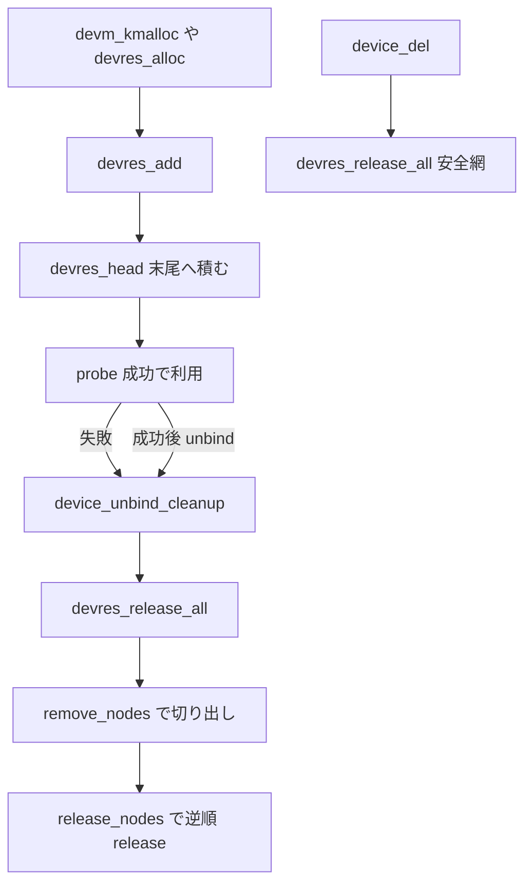

# 第15章 devres によるマネージドリソース

> 本章で読むソース
>
> - [`drivers/base/devres.c` L19-L36](https://github.com/gregkh/linux/blob/v6.18.38/drivers/base/devres.c#L19-L36)
> - [`drivers/base/devres.c` L162-L172](https://github.com/gregkh/linux/blob/v6.18.38/drivers/base/devres.c#L162-L172)
> - [`drivers/base/devres.c` L223-L231](https://github.com/gregkh/linux/blob/v6.18.38/drivers/base/devres.c#L223-L231)
> - [`drivers/base/devres.c` L243-L251](https://github.com/gregkh/linux/blob/v6.18.38/drivers/base/devres.c#L243-L251)
> - [`drivers/base/devres.c` L435-L459](https://github.com/gregkh/linux/blob/v6.18.38/drivers/base/devres.c#L435-L459)
> - [`drivers/base/devres.c` L496-L507](https://github.com/gregkh/linux/blob/v6.18.38/drivers/base/devres.c#L496-L507)
> - [`drivers/base/devres.c` L517-L536](https://github.com/gregkh/linux/blob/v6.18.38/drivers/base/devres.c#L517-L536)
> - [`drivers/base/devres.c` L672-L706](https://github.com/gregkh/linux/blob/v6.18.38/drivers/base/devres.c#L672-L706)
> - [`drivers/base/devres.c` L856-L875](https://github.com/gregkh/linux/blob/v6.18.38/drivers/base/devres.c#L856-L875)
> - [`drivers/base/dd.c` L608-L621](https://github.com/gregkh/linux/blob/v6.18.38/drivers/base/dd.c#L608-L621)
> - [`drivers/base/core.c` L3900-L3910](https://github.com/gregkh/linux/blob/v6.18.38/drivers/base/core.c#L3900-L3910)

## この章の狙い

**devres** がデバイスまたはドライバの寿命に紐づけてリソースを確保し、unbind や削除で自動解放する仕組みであることを固定する。
`devm_kmalloc` などのマネージド API が `devres_head` へ積む構造と、逆順解放の流れを追う。
解放時点が driver 寿命だけでなく device 寿命側にも安全網がある点も明示する。

## 前提

[really_probe とバインドの中核](../part03-probe/11-really-probe.md) で probe 失敗時の `device_unbind_cleanup` を読んでいること。
[device の登録操作と削除規約](../part01-registration/04-device-add-del.md) で `devres_head` の初期化を押さえていること。

## devres の内部表現

`struct devres` は `devres_node` と可変長 `data[]` を一体で持つ。
`release` コールバックと名前が node に記録される。

[`drivers/base/devres.c` L19-L36](https://github.com/gregkh/linux/blob/v6.18.38/drivers/base/devres.c#L19-L36)

```c
struct devres_node {
	struct list_head		entry;
	dr_release_t			release;
	const char			*name;
	size_t				size;
};

struct devres {
	struct devres_node		node;
	/*
	 * Some archs want to perform DMA into kmalloc caches
	 * and need a guaranteed alignment larger than
	 * the alignment of a 64-bit integer.
	 * Thus we use ARCH_DMA_MINALIGN for data[] which will force the same
	 * alignment for struct devres when allocated by kmalloc().
	 */
	u8 __aligned(ARCH_DMA_MINALIGN) data[];
};
```

`__devres_alloc_node` は `alloc_dr` で確保し、release 関数とサイズを node に設定する。

[`drivers/base/devres.c` L162-L172](https://github.com/gregkh/linux/blob/v6.18.38/drivers/base/devres.c#L162-L172)

```c
void *__devres_alloc_node(dr_release_t release, size_t size, gfp_t gfp, int nid,
			  const char *name)
{
	struct devres *dr;

	dr = alloc_dr(release, size, gfp | __GFP_ZERO, nid);
	if (unlikely(!dr))
		return NULL;
	set_node_dbginfo(&dr->node, name, size);
	return dr->data;
}
```

## devres_add と devres_free

`devres_add` は `devres_head` 末尾へ node を積む。
`devres_free` はリストに載っていない単体の devres を `kfree` する。

[`drivers/base/devres.c` L243-L251](https://github.com/gregkh/linux/blob/v6.18.38/drivers/base/devres.c#L243-L251)

```c
void devres_add(struct device *dev, void *res)
{
	struct devres *dr = container_of(res, struct devres, data);
	unsigned long flags;

	spin_lock_irqsave(&dev->devres_lock, flags);
	add_dr(dev, &dr->node);
	spin_unlock_irqrestore(&dev->devres_lock, flags);
}
```

[`drivers/base/devres.c` L223-L231](https://github.com/gregkh/linux/blob/v6.18.38/drivers/base/devres.c#L223-L231)

```c
void devres_free(void *res)
{
	if (res) {
		struct devres *dr = container_of(res, struct devres, data);

		BUG_ON(!list_empty(&dr->node.entry));
		kfree(dr);
	}
}
```

## devm_kmalloc の代表例

`devm_kmalloc` は `alloc_dr` で `devm_kmalloc_release` を release に設定し、`devres_add` でデバイスへ登録する。
ドライバ detach 時に自動解放される。

[`drivers/base/devres.c` L856-L875](https://github.com/gregkh/linux/blob/v6.18.38/drivers/base/devres.c#L856-L875)

```c
void *devm_kmalloc(struct device *dev, size_t size, gfp_t gfp)
{
	struct devres *dr;

	if (unlikely(!size))
		return ZERO_SIZE_PTR;

	/* use raw alloc_dr for kmalloc caller tracing */
	dr = alloc_dr(devm_kmalloc_release, size, gfp, dev_to_node(dev));
	if (unlikely(!dr))
		return NULL;

	/*
	 * This is named devm_kzalloc_release for historical reasons
	 * The initial implementation did not support kmalloc, only kzalloc
	 */
	set_node_dbginfo(&dr->node, "devm_kzalloc_release", size);
	devres_add(dev, dr->data);
	return dr->data;
}
```

## devres_release_all と逆順解放

`devres_release_all` は `remove_nodes` で `devres_head` から切り出し、`release_nodes` で逆順に release を呼ぶ。
release callback は `devres_lock` の外で実行される。
解放処理が長時間 lock を保持せず、callback が別処理を呼ぶ余地を残す。

[`drivers/base/devres.c` L435-L459](https://github.com/gregkh/linux/blob/v6.18.38/drivers/base/devres.c#L435-L459)

```c
static int remove_nodes(struct device *dev,
			struct list_head *first, struct list_head *end,
			struct list_head *todo)
{
	struct devres_node *node, *n;
	int cnt = 0, nr_groups = 0;

	/* First pass - move normal devres entries to @todo and clear
	 * devres_group colors.
	 */
	node = list_entry(first, struct devres_node, entry);
	list_for_each_entry_safe_from(node, n, end, entry) {
		struct devres_group *grp;

		grp = node_to_group(node);
		if (grp) {
			/* clear color of group markers in the first pass */
			grp->color = 0;
			nr_groups++;
		} else {
			/* regular devres entry */
			if (&node->entry == first)
				first = first->next;
			list_move_tail(&node->entry, todo);
			cnt++;
```

[`drivers/base/devres.c` L496-L507](https://github.com/gregkh/linux/blob/v6.18.38/drivers/base/devres.c#L496-L507)

```c
static void release_nodes(struct device *dev, struct list_head *todo)
{
	struct devres *dr, *tmp;

	/* Release.  Note that both devres and devres_group are
	 * handled as devres in the following loop.  This is safe.
	 */
	list_for_each_entry_safe_reverse(dr, tmp, todo, node.entry) {
		devres_log(dev, &dr->node, "REL");
		dr->node.release(dev, dr->data);
		kfree(dr);
	}
}
```

[`drivers/base/devres.c` L517-L536](https://github.com/gregkh/linux/blob/v6.18.38/drivers/base/devres.c#L517-L536)

```c
int devres_release_all(struct device *dev)
{
	unsigned long flags;
	LIST_HEAD(todo);
	int cnt;

	/* Looks like an uninitialized device structure */
	if (WARN_ON(dev->devres_head.next == NULL))
		return -ENODEV;

	/* Nothing to release if list is empty */
	if (list_empty(&dev->devres_head))
		return 0;

	spin_lock_irqsave(&dev->devres_lock, flags);
	cnt = remove_nodes(dev, dev->devres_head.next, &dev->devres_head, &todo);
	spin_unlock_irqrestore(&dev->devres_lock, flags);

	release_nodes(dev, &todo);
	return cnt;
}
```

## 解放が走る時点

通常は driver detach と probe 失敗の `device_unbind_cleanup` で `devres_release_all` が呼ばれる。

[`drivers/base/dd.c` L608-L621](https://github.com/gregkh/linux/blob/v6.18.38/drivers/base/dd.c#L608-L621)

```c
static void device_unbind_cleanup(struct device *dev)
{
	devres_release_all(dev);
	arch_teardown_dma_ops(dev);
	kfree(dev->dma_range_map);
	dev->dma_range_map = NULL;
	device_set_driver(dev, NULL);
	dev_set_drvdata(dev, NULL);
	dev_pm_domain_detach(dev, dev->power.detach_power_off);
	if (dev->pm_domain && dev->pm_domain->dismiss)
		dev->pm_domain->dismiss(dev);
	pm_runtime_reinit(dev);
	dev_pm_set_driver_flags(dev, 0);
}
```

driver が付かなかった device や後から追加された resource に備え、`device_del` と最終 `device_release` でも `devres_release_all` が呼ばれる。
「ドライバ寿命だけ」ではなく device 寿命側にも最終的な安全網がある。

[`drivers/base/core.c` L3900-L3910](https://github.com/gregkh/linux/blob/v6.18.38/drivers/base/core.c#L3900-L3910)

```c
	/*
	 * If a device does not have a driver attached, we need to clean
	 * up any managed resources. We do this in device_release(), but
	 * it's never called (and we leak the device) if a managed
	 * resource holds a reference to the device. So release all
	 * managed resources here, like we do in driver_detach(). We
	 * still need to do so again in device_release() in case someone
	 * adds a new resource after this point, though.
	 */
	devres_release_all(dev);
```

## devres グループ

group は単純な一 node ではない。
open と close の marker を持つ `devres_group` である。
`remove_nodes` が指定範囲の通常 resource と完全に含まれる group marker を切り出す。
`devres_release_group` が部分的な逆順解放を行う。

[`drivers/base/devres.c` L672-L706](https://github.com/gregkh/linux/blob/v6.18.38/drivers/base/devres.c#L672-L706)

```c
int devres_release_group(struct device *dev, void *id)
{
	struct devres_group *grp;
	unsigned long flags;
	LIST_HEAD(todo);
	int cnt = 0;

	spin_lock_irqsave(&dev->devres_lock, flags);

	grp = find_group(dev, id);
	if (grp) {
		struct list_head *first = &grp->node[0].entry;
		struct list_head *end = &dev->devres_head;

		if (!list_empty(&grp->node[1].entry))
			end = grp->node[1].entry.next;

		cnt = remove_nodes(dev, first, end, &todo);
		spin_unlock_irqrestore(&dev->devres_lock, flags);

		release_nodes(dev, &todo);
	} else if (list_empty(&dev->devres_head)) {
		/*
		 * dev is probably dying via devres_release_all(): groups
		 * have already been removed and are on the process of
		 * being released - don't touch and don't warn.
		 */
		spin_unlock_irqrestore(&dev->devres_lock, flags);
	} else {
		WARN_ON(1);
		spin_unlock_irqrestore(&dev->devres_lock, flags);
	}

	return cnt;
}
```

probe 失敗時は `devres_release_group` で途中まで積んだリソースだけを巻き戻す使い方ができる。
第11章の段階的ロールバックと同じ思想を、確保側から支える。

## 処理の流れ



## 高速化と最適化の工夫

リソースをデバイス寿命に紐づけ逆順解放することで、多数のエラー分岐それぞれに個別の解放コードを書かずに済む。
部分初期化のリークとエラー処理の重複を減らす。
第11章の段階的ロールバックと同じ思想を、確保 API 側から一貫して支える。

## まとめ

devres は `devres_node` を `devres_head` に積み、detach や削除で逆順に release する。
`devm_kmalloc` は代表例であり、probe 失敗と unbind の双方で `device_unbind_cleanup` から解放される。
`device_del` と `device_release` にも安全網がある。
group は open と close marker で範囲解放を表現する。

## 関連する章

- [really_probe とバインドの中核](../part03-probe/11-really-probe.md)
- [device links と fw_devlink](14-device-links-fw-devlink.md)
- [unbind と remove とデバイス削除](16-unbind-remove-del.md)
- [device の登録操作と削除規約](../part01-registration/04-device-add-del.md)
