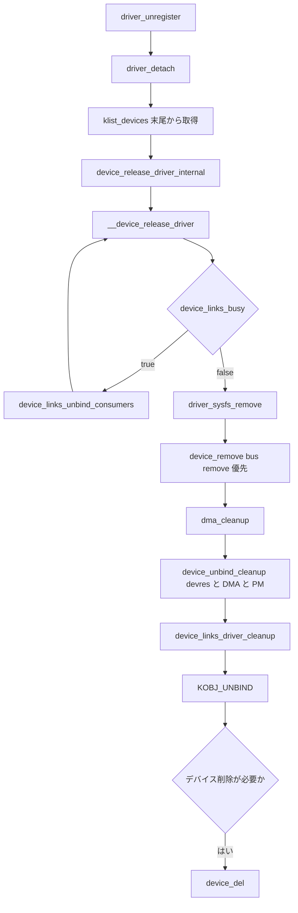

# 第16章 unbind と remove とデバイス削除

> 本章で読むソース
>
> - [`drivers/base/dd.c` L608-L621](https://github.com/gregkh/linux/blob/v6.18.38/drivers/base/dd.c#L608-L621)
> - [`drivers/base/dd.c` L623-L632](https://github.com/gregkh/linux/blob/v6.18.38/drivers/base/dd.c#L623-L632)
> - [`drivers/base/dd.c` L777-L785](https://github.com/gregkh/linux/blob/v6.18.38/drivers/base/dd.c#L777-L785)
> - [`drivers/base/dd.c` L1323-L1368](https://github.com/gregkh/linux/blob/v6.18.38/drivers/base/dd.c#L1323-L1368)
> - [`drivers/base/dd.c` L1370-L1380](https://github.com/gregkh/linux/blob/v6.18.38/drivers/base/dd.c#L1370-L1380)
> - [`drivers/base/dd.c` L1393-L1401](https://github.com/gregkh/linux/blob/v6.18.38/drivers/base/dd.c#L1393-L1401)
> - [`drivers/base/dd.c` L1420-L1443](https://github.com/gregkh/linux/blob/v6.18.38/drivers/base/dd.c#L1420-L1443)
> - [`drivers/base/core.c` L1493-L1522](https://github.com/gregkh/linux/blob/v6.18.38/drivers/base/core.c#L1493-L1522)
> - [`drivers/base/core.c` L1578-L1615](https://github.com/gregkh/linux/blob/v6.18.38/drivers/base/core.c#L1578-L1615)
> - [`drivers/base/core.c` L3900-L3910](https://github.com/gregkh/linux/blob/v6.18.38/drivers/base/core.c#L3900-L3910)

## この章の狙い

登録と probe の逆経路として、driver unregister から device unbind、必要なら `device_del` までを一続きで追う。
consumer を先に外す device links の順序制御と、`device_unbind_cleanup` と `device_links_driver_cleanup` の担当分離を固定する。
正常 unbind と probe 失敗ロールバックの経路差も明示する。

## 前提

[really_probe とバインドの中核](../part03-probe/11-really-probe.md) で probe 成功と失敗の分岐を読んでいること。
[device links と fw_devlink](14-device-links-fw-devlink.md) で `device_links_unbind_consumers` と link 状態を押さえていること。
[devres によるマネージドリソース](15-devres.md) で `device_unbind_cleanup` 内の `devres_release_all` を読んでいること。

## driver_detach から unbind へ

`driver_unregister` は `bus_remove_driver` 経由で `driver_detach` を呼ぶ。
`driver_detach` は非同期 probe を同期した後、driver の `klist_devices` 末尾から一件ずつ参照を取り `device_release_driver_internal` を呼ぶ。

[`drivers/base/dd.c` L1420-L1443](https://github.com/gregkh/linux/blob/v6.18.38/drivers/base/dd.c#L1420-L1443)

```c
void driver_detach(const struct device_driver *drv)
{
	struct device_private *dev_prv;
	struct device *dev;

	if (driver_allows_async_probing(drv))
		async_synchronize_full();

	for (;;) {
		spin_lock(&drv->p->klist_devices.k_lock);
		if (list_empty(&drv->p->klist_devices.k_list)) {
			spin_unlock(&drv->p->klist_devices.k_lock);
			break;
		}
		dev_prv = list_last_entry(&drv->p->klist_devices.k_list,
				     struct device_private,
				     knode_driver.n_node);
		dev = dev_prv->device;
		get_device(dev);
		spin_unlock(&drv->p->klist_devices.k_lock);
		device_release_driver_internal(dev, drv, dev->parent);
		put_device(dev);
	}
}
```

## __device_release_driver の中核

`__device_release_driver` は無条件の一発ではない。
`device_links_busy` が `CONSUMER_PROBE` または `ACTIVE` の managed consumer link があれば true を返す。
それ以外の managed link を `SUPPLIER_UNBIND` にする。

busy の間、`__device_release_driver` は自身の device lock を外して `device_links_unbind_consumers` を呼ぶ。
戻ってから lock を取り直し、driver が同一か再確認する。
supplier の device lock を保持したまま consumer を待つデッドロックを避ける。

[`drivers/base/dd.c` L1323-L1368](https://github.com/gregkh/linux/blob/v6.18.38/drivers/base/dd.c#L1323-L1368)

```c
static void __device_release_driver(struct device *dev, struct device *parent)
{
	struct device_driver *drv;

	drv = dev->driver;
	if (drv) {
		pm_runtime_get_sync(dev);

		while (device_links_busy(dev)) {
			__device_driver_unlock(dev, parent);

			device_links_unbind_consumers(dev);

			__device_driver_lock(dev, parent);
			/*
			 * A concurrent invocation of the same function might
			 * have released the driver successfully while this one
			 * was waiting, so check for that.
			 */
			if (dev->driver != drv) {
				pm_runtime_put(dev);
				return;
			}
		}

		driver_sysfs_remove(dev);

		bus_notify(dev, BUS_NOTIFY_UNBIND_DRIVER);

		pm_runtime_put_sync(dev);

		device_remove(dev);

		if (dev->bus && dev->bus->dma_cleanup)
			dev->bus->dma_cleanup(dev);

		device_unbind_cleanup(dev);
		device_links_driver_cleanup(dev);

		klist_remove(&dev->p->knode_driver);
		device_pm_check_callbacks(dev);

		bus_notify(dev, BUS_NOTIFY_UNBOUND_DRIVER);
		kobject_uevent(&dev->kobj, KOBJ_UNBIND);
	}
}
```

`device_links_unbind_consumers` は `CONSUMER_PROBE` を見つけると `wait_for_device_probe` で進行中 probe を待つ。
`ACTIVE` を見つけると link を `SUPPLIER_UNBIND` に変えて consumer の `device_release_driver_internal` を呼ぶ。
`SYNC_STATE_ONLY` link は強制 unbind の対象外である。

[`drivers/base/core.c` L1578-L1615](https://github.com/gregkh/linux/blob/v6.18.38/drivers/base/core.c#L1578-L1615)

```c
void device_links_unbind_consumers(struct device *dev)
{
	struct device_link *link;

 start:
	device_links_write_lock();

	list_for_each_entry(link, &dev->links.consumers, s_node) {
		enum device_link_state status;

		if (!device_link_test(link, DL_FLAG_MANAGED) ||
		    device_link_test(link, DL_FLAG_SYNC_STATE_ONLY))
			continue;

		status = link->status;
		if (status == DL_STATE_CONSUMER_PROBE) {
			device_links_write_unlock();

			wait_for_device_probe();
			goto start;
		}
		WRITE_ONCE(link->status, DL_STATE_SUPPLIER_UNBIND);
		if (status == DL_STATE_ACTIVE) {
			struct device *consumer = link->consumer;

			get_device(consumer);

			device_links_write_unlock();

			device_release_driver_internal(consumer, NULL,
						       consumer->parent);
			put_device(consumer);
			goto start;
		}
	}

	device_links_write_unlock();
}
```

## device_remove と bus remove の優先

正常 unbind では consumer 処理のあと `driver_sysfs_remove`、通知、runtime PM 同期、`device_remove` の順で進む。
`device_remove` は driver 属性を外した後、`bus->remove` があれば優先し、なければ `driver->remove` を呼ぶ。

[`drivers/base/dd.c` L623-L632](https://github.com/gregkh/linux/blob/v6.18.38/drivers/base/dd.c#L623-L632)

```c
static void device_remove(struct device *dev)
{
	device_remove_file(dev, &dev_attr_state_synced);
	device_remove_groups(dev, dev->driver->dev_groups);

	if (dev->bus && dev->bus->remove)
		dev->bus->remove(dev);
	else if (dev->driver->remove)
		dev->driver->remove(dev);
}
```

## device_unbind_cleanup と device_links_driver_cleanup の分離

`device_unbind_cleanup` が解放するのは devres 全体、architecture DMA ops、`dma_range_map`、`dev->driver` と `driver_data`、PM domain の detach と dismiss、runtime PM 状態、driver flags である。
device links は `device_unbind_cleanup` の担当ではない。
直後の `device_links_driver_cleanup` が consumer link と supplier link の状態を整理する。

[`drivers/base/dd.c` L608-L621](https://github.com/gregkh/linux/blob/v6.18.38/drivers/base/dd.c#L608-L621)

```c
static void device_unbind_cleanup(struct device *dev)
{
	devres_release_all(dev);
	arch_teardown_dma_ops(dev);
	kfree(dev->dma_range_map);
	dev->dma_range_map = NULL;
	device_set_driver(dev, NULL);
	dev_set_drvdata(dev, NULL);
	dev_pm_domain_detach(dev, dev->power.detach_power_off);
	if (dev->pm_domain && dev->pm_domain->dismiss)
		dev->pm_domain->dismiss(dev);
	pm_runtime_reinit(dev);
	dev_pm_set_driver_flags(dev, 0);
}
```

[`drivers/base/core.c` L1493-L1522](https://github.com/gregkh/linux/blob/v6.18.38/drivers/base/core.c#L1493-L1522)

```c
void device_links_driver_cleanup(struct device *dev)
{
	struct device_link *link, *ln;

	device_links_write_lock();

	list_for_each_entry_safe(link, ln, &dev->links.consumers, s_node) {
		if (!device_link_test(link, DL_FLAG_MANAGED))
			continue;

		WARN_ON(device_link_test(link, DL_FLAG_AUTOREMOVE_CONSUMER));
		WARN_ON(link->status != DL_STATE_SUPPLIER_UNBIND);

		/*
		 * autoremove the links between this @dev and its consumer
		 * devices that are not active, i.e. where the link state
		 * has moved to DL_STATE_SUPPLIER_UNBIND.
		 */
		if (link->status == DL_STATE_SUPPLIER_UNBIND &&
		    device_link_test(link, DL_FLAG_AUTOREMOVE_SUPPLIER))
			device_link_drop_managed(link);

		WRITE_ONCE(link->status, DL_STATE_DORMANT);
	}

	list_del_init(&dev->links.defer_sync);
	__device_links_no_driver(dev);

	device_links_write_unlock();
}
```

## 正常 unbind と probe 失敗の違い

probe callback 自体が失敗した場合は remove callback を呼ばない。
`driver_sysfs_remove`、`dma_cleanup`、`device_links_no_driver`、`device_unbind_cleanup` で部分状態を戻す。

probe 成功後に driver 属性や `state_synced` 属性の追加が失敗した場合は `device_remove` を呼んでから同じ cleanup へ合流する。
正常 unbind は bound 状態なので必ず `device_remove` と `device_links_driver_cleanup` を通る。
共有されるのは主に `dma_cleanup` と `device_unbind_cleanup` で、link cleanup と remove callback は経路ごとに異なる。

[`drivers/base/dd.c` L777-L785](https://github.com/gregkh/linux/blob/v6.18.38/drivers/base/dd.c#L777-L785)

```c
probe_failed:
	driver_sysfs_remove(dev);
sysfs_failed:
	bus_notify(dev, BUS_NOTIFY_DRIVER_NOT_BOUND);
	if (dev->bus && dev->bus->dma_cleanup)
		dev->bus->dma_cleanup(dev);
pinctrl_bind_failed:
	device_links_no_driver(dev);
	device_unbind_cleanup(dev);
```

`device_release_driver` は手動 unbind の公開 API である。
内部は `device_release_driver_internal` へ委譲する。

[`drivers/base/dd.c` L1370-L1401](https://github.com/gregkh/linux/blob/v6.18.38/drivers/base/dd.c#L1370-L1401)

```c
void device_release_driver_internal(struct device *dev,
				    const struct device_driver *drv,
				    struct device *parent)
{
	__device_driver_lock(dev, parent);

	if (!drv || drv == dev->driver)
		__device_release_driver(dev, parent);

	__device_driver_unlock(dev, parent);
}

/**
 * device_release_driver - manually detach device from driver.
 * @dev: device.
 *
 * Manually detach device from driver.
 * When called for a USB interface, @dev->parent lock must be held.
 *
 * If this function is to be called with @dev->parent lock held, ensure that
 * the device's consumers are unbound in advance or that their locks can be
 * acquired under the @dev->parent lock.
 */
void device_release_driver(struct device *dev)
{
	/*
	 * If anyone calls device_release_driver() recursively from
	 * within their ->remove callback for the same device, they
	 * will deadlock right here.
	 */
	device_release_driver_internal(dev, NULL, NULL);
}
```

## device_del への回帰

unbind のあとデバイス自体を消す場合は `device_del` へ進む。
`device_del` は bus から外し、device links を purge し、devres を再度解放する安全網を持つ。
[PCIe ホットプラグと再帰的削除](../part07-pci-dynamic/24-pcie-hotplug.md) が既存デバイスをどう消すかの具体例である。

[`drivers/base/core.c` L3900-L3910](https://github.com/gregkh/linux/blob/v6.18.38/drivers/base/core.c#L3900-L3910)

```c
	/*
	 * If a device does not have a driver attached, we need to clean
	 * up any managed resources. We do this in device_release(), but
	 * it's never called (and we leak the device) if a managed
	 * resource holds a reference to the device. So release all
	 * managed resources here, like we do in driver_detach(). We
	 * still need to do so again in device_release() in case someone
	 * adds a new resource after this point, though.
	 */
	devres_release_all(dev);
```

## 処理の流れ



## 高速化と最適化の工夫

device links の consumer を先に外し、supplier の device lock を保持せず待つ順序制御により、supplier を先に消して consumer が宙に浮く不整合とデッドロックを避けられる。
`device_unbind_cleanup` に devres と DMA と PM の解放を集約し、正常 unbind と probe 失敗の双方が `dma_cleanup` と `device_unbind_cleanup` を共有する。
link cleanup と remove callback は経路ごとに異なる点は混同しない。

## まとめ

`driver_detach` は klist 末尾から順に unbind する。
`__device_release_driver` は busy consumer を先に外してから `device_remove` と cleanup へ進む。
`device_unbind_cleanup` と `device_links_driver_cleanup` は担当が分離されている。
probe 失敗は remove を呼ばず、`device_links_no_driver` 経由で link を戻す。
デバイス削除は `device_del` へ回帰する。

## 関連する章

- [really_probe とバインドの中核](../part03-probe/11-really-probe.md)
- [device links と fw_devlink](14-device-links-fw-devlink.md)
- [devres によるマネージドリソース](15-devres.md)
- [device の登録操作と削除規約](../part01-registration/04-device-add-del.md)
- [PCIe ホットプラグと再帰的削除](../part07-pci-dynamic/24-pcie-hotplug.md)
