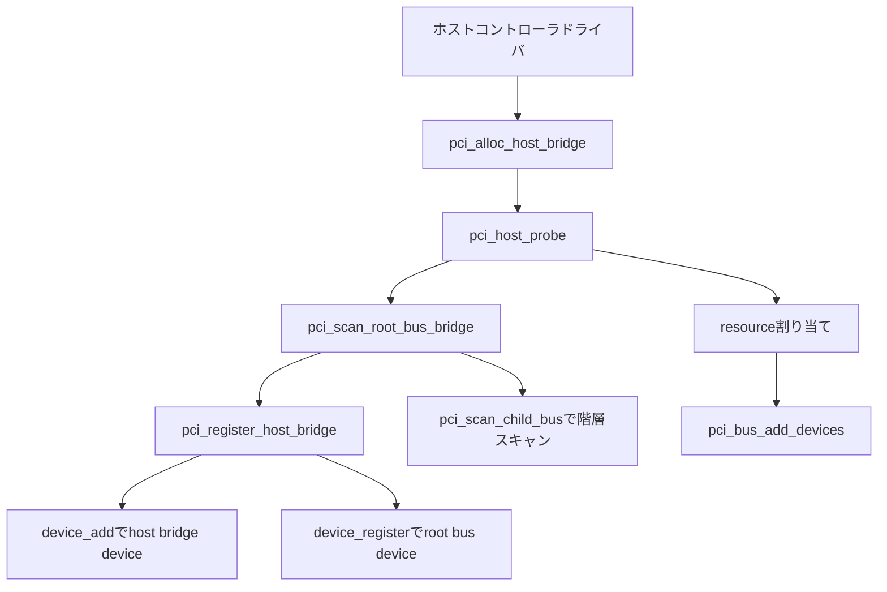

# 第17章 PCI サブシステムの全体像と host bridge 登録

> 本章で読むソース
>
> - [`include/linux/pci.h` L338-L383](https://github.com/gregkh/linux/blob/v6.18.38/include/linux/pci.h#L338-L383)
> - [`include/linux/pci.h` L424-L435](https://github.com/gregkh/linux/blob/v6.18.38/include/linux/pci.h#L424-L435)
> - [`include/linux/pci.h` L591-L628](https://github.com/gregkh/linux/blob/v6.18.38/include/linux/pci.h#L591-L628)
> - [`include/linux/pci.h` L656-L691](https://github.com/gregkh/linux/blob/v6.18.38/include/linux/pci.h#L656-L691)
> - [`include/linux/pci.h` L700-L711](https://github.com/gregkh/linux/blob/v6.18.38/include/linux/pci.h#L700-L711)
> - [`drivers/pci/probe.c` L654-L689](https://github.com/gregkh/linux/blob/v6.18.38/drivers/pci/probe.c#L654-L689)
> - [`drivers/pci/probe.c` L1009-L1043](https://github.com/gregkh/linux/blob/v6.18.38/drivers/pci/probe.c#L1009-L1043)
> - [`drivers/pci/probe.c` L1066-L1116](https://github.com/gregkh/linux/blob/v6.18.38/drivers/pci/probe.c#L1066-L1116)
> - [`drivers/pci/probe.c` L2756-L2800](https://github.com/gregkh/linux/blob/v6.18.38/drivers/pci/probe.c#L2756-L2800)
> - [`drivers/pci/probe.c` L3290-L3333](https://github.com/gregkh/linux/blob/v6.18.38/drivers/pci/probe.c#L3290-L3333)
> - [`drivers/pci/probe.c` L3397-L3434](https://github.com/gregkh/linux/blob/v6.18.38/drivers/pci/probe.c#L3397-L3434)
> - [`drivers/pci/bus.c` L404-L424](https://github.com/gregkh/linux/blob/v6.18.38/drivers/pci/bus.c#L404-L424)

## この章の狙い

**PCI** が列挙可能なバスであり、各デバイスがコンフィグ空間で自己記述する点を、[platform バス](../part03-probe/13-platform-bus.md) の非 discoverable な列挙と対比して押さえる。
ホストコントローラドライバが `pci_alloc_host_bridge` と `pci_host_probe` を通じて host bridge を登録し、root bus をスキャンしてリソースを割り当てるまでの入口を追う。
host bridge device と root bus device の二段登録、および `pci_bus_add_devices` が第二段階である点を正確に固定する。

## 前提

[中核データ構造と所有構造](../part00-overview/02-core-data-structures-ownership.md) で `struct device` の埋め込みと driver core への登録を読んでいること。
[device の登録操作と削除規約](../part01-registration/04-device-add-del.md) の `device_add` と `device_register` の違いを押さえていること。
[platform バスによるマッチと probe の実例](../part03-probe/13-platform-bus.md) で platform デバイスが DT や ACPI から静的に登録される経路を読んでいること。

## PCI バスと platform バスの対比

platform バスは、SoC 上の on-chip デバイスを Device Tree や ACPI や board コードが個別に `platform_device` として登録する。
親バスがデバイスの存在をファームウェア記述から知るため、列挙というより登録に近い。

PCI はバス上の各スロットに接続されたデバイスが、コンフィグ空間の vendor ID、device ID、class コードを返す。
カーネルはスキャン時にこれらを読み、ツリー構造を実行時に構築する。
I/O やメモリの要求は BAR レジスタへの sizing 手順で検出する（第20章で詳述する）。

## 中核データ構造

### struct pci_dev

`pci_dev` はバス上の1関数分を表す。
`bus` と `subordinate`、`devfn`、識別子、class、`resource` 配列、埋め込み `struct device` を持つ。

[`include/linux/pci.h` L338-L383](https://github.com/gregkh/linux/blob/v6.18.38/include/linux/pci.h#L338-L383)

```c
struct pci_dev {
	struct list_head bus_list;	/* Node in per-bus list */
	struct pci_bus	*bus;		/* Bus this device is on */
	struct pci_bus	*subordinate;	/* Bus this device bridges to */

	void		*sysdata;	/* Hook for sys-specific extension */
	struct proc_dir_entry *procent;	/* Device entry in /proc/bus/pci */
	struct pci_slot	*slot;		/* Physical slot this device is in */

	unsigned int	devfn;		/* Encoded device & function index */
	unsigned short	vendor;
	unsigned short	device;
	unsigned short	subsystem_vendor;
	unsigned short	subsystem_device;
	unsigned int	class;		/* 3 bytes: (base,sub,prog-if) */
	u8		revision;	/* PCI revision, low byte of class word */
	u8		hdr_type;	/* PCI header type (`multi' flag masked out) */
#ifdef CONFIG_PCIEAER
	u16		aer_cap;	/* AER capability offset */
	struct aer_info	*aer_info;	/* AER info for this device */
#endif
#ifdef CONFIG_PCIEPORTBUS
	struct rcec_ea	*rcec_ea;	/* RCEC cached endpoint association */
	struct pci_dev  *rcec;          /* Associated RCEC device */
#endif
	u32		devcap;		/* PCIe Device Capabilities */
	u16		rebar_cap;	/* Resizable BAR capability offset */
	u8		pcie_cap;	/* PCIe capability offset */
	u8		msi_cap;	/* MSI capability offset */
	u8		msix_cap;	/* MSI-X capability offset */
	u8		pcie_mpss:3;	/* PCIe Max Payload Size Supported */
	u8		rom_base_reg;	/* Config register controlling ROM */
	u8		pin;		/* Interrupt pin this device uses */
	u16		pcie_flags_reg;	/* Cached PCIe Capabilities Register */
	unsigned long	*dma_alias_mask;/* Mask of enabled devfn aliases */

	struct pci_driver *driver;	/* Driver bound to this device */
	u64		dma_mask;	/* Mask of the bits of bus address this
					   device implements.  Normally this is
					   0xffffffff.  You only need to change
					   this if your device has broken DMA
					   or supports 64-bit transfers.  */

	struct device_dma_parameters dma_parms;
```

[`include/linux/pci.h` L424-L435](https://github.com/gregkh/linux/blob/v6.18.38/include/linux/pci.h#L424-L435)

```c
	pci_channel_state_t error_state;	/* Current connectivity state */
	struct device	dev;			/* Generic device interface */

	int		cfg_size;		/* Size of config space */

	/*
	 * Instead of touching interrupt line and base address registers
	 * directly, use the values stored here. They might be different!
	 */
	unsigned int	irq;
	struct resource resource[DEVICE_COUNT_RESOURCE]; /* I/O and memory regions + expansion ROMs */
	struct resource driver_exclusive_resource;	 /* driver exclusive resource ranges */
```

`cfg_size` はコンフィグ空間の実効サイズであり、拡張 capability の探索可否に効く（第18章）。

### struct pci_bus と struct pci_host_bridge

`pci_bus` は1本の PCI バスを表す。
`parent`、`children`、`devices`、`self`、resource window、`pci_ops`、埋め込み `struct device` を持つ。

[`include/linux/pci.h` L656-L691](https://github.com/gregkh/linux/blob/v6.18.38/include/linux/pci.h#L656-L691)

```c
struct pci_bus {
	struct list_head node;		/* Node in list of buses */
	struct pci_bus	*parent;	/* Parent bus this bridge is on */
	struct list_head children;	/* List of child buses */
	struct list_head devices;	/* List of devices on this bus */
	struct pci_dev	*self;		/* Bridge device as seen by parent */
	struct list_head slots;		/* List of slots on this bus;
					   protected by pci_slot_mutex */
	struct resource *resource[PCI_BRIDGE_RESOURCE_NUM];
	struct list_head resources;	/* Address space routed to this bus */
	struct resource busn_res;	/* Bus numbers routed to this bus */

	struct pci_ops	*ops;		/* Configuration access functions */
	void		*sysdata;	/* Hook for sys-specific extension */
	struct proc_dir_entry *procdir;	/* Directory entry in /proc/bus/pci */

	unsigned char	number;		/* Bus number */
	unsigned char	primary;	/* Number of primary bridge */
	unsigned char	max_bus_speed;	/* enum pci_bus_speed */
	unsigned char	cur_bus_speed;	/* enum pci_bus_speed */
#ifdef CONFIG_PCI_DOMAINS_GENERIC
	int		domain_nr;
#endif

	char		name[48];

	unsigned short	bridge_ctl;	/* Manage NO_ISA/FBB/et al behaviors */
	pci_bus_flags_t bus_flags;	/* Inherited by child buses */
	struct device		*bridge;
	struct device		dev;
	struct bin_attribute	*legacy_io;	/* Legacy I/O for this bus */
	struct bin_attribute	*legacy_mem;	/* Legacy mem */
	unsigned int		is_added:1;
	unsigned int		unsafe_warn:1;	/* warned about RW1C config write */
	unsigned int		flit_mode:1;	/* Link in Flit mode */
};
```

`pci_host_bridge` は CPU 側コントローラを表す。
埋め込み `struct device`（`bridge->dev`）がホストコントローラ device の子となり、`bus` が root `pci_bus`、`ops` と `windows` がアクセス経路とアドレス窓を保持する。

[`include/linux/pci.h` L591-L628](https://github.com/gregkh/linux/blob/v6.18.38/include/linux/pci.h#L591-L628)

```c
struct pci_host_bridge {
	struct device	dev;
	struct pci_bus	*bus;		/* Root bus */
	struct pci_ops	*ops;
	struct pci_ops	*child_ops;
	void		*sysdata;
	int		busnr;
	int		domain_nr;
	struct list_head windows;	/* resource_entry */
	struct list_head dma_ranges;	/* dma ranges resource list */
	u8 (*swizzle_irq)(struct pci_dev *, u8 *); /* Platform IRQ swizzler */
	int (*map_irq)(const struct pci_dev *, u8, u8);
	void (*release_fn)(struct pci_host_bridge *);
	int (*enable_device)(struct pci_host_bridge *bridge, struct pci_dev *dev);
	void (*disable_device)(struct pci_host_bridge *bridge, struct pci_dev *dev);
	void		*release_data;
	unsigned int	ignore_reset_delay:1;	/* For entire hierarchy */
	unsigned int	no_ext_tags:1;		/* No Extended Tags */
	unsigned int	no_inc_mrrs:1;		/* No Increase MRRS */
	unsigned int	native_aer:1;		/* OS may use PCIe AER */
	unsigned int	native_pcie_hotplug:1;	/* OS may use PCIe hotplug */
	unsigned int	native_shpc_hotplug:1;	/* OS may use SHPC hotplug */
	unsigned int	native_pme:1;		/* OS may use PCIe PME */
	unsigned int	native_ltr:1;		/* OS may use PCIe LTR */
	unsigned int	native_dpc:1;		/* OS may use PCIe DPC */
	unsigned int	native_cxl_error:1;	/* OS may use CXL RAS/Events */
	unsigned int	preserve_config:1;	/* Preserve FW resource setup */
	unsigned int	size_windows:1;		/* Enable root bus sizing */
	unsigned int	msi_domain:1;		/* Bridge wants MSI domain */

	/* Resource alignment requirements */
	resource_size_t (*align_resource)(struct pci_dev *dev,
			const struct resource *res,
			resource_size_t start,
			resource_size_t size,
			resource_size_t align);
	unsigned long	private[] ____cacheline_aligned;
};
```

### root bus の判定

root bus かどうかは `self` が NULL かでは判定しない。
SR-IOV の virtual bus も `self` が NULL になりうるため、`pci_is_root_bus` は `parent` の有無を見る。

[`include/linux/pci.h` L700-L711](https://github.com/gregkh/linux/blob/v6.18.38/include/linux/pci.h#L700-L711)

```c
/*
 * Returns true if the PCI bus is root (behind host-PCI bridge),
 * false otherwise
 *
 * Some code assumes that "bus->self == NULL" means that bus is a root bus.
 * This is incorrect because "virtual" buses added for SR-IOV (via
 * virtfn_add_bus()) have "bus->self == NULL" but are not root buses.
 */
static inline bool pci_is_root_bus(struct pci_bus *pbus)
{
	return !(pbus->parent);
}
```

## host bridge の確保

`pci_alloc_host_bridge` は `pci_host_bridge` とドライバ私有領域を確保し、`pci_init_host_bridge` で window リストと native 機能フラグを初期化する。

[`drivers/pci/probe.c` L654-L689](https://github.com/gregkh/linux/blob/v6.18.38/drivers/pci/probe.c#L654-L689)

```c
static void pci_init_host_bridge(struct pci_host_bridge *bridge)
{
	INIT_LIST_HEAD(&bridge->windows);
	INIT_LIST_HEAD(&bridge->dma_ranges);

	/*
	 * We assume we can manage these PCIe features.  Some systems may
	 * reserve these for use by the platform itself, e.g., an ACPI BIOS
	 * may implement its own AER handling and use _OSC to prevent the
	 * OS from interfering.
	 */
	bridge->native_aer = 1;
	bridge->native_pcie_hotplug = 1;
	bridge->native_shpc_hotplug = 1;
	bridge->native_pme = 1;
	bridge->native_ltr = 1;
	bridge->native_dpc = 1;
	bridge->domain_nr = PCI_DOMAIN_NR_NOT_SET;
	bridge->native_cxl_error = 1;

	device_initialize(&bridge->dev);
}

struct pci_host_bridge *pci_alloc_host_bridge(size_t priv)
{
	struct pci_host_bridge *bridge;

	bridge = kzalloc(sizeof(*bridge) + priv, GFP_KERNEL);
	if (!bridge)
		return NULL;

	pci_init_host_bridge(bridge);
	bridge->dev.release = pci_release_host_bridge_dev;

	return bridge;
}
```

ホストコントローラドライバは `bridge->dev.parent` にコントローラ device を設定し、`bridge->ops` と `bridge->windows` にバス番号窓やメモリ窓を積んでから `pci_host_probe` を呼ぶ。

## pci_register_host_bridge による二段登録

`pci_register_host_bridge` は host bridge device と root bus device を別々の `struct device` として driver core へ登録する。

第一段階では `bridge->dev` に domain と bus 番号を含む名前を付け、`device_add` で host bridge を sysfs に載せる。
第二段階では `bridge->bus` を初期化し、`bus->dev.parent` を `bridge->dev` に設定したうえで `device_register` する。
sysfs 階層は host bridge の device の下に root pci_bus の device がぶら下がる二段構造になる。

[`drivers/pci/probe.c` L1009-L1043](https://github.com/gregkh/linux/blob/v6.18.38/drivers/pci/probe.c#L1009-L1043)

```c
	dev_set_name(&bridge->dev, "pci%04x:%02x", pci_domain_nr(bus),
		     bridge->busnr);

	err = pcibios_root_bridge_prepare(bridge);
	if (err)
		goto free;

	/* Temporarily move resources off the list */
	list_splice_init(&bridge->windows, &resources);
	err = device_add(&bridge->dev);
	if (err)
		goto free;

	bus->bridge = get_device(&bridge->dev);
	device_enable_async_suspend(bus->bridge);
	pci_set_bus_of_node(bus);
	pci_set_bus_msi_domain(bus);
	if (bridge->msi_domain && !dev_get_msi_domain(&bus->dev) &&
	    !pci_host_of_has_msi_map(parent))
		bus->bus_flags |= PCI_BUS_FLAGS_NO_MSI;

	if (!parent)
		set_dev_node(bus->bridge, pcibus_to_node(bus));

	bus->dev.class = &pcibus_class;
	bus->dev.parent = bus->bridge;

	dev_set_name(&bus->dev, "%04x:%02x", pci_domain_nr(bus), bus->number);
	name = dev_name(&bus->dev);

	err = device_register(&bus->dev);
	bus_registered = true;
	if (err)
		goto unregister;

	pcibios_add_bus(bus);
```

登録後、`bridge->windows` を一時 list から戻しながら連続 window を統合し、bus number 窓や I/O、memory 窓を root bus の resource list へ接続する。
`pci_create_legacy_files` で legacy I/O と legacy memory の sysfs ファイルも用意する。

[`drivers/pci/probe.c` L1066-L1116](https://github.com/gregkh/linux/blob/v6.18.38/drivers/pci/probe.c#L1066-L1116)

```c
	/* Coalesce contiguous windows */
	resource_list_for_each_entry_safe(window, n, &resources) {
		if (list_is_last(&window->node, &resources))
			break;

		next = list_next_entry(window, node);
		offset = window->offset;
		res = window->res;
		next_offset = next->offset;
		next_res = next->res;

		if (res->flags != next_res->flags || offset != next_offset)
			continue;

		if (res->end + 1 == next_res->start) {
			next_res->start = res->start;
			res->flags = res->start = res->end = 0;
		}
	}

	/* Add initial resources to the bus */
	resource_list_for_each_entry_safe(window, n, &resources) {
		offset = window->offset;
		res = window->res;
		if (!res->flags && !res->start && !res->end) {
			release_resource(res);
			resource_list_destroy_entry(window);
			continue;
		}

		list_move_tail(&window->node, &bridge->windows);

		if (res->flags & IORESOURCE_BUS)
			pci_bus_insert_busn_res(bus, bus->number, res->end);
		else
			pci_bus_add_resource(bus, res);

		if (offset) {
			if (resource_type(res) == IORESOURCE_IO)
				fmt = " (bus address [%#06llx-%#06llx])";
			else
				fmt = " (bus address [%#010llx-%#010llx])";

			snprintf(addr, sizeof(addr), fmt,
				 (unsigned long long)(res->start - offset),
				 (unsigned long long)(res->end - offset));
		} else
			addr[0] = '\0';

		dev_info(&bus->dev, "root bus resource %pR%s\n", res, addr);
	}
```

## pci_host_probe の段階

`pci_host_probe` は rescan/remove lock 下で `pci_scan_root_bus_bridge` を呼び、戻ったあと resource 配置と `pci_bus_add_devices` を行う。

[`drivers/pci/probe.c` L3290-L3333](https://github.com/gregkh/linux/blob/v6.18.38/drivers/pci/probe.c#L3290-L3333)

```c
int pci_host_probe(struct pci_host_bridge *bridge)
{
	struct pci_bus *bus, *child;
	int ret;

	pci_lock_rescan_remove();
	ret = pci_scan_root_bus_bridge(bridge);
	pci_unlock_rescan_remove();
	if (ret < 0) {
		dev_err(bridge->dev.parent, "Scanning root bridge failed");
		return ret;
	}

	bus = bridge->bus;

	/* If we must preserve the resource configuration, claim now */
	if (bridge->preserve_config)
		pci_bus_claim_resources(bus);

	/*
	 * Assign whatever was left unassigned. If we didn't claim above,
	 * this will reassign everything.
	 */
	pci_assign_unassigned_root_bus_resources(bus);

	list_for_each_entry(child, &bus->children, node)
		pcie_bus_configure_settings(child);

	pci_lock_rescan_remove();
	pci_bus_add_devices(bus);
	pci_unlock_rescan_remove();

	/*
	 * Ensure pm_runtime_enable() is called for the controller drivers
	 * before calling pci_host_probe(). The PM framework expects that
	 * if the parent device supports runtime PM, it will be enabled
	 * before child runtime PM is enabled.
	 */
	pm_runtime_set_active(&bridge->dev);
	pm_runtime_no_callbacks(&bridge->dev);
	devm_pm_runtime_enable(&bridge->dev);

	return 0;
}
```

`preserve_config` が真なら先にファームウェアが配置した resource を `pci_bus_claim_resources` で claim し、その後 `preserve_config` の値にかかわらず `pci_assign_unassigned_root_bus_resources` が残った未割り当て resource を配置する。
`preserve_config` が偽なら claim を行わず、この assign が全体を再配置し得る。
子 bus には `pcie_bus_configure_settings` で PCIe 設定を適用したあと、lock 下で `pci_bus_add_devices` を呼ぶ。

## pci_scan_root_bus_bridge

`pci_scan_root_bus_bridge` は `bridge->windows` から bus number resource を探し、`pci_register_host_bridge` で登録してから `pci_scan_child_bus` で階層を検出する。
bus number window がなければ一時的に bus 番号 255 までを登録し、スキャン後に実際の最大 bus 番号へ縮める。

[`drivers/pci/probe.c` L3397-L3434](https://github.com/gregkh/linux/blob/v6.18.38/drivers/pci/probe.c#L3397-L3434)

```c
int pci_scan_root_bus_bridge(struct pci_host_bridge *bridge)
{
	struct resource_entry *window;
	bool found = false;
	struct pci_bus *b;
	int max, bus, ret;

	if (!bridge)
		return -EINVAL;

	resource_list_for_each_entry(window, &bridge->windows)
		if (window->res->flags & IORESOURCE_BUS) {
			bridge->busnr = window->res->start;
			found = true;
			break;
		}

	ret = pci_register_host_bridge(bridge);
	if (ret < 0)
		return ret;

	b = bridge->bus;
	bus = bridge->busnr;

	if (!found) {
		dev_info(&b->dev,
		 "No busn resource found for root bus, will use [bus %02x-ff]\n",
			bus);
		pci_bus_insert_busn_res(b, bus, 255);
	}

	max = pci_scan_child_bus(b);

	if (!found)
		pci_bus_update_busn_res_end(b, max);

	return 0;
}
```

## スキャン時の device 登録と pci_bus_add_devices

スキャン中の `pci_device_add` は各 `pci_dev` の generic device を `device_add` で driver core へ載せる第一段階である。
`pci_bus_add_devices` は resource 配置後に PCI 専用 sysfs、保存状態、runtime PM、`device_initial_probe` を開始する第二段階である（第20章で BAR 配置との順序を詳述する）。

[`drivers/pci/probe.c` L2756-L2800](https://github.com/gregkh/linux/blob/v6.18.38/drivers/pci/probe.c#L2756-L2800)

```c
void pci_device_add(struct pci_dev *dev, struct pci_bus *bus)
{
	int ret;

	pci_configure_device(dev);

	device_initialize(&dev->dev);
	dev->dev.release = pci_release_dev;

	set_dev_node(&dev->dev, pcibus_to_node(bus));
	dev->dev.dma_mask = &dev->dma_mask;
	dev->dev.dma_parms = &dev->dma_parms;
	dev->dev.coherent_dma_mask = 0xffffffffull;

	dma_set_max_seg_size(&dev->dev, 65536);
	dma_set_seg_boundary(&dev->dev, 0xffffffff);

	pcie_failed_link_retrain(dev);

	/* Fix up broken headers */
	pci_fixup_device(pci_fixup_header, dev);

	pci_reassigndev_resource_alignment(dev);

	dev->state_saved = false;

	pci_init_capabilities(dev);

	/*
	 * Add the device to our list of discovered devices
	 * and the bus list for fixup functions, etc.
	 */
	down_write(&pci_bus_sem);
	list_add_tail(&dev->bus_list, &bus->devices);
	up_write(&pci_bus_sem);

	ret = pcibios_device_add(dev);
	WARN_ON(ret < 0);

	/* Set up MSI IRQ domain */
	pci_set_msi_domain(dev);

	/* Notifier could use PCI capabilities */
	ret = device_add(&dev->dev);
	WARN_ON(ret < 0);
```

[`drivers/pci/bus.c` L404-L424](https://github.com/gregkh/linux/blob/v6.18.38/drivers/pci/bus.c#L404-L424)

```c
void pci_bus_add_devices(const struct pci_bus *bus)
{
	struct pci_dev *dev;
	struct pci_bus *child;

	list_for_each_entry(dev, &bus->devices, bus_list) {
		/* Skip already-added devices */
		if (pci_dev_is_added(dev))
			continue;
		pci_bus_add_device(dev);
	}

	list_for_each_entry(dev, &bus->devices, bus_list) {
		/* Skip if device attach failed */
		if (!pci_dev_is_added(dev))
			continue;
		child = dev->subordinate;
		if (child)
			pci_bus_add_devices(child);
	}
}
```

## 処理の流れ



## 高速化と最適化の工夫

PCI デバイスはコンフィグ空間で vendor、device、class を自己記述する。
BAR の必要サイズは、全ビット1を書き込んで読み戻す sizing 手順への応答から検出できる。
カーネルは実行時スキャンだけで各デバイスの存在とリソース要求を把握でき、ボードごとの静的な DT 記述なしに列挙できる。
platform バスがファームウェア記述に依存するのと対照的に、PCI はバス走査という単一の入口で多数のデバイスを扱える。

## まとめ

PCI はコンフィグ空間による自己記述とスキャンでツリーを構築する discoverable なバスである。
`pci_host_bridge` はコントローラ device の子として host bridge device を登録し、`pci_bus` はその子として root bus device を登録する二段構造を持つ。
`pci_host_probe` はスキャン、resource 配置、子 bus の PCIe 設定、`pci_bus_add_devices` の順で進む。
`pci_device_add` が generic device の第一段階、`pci_bus_add_devices` が sysfs と probe 開始の第二段階である。

## 関連する章

- [platform バスによるマッチと probe の実例](../part03-probe/13-platform-bus.md)
- [コンフィグ空間アクセスと capability 探索](18-pci-config-capability.md)
- [PCI バススキャンとデバイス生成](19-pci-bus-scan.md)
- [BAR 調査とリソース割り当てと二段階追加](20-pci-bar-resource-assign.md)
