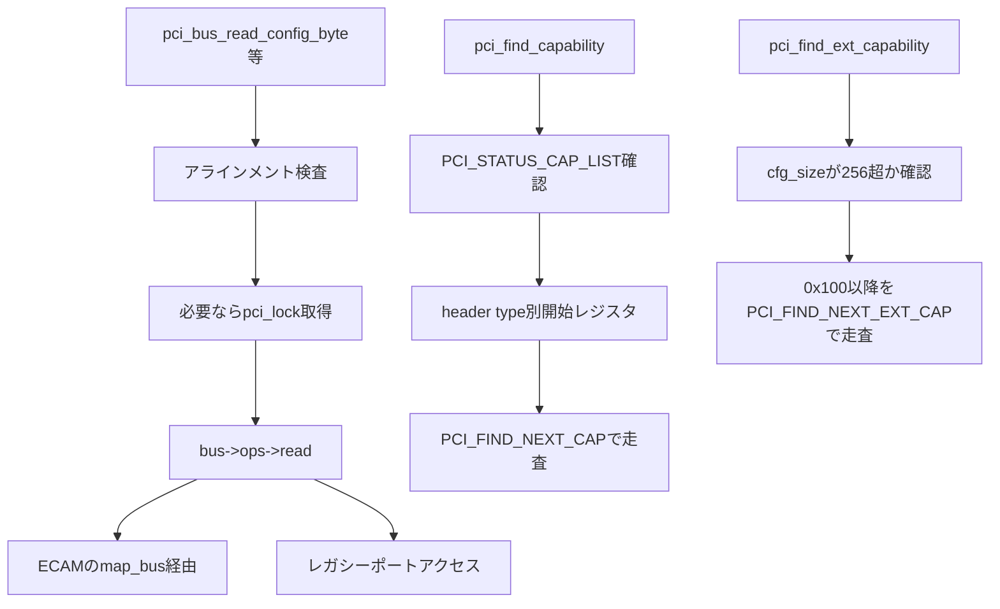

# 第18章 コンフィグ空間アクセスと capability 探索

> 本章で読むソース
>
> - [`include/linux/pci.h` L823-L829](https://github.com/gregkh/linux/blob/v6.18.38/include/linux/pci.h#L823-L829)
> - [`drivers/pci/access.c` L35-L55](https://github.com/gregkh/linux/blob/v6.18.38/drivers/pci/access.c#L35-L55)
> - [`drivers/pci/access.c` L81-L83](https://github.com/gregkh/linux/blob/v6.18.38/drivers/pci/access.c#L81-L83)
> - [`drivers/pci/access.c` L88-L105](https://github.com/gregkh/linux/blob/v6.18.38/drivers/pci/access.c#L88-L105)
> - [`drivers/pci/pci.h` L119-L151](https://github.com/gregkh/linux/blob/v6.18.38/drivers/pci/pci.h#L119-L151)
> - [`drivers/pci/pci.h` L170-L199](https://github.com/gregkh/linux/blob/v6.18.38/drivers/pci/pci.h#L170-L199)
> - [`drivers/pci/pci.c` L426-L430](https://github.com/gregkh/linux/blob/v6.18.38/drivers/pci/pci.c#L426-L430)
> - [`drivers/pci/pci.c` L439-L487](https://github.com/gregkh/linux/blob/v6.18.38/drivers/pci/pci.c#L439-L487)
> - [`drivers/pci/pci.c` L528-L555](https://github.com/gregkh/linux/blob/v6.18.38/drivers/pci/pci.c#L528-L555)

## この章の狙い

**コンフィグ空間**が各 PCI デバイスのレジスタ空間であり、vendor ID、command/status、BAR、capability ポインタを保持する点を押さえる。
`pci_bus_read_config_*` が `pci_ops` を通じて読み書きする構造と、標準 capability リストと PCIe 拡張 capability チェーンの走査手順を追う。
第23章の MSI、第25章の SR-IOV、第26章の AER がこの探索 API に依存することへの接続点を示す。

## 前提

[PCI サブシステムの全体像と host bridge 登録](17-pci-overview-host-bridge.md) で `pci_dev` の `cfg_size` と `pci_bus` の `ops` を読んでいること。
host bridge 登録で `bridge->ops` が各 bus に引き継がれる流れを押さえていること。

## コンフィグ空間の役割

各 PCI 関数は最大 4KB のコンフィグ空間を持つ（PCIe 仕様）。
先頭 256 バイトはレガシー PCI ヘッダで、vendor ID、device ID、command、status、BAR レジスタ、capability リストポインタなどが並ぶ。
0x100 以降は PCIe 拡張 capability が連結リストで並ぶ。

カーネルが実際に扱えるサイズは `dev->cfg_size` と platform access の制約に依存する。
`cfg_size` が 256 バイト以下のデバイスでは拡張 capability 探索は行われない。
「PCIe デバイスは常に 4KB アクセス可能」とは断定できない。

## pci_ops による抽象化

`pci_ops` は host controller または architecture が提供するコンフィグ空間 read/write の抽象である。
`map_bus` はオプションで、generic ECAM 系はこれで MMIO アドレスを得て `readb` などを使う。
レガシー x86 は CF8/CFC ポートアクセスなど別の低水準実装を選ぶ。
すべての `pci_ops` が `map_bus` を直接提供するとは限らない。

[`include/linux/pci.h` L823-L829](https://github.com/gregkh/linux/blob/v6.18.38/include/linux/pci.h#L823-L829)

```c
struct pci_ops {
	int (*add_bus)(struct pci_bus *bus);
	void (*remove_bus)(struct pci_bus *bus);
	void __iomem *(*map_bus)(struct pci_bus *bus, unsigned int devfn, int where);
	int (*read)(struct pci_bus *bus, unsigned int devfn, int where, int size, u32 *val);
	int (*write)(struct pci_bus *bus, unsigned int devfn, int where, int size, u32 val);
};
```

`pci_generic_config_read` は `map_bus` で得たアドレスへサイズに応じた MMIO 読み取りを行う ECAM 系の典型実装である。

[`drivers/pci/access.c` L88-L105](https://github.com/gregkh/linux/blob/v6.18.38/drivers/pci/access.c#L88-L105)

```c
int pci_generic_config_read(struct pci_bus *bus, unsigned int devfn,
			    int where, int size, u32 *val)
{
	void __iomem *addr;

	addr = bus->ops->map_bus(bus, devfn, where);
	if (!addr)
		return PCIBIOS_DEVICE_NOT_FOUND;

	if (size == 1)
		*val = readb(addr);
	else if (size == 2)
		*val = readw(addr);
	else
		*val = readl(addr);

	return PCIBIOS_SUCCESSFUL;
}
```

## pci_bus_read_config のラッパー

`pci_bus_read_config_byte`、`word`、`dword` はマクロ `PCI_OP_READ` で展開される。
アラインメントを検査し、必要な構成では global raw spinlock を取ってから `bus->ops->read` を呼ぶ。
`CONFIG_PCI_LOCKLESS_CONFIG` が有効なときは lock ラッパーが空になり、global lock による直列化は行われない。
read 失敗時は出力へ PCI error response を設定し、PCIBIOS status を返す。

[`drivers/pci/access.c` L35-L55](https://github.com/gregkh/linux/blob/v6.18.38/drivers/pci/access.c#L35-L55)

```c
#define PCI_OP_READ(size, type, len) \
int noinline pci_bus_read_config_##size \
	(struct pci_bus *bus, unsigned int devfn, int pos, type *value)	\
{									\
	unsigned long flags;						\
	u32 data = 0;							\
	int res;							\
									\
	if (PCI_##size##_BAD)						\
		return PCIBIOS_BAD_REGISTER_NUMBER;			\
									\
	pci_lock_config(flags);						\
	res = bus->ops->read(bus, devfn, pos, len, &data);		\
	if (res)							\
		PCI_SET_ERROR_RESPONSE(value);				\
	else								\
		*value = (type)data;					\
	pci_unlock_config(flags);					\
									\
	return res;							\
}
```

[`drivers/pci/access.c` L81-L83](https://github.com/gregkh/linux/blob/v6.18.38/drivers/pci/access.c#L81-L83)

```c
EXPORT_SYMBOL(pci_bus_read_config_byte);
EXPORT_SYMBOL(pci_bus_read_config_word);
EXPORT_SYMBOL(pci_bus_read_config_dword);
```

`pci_dev` が存在する段階では `pci_read_config_*` が `dev->bus` と `dev->devfn` を渡して同じラッパーへ合流する。

## 標準 capability の走査

### 開始位置の決定

`pci_find_capability` はまず `PCI_STATUS` の `PCI_STATUS_CAP_LIST` ビットを確認する。
capability リストを持たないデバイスなら 0 を返す。
開始 pointer レジスタは header type によって異なり、通常 device と PCI bridge は `PCI_CAPABILITY_LIST`、CardBus bridge は `PCI_CB_CAPABILITY_LIST` を使う。

[`drivers/pci/pci.c` L439-L487](https://github.com/gregkh/linux/blob/v6.18.38/drivers/pci/pci.c#L439-L487)

```c
static u8 __pci_bus_find_cap_start(struct pci_bus *bus,
				    unsigned int devfn, u8 hdr_type)
{
	u16 status;

	pci_bus_read_config_word(bus, devfn, PCI_STATUS, &status);
	if (!(status & PCI_STATUS_CAP_LIST))
		return 0;

	switch (hdr_type) {
	case PCI_HEADER_TYPE_NORMAL:
	case PCI_HEADER_TYPE_BRIDGE:
		return PCI_CAPABILITY_LIST;
	case PCI_HEADER_TYPE_CARDBUS:
		return PCI_CB_CAPABILITY_LIST;
	}

	return 0;
}

/**
 * pci_find_capability - query for devices' capabilities
 * @dev: PCI device to query
 * @cap: capability code
 *
 * Tell if a device supports a given PCI capability.
 * Returns the address of the requested capability structure within the
 * device's PCI configuration space or 0 in case the device does not
 * support it.  Possible values for @cap include:
 *
 *  %PCI_CAP_ID_PM           Power Management
 *  %PCI_CAP_ID_AGP          Accelerated Graphics Port
 *  %PCI_CAP_ID_VPD          Vital Product Data
 *  %PCI_CAP_ID_SLOTID       Slot Identification
 *  %PCI_CAP_ID_MSI          Message Signalled Interrupts
 *  %PCI_CAP_ID_CHSWP        CompactPCI HotSwap
 *  %PCI_CAP_ID_PCIX         PCI-X
 *  %PCI_CAP_ID_EXP          PCI Express
 */
u8 pci_find_capability(struct pci_dev *dev, int cap)
{
	u8 pos;

	pos = __pci_bus_find_cap_start(dev->bus, dev->devfn, dev->hdr_type);
	if (pos)
		pos = __pci_find_next_cap(dev->bus, dev->devfn, pos, cap);

	return pos;
}
```

### リスト走査のマクロ

`__pci_find_next_cap` はマクロ `PCI_FIND_NEXT_CAP` を呼ぶ。
開始 pointer から最初の offset を読み、各エントリの ID と next pointer を辿る。
pointer の下位ビットは `ALIGN_DOWN` で落とし、offset が標準ヘッダ未満、read error、ID が 0xff、0 ポインタ、TTL 超過で打ち切る。

[`drivers/pci/pci.c` L426-L430](https://github.com/gregkh/linux/blob/v6.18.38/drivers/pci/pci.c#L426-L430)

```c
static u8 __pci_find_next_cap(struct pci_bus *bus, unsigned int devfn,
			      u8 pos, int cap)
{
	return PCI_FIND_NEXT_CAP(pci_bus_read_config, pos, cap, NULL, bus, devfn);
}
```

[`drivers/pci/pci.h` L119-L151](https://github.com/gregkh/linux/blob/v6.18.38/drivers/pci/pci.h#L119-L151)

```c
#define PCI_FIND_NEXT_CAP(read_cfg, start, cap, prev_ptr, args...)	\
({									\
	int __ttl = PCI_FIND_CAP_TTL;					\
	u8 __id,  __found_pos = 0;					\
	u8 __prev_pos = (start);					\
	u8 __pos = (start);						\
	u16 __ent;							\
									\
	read_cfg##_byte(args, __pos, &__pos);				\
									\
	while (__ttl--) {						\
		if (__pos < PCI_STD_HEADER_SIZEOF)			\
			break;						\
									\
		__pos = ALIGN_DOWN(__pos, 4);				\
		read_cfg##_word(args, __pos, &__ent);			\
									\
		__id = FIELD_GET(PCI_CAP_ID_MASK, __ent);		\
		if (__id == 0xff)					\
			break;						\
									\
		if (__id == (cap)) {					\
			__found_pos = __pos;				\
			if (prev_ptr != NULL)				\
				*(u8 *)prev_ptr = __prev_pos;		\
			break;						\
		}							\
									\
		__prev_pos = __pos;					\
		__pos = FIELD_GET(PCI_CAP_LIST_NEXT_MASK, __ent);	\
	}								\
	__found_pos;							\
})
```

MSI や PCIe capability はこの標準リスト上に並ぶ。
第23章では `PCI_CAP_ID_MSI` と `PCI_CAP_ID_MSIX` の offset 取得に `pci_find_capability` が使われる。

## PCIe 拡張 capability の走査

`pci_find_ext_capability` は `pci_find_next_ext_capability` を start=0 で呼ぶ。
`dev->cfg_size` が `PCI_CFG_SPACE_SIZE`（256 バイト）以下なら 0 を返す。
探索は 0x100 から始まり、各ヘッダの ID と next offset を 4 バイトアラインメントで辿る。
read error、ヘッダが 0、不正 offset、TTL 超過で停止する。

[`drivers/pci/pci.c` L528-L555](https://github.com/gregkh/linux/blob/v6.18.38/drivers/pci/pci.c#L528-L555)

```c
u16 pci_find_next_ext_capability(struct pci_dev *dev, u16 start, int cap)
{
	if (dev->cfg_size <= PCI_CFG_SPACE_SIZE)
		return 0;

	return PCI_FIND_NEXT_EXT_CAP(pci_bus_read_config, start, cap,
				     NULL, dev->bus, dev->devfn);
}
EXPORT_SYMBOL_GPL(pci_find_next_ext_capability);

/**
 * pci_find_ext_capability - Find an extended capability
 * @dev: PCI device to query
 * @cap: capability code
 *
 * Returns the address of the requested extended capability structure
 * within the device's PCI configuration space or 0 if the device does
 * not support it.  Possible values for @cap include:
 *
 *  %PCI_EXT_CAP_ID_ERR		Advanced Error Reporting
 *  %PCI_EXT_CAP_ID_VC		Virtual Channel
 *  %PCI_EXT_CAP_ID_DSN		Device Serial Number
 *  %PCI_EXT_CAP_ID_PWR		Power Budgeting
 */
u16 pci_find_ext_capability(struct pci_dev *dev, int cap)
{
	return pci_find_next_ext_capability(dev, 0, cap);
}
```

[`drivers/pci/pci.h` L170-L199](https://github.com/gregkh/linux/blob/v6.18.38/drivers/pci/pci.h#L170-L199)

```c
#define PCI_FIND_NEXT_EXT_CAP(read_cfg, start, cap, prev_ptr, args...)	\
({									\
	u16 __pos = (start) ?: PCI_CFG_SPACE_SIZE;			\
	u16 __found_pos = 0;						\
	u16 __prev_pos;							\
	int __ttl, __ret;						\
	u32 __header;							\
									\
	__prev_pos = __pos;						\
	__ttl = (PCI_CFG_SPACE_EXP_SIZE - PCI_CFG_SPACE_SIZE) / 8;	\
	while (__ttl-- > 0 && __pos >= PCI_CFG_SPACE_SIZE) {		\
		__ret = read_cfg##_dword(args, __pos, &__header);	\
		if (__ret != PCIBIOS_SUCCESSFUL)			\
			break;						\
									\
		if (__header == 0)					\
			break;						\
									\
		if (PCI_EXT_CAP_ID(__header) == (cap) && __pos != start) {\
			__found_pos = __pos;				\
			if (prev_ptr != NULL)				\
				*(u16 *)prev_ptr = __prev_pos;		\
			break;						\
		}							\
									\
		__prev_pos = __pos;					\
		__pos = PCI_EXT_CAP_NEXT(__header);			\
	}								\
	__found_pos;							\
})
```

AER（`PCI_EXT_CAP_ID_ERR`）や SR-IOV（`PCI_EXT_CAP_ID_SRIOV`）はこのチェーン上にある。
第25章と第26章でそれぞれの offset 取得に `pci_find_ext_capability` が使われる。

## 処理の流れ



## 高速化と最適化の工夫

capability を連結リストにしておくことで、デバイスが持つ機能だけを可変長で公開できる。
仕様拡張で新しい capability ID が追加されても、固定レジスタ layout の変更なしに列挙できる。
省スペースと拡張性のトレードオフとして、探索は線形になるが、デバイスごとに必要な capability だけを載せられる。

`pci_ops` の抽象化は、ECAM とレガシーポートアクセスの差を PCI コアから隠す。
`pci_bus_read_config_*` と `pci_find_capability` は同一 API のまま、arch や host controller が選んだ実装へ委譲する。

## まとめ

コンフィグ空間は各 PCI 関数のレジスタ空間であり、`pci_bus_read_config_*` が alignment 検査と lock のうえで `pci_ops->read` を呼ぶ。
標準 capability は `PCI_STATUS_CAP_LIST` 確認後、header type 別の開始レジスタから `PCI_FIND_NEXT_CAP` で走査する。
拡張 capability は `cfg_size` が 256 バイトを超える場合に限り、0x100 以降を `PCI_FIND_NEXT_EXT_CAP` で走査する。
MSI、SR-IOV、AER など後続章の機能は、この探索 API で offset を得てからレジスタを触る。

## 関連する章

- [PCI サブシステムの全体像と host bridge 登録](17-pci-overview-host-bridge.md)
- [PCI バススキャンとデバイス生成](19-pci-bus-scan.md)
- [MSI/MSI-X の PCI 側プログラミング](../part06-pci-driver/23-pci-msi.md)
- [SR-IOV による VF 生成](../part07-pci-dynamic/25-sriov.md)
- [PCIe AER とエラー回復](../part07-pci-dynamic/26-pcie-aer.md)
