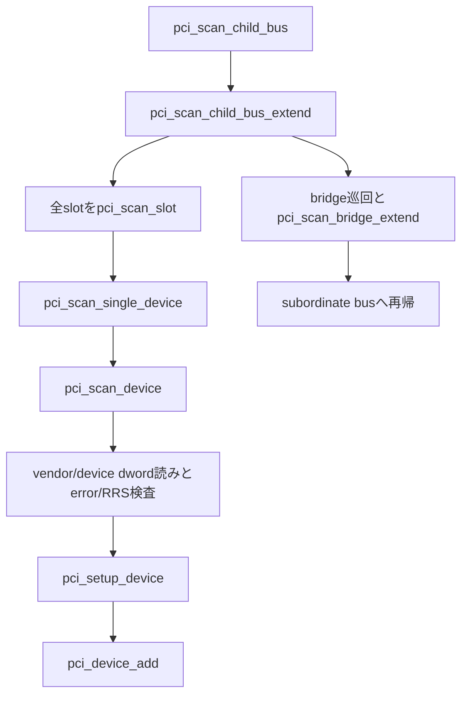

# 第19章 PCI バススキャンとデバイス生成

> 本章で読むソース
>
> - [`drivers/pci/probe.c` L2486-L2544](https://github.com/gregkh/linux/blob/v6.18.38/drivers/pci/probe.c#L2486-L2544)
> - [`drivers/pci/probe.c` L2620-L2651](https://github.com/gregkh/linux/blob/v6.18.38/drivers/pci/probe.c#L2620-L2651)
> - [`drivers/pci/probe.c` L1997-L2056](https://github.com/gregkh/linux/blob/v6.18.38/drivers/pci/probe.c#L1997-L2056)
> - [`drivers/pci/probe.c` L2807-L2824](https://github.com/gregkh/linux/blob/v6.18.38/drivers/pci/probe.c#L2807-L2824)
> - [`drivers/pci/probe.c` L2848-L2882](https://github.com/gregkh/linux/blob/v6.18.38/drivers/pci/probe.c#L2848-L2882)
> - [`drivers/pci/probe.c` L2895-L2927](https://github.com/gregkh/linux/blob/v6.18.38/drivers/pci/probe.c#L2895-L2927)
> - [`drivers/pci/probe.c` L3111-L3225](https://github.com/gregkh/linux/blob/v6.18.38/drivers/pci/probe.c#L3111-L3225)
> - [`drivers/pci/probe.c` L3235-L3238](https://github.com/gregkh/linux/blob/v6.18.38/drivers/pci/probe.c#L3235-L3238)
> - [`drivers/pci/probe.c` L2756-L2800](https://github.com/gregkh/linux/blob/v6.18.38/drivers/pci/probe.c#L2756-L2800)

## この章の狙い

`pci_scan_child_bus` がバス配下をどの順序で走査し、`pci_dev` を生成して driver core へ第一段階登録するかを追う。
device 存在判定の有効性検査、function 走査の打ち切り、bridge 巡回と subordinate bus への再帰の関係を正確に固定する。
resource 割り当てと `pci_bus_add_device` による第二段階は第20章へ委ねる。

## 前提

[PCI サブシステムの全体像と host bridge 登録](17-pci-overview-host-bridge.md) で `pci_host_probe` が `pci_scan_root_bus_bridge` を呼ぶ入口を読んでいること。
[コンフィグ空間アクセスと capability 探索](18-pci-config-capability.md) で `pci_bus_read_config_*` と `pci_ops` を押さえていること。

## スキャンの走査順

`pci_scan_child_bus` は `pci_scan_child_bus_extend` を `available_buses=0` で呼ぶ薄いラッパーである。

[`drivers/pci/probe.c` L3235-L3238](https://github.com/gregkh/linux/blob/v6.18.38/drivers/pci/probe.c#L3235-L3238)

```c
unsigned int pci_scan_child_bus(struct pci_bus *bus)
{
	return pci_scan_child_bus_extend(bus, 0);
}
```

`pci_scan_child_bus_extend` の流れは次のとおりである。

1. 現在 bus の全 slot を `pci_scan_slot` で列挙する（SR-IOV 用 bus number 予約と arch fixup もここで処理する）。
2. bridge を数え、設定済み bridge を第一巡、再設定が必要な bridge を第二巡で `pci_scan_bridge_extend` に渡す。
3. bridge 先で subordinate bus を作り、再帰的に `pci_scan_child_bus_extend` を呼ぶ。

device を見つけた瞬間に bridge へ降りる単純な深さ優先ではない。
「現在 bus の全 slot を先に検出し、その後 bridge を巡回して子 bus へ再帰する」順序である。
hotplug bridge には `available_buses` で将来拡張用の bus number を分配する。

[`drivers/pci/probe.c` L3111-L3225](https://github.com/gregkh/linux/blob/v6.18.38/drivers/pci/probe.c#L3111-L3225)

```c
static unsigned int pci_scan_child_bus_extend(struct pci_bus *bus,
					      unsigned int available_buses)
{
	unsigned int used_buses, normal_bridges = 0, hotplug_bridges = 0;
	unsigned int start = bus->busn_res.start;
	unsigned int devnr, cmax, max = start;
	struct pci_dev *dev;

	dev_dbg(&bus->dev, "scanning bus\n");

	/* Go find them, Rover! */
	for (devnr = 0; devnr < PCI_MAX_NR_DEVS; devnr++)
		pci_scan_slot(bus, PCI_DEVFN(devnr, 0));

	/* Reserve buses for SR-IOV capability */
	used_buses = pci_iov_bus_range(bus);
	max += used_buses;

	/*
	 * After performing arch-dependent fixup of the bus, look behind
	 * all PCI-to-PCI bridges on this bus.
	 */
	if (!bus->is_added) {
		dev_dbg(&bus->dev, "fixups for bus\n");
		pcibios_fixup_bus(bus);
		bus->is_added = 1;
	}

	/*
	 * Calculate how many hotplug bridges and normal bridges there
	 * are on this bus. We will distribute the additional available
	 * buses between hotplug bridges.
	 */
	for_each_pci_bridge(dev, bus) {
		if (dev->is_hotplug_bridge)
			hotplug_bridges++;
		else
			normal_bridges++;
	}

	/*
	 * Scan bridges that are already configured. We don't touch them
	 * unless they are misconfigured (which will be done in the second
	 * scan below).
	 */
	for_each_pci_bridge(dev, bus) {
		cmax = max;
		max = pci_scan_bridge_extend(bus, dev, max, 0, 0);

		/*
		 * Reserve one bus for each bridge now to avoid extending
		 * hotplug bridges too much during the second scan below.
		 */
		used_buses++;
		if (max - cmax > 1)
			used_buses += max - cmax - 1;
	}

	/* Scan bridges that need to be reconfigured */
	for_each_pci_bridge(dev, bus) {
		unsigned int buses = 0;

		if (!hotplug_bridges && normal_bridges == 1) {
			/*
			 * There is only one bridge on the bus (upstream
			 * port) so it gets all available buses which it
			 * can then distribute to the possible hotplug
			 * bridges below.
			 */
			buses = available_buses;
		} else if (dev->is_hotplug_bridge) {
			/*
			 * Distribute the extra buses between hotplug
			 * bridges if any.
			 */
			buses = available_buses / hotplug_bridges;
			buses = min(buses, available_buses - used_buses + 1);
		}

		cmax = max;
		max = pci_scan_bridge_extend(bus, dev, cmax, buses, 1);
		/* One bus is already accounted so don't add it again */
		if (max - cmax > 1)
			used_buses += max - cmax - 1;
	}

	/*
	 * Make sure a hotplug bridge has at least the minimum requested
	 * number of buses but allow it to grow up to the maximum available
	 * bus number if there is room.
	 */
	if (bus->self && bus->self->is_hotplug_bridge) {
		used_buses = max_t(unsigned int, available_buses,
				   pci_hotplug_bus_size - 1);
		if (max - start < used_buses) {
			max = start + used_buses;

			/* Do not allocate more buses than we have room left */
			if (max > bus->busn_res.end)
				max = bus->busn_res.end;

			dev_dbg(&bus->dev, "%pR extended by %#02x\n",
				&bus->busn_res, max - start);
		}
	}

	/*
	 * We've scanned the bus and so we know all about what's on
	 * the other side of any bridges that may be on this bus plus
	 * any devices.
	 *
	 * Return how far we've got finding sub-buses.
	 */
	dev_dbg(&bus->dev, "bus scan returning with max=%02x\n", max);
	return max;
}
```

## device 存在判定

`pci_scan_device` は `pci_bus_read_dev_vendor_id` で vendor と device を1つの dword として読む。
読み取り失敗、PCI error response、全0、`0x0000ffff`、`0xffff0000` は非在として扱う。
Configuration Request Retry Status を示す値なら 60000ms の timeout 値を基準に指数 backoff で再読出しし、有効な ID へ変われば device として扱う。
待機時間は次の sleep 前に timeout 超過を検査せず 1ms から 32768ms まで倍増するため、RRS が継続する場合の実待機合計は timeout 値を少し超え 65535ms に達し得る。

[`drivers/pci/probe.c` L2486-L2544](https://github.com/gregkh/linux/blob/v6.18.38/drivers/pci/probe.c#L2486-L2544)

```c
static bool pci_bus_wait_rrs(struct pci_bus *bus, int devfn, u32 *l,
			     int timeout)
{
	int delay = 1;

	if (!pci_bus_rrs_vendor_id(*l))
		return true;	/* not a Configuration RRS completion */

	if (!timeout)
		return false;	/* RRS, but caller doesn't want to wait */

	/*
	 * We got the reserved Vendor ID that indicates a completion with
	 * Configuration Request Retry Status (RRS).  Retry until we get a
	 * valid Vendor ID or we time out.
	 */
	while (pci_bus_rrs_vendor_id(*l)) {
		if (delay > timeout) {
			pr_warn("pci %04x:%02x:%02x.%d: not ready after %dms; giving up\n",
				pci_domain_nr(bus), bus->number,
				PCI_SLOT(devfn), PCI_FUNC(devfn), delay - 1);

			return false;
		}
		if (delay >= 1000)
			pr_info("pci %04x:%02x:%02x.%d: not ready after %dms; waiting\n",
				pci_domain_nr(bus), bus->number,
				PCI_SLOT(devfn), PCI_FUNC(devfn), delay - 1);

		msleep(delay);
		delay *= 2;

		if (pci_bus_read_config_dword(bus, devfn, PCI_VENDOR_ID, l))
			return false;
	}

	if (delay >= 1000)
		pr_info("pci %04x:%02x:%02x.%d: ready after %dms\n",
			pci_domain_nr(bus), bus->number,
			PCI_SLOT(devfn), PCI_FUNC(devfn), delay - 1);

	return true;
}

bool pci_bus_generic_read_dev_vendor_id(struct pci_bus *bus, int devfn, u32 *l,
					int timeout)
{
	if (pci_bus_read_config_dword(bus, devfn, PCI_VENDOR_ID, l))
		return false;

	/* Some broken boards return 0 or ~0 (PCI_ERROR_RESPONSE) if a slot is empty: */
	if (PCI_POSSIBLE_ERROR(*l) || *l == 0x00000000 ||
	    *l == 0x0000ffff || *l == 0xffff0000)
		return false;

	if (pci_bus_rrs_vendor_id(*l))
		return pci_bus_wait_rrs(bus, devfn, l, timeout);

	return true;
}
```

`pci_pwrctrl` が必要な OF device では、先に power control platform device を作って今回の scan を中断し、電源投入後の rescan に委ねる分岐がある（`CONFIG_PCI_PWRCTRL` 有効時の例外）。

[`drivers/pci/probe.c` L2620-L2651](https://github.com/gregkh/linux/blob/v6.18.38/drivers/pci/probe.c#L2620-L2651)

```c
static struct pci_dev *pci_scan_device(struct pci_bus *bus, int devfn)
{
	struct pci_dev *dev;
	u32 l;

	/*
	 * Create pwrctrl device (if required) for the PCI device to handle the
	 * power state. If the pwrctrl device is created, then skip scanning
	 * further as the pwrctrl core will rescan the bus after powering on
	 * the device.
	 */
	if (pci_pwrctrl_create_device(bus, devfn))
		return NULL;

	if (!pci_bus_read_dev_vendor_id(bus, devfn, &l, 60*1000))
		return NULL;

	dev = pci_alloc_dev(bus);
	if (!dev)
		return NULL;

	dev->devfn = devfn;
	dev->vendor = l & 0xffff;
	dev->device = (l >> 16) & 0xffff;

	if (pci_setup_device(dev)) {
		pci_bus_put(dev->bus);
		kfree(dev);
		return NULL;
	}

	return dev;
}
```

## pci_dev の生成と pci_setup_device

`pci_setup_device` は header type と class を読み、`cfg_size` を決め、header type に応じて BAR と bridge 情報を初期化する。
通常 header では `pci_read_bases` で BAR sizing を行う（第20章）。

[`drivers/pci/probe.c` L1997-L2056](https://github.com/gregkh/linux/blob/v6.18.38/drivers/pci/probe.c#L1997-L2056)

```c
int pci_setup_device(struct pci_dev *dev)
{
	u32 class;
	u16 cmd;
	u8 hdr_type;
	int err, pos = 0;
	struct pci_bus_region region;
	struct resource *res;

	hdr_type = pci_hdr_type(dev);

	dev->sysdata = dev->bus->sysdata;
	dev->dev.parent = dev->bus->bridge;
	dev->dev.bus = &pci_bus_type;
	dev->hdr_type = FIELD_GET(PCI_HEADER_TYPE_MASK, hdr_type);
	dev->multifunction = FIELD_GET(PCI_HEADER_TYPE_MFD, hdr_type);
	dev->error_state = pci_channel_io_normal;
	set_pcie_port_type(dev);

	err = pci_set_of_node(dev);
	if (err)
		return err;
	pci_set_acpi_fwnode(dev);

	pci_dev_assign_slot(dev);

	/*
	 * Assume 32-bit PCI; let 64-bit PCI cards (which are far rarer)
	 * set this higher, assuming the system even supports it.
	 */
	dev->dma_mask = 0xffffffff;

	dev_set_name(&dev->dev, "%04x:%02x:%02x.%d", pci_domain_nr(dev->bus),
		     dev->bus->number, PCI_SLOT(dev->devfn),
		     PCI_FUNC(dev->devfn));

	class = pci_class(dev);

	dev->revision = class & 0xff;
	dev->class = class >> 8;		    /* upper 3 bytes */

	if (pci_early_dump)
		early_dump_pci_device(dev);

	/* Need to have dev->class ready */
	dev->cfg_size = pci_cfg_space_size(dev);

	/* Need to have dev->cfg_size ready */
	set_pcie_thunderbolt(dev);

	set_pcie_untrusted(dev);

	if (pci_is_pcie(dev))
		dev->supported_speeds = pcie_get_supported_speeds(dev);

	/* "Unknown power state" */
	dev->current_state = PCI_UNKNOWN;

	/* Early fixups, before probing the BARs */
	pci_fixup_device(pci_fixup_early, dev);
```

`pci_scan_single_device` は同 devfn の既存 `pci_dev` があれば再利用する。
新規のときだけ `pci_scan_device` と `pci_device_add` を呼ぶ。

[`drivers/pci/probe.c` L2807-L2824](https://github.com/gregkh/linux/blob/v6.18.38/drivers/pci/probe.c#L2807-L2824)

```c
struct pci_dev *pci_scan_single_device(struct pci_bus *bus, int devfn)
{
	struct pci_dev *dev;

	dev = pci_get_slot(bus, devfn);
	if (dev) {
		pci_dev_put(dev);
		return dev;
	}

	dev = pci_scan_device(bus, devfn);
	if (!dev)
		return NULL;

	pci_device_add(dev, bus);

	return dev;
}
```

## function 走査の打ち切り

`pci_scan_slot` は function 0 から始め、function 0 が無く `hypervisor_isolated_pci_functions` が偽なら slot 走査を終了する。
function 0 があっても multifunction bit が立たなければ `next_fn` が `-ENODEV` を返し function 1 以降を読まない。

ARI 有効 bus では固定 0 から 7 の線形加算ではなく、ARI capability の Next Function Number を辿る。
PCIe downstream port 配下では `only_one_child` が Device 0 以外を省く。

[`drivers/pci/probe.c` L2848-L2882](https://github.com/gregkh/linux/blob/v6.18.38/drivers/pci/probe.c#L2848-L2882)

```c
static int next_fn(struct pci_bus *bus, struct pci_dev *dev, int fn)
{
	if (pci_ari_enabled(bus))
		return next_ari_fn(bus, dev, fn);

	if (fn >= 7)
		return -ENODEV;
	/* only multifunction devices may have more functions */
	if (dev && !dev->multifunction)
		return -ENODEV;

	return fn + 1;
}

static int only_one_child(struct pci_bus *bus)
{
	struct pci_dev *bridge = bus->self;

	/*
	 * Systems with unusual topologies set PCI_SCAN_ALL_PCIE_DEVS so
	 * we scan for all possible devices, not just Device 0.
	 */
	if (pci_has_flag(PCI_SCAN_ALL_PCIE_DEVS))
		return 0;

	/*
	 * A PCIe Downstream Port normally leads to a Link with only Device
	 * 0 on it (PCIe spec r3.1, sec 7.3.1).  As an optimization, scan
	 * only for Device 0 in that situation.
	 */
	if (bridge && pci_is_pcie(bridge) && pcie_downstream_port(bridge))
		return 1;

	return 0;
}
```

[`drivers/pci/probe.c` L2895-L2927](https://github.com/gregkh/linux/blob/v6.18.38/drivers/pci/probe.c#L2895-L2927)

```c
int pci_scan_slot(struct pci_bus *bus, int devfn)
{
	struct pci_dev *dev;
	int fn = 0, nr = 0;

	if (only_one_child(bus) && (devfn > 0))
		return 0; /* Already scanned the entire slot */

	do {
		dev = pci_scan_single_device(bus, devfn + fn);
		if (dev) {
			if (!pci_dev_is_added(dev))
				nr++;
			if (fn > 0)
				dev->multifunction = 1;
		} else if (fn == 0) {
			/*
			 * Function 0 is required unless we are running on
			 * a hypervisor that passes through individual PCI
			 * functions.
			 */
			if (!hypervisor_isolated_pci_functions())
				break;
		}
		fn = next_fn(bus, dev, fn);
	} while (fn >= 0);

	/* Only one slot has PCIe device */
	if (bus->self && nr)
		pcie_aspm_init_link_state(bus->self);

	return nr;
}
```

## pci_device_add による第一段階登録

`pci_device_add` は capability 初期化と fixup の後、`pci_bus_sem` 下で `bus->devices` へ追加し、MSI domain を設定して `device_add` を呼ぶ。
generic device はこの時点で driver core に登録済みになるが、resource は未割り当ての可能性がある。

[`drivers/pci/probe.c` L2756-L2800](https://github.com/gregkh/linux/blob/v6.18.38/drivers/pci/probe.c#L2756-L2800)

```c
void pci_device_add(struct pci_dev *dev, struct pci_bus *bus)
{
	int ret;

	pci_configure_device(dev);

	device_initialize(&dev->dev);
	dev->dev.release = pci_release_dev;

	set_dev_node(&dev->dev, pcibus_to_node(bus));
	dev->dev.dma_mask = &dev->dma_mask;
	dev->dev.dma_parms = &dev->dma_parms;
	dev->dev.coherent_dma_mask = 0xffffffffull;

	dma_set_max_seg_size(&dev->dev, 65536);
	dma_set_seg_boundary(&dev->dev, 0xffffffff);

	pcie_failed_link_retrain(dev);

	/* Fix up broken headers */
	pci_fixup_device(pci_fixup_header, dev);

	pci_reassigndev_resource_alignment(dev);

	dev->state_saved = false;

	pci_init_capabilities(dev);

	/*
	 * Add the device to our list of discovered devices
	 * and the bus list for fixup functions, etc.
	 */
	down_write(&pci_bus_sem);
	list_add_tail(&dev->bus_list, &bus->devices);
	up_write(&pci_bus_sem);

	ret = pcibios_device_add(dev);
	WARN_ON(ret < 0);

	/* Set up MSI IRQ domain */
	pci_set_msi_domain(dev);

	/* Notifier could use PCI capabilities */
	ret = device_add(&dev->dev);
	WARN_ON(ret < 0);
```

`pci_bus_add_device` による sysfs 作成、runtime PM、`device_initial_probe` は resource 配置後の第二段階であり、第20章で扱う。

## 処理の流れ



## 高速化と最適化の工夫

function 走査は仕様に沿った打ち切りで config アクセス回数を抑える。
function 0 が無ければ slot 全体を打ち切り、非 multifunction なら function 1 以降を読まない。
ARI 有効時は Next Function Number を辿り、PCIe downstream port 配下は Device 0 のみを走査する。
全 devfn を総当たりしないことで、大規模バスでもスキャンコストを抑える。

## まとめ

`pci_scan_child_bus_extend` は現在 bus の全 slot を先に検出し、その後 bridge を二段階で巡回して subordinate bus へ再帰する。
device 存在判定は error response と RRS を含む有効性検査であり、`0xffff` だけではない。
`pci_scan_device` が `pci_dev` を生成し、`pci_device_add` が generic device の第一段階登録を行う。
resource 割り当てと probe 開始は第20章の `pci_bus_add_devices` へ委ねる。

## 関連する章

- [PCI サブシステムの全体像と host bridge 登録](17-pci-overview-host-bridge.md)
- [コンフィグ空間アクセスと capability 探索](18-pci-config-capability.md)
- [BAR 調査とリソース割り当てと二段階追加](20-pci-bar-resource-assign.md)
