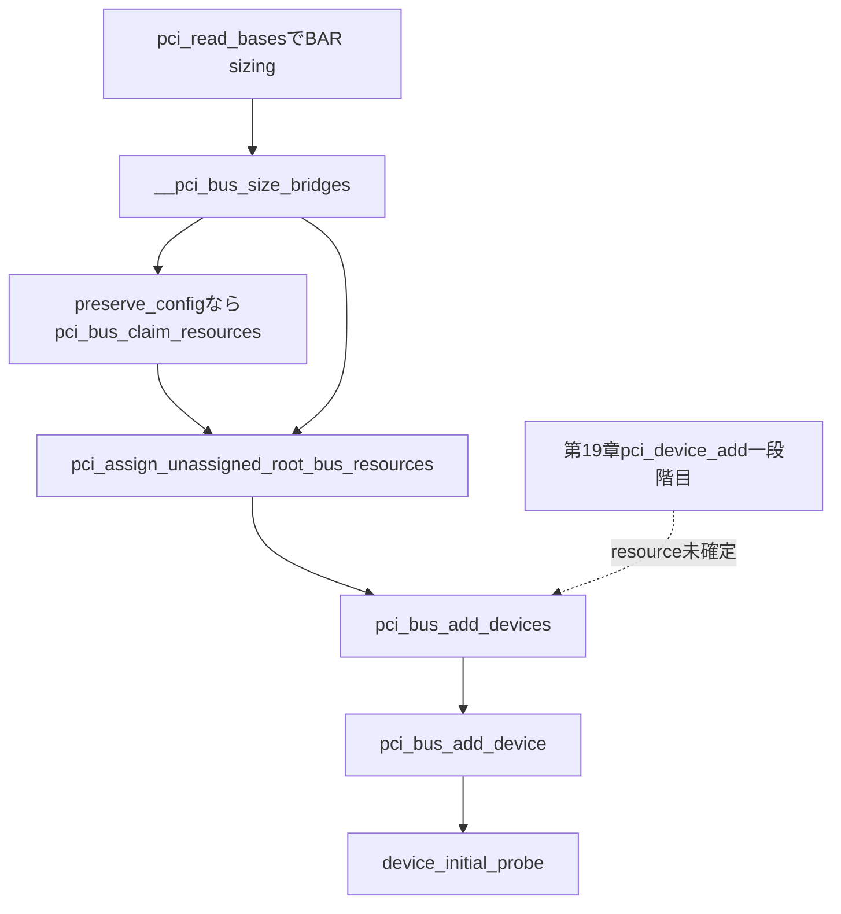

# 第20章 BAR 調査とリソース割り当てと二段階追加

> 本章で読むソース
>
> - [`drivers/pci/probe.c` L184-L196](https://github.com/gregkh/linux/blob/v6.18.38/drivers/pci/probe.c#L184-L196)
> - [`drivers/pci/probe.c` L343-L390](https://github.com/gregkh/linux/blob/v6.18.38/drivers/pci/probe.c#L343-L390)
> - [`drivers/pci/probe.c` L219-L284](https://github.com/gregkh/linux/blob/v6.18.38/drivers/pci/probe.c#L219-L284)
> - [`drivers/pci/setup-bus.c` L1500-L1575](https://github.com/gregkh/linux/blob/v6.18.38/drivers/pci/setup-bus.c#L1500-L1575)
> - [`drivers/pci/setup-bus.c` L1617-L1651](https://github.com/gregkh/linux/blob/v6.18.38/drivers/pci/setup-bus.c#L1617-L1651)
> - [`drivers/pci/setup-bus.c` L1703-L1725](https://github.com/gregkh/linux/blob/v6.18.38/drivers/pci/setup-bus.c#L1703-L1725)
> - [`drivers/pci/setup-bus.c` L2245-L2310](https://github.com/gregkh/linux/blob/v6.18.38/drivers/pci/setup-bus.c#L2245-L2310)
> - [`drivers/pci/setup-res.c` L326-L372](https://github.com/gregkh/linux/blob/v6.18.38/drivers/pci/setup-res.c#L326-L372)
> - [`drivers/pci/probe.c` L3305-L3313](https://github.com/gregkh/linux/blob/v6.18.38/drivers/pci/probe.c#L3305-L3313)
> - [`drivers/pci/bus.c` L344-L424](https://github.com/gregkh/linux/blob/v6.18.38/drivers/pci/bus.c#L344-L424)

## この章の狙い

BAR sizing 手順でリソース要求を検出し、bridge window のサイズ算出、claim と assign の合流、resource 配置後の `pci_bus_add_device` による第二段階登録までを追う。
第19章の `pci_device_add` が第一段階であることとの非対称を明示する。

## 前提

[PCI バススキャンとデバイス生成](19-pci-bus-scan.md) で `pci_setup_device` が `pci_read_bases` を呼ぶタイミングと、`pci_device_add` が generic device を登録する点を読んでいること。
[PCI サブシステムの全体像と host bridge 登録](17-pci-overview-host-bridge.md) で `pci_host_probe` の全体フローを押さえていること。

## BAR のサイズ検出

`pci_read_bases` は `non_compliant_bars` device と VF では処理を省略する。
通常 device では `mmio_always_on` でなければ sizing 中の誤 decode を避けるため `PCI_COMMAND` の I/O と memory decode を一時無効化し、終了後に戻す。

[`drivers/pci/probe.c` L343-L390](https://github.com/gregkh/linux/blob/v6.18.38/drivers/pci/probe.c#L343-L390)

```c
static __always_inline void pci_read_bases(struct pci_dev *dev,
					   unsigned int howmany, int rom)
{
	u32 rombar, stdbars[PCI_STD_NUM_BARS];
	unsigned int pos, reg;
	u16 orig_cmd;

	BUILD_BUG_ON(statically_true(howmany > PCI_STD_NUM_BARS));

	if (dev->non_compliant_bars)
		return;

	/* Per PCIe r4.0, sec 9.3.4.1.11, the VF BARs are all RO Zero */
	if (dev->is_virtfn)
		return;

	/* No printks while decoding is disabled! */
	if (!dev->mmio_always_on) {
		pci_read_config_word(dev, PCI_COMMAND, &orig_cmd);
		if (orig_cmd & PCI_COMMAND_DECODE_ENABLE) {
			pci_write_config_word(dev, PCI_COMMAND,
				orig_cmd & ~PCI_COMMAND_DECODE_ENABLE);
		}
	}

	__pci_size_stdbars(dev, howmany, PCI_BASE_ADDRESS_0, stdbars);
	if (rom)
		__pci_size_rom(dev, rom, &rombar);

	if (!dev->mmio_always_on &&
	    (orig_cmd & PCI_COMMAND_DECODE_ENABLE))
		pci_write_config_word(dev, PCI_COMMAND, orig_cmd);

	for (pos = 0; pos < howmany; pos++) {
		struct resource *res = &dev->resource[pos];
		reg = PCI_BASE_ADDRESS_0 + (pos << 2);
		pos += __pci_read_base(dev, pci_bar_unknown,
				       res, reg, &stdbars[pos]);
	}

	if (rom) {
		struct resource *res = &dev->resource[PCI_ROM_RESOURCE];
		dev->rom_base_reg = rom;
		res->flags = IORESOURCE_MEM | IORESOURCE_PREFETCH |
				IORESOURCE_READONLY | IORESOURCE_SIZEALIGN;
		__pci_read_base(dev, pci_bar_mem32, res, rom, &rombar);
	}
}
```

`__pci_size_stdbars` は元の BAR 値を保存し、全ビット1を書いて mask を読み戻し、元の値を書き戻す。
恒久的に全ビット1を残すのではなく、一時的な sizing 手順である。

[`drivers/pci/probe.c` L184-L196](https://github.com/gregkh/linux/blob/v6.18.38/drivers/pci/probe.c#L184-L196)

```c
static void __pci_size_bars(struct pci_dev *dev, int count,
			    unsigned int pos, u32 *sizes, bool rom)
{
	u32 orig, mask = rom ? PCI_ROM_ADDRESS_MASK : ~0;
	int i;

	for (i = 0; i < count; i++, pos += 4, sizes++) {
		pci_read_config_dword(dev, pos, &orig);
		pci_write_config_dword(dev, pos, mask);
		pci_read_config_dword(dev, pos, sizes);
		pci_write_config_dword(dev, pos, orig);
	}
}
```

`__pci_read_base` は元 base、sizing mask、BAR type から `struct resource` の範囲と flags を作る。
64bit BAR は連続2 register を1つとして扱い、loop は次 slot を飛ばす。

[`drivers/pci/probe.c` L219-L284](https://github.com/gregkh/linux/blob/v6.18.38/drivers/pci/probe.c#L219-L284)

```c
int __pci_read_base(struct pci_dev *dev, enum pci_bar_type type,
		    struct resource *res, unsigned int pos, u32 *sizes)
{
	u32 l = 0, sz;
	u64 l64, sz64, mask64;
	struct pci_bus_region region, inverted_region;
	const char *res_name = pci_resource_name(dev, res - dev->resource);

	res->name = pci_name(dev);

	pci_read_config_dword(dev, pos, &l);
	sz = sizes[0];

	/*
	 * All bits set in sz means the device isn't working properly.
	 * If the BAR isn't implemented, all bits must be 0.  If it's a
	 * memory BAR or a ROM, bit 0 must be clear; if it's an io BAR, bit
	 * 1 must be clear.
	 */
	if (PCI_POSSIBLE_ERROR(sz))
		sz = 0;

	/*
	 * I don't know how l can have all bits set.  Copied from old code.
	 * Maybe it fixes a bug on some ancient platform.
	 */
	if (PCI_POSSIBLE_ERROR(l))
		l = 0;

	if (type == pci_bar_unknown) {
		res->flags = decode_bar(dev, l);
		res->flags |= IORESOURCE_SIZEALIGN;
		if (res->flags & IORESOURCE_IO) {
			l64 = l & PCI_BASE_ADDRESS_IO_MASK;
			sz64 = sz & PCI_BASE_ADDRESS_IO_MASK;
			mask64 = PCI_BASE_ADDRESS_IO_MASK & (u32)IO_SPACE_LIMIT;
		} else {
			l64 = l & PCI_BASE_ADDRESS_MEM_MASK;
			sz64 = sz & PCI_BASE_ADDRESS_MEM_MASK;
			mask64 = (u32)PCI_BASE_ADDRESS_MEM_MASK;
		}
	} else {
		if (l & PCI_ROM_ADDRESS_ENABLE)
			res->flags |= IORESOURCE_ROM_ENABLE;
		l64 = l & PCI_ROM_ADDRESS_MASK;
		sz64 = sz & PCI_ROM_ADDRESS_MASK;
		mask64 = PCI_ROM_ADDRESS_MASK;
	}

	if (res->flags & IORESOURCE_MEM_64) {
		pci_read_config_dword(dev, pos + 4, &l);
		sz = sizes[1];

		l64 |= ((u64)l << 32);
		sz64 |= ((u64)sz << 32);
		mask64 |= ((u64)~0 << 32);
	}

	if (!sz64)
		goto fail;

	sz64 = pci_size(l64, sz64, mask64);
	if (!sz64) {
		pci_info(dev, FW_BUG "%s: invalid; can't size\n", res_name);
		goto fail;
	}
```

## bridge window の sizing

`__pci_bus_size_bridges` はまず subordinate bus を再帰処理し、その後現在 bridge の I/O、prefetchable memory、non-prefetchable memory window の要求サイズと alignment を算出する。
hotplug bridge には将来追加用の余白を加える。
root bus では `host->size_windows` が偽なら root window の sizing をしない。

[`drivers/pci/setup-bus.c` L1500-L1575](https://github.com/gregkh/linux/blob/v6.18.38/drivers/pci/setup-bus.c#L1500-L1575)

```c
void __pci_bus_size_bridges(struct pci_bus *bus, struct list_head *realloc_head)
{
	struct pci_dev *dev;
	resource_size_t additional_io_size = 0, additional_mmio_size = 0,
			additional_mmio_pref_size = 0;
	struct resource *pref;
	struct pci_host_bridge *host;
	int hdr_type;

	list_for_each_entry(dev, &bus->devices, bus_list) {
		struct pci_bus *b = dev->subordinate;
		if (!b)
			continue;

		switch (dev->hdr_type) {
		case PCI_HEADER_TYPE_CARDBUS:
			pci_bus_size_cardbus(b, realloc_head);
			break;

		case PCI_HEADER_TYPE_BRIDGE:
		default:
			__pci_bus_size_bridges(b, realloc_head);
			break;
		}
	}

	/* The root bus? */
	if (pci_is_root_bus(bus)) {
		host = to_pci_host_bridge(bus->bridge);
		if (!host->size_windows)
			return;
		pci_bus_for_each_resource(bus, pref)
			if (pref && (pref->flags & IORESOURCE_PREFETCH))
				break;
		hdr_type = -1;	/* Intentionally invalid - not a PCI device. */
	} else {
		pref = &bus->self->resource[PCI_BRIDGE_PREF_MEM_WINDOW];
		hdr_type = bus->self->hdr_type;
	}

	switch (hdr_type) {
	case PCI_HEADER_TYPE_CARDBUS:
		/* Don't size CardBuses yet */
		break;

	case PCI_HEADER_TYPE_BRIDGE:
		pci_bridge_check_ranges(bus);
		if (bus->self->is_hotplug_bridge) {
			additional_io_size  = pci_hotplug_io_size;
			additional_mmio_size = pci_hotplug_mmio_size;
			additional_mmio_pref_size = pci_hotplug_mmio_pref_size;
		}
		fallthrough;
	default:
		pbus_size_io(bus, realloc_head ? 0 : additional_io_size,
			     additional_io_size, realloc_head);

		if (pref && (pref->flags & IORESOURCE_PREFETCH)) {
			pbus_size_mem(bus,
				      IORESOURCE_MEM | IORESOURCE_PREFETCH |
				      (pref->flags & IORESOURCE_MEM_64),
				      realloc_head ? 0 : additional_mmio_pref_size,
				      additional_mmio_pref_size, realloc_head);
		}

		pbus_size_mem(bus, IORESOURCE_MEM,
			      realloc_head ? 0 : additional_mmio_size,
			      additional_mmio_size, realloc_head);
		break;
	}
}

void pci_bus_size_bridges(struct pci_bus *bus)
{
	__pci_bus_size_bridges(bus, NULL);
}
```

配下要求の単純合計ではなく、type、alignment、granularity、hotplug reserve を考慮した集約である。

## claim と assign の合流

`pci_host_probe` は `preserve_config` が真なら `pci_bus_claim_resources` を先に呼ぶが、その後は条件にかかわらず `pci_assign_unassigned_root_bus_resources` を呼ぶ。
claim と assign は択一ではない。

[`drivers/pci/probe.c` L3305-L3313](https://github.com/gregkh/linux/blob/v6.18.38/drivers/pci/probe.c#L3305-L3313)

```c
	/* If we must preserve the resource configuration, claim now */
	if (bridge->preserve_config)
		pci_bus_claim_resources(bus);

	/*
	 * Assign whatever was left unassigned. If we didn't claim above,
	 * this will reassign everything.
	 */
	pci_assign_unassigned_root_bus_resources(bus);
```

claim は firmware 設定済みの bridge aperture と device BAR を親 resource tree へ予約する段階である。
`pci_bus_claim_resources` は depth-first で bridge aperture を読み取り、device BAR を claim する。

[`drivers/pci/setup-bus.c` L1703-L1725](https://github.com/gregkh/linux/blob/v6.18.38/drivers/pci/setup-bus.c#L1703-L1725)

```c
static void pci_bus_allocate_resources(struct pci_bus *b)
{
	struct pci_bus *child;

	/*
	 * Carry out a depth-first search on the PCI bus tree to allocate
	 * bridge apertures.  Read the programmed bridge bases and
	 * recursively claim the respective bridge resources.
	 */
	if (b->self) {
		pci_read_bridge_bases(b);
		pci_claim_bridge_resources(b->self);
	}

	list_for_each_entry(child, &b->children, node)
		pci_bus_allocate_resources(child);
}

void pci_bus_claim_resources(struct pci_bus *b)
{
	pci_bus_allocate_resources(b);
	pci_bus_allocate_dev_resources(b);
}
```

assign は claim 後にも残る未割り当てを配置する段階である。
`preserve_config` が偽なら事前 claim せず、assign が全体を再配置しうる。

`pci_assign_unassigned_root_bus_resources` は depth first に size と alignment を計算し、root の利用可能 resource を分配し、depth last で hardware register を更新する。
失敗時は bridge resource を解放して再試行する。

[`drivers/pci/setup-bus.c` L2245-L2310](https://github.com/gregkh/linux/blob/v6.18.38/drivers/pci/setup-bus.c#L2245-L2310)

```c
void pci_assign_unassigned_root_bus_resources(struct pci_bus *bus)
{
	LIST_HEAD(realloc_head);
	/* List of resources that want additional resources */
	struct list_head *add_list = NULL;
	int tried_times = 0;
	enum release_type rel_type = leaf_only;
	LIST_HEAD(fail_head);
	int pci_try_num = 1;
	enum enable_type enable_local;

	/* Don't realloc if asked to do so */
	enable_local = pci_realloc_detect(bus, pci_realloc_enable);
	if (pci_realloc_enabled(enable_local)) {
		int max_depth = pci_bus_get_depth(bus);

		pci_try_num = max_depth + 1;
		dev_info(&bus->dev, "max bus depth: %d pci_try_num: %d\n",
			 max_depth, pci_try_num);
	}

	while (1) {
		/*
		 * Last try will use add_list, otherwise will try good to
		 * have as must have, so can realloc parent bridge resource
		 */
		if (tried_times + 1 == pci_try_num)
			add_list = &realloc_head;
		/*
		 * Depth first, calculate sizes and alignments of all
		 * subordinate buses.
		 */
		__pci_bus_size_bridges(bus, add_list);

		pci_root_bus_distribute_available_resources(bus, add_list);

		/* Depth last, allocate resources and update the hardware. */
		__pci_bus_assign_resources(bus, add_list, &fail_head);
		if (WARN_ON_ONCE(add_list && !list_empty(add_list)))
			free_list(add_list);
		tried_times++;

		/* Any device complain? */
		if (list_empty(&fail_head))
			break;

		if (tried_times >= pci_try_num) {
			if (enable_local == undefined) {
				dev_info(&bus->dev,
					 "Some PCI device resources are unassigned, try booting with pci=realloc\n");
			} else if (enable_local == auto_enabled) {
				dev_info(&bus->dev,
					 "Automatically enabled pci realloc, if you have problem, try booting with pci=realloc=off\n");
			}
			free_list(&fail_head);
			break;
		}

		/* Third times and later will not check if it is leaf */
		if (tried_times + 1 > 2)
			rel_type = whole_subtree;

		pci_prepare_next_assign_round(&fail_head, tried_times, rel_type);
	}

	pci_bus_dump_resources(bus);
}
```

`__pci_bus_assign_resources` は sorted 割り当てのあと subordinate bus へ再帰し、bridge の hardware register を更新する。

[`drivers/pci/setup-bus.c` L1617-L1651](https://github.com/gregkh/linux/blob/v6.18.38/drivers/pci/setup-bus.c#L1617-L1651)

```c
void __pci_bus_assign_resources(const struct pci_bus *bus,
				struct list_head *realloc_head,
				struct list_head *fail_head)
{
	struct pci_bus *b;
	struct pci_dev *dev;

	pbus_assign_resources_sorted(bus, realloc_head, fail_head);

	list_for_each_entry(dev, &bus->devices, bus_list) {
		pdev_assign_fixed_resources(dev);

		b = dev->subordinate;
		if (!b)
			continue;

		__pci_bus_assign_resources(b, realloc_head, fail_head);

		switch (dev->hdr_type) {
		case PCI_HEADER_TYPE_BRIDGE:
			if (!pci_is_enabled(dev))
				pci_setup_bridge(b);
			break;

		case PCI_HEADER_TYPE_CARDBUS:
			pci_setup_cardbus(b);
			break;

		default:
			pci_info(dev, "not setting up bridge for bus %04x:%02x\n",
				 pci_domain_nr(b), b->number);
			break;
		}
	}
}
```

## pci_assign_resource による個別配置

`pci_assign_resource` は `IORESOURCE_PCI_FIXED` を除外し、alignment と size を求めて親 bus window から割り当てる。
失敗時は firmware 元 address へ戻す試行を行う。
成功時は `IORESOURCE_UNSET` を外し、device BAR なら `pci_update_resource` で config space を更新する。

[`drivers/pci/setup-res.c` L326-L372](https://github.com/gregkh/linux/blob/v6.18.38/drivers/pci/setup-res.c#L326-L372)

```c
int pci_assign_resource(struct pci_dev *dev, int resno)
{
	struct resource *res = pci_resource_n(dev, resno);
	const char *res_name = pci_resource_name(dev, resno);
	resource_size_t align, size;
	int ret;

	if (res->flags & IORESOURCE_PCI_FIXED)
		return 0;

	res->flags |= IORESOURCE_UNSET;
	align = pci_resource_alignment(dev, res);
	if (!align) {
		pci_info(dev, "%s %pR: can't assign; bogus alignment\n",
			 res_name, res);
		return -EINVAL;
	}

	size = resource_size(res);
	ret = _pci_assign_resource(dev, resno, size, align);

	/*
	 * If we failed to assign anything, let's try the address
	 * where firmware left it.  That at least has a chance of
	 * working, which is better than just leaving it disabled.
	 */
	if (ret < 0) {
		pci_info(dev, "%s %pR: can't assign; no space\n", res_name, res);
		ret = pci_revert_fw_address(res, dev, resno, size);
	}

	if (ret < 0) {
		pci_info(dev, "%s %pR: failed to assign\n", res_name, res);
		return ret;
	}

	res->flags &= ~IORESOURCE_UNSET;
	res->flags &= ~IORESOURCE_STARTALIGN;
	if (resno >= PCI_BRIDGE_RESOURCES && resno <= PCI_BRIDGE_RESOURCE_END)
		res->flags &= ~IORESOURCE_DISABLED;

	pci_info(dev, "%s %pR: assigned\n", res_name, res);
	if (resno < PCI_BRIDGE_RESOURCES)
		pci_update_resource(dev, resno);

	return 0;
}
```

## 二段階追加の非対称

scan 中の `pci_device_add`（第19章）で generic device は登録済みだが、resource 未割り当ての可能性があるため probe は始めない。
`pci_bus_add_device` は resource 配置後に arch hook、final fixup、PCI 固有 sysfs file、proc entry、bridge D3、config state 保存、必要な power control device link、runtime PM を準備し、OF node が使用可能なら binding を許可して `device_initial_probe` を呼び `is_added` を設定する。

[`drivers/pci/bus.c` L344-L424](https://github.com/gregkh/linux/blob/v6.18.38/drivers/pci/bus.c#L344-L424)

```c
void pci_bus_add_device(struct pci_dev *dev)
{
	struct device_node *dn = dev->dev.of_node;
	struct platform_device *pdev;

	/*
	 * Can not put in pci_device_add yet because resources
	 * are not assigned yet for some devices.
	 */
	pcibios_bus_add_device(dev);
	pci_fixup_device(pci_fixup_final, dev);
	if (pci_is_bridge(dev))
		of_pci_make_dev_node(dev);
	pci_create_sysfs_dev_files(dev);
	pci_proc_attach_device(dev);
	pci_bridge_d3_update(dev);

	/* Save config space for error recoverability */
	pci_save_state(dev);

	/*
	 * If the PCI device is associated with a pwrctrl device with a
	 * power supply, create a device link between the PCI device and
	 * pwrctrl device.  This ensures that pwrctrl drivers are probed
	 * before PCI client drivers.
	 */
	pdev = of_find_device_by_node(dn);
	if (pdev) {
		if (of_pci_supply_present(dn)) {
			if (!device_link_add(&dev->dev, &pdev->dev,
					     DL_FLAG_AUTOREMOVE_CONSUMER)) {
				pci_err(dev, "failed to add device link to power control device %s\n",
					pdev->name);
			}
		}
		put_device(&pdev->dev);
	}

	/*
	 * Enable runtime PM, which potentially allows the device to
	 * suspend immediately, only after the PCI state has been
	 * configured completely.
	 */
	pm_runtime_enable(&dev->dev);

	if (!dn || of_device_is_available(dn))
		pci_dev_allow_binding(dev);

	device_initial_probe(&dev->dev);

	pci_dev_assign_added(dev);
}
EXPORT_SYMBOL_GPL(pci_bus_add_device);

/**
 * pci_bus_add_devices - start driver for PCI devices
 * @bus: bus to check for new devices
 *
 * Start driver for PCI devices and add some sysfs entries.
 */
void pci_bus_add_devices(const struct pci_bus *bus)
{
	struct pci_dev *dev;
	struct pci_bus *child;

	list_for_each_entry(dev, &bus->devices, bus_list) {
		/* Skip already-added devices */
		if (pci_dev_is_added(dev))
			continue;
		pci_bus_add_device(dev);
	}

	list_for_each_entry(dev, &bus->devices, bus_list) {
		/* Skip if device attach failed */
		if (!pci_dev_is_added(dev))
			continue;
		child = dev->subordinate;
		if (child)
			pci_bus_add_devices(child);
	}
}
```

`pci_bus_add_devices` はまず現在 bus の全 device に `pci_bus_add_device` を適用し、第二巡で added 済み bridge の child bus へ再帰する。
親 bus を終えてから child bus を開始し、階層順序を保つ。

## 処理の流れ



## 高速化と最適化の工夫

二段階追加は resource が確定してから probe を始め、ドライバが未割り当ての BAR を掴む不整合を防ぐ。
resource 配置を scan と分離し、resource type と alignment を考慮して親 window 内へ衝突なく配置する。
`pci_assign_unassigned_root_bus_resources` は失敗時に bridge window を段階的に再配分するが、断片化最小を保証する機構ではなく、衝突回避と再配分のための再試行である。

## まとめ

BAR sizing は一時的な全ビット1書き込みと元値復元であり、`__pci_read_base` が `struct resource` を埋める。
claim は firmware 設定の予約、assign は未割り当ての配置であり、両方が `pci_host_probe` で合流する。
`pci_device_add` が第一段階、`pci_bus_add_device` が resource 配置後の第二段階であり、後者で初めて `device_initial_probe` が走る。

## 関連する章

- [PCI バススキャンとデバイス生成](19-pci-bus-scan.md)
- [PCI サブシステムの全体像と host bridge 登録](17-pci-overview-host-bridge.md)
- [PCI ドライバのバインド](../part06-pci-driver/21-pci-driver-bind.md)
