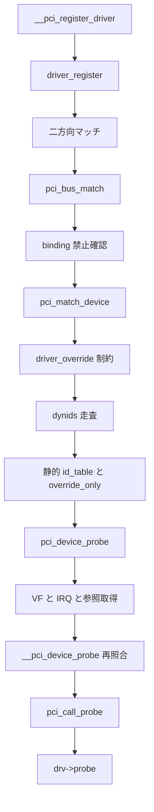

# 第21章 PCI ドライバのバインド

> 本章で読むソース
>
> - [`drivers/pci/pci-driver.c` L105-L116](https://github.com/gregkh/linux/blob/v6.18.38/drivers/pci/pci-driver.c#L105-L116)
> - [`drivers/pci/pci-driver.c` L136-L180](https://github.com/gregkh/linux/blob/v6.18.38/drivers/pci/pci-driver.c#L136-L180)
> - [`drivers/pci/pci.h` L408-L418](https://github.com/gregkh/linux/blob/v6.18.38/drivers/pci/pci.h#L408-L418)
> - [`drivers/pci/pci-driver.c` L1515-L1530](https://github.com/gregkh/linux/blob/v6.18.38/drivers/pci/pci-driver.c#L1515-L1530)
> - [`drivers/pci/pci-driver.c` L416-L429](https://github.com/gregkh/linux/blob/v6.18.38/drivers/pci/pci-driver.c#L416-L429)
> - [`drivers/pci/pci-driver.c` L444-L467](https://github.com/gregkh/linux/blob/v6.18.38/drivers/pci/pci-driver.c#L444-L467)
> - [`drivers/pci/pci-driver.c` L1444-L1460](https://github.com/gregkh/linux/blob/v6.18.38/drivers/pci/pci-driver.c#L1444-L1460)
> - [`drivers/pci/pci-driver.c` L1705-L1721](https://github.com/gregkh/linux/blob/v6.18.38/drivers/pci/pci-driver.c#L1705-L1721)
> - [`drivers/pci/pci-driver.c` L195-L253](https://github.com/gregkh/linux/blob/v6.18.38/drivers/pci/pci-driver.c#L195-L253)

## この章の狙い

PCI ドライバが `id_table` と動的 ID でデバイスを選び、汎用 driver core の二方向マッチへ接続される経路を追う。
`pci_match_device` の照合順序、`pci_bus_type` の `match` と `probe` ラッパ、probe 直前の再照合までをソースで固定する。

## 前提

[ドライバ登録と二方向マッチと async probe](../part03-probe/10-driver-match-async-probe.md) で `driver_register` と `driver_match_device` を読んでいること。
[really_probe とバインドの中核](../part03-probe/11-really-probe.md) で `really_probe` が `bus->probe` を優先して呼ぶことを押さえていること。

## PCI ドライバの登録

`struct pci_driver` は `MODULE_DEVICE_TABLE` で静的な `id_table` を持ち、`__pci_register_driver` が汎用 `device_driver` フィールドを埋めて `driver_register` へ渡す。
`bus` は `pci_bus_type` に固定され、dynids リスト用のスピンロックもここで初期化される。

[`drivers/pci/pci-driver.c` L1444-L1460](https://github.com/gregkh/linux/blob/v6.18.38/drivers/pci/pci-driver.c#L1444-L1460)

```c
int __pci_register_driver(struct pci_driver *drv, struct module *owner,
			  const char *mod_name)
{
	/* initialize common driver fields */
	drv->driver.name = drv->name;
	drv->driver.bus = &pci_bus_type;
	drv->driver.owner = owner;
	drv->driver.mod_name = mod_name;
	drv->driver.groups = drv->groups;
	drv->driver.dev_groups = drv->dev_groups;

	spin_lock_init(&drv->dynids.lock);
	INIT_LIST_HEAD(&drv->dynids.list);

	/* register with core */
	return driver_register(&drv->driver);
}
```

登録後は第10章と同様、既存デバイスへの `driver_attach` と、後着デバイスへの `bus_probe_device` が走る。

## id_table とマスク付き照合

静的 `id_table` の各 entry は vendor、device、subsystem vendor、subsystem device、class、class_mask を持つ。
終端は vendor、subvendor、class_mask がすべて 0 の entry である。
1 entry あたりの照合は `pci_match_one_device` が担い、各フィールドは完全一致か `PCI_ANY_ID` ワイルドカード、class は XOR と mask で判定する。

[`drivers/pci/pci.h` L408-L418](https://github.com/gregkh/linux/blob/v6.18.38/drivers/pci/pci.h#L408-L418)

```c
static inline const struct pci_device_id *
pci_match_one_device(const struct pci_device_id *id, const struct pci_dev *dev)
{
	if ((id->vendor == PCI_ANY_ID || id->vendor == dev->vendor) &&
	    (id->device == PCI_ANY_ID || id->device == dev->device) &&
	    (id->subvendor == PCI_ANY_ID || id->subvendor == dev->subsystem_vendor) &&
	    (id->subdevice == PCI_ANY_ID || id->subdevice == dev->subsystem_device) &&
	    !((id->class ^ dev->class) & id->class_mask))
		return id;
	return NULL;
}
```

vendor 全体を受け入れるには `PCI_ANY_ID` を vendor フィールドに明示した entry が必要である。
class_mask だけでは vendor や device がワイルドカードにならない。

`pci_match_id` は table 先頭から終端手前まで `pci_match_one_device` を繰り返す薄いラッパである。

[`drivers/pci/pci-driver.c` L105-L116](https://github.com/gregkh/linux/blob/v6.18.38/drivers/pci/pci-driver.c#L105-L116)

```c
const struct pci_device_id *pci_match_id(const struct pci_device_id *ids,
					 struct pci_dev *dev)
{
	if (ids) {
		while (ids->vendor || ids->subvendor || ids->class_mask) {
			if (pci_match_one_device(ids, dev))
				return ids;
			ids++;
		}
	}
	return NULL;
}
```

## pci_match_device の照合順序

`pci_match_device` は bus match と probe 直前の再照合の両方で使われる。
照合は次の順序で固定される。

1. `device_match_driver_override` が 0 を返せば、そのドライバへのバインドを拒否して直ちに NULL を返す。
2. 拒否されなければ、dynids リストをスピンロック下で先に走査し、一致すればその dynamic `pci_device_id` を返す。
3. 次に静的 `id_table` を `pci_match_id` で走査する。
   `override_only` entry は `driver_override` が明示一致した場合だけ採用し、通常 entry はそのまま採用する。
4. 静的 entry が一致しなくても `driver_override` が一致していれば `pci_device_id_any` を返す。

[`drivers/pci/pci-driver.c` L136-L180](https://github.com/gregkh/linux/blob/v6.18.38/drivers/pci/pci-driver.c#L136-L180)

```c
static const struct pci_device_id *pci_match_device(struct pci_driver *drv,
						    struct pci_dev *dev)
{
	struct pci_dynid *dynid;
	const struct pci_device_id *found_id = NULL, *ids;
	int ret;

	/* When driver_override is set, only bind to the matching driver */
	ret = device_match_driver_override(&dev->dev, &drv->driver);
	if (ret == 0)
		return NULL;

	/* Look at the dynamic ids first, before the static ones */
	spin_lock(&drv->dynids.lock);
	list_for_each_entry(dynid, &drv->dynids.list, node) {
		if (pci_match_one_device(&dynid->id, dev)) {
			found_id = &dynid->id;
			break;
		}
	}
	spin_unlock(&drv->dynids.lock);

	if (found_id)
		return found_id;

	for (ids = drv->id_table; (found_id = pci_match_id(ids, dev));
	     ids = found_id + 1) {
		/*
		 * The match table is split based on driver_override.
		 * In case override_only was set, enforce driver_override
		 * matching.
		 */
		if (found_id->override_only) {
			if (ret > 0)
				return found_id;
		} else {
			return found_id;
		}
	}

	/* driver_override will always match, send a dummy id */
	if (ret > 0)
		return &pci_device_id_any;
	return NULL;
}
```

dynids を静的 table より先に見るため、sysfs の `new_id` で追加した ID が再ビルドなしで優先される。
一方 `new_id_store` は互換性を検証しない。
静的 `id_table` を持つドライバでは、`driver_data` は既存 entry の値と一致する場合だけ受け付ける（`id_table` が NULL のドライバはこの検査を行わない）が、デバイスとドライバの動作互換は運用者が保証する仕組みである。

[`drivers/pci/pci-driver.c` L195-L253](https://github.com/gregkh/linux/blob/v6.18.38/drivers/pci/pci-driver.c#L195-L253)

```c
static ssize_t new_id_store(struct device_driver *driver, const char *buf,
			    size_t count)
{
	struct pci_driver *pdrv = to_pci_driver(driver);
	const struct pci_device_id *ids = pdrv->id_table;
	u32 vendor, device, subvendor = PCI_ANY_ID,
		subdevice = PCI_ANY_ID, class = 0, class_mask = 0;
	unsigned long driver_data = 0;
	int fields;
	int retval = 0;

	fields = sscanf(buf, "%x %x %x %x %x %x %lx",
			&vendor, &device, &subvendor, &subdevice,
			&class, &class_mask, &driver_data);
	if (fields < 2)
		return -EINVAL;

	if (fields != 7) {
		struct pci_dev *pdev = kzalloc(sizeof(*pdev), GFP_KERNEL);
		if (!pdev)
			return -ENOMEM;

		pdev->vendor = vendor;
		pdev->device = device;
		pdev->subsystem_vendor = subvendor;
		pdev->subsystem_device = subdevice;
		pdev->class = class;
		pdev->dev.release = _pci_free_device;

		device_initialize(&pdev->dev);
		if (pci_match_device(pdrv, pdev))
			retval = -EEXIST;

		put_device(&pdev->dev);

		if (retval)
			return retval;
	}

	/* Only accept driver_data values that match an existing id_table
	   entry */
	if (ids) {
		retval = -EINVAL;
		while (ids->vendor || ids->subvendor || ids->class_mask) {
			if (driver_data == ids->driver_data) {
				retval = 0;
				break;
			}
			ids++;
		}
		if (retval)	/* No match */
			return retval;
	}

	retval = pci_add_dynid(pdrv, vendor, device, subvendor, subdevice,
			       class, class_mask, driver_data);
	if (retval)
		return retval;
	return count;
}
```

## pci_bus_type と汎用 core への接続

`pci_bus_type` は `match` に `pci_bus_match`、`probe` に `pci_device_probe` を設定する。
`driver_override` フラグも真であり、override 機構と id_table の `override_only` が連動する。

[`drivers/pci/pci-driver.c` L1705-L1721](https://github.com/gregkh/linux/blob/v6.18.38/drivers/pci/pci-driver.c#L1705-L1721)

```c
const struct bus_type pci_bus_type = {
	.name		= "pci",
	.driver_override = true,
	.match		= pci_bus_match,
	.uevent		= pci_uevent,
	.probe		= pci_device_probe,
	.remove		= pci_device_remove,
	.shutdown	= pci_device_shutdown,
	.irq_get_affinity = pci_device_irq_get_affinity,
	.dev_groups	= pci_dev_groups,
	.bus_groups	= pci_bus_groups,
	.drv_groups	= pci_drv_groups,
	.pm		= PCI_PM_OPS_PTR,
	.num_vf		= pci_bus_num_vf,
	.dma_configure	= pci_dma_configure,
	.dma_cleanup	= pci_dma_cleanup,
};
```

`pci_bus_match` は binding が禁止されたデバイスを除外したうえで `pci_match_device` を呼び、一致すれば 1 を返す。
`really_probe` の `call_driver_probe` は `bus->probe` があればそちらを優先するため、PCI では `pci_device_probe` ラッパへ入る。

[`drivers/pci/pci-driver.c` L1515-L1530](https://github.com/gregkh/linux/blob/v6.18.38/drivers/pci/pci-driver.c#L1515-L1530)

```c
static int pci_bus_match(struct device *dev, const struct device_driver *drv)
{
	struct pci_dev *pci_dev = to_pci_dev(dev);
	struct pci_driver *pci_drv;
	const struct pci_device_id *found_id;

	if (pci_dev_binding_disallowed(pci_dev))
		return 0;

	pci_drv = (struct pci_driver *)to_pci_driver(drv);
	found_id = pci_match_device(pci_drv, pci_dev);
	if (found_id)
		return 1;

	return 0;
}
```

## probe ラッパと二回目の照合

`pci_device_probe` は VF の `drivers_autoprobe` 条件、legacy IRQ 割り当て、アーキテクチャ依存の IRQ 確保、`pci_dev` の参照取得を済ませてから `__pci_device_probe` を呼ぶ。
`__pci_device_probe` は `pci_match_device` を再度呼び、一致した `pci_device_id` を `pci_call_probe` 経由でドライバの `probe` へ渡す。

bus match 段階では一致の有無だけが汎用 core に返り、probe 段階の再照合で id entry 自体を `probe` 引数に渡す。
dynids や `override_only` の分岐が二回とも同じ関数で評価される。

[`drivers/pci/pci-driver.c` L444-L467](https://github.com/gregkh/linux/blob/v6.18.38/drivers/pci/pci-driver.c#L444-L467)

```c
static int pci_device_probe(struct device *dev)
{
	int error;
	struct pci_dev *pci_dev = to_pci_dev(dev);
	struct pci_driver *drv = to_pci_driver(dev->driver);

	if (!pci_device_can_probe(pci_dev))
		return -ENODEV;

	pci_assign_irq(pci_dev);

	error = pcibios_alloc_irq(pci_dev);
	if (error < 0)
		return error;

	pci_dev_get(pci_dev);
	error = __pci_device_probe(drv, pci_dev);
	if (error) {
		pcibios_free_irq(pci_dev);
		pci_dev_put(pci_dev);
	}

	return error;
}
```

[`drivers/pci/pci-driver.c` L416-L429](https://github.com/gregkh/linux/blob/v6.18.38/drivers/pci/pci-driver.c#L416-L429)

```c
static int __pci_device_probe(struct pci_driver *drv, struct pci_dev *pci_dev)
{
	const struct pci_device_id *id;
	int error = 0;

	if (drv->probe) {
		error = -ENODEV;

		id = pci_match_device(drv, pci_dev);
		if (id)
			error = pci_call_probe(drv, pci_dev, id);
	}
	return error;
}
```

## 処理の流れ



## 高速化と最適化の工夫

マスク付き `id_table` により、1 つのドライバが `PCI_ANY_ID` や class mask で広いデバイス群を少数 entry で受け持てる。
デバイスごとに個別ドライバを書かず、テーブル走査だけでマッチ可否を決められる。
dynids を静的 table より先に見る設計は、モジュール再ビルドなしに sysfs から新 ID を結び付けられる運用面の柔軟性も与える。

## まとめ

PCI ドライバは `__pci_register_driver` で `pci_bus_type` に接続され、照合は `pci_match_device` の固定順序で行われる。
汎用 core の match と PCI 固有の probe ラッパが二段階で同じ照合関数を呼び、probe では一致 id をドライバへ渡す。

## 関連する章

- [ドライバ登録と二方向マッチと async probe](../part03-probe/10-driver-match-async-probe.md)
- [really_probe とバインドの中核](../part03-probe/11-really-probe.md)
- [PCI ドライバの利用準備](22-pci-enable-device.md)
