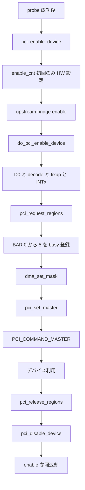

# 第22章 PCI ドライバの利用準備

> 本章で読むソース
>
> - [`drivers/pci/pci.c` L2012-L2054](https://github.com/gregkh/linux/blob/v6.18.38/drivers/pci/pci.c#L2012-L2054)
> - [`drivers/pci/pci.c` L2093-L2126](https://github.com/gregkh/linux/blob/v6.18.38/drivers/pci/pci.c#L2093-L2126)
> - [`drivers/pci/pci.c` L2153-L2156](https://github.com/gregkh/linux/blob/v6.18.38/drivers/pci/pci.c#L2153-L2156)
> - [`drivers/pci/pci.c` L2193-L2204](https://github.com/gregkh/linux/blob/v6.18.38/drivers/pci/pci.c#L2193-L2204)
> - [`drivers/pci/pci.c` L2229-L2242](https://github.com/gregkh/linux/blob/v6.18.38/drivers/pci/pci.c#L2229-L2242)
> - [`drivers/pci/pci.c` L4001-L4018](https://github.com/gregkh/linux/blob/v6.18.38/drivers/pci/pci.c#L4001-L4018)
> - [`drivers/pci/pci.c` L4079-L4083](https://github.com/gregkh/linux/blob/v6.18.38/drivers/pci/pci.c#L4079-L4083)
> - [`drivers/pci/pci.c` L4222-L4237](https://github.com/gregkh/linux/blob/v6.18.38/drivers/pci/pci.c#L4222-L4237)
> - [`drivers/pci/pci.c` L4285-L4289](https://github.com/gregkh/linux/blob/v6.18.38/drivers/pci/pci.c#L4285-L4289)

## この章の狙い

probe に成功した PCI ドライバがデバイスを使う前に行う定型準備を、enable、region 予約、bus master、解除の非対称性まで含めて追う。
`pci_enable_device` が decode と D0 を担い bus master を含まない点、`pci_disable_device` が decode を対称に戻さない点を明確にする。

## 前提

[PCI ドライバのバインド](21-pci-driver-bind.md) で `pci_device_probe` からドライバ `probe` へ至る経路を読んでいること。
[BAR 調査とリソース割り当てと二段階追加](../part05-pci-enumeration/20-pci-bar-resource-assign.md) で `struct resource` が列挙時にサイズだけ確定していることを押さえていること。

## pci_enable_device の参照カウントと初回処理

`pci_enable_device` は `pci_enable_device_flags` に I/O と memory の resource flags を渡す薄いラッパである。

[`drivers/pci/pci.c` L2153-L2156](https://github.com/gregkh/linux/blob/v6.18.38/drivers/pci/pci.c#L2153-L2156)

```c
int pci_enable_device(struct pci_dev *dev)
{
	return pci_enable_device_flags(dev, IORESOURCE_MEM | IORESOURCE_IO);
}
```

`pci_enable_device_flags` は current power state を更新し、`enable_cnt` を増やす。
二回目以降はカウントだけ増やし、ハードウェア再設定を省く。

初回は upstream bridge を再帰的に enable し、要求 flags に合う resource の bitmask を組み立てて `do_pci_enable_device` を呼ぶ。

[`drivers/pci/pci.c` L2093-L2126](https://github.com/gregkh/linux/blob/v6.18.38/drivers/pci/pci.c#L2093-L2126)

```c
static int pci_enable_device_flags(struct pci_dev *dev, unsigned long flags)
{
	struct pci_dev *bridge;
	int err;
	int i, bars = 0;

	/*
	 * Power state could be unknown at this point, either due to a fresh
	 * boot or a device removal call.  So get the current power state
	 * so that things like MSI message writing will behave as expected
	 * (e.g. if the device really is in D0 at enable time).
	 */
	pci_update_current_state(dev, dev->current_state);

	if (atomic_inc_return(&dev->enable_cnt) > 1)
		return 0;		/* already enabled */

	bridge = pci_upstream_bridge(dev);
	if (bridge)
		pci_enable_bridge(bridge);

	/* only skip sriov related */
	for (i = 0; i <= PCI_ROM_RESOURCE; i++)
		if (dev->resource[i].flags & flags)
			bars |= (1 << i);
	for (i = PCI_BRIDGE_RESOURCES; i < DEVICE_COUNT_RESOURCE; i++)
		if (dev->resource[i].flags & flags)
			bars |= (1 << i);

	err = do_pci_enable_device(dev, bars);
	if (err < 0)
		atomic_dec(&dev->enable_cnt);
	return err;
}
```

## do_pci_enable_device の実効

`do_pci_enable_device` は D0 遷移、ASPM link 設定、host bridge の enable hook、`pcibios_enable_device` による resource decode、enable fixup を行う。
MSI または MSI-X が未使用で `PCI_INTERRUPT_PIN` があるデバイスでは INTx disable bit を解除する。
主要効果は D0 と I/O、memory の decode である。
`PCI_COMMAND_MASTER` はここでは設定されない。

[`drivers/pci/pci.c` L2012-L2054](https://github.com/gregkh/linux/blob/v6.18.38/drivers/pci/pci.c#L2012-L2054)

```c
static int do_pci_enable_device(struct pci_dev *dev, int bars)
{
	int err;
	struct pci_dev *bridge;
	u16 cmd;
	u8 pin;

	err = pci_set_power_state(dev, PCI_D0);
	if (err < 0 && err != -EIO)
		return err;

	bridge = pci_upstream_bridge(dev);
	if (bridge)
		pcie_aspm_powersave_config_link(bridge);

	err = pci_host_bridge_enable_device(dev);
	if (err)
		return err;

	err = pcibios_enable_device(dev, bars);
	if (err < 0)
		goto err_enable;
	pci_fixup_device(pci_fixup_enable, dev);

	if (dev->msi_enabled || dev->msix_enabled)
		return 0;

	pci_read_config_byte(dev, PCI_INTERRUPT_PIN, &pin);
	if (pin) {
		pci_read_config_word(dev, PCI_COMMAND, &cmd);
		if (cmd & PCI_COMMAND_INTX_DISABLE)
			pci_write_config_word(dev, PCI_COMMAND,
					      cmd & ~PCI_COMMAND_INTX_DISABLE);
	}

	return 0;

err_enable:
	pci_host_bridge_disable_device(dev);

	return err;

}
```

## pci_request_regions と BAR 予約

`pci_request_regions` は標準 BAR 0 から 5 を `pci_request_selected_regions` へ渡す。
各 resource を resource tree 上で busy として予約し、途中失敗では先に確保した region を逆順に release して `-EBUSY` を返す。
ROM resource や bridge window までは予約しない。

[`drivers/pci/pci.c` L4079-L4083](https://github.com/gregkh/linux/blob/v6.18.38/drivers/pci/pci.c#L4079-L4083)

```c
int pci_request_regions(struct pci_dev *pdev, const char *name)
{
	return pci_request_selected_regions(pdev,
			((1 << PCI_STD_NUM_BARS) - 1), name);
}
```

[`drivers/pci/pci.c` L4001-L4018](https://github.com/gregkh/linux/blob/v6.18.38/drivers/pci/pci.c#L4001-L4018)

```c
static int __pci_request_selected_regions(struct pci_dev *pdev, int bars,
					  const char *name, int excl)
{
	int i;

	for (i = 0; i < PCI_STD_NUM_BARS; i++)
		if (bars & (1 << i))
			if (__pci_request_region(pdev, i, name, excl))
				goto err_out;
	return 0;

err_out:
	while (--i >= 0)
		if (bars & (1 << i))
			pci_release_region(pdev, i);

	return -EBUSY;
}
```

BAR の物理アドレス割り当ては第20章の列挙段階で済んでいる。
`pci_request_regions` はドライバ間の二重使用を予約時に検出する層である。

## pci_set_master と bus mastering

デバイス起点 DMA を許可する bus mastering は `pci_set_master` が別途 `PCI_COMMAND_MASTER` を立てる。
`__pci_set_master` が config space の `PCI_COMMAND` を更新し、`pcibios_set_master` がアーキテクチャ依存の設定を行う。

[`drivers/pci/pci.c` L4285-L4289](https://github.com/gregkh/linux/blob/v6.18.38/drivers/pci/pci.c#L4285-L4289)

```c
void pci_set_master(struct pci_dev *dev)
{
	__pci_set_master(dev, true);
	pcibios_set_master(dev);
}
```

[`drivers/pci/pci.c` L4222-L4237](https://github.com/gregkh/linux/blob/v6.18.38/drivers/pci/pci.c#L4222-L4237)

```c
static void __pci_set_master(struct pci_dev *dev, bool enable)
{
	u16 old_cmd, cmd;

	pci_read_config_word(dev, PCI_COMMAND, &old_cmd);
	if (enable)
		cmd = old_cmd | PCI_COMMAND_MASTER;
	else
		cmd = old_cmd & ~PCI_COMMAND_MASTER;
	if (cmd != old_cmd) {
		pci_dbg(dev, "%s bus mastering\n",
			enable ? "enabling" : "disabling");
		pci_write_config_word(dev, PCI_COMMAND, cmd);
	}
	dev->is_busmaster = enable;
}
```

DMA を使わないデバイスは `pci_set_master` を呼ばず master bit を立てない運用が可能である。
`dma_set_mask` はデバイスが生成または受信できる DMA アドレス幅を DMA 層へ伝える別操作であり、本章の enable 系列とは独立する。

## 解除経路と非対称性

典型的な cleanup は `pci_clear_master`、`pci_release_regions`、`pci_disable_device` の順であるが、機械的な完全逆順ではない。

`pci_disable_device` は `enable_cnt` を減らし、最後の caller が disable した場合だけ host bridge disable hook と `do_pci_disable_device` を実行する。
カーネルコメントが示すとおり、主効果は bus mastering の無効化である。

[`drivers/pci/pci.c` L2229-L2242](https://github.com/gregkh/linux/blob/v6.18.38/drivers/pci/pci.c#L2229-L2242)

```c
void pci_disable_device(struct pci_dev *dev)
{
	dev_WARN_ONCE(&dev->dev, atomic_read(&dev->enable_cnt) <= 0,
		      "disabling already-disabled device");

	if (atomic_dec_return(&dev->enable_cnt) != 0)
		return;

	pci_host_bridge_disable_device(dev);

	do_pci_disable_device(dev);

	dev->is_busmaster = 0;
}
```

`do_pci_disable_device` 自身が `PCI_COMMAND_MASTER` を落とすため、直前の `pci_clear_master` は重複しうる。

[`drivers/pci/pci.c` L2193-L2204](https://github.com/gregkh/linux/blob/v6.18.38/drivers/pci/pci.c#L2193-L2204)

```c
static void do_pci_disable_device(struct pci_dev *dev)
{
	u16 pci_command;

	pci_read_config_word(dev, PCI_COMMAND, &pci_command);
	if (pci_command & PCI_COMMAND_MASTER) {
		pci_command &= ~PCI_COMMAND_MASTER;
		pci_write_config_word(dev, PCI_COMMAND, pci_command);
	}

	pcibios_disable_device(dev);
}
```

`pci_disable_device` は `pci_enable_device` が立てた I/O、memory decode bit を対称に消す処理ではない。
region 予約の返却と enable 参照の返却は別の API で行う。
`pcim_enable_device` など managed API は devres action で detach 時 cleanup を登録する。

## 処理の流れ



## 高速化と最適化の工夫

decode 有効化と bus master 有効化を別 API に分けることで、DMA を使わないデバイスは master bit を立てず誤 DMA を抑止できる。
`pci_request_regions` が resource tree に領域を busy 登録することで、複数ドライバの BAR 二重使用を予約時に `-EBUSY` で検出できる。
`enable_cnt` による参照カウントは、複数サブシステムが同一 `pci_dev` を enable した場合のハードウェア再設定コストを省く。

## まとめ

利用準備は `pci_enable_device` で D0 と decode を有効化し、`pci_request_regions` で BAR を予約し、必要なら `dma_set_mask` と `pci_set_master` を別途行う。
解除は region 返却と enable 参照返却を区別し、`pci_disable_device` が decode を機械的に戻すと期待しない。

## 関連する章

- [PCI ドライバのバインド](21-pci-driver-bind.md)
- [MSI/MSI-X の PCI 側プログラミング](23-pci-msi.md)
- [BAR 調査とリソース割り当てと二段階追加](../part05-pci-enumeration/20-pci-bar-resource-assign.md)
