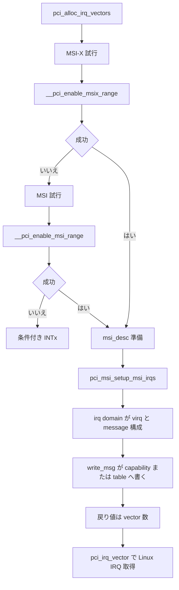

# 第23章 MSI/MSI-X の PCI 側プログラミング

> 本章で読むソース
>
> - [`drivers/pci/msi/api.c` L232-L237](https://github.com/gregkh/linux/blob/v6.18.38/drivers/pci/msi/api.c#L232-L237)
> - [`drivers/pci/msi/api.c` L252-L296](https://github.com/gregkh/linux/blob/v6.18.38/drivers/pci/msi/api.c#L252-L296)
> - [`drivers/pci/msi/api.c` L311-L320](https://github.com/gregkh/linux/blob/v6.18.38/drivers/pci/msi/api.c#L311-L320)
> - [`drivers/pci/msi/api.c` L374-L378](https://github.com/gregkh/linux/blob/v6.18.38/drivers/pci/msi/api.c#L374-L378)
> - [`drivers/pci/msi/msi.c` L187-L207](https://github.com/gregkh/linux/blob/v6.18.38/drivers/pci/msi/msi.c#L187-L207)
> - [`drivers/pci/msi/msi.c` L411-L470](https://github.com/gregkh/linux/blob/v6.18.38/drivers/pci/msi/msi.c#L411-L470)
> - [`drivers/pci/msi/msi.c` L622-L643](https://github.com/gregkh/linux/blob/v6.18.38/drivers/pci/msi/msi.c#L622-L643)
> - [`drivers/pci/msi/msi.c` L712-L759](https://github.com/gregkh/linux/blob/v6.18.38/drivers/pci/msi/msi.c#L712-L759)
> - [`drivers/pci/msi/msi.c` L793-L859](https://github.com/gregkh/linux/blob/v6.18.38/drivers/pci/msi/msi.c#L793-L859)
> - [`drivers/pci/msi/irqdomain.c` L11-L20](https://github.com/gregkh/linux/blob/v6.18.38/drivers/pci/msi/irqdomain.c#L11-L20)
> - [`drivers/pci/msi/irqdomain.c` L40-L50](https://github.com/gregkh/linux/blob/v6.18.38/drivers/pci/msi/irqdomain.c#L40-L50)

## この章の狙い

MSI と MSI-X の PCI capability 側設定と、`pci_alloc_irq_vectors` による方式選択を追う。
MSI message の address と data を誰が決め誰が書き込むか、irq domain との往復、戻り値が vector 数である点を固定する。
`irq_domain` の内部階層は [割り込みと時間の MSI ドメイン章](../../irq-time/part00-genirq/04-msi-domain.md) に委譲する。

## 前提

[PCI ドライバの利用準備](22-pci-enable-device.md) で `pci_enable_device` が D0 遷移を行うことを読んでいること。
[コンフィグ空間アクセスと capability 探索](../part05-pci-enumeration/18-pci-config-capability.md) で MSI、MSI-X capability の存在を押さえていること。

## MSI message の向き

「デバイスがメッセージ内容を決めて書き込む」という理解は誤りである。
カーネルと interrupt controller 側が MSI message の address と data を決め、PCI core が MSI capability register または MSI-X table entry へプログラムする。
割り込み発生時、デバイスは設定済みの address と data を持つ Memory Write transaction を発行する。

MSI は capability に共通の message address と data を持ち、vector encoding は capability の Multiple Message フィールドで表す。
MSI-X はデバイスメモリ上の table entry ごとに address、data、vector control を持つ。
共有ラインの INTx と違い、専用ベクタごとに割り込みを分離できる。

MSI capability への書き込みは `pci_write_msg_msi` が担う。

[`drivers/pci/msi/msi.c` L187-L207](https://github.com/gregkh/linux/blob/v6.18.38/drivers/pci/msi/msi.c#L187-L207)

```c
static inline void pci_write_msg_msi(struct pci_dev *dev, struct msi_desc *desc,
				     struct msi_msg *msg)
{
	int pos = dev->msi_cap;
	u16 msgctl;

	pci_read_config_word(dev, pos + PCI_MSI_FLAGS, &msgctl);
	msgctl &= ~PCI_MSI_FLAGS_QSIZE;
	msgctl |= FIELD_PREP(PCI_MSI_FLAGS_QSIZE, desc->pci.msi_attrib.multiple);
	pci_write_config_word(dev, pos + PCI_MSI_FLAGS, msgctl);

	pci_write_config_dword(dev, pos + PCI_MSI_ADDRESS_LO, msg->address_lo);
	if (desc->pci.msi_attrib.is_64) {
		pci_write_config_dword(dev, pos + PCI_MSI_ADDRESS_HI,  msg->address_hi);
		pci_write_config_word(dev, pos + PCI_MSI_DATA_64, msg->data);
	} else {
		pci_write_config_word(dev, pos + PCI_MSI_DATA_32, msg->data);
	}
	/* Ensure that the writes are visible in the device */
	pci_read_config_word(dev, pos + PCI_MSI_FLAGS, &msgctl);
}
```

## pci_alloc_irq_vectors とフォールバック

`pci_alloc_irq_vectors` は affinity 版への薄いラッパである。
flags に `PCI_IRQ_MSIX` があれば MSI-X を最初に試し、正数ならその vector 数を返す。
失敗して `PCI_IRQ_MSI` も許可なら MSI を試す。
両方失敗し `PCI_IRQ_INTX` が許可なら、`min_vecs` が 1 で `dev->irq` が非 0 の場合だけ INTx を enable して 1 を返す。
許可されない方式は試さず、INTx は複数 vector 要求の fallback にならない。
最終失敗時は最後に試した MSI または MSI-X の error を返す。
初期値は `-ENOSPC` である。

[`drivers/pci/msi/api.c` L232-L237](https://github.com/gregkh/linux/blob/v6.18.38/drivers/pci/msi/api.c#L232-L237)

```c
int pci_alloc_irq_vectors(struct pci_dev *dev, unsigned int min_vecs,
			  unsigned int max_vecs, unsigned int flags)
{
	return pci_alloc_irq_vectors_affinity(dev, min_vecs, max_vecs,
					      flags, NULL);
}
```

[`drivers/pci/msi/api.c` L252-L296](https://github.com/gregkh/linux/blob/v6.18.38/drivers/pci/msi/api.c#L252-L296)

```c
int pci_alloc_irq_vectors_affinity(struct pci_dev *dev, unsigned int min_vecs,
				   unsigned int max_vecs, unsigned int flags,
				   struct irq_affinity *affd)
{
	struct irq_affinity msi_default_affd = {0};
	int nvecs = -ENOSPC;

	if (flags & PCI_IRQ_AFFINITY) {
		if (!affd)
			affd = &msi_default_affd;
	} else {
		if (WARN_ON(affd))
			affd = NULL;
	}

	if (flags & PCI_IRQ_MSIX) {
		nvecs = __pci_enable_msix_range(dev, NULL, min_vecs, max_vecs,
						affd, flags);
		if (nvecs > 0)
			return nvecs;
	}

	if (flags & PCI_IRQ_MSI) {
		nvecs = __pci_enable_msi_range(dev, min_vecs, max_vecs, affd);
		if (nvecs > 0)
			return nvecs;
	}

	/* use INTx IRQ if allowed */
	if (flags & PCI_IRQ_INTX) {
		if (min_vecs == 1 && dev->irq) {
			/*
			 * Invoke the affinity spreading logic to ensure that
			 * the device driver can adjust queue configuration
			 * for the single interrupt case.
			 */
			if (affd)
				irq_create_affinity_masks(1, affd);
			pci_intx(dev, 1);
			return 1;
		}
	}

	return nvecs;
}
```

戻り値は Linux IRQ 番号ではなく確保できた vector 数である。
各 Linux IRQ 番号は成功後に `pci_irq_vector` で取得する。

[`drivers/pci/msi/api.c` L311-L320](https://github.com/gregkh/linux/blob/v6.18.38/drivers/pci/msi/api.c#L311-L320)

```c
int pci_irq_vector(struct pci_dev *dev, unsigned int nr)
{
	unsigned int irq;

	if (!dev->msi_enabled && !dev->msix_enabled)
		return !nr ? dev->irq : -EINVAL;

	irq = msi_get_virq(&dev->dev, nr);
	return irq ? irq : -EINVAL;
}
```

## __pci_enable_msi_range の vector 交渉

`__pci_enable_msi_range` は D0、MSI support、MSI-X 未使用、domain capability、ハードウェア vector 数を確認する。
`pci_setup_msi_context` と `pci_setup_msi_device_domain` の後、要求数をハードウェア上限へ縮め affinity を反映して `msi_capability_init` を試す。
domain がより少ない数を正数で返せば再試行し、`min` 未満なら `-ENOSPC` となる。

[`drivers/pci/msi/msi.c` L411-L470](https://github.com/gregkh/linux/blob/v6.18.38/drivers/pci/msi/msi.c#L411-L470)

```c
int __pci_enable_msi_range(struct pci_dev *dev, int minvec, int maxvec,
			   struct irq_affinity *affd)
{
	int nvec;
	int rc;

	if (!pci_msi_supported(dev, minvec) || dev->current_state != PCI_D0)
		return -EINVAL;

	/* Check whether driver already requested MSI-X IRQs */
	if (dev->msix_enabled) {
		pci_info(dev, "can't enable MSI (MSI-X already enabled)\n");
		return -EINVAL;
	}

	if (maxvec < minvec)
		return -ERANGE;

	if (WARN_ON_ONCE(dev->msi_enabled))
		return -EINVAL;

	/* Test for the availability of MSI support */
	if (!pci_msi_domain_supports(dev, 0, ALLOW_LEGACY))
		return -ENOTSUPP;

	nvec = pci_msi_vec_count(dev);
	if (nvec < 0)
		return nvec;
	if (nvec < minvec)
		return -ENOSPC;

	rc = pci_setup_msi_context(dev);
	if (rc)
		return rc;

	if (!pci_setup_msi_device_domain(dev, nvec))
		return -ENODEV;

	if (nvec > maxvec)
		nvec = maxvec;

	for (;;) {
		if (affd) {
			nvec = irq_calc_affinity_vectors(minvec, nvec, affd);
			if (nvec < minvec)
				return -ENOSPC;
		}

		rc = msi_capability_init(dev, nvec, affd);
		if (rc == 0)
			return nvec;

		if (rc < 0)
			return rc;
		if (rc < minvec)
			return -ENOSPC;

		nvec = rc;
	}
}
```

## __pci_enable_msix_range と descriptor 準備

`__pci_enable_msix_range` は D0、MSI 未使用、domain の MSI-X support、table size、entry 重複と gap を確認する。
`msix_setup_msi_descs` は要求 entry ごとに `msi_desc` を用意し `msi_insert_msi_desc` で登録する。
MSI-X capability を MASKALL と ENABLE にして table を map するのは `msix_capability_init` であり、その後 `msix_setup_interrupts` を経て必要に応じ全 entry を mask し MASKALL を解除する。
成功後に INTx disable と capability enable を確定する。

[`drivers/pci/msi/msi.c` L793-L859](https://github.com/gregkh/linux/blob/v6.18.38/drivers/pci/msi/msi.c#L793-L859)

```c
int __pci_enable_msix_range(struct pci_dev *dev, struct msix_entry *entries, int minvec,
			    int maxvec, struct irq_affinity *affd, int flags)
{
	int hwsize, rc, nvec = maxvec;

	if (maxvec < minvec)
		return -ERANGE;

	if (dev->msi_enabled) {
		pci_info(dev, "can't enable MSI-X (MSI already enabled)\n");
		return -EINVAL;
	}

	if (WARN_ON_ONCE(dev->msix_enabled))
		return -EINVAL;

	/* Check MSI-X early on irq domain enabled architectures */
	if (!pci_msi_domain_supports(dev, MSI_FLAG_PCI_MSIX, ALLOW_LEGACY))
		return -ENOTSUPP;

	if (!pci_msi_supported(dev, nvec) || dev->current_state != PCI_D0)
		return -EINVAL;

	hwsize = pci_msix_vec_count(dev);
	if (hwsize < 0)
		return hwsize;

	if (!pci_msix_validate_entries(dev, entries, nvec))
		return -EINVAL;

	if (hwsize < nvec) {
		/* Keep the IRQ virtual hackery working */
		if (flags & PCI_IRQ_VIRTUAL)
			hwsize = nvec;
		else
			nvec = hwsize;
	}

	if (nvec < minvec)
		return -ENOSPC;

	rc = pci_setup_msi_context(dev);
	if (rc)
		return rc;

	if (!pci_setup_msix_device_domain(dev, hwsize))
		return -ENODEV;

	for (;;) {
		if (affd) {
			nvec = irq_calc_affinity_vectors(minvec, nvec, affd);
			if (nvec < minvec)
				return -ENOSPC;
		}

		rc = msix_capability_init(dev, entries, nvec, affd);
		if (rc == 0)
			return nvec;

		if (rc < 0)
			return rc;
		if (rc < minvec)
			return -ENOSPC;

		nvec = rc;
	}
}
```

[`drivers/pci/msi/msi.c` L622-L643](https://github.com/gregkh/linux/blob/v6.18.38/drivers/pci/msi/msi.c#L622-L643)

```c
static int msix_setup_msi_descs(struct pci_dev *dev, struct msix_entry *entries,
				int nvec, struct irq_affinity_desc *masks)
{
	int ret = 0, i, vec_count = pci_msix_vec_count(dev);
	struct irq_affinity_desc *curmsk;
	struct msi_desc desc;

	memset(&desc, 0, sizeof(desc));

	for (i = 0, curmsk = masks; i < nvec; i++, curmsk++) {
		desc.msi_index = entries ? entries[i].entry : i;
		desc.affinity = masks ? curmsk : NULL;
		desc.pci.msi_attrib.is_virtual = desc.msi_index >= vec_count;

		msix_prepare_msi_desc(dev, &desc);

		ret = msi_insert_msi_desc(&dev->dev, &desc);
		if (ret)
			break;
	}
	return ret;
}
```

`msix_capability_init` は capability を ENABLE と MASKALL にしてから table を map し、割り込み設定の後に INTx を無効化し、必要なら全 entry を mask してから MASKALL だけを解除し ENABLE は維持する。

[`drivers/pci/msi/msi.c` L712-L759](https://github.com/gregkh/linux/blob/v6.18.38/drivers/pci/msi/msi.c#L712-L759)

```c
static int msix_capability_init(struct pci_dev *dev, struct msix_entry *entries,
				int nvec, struct irq_affinity *affd)
{
	int ret, tsize;
	u16 control;

	/*
	 * Some devices require MSI-X to be enabled before the MSI-X
	 * registers can be accessed.  Mask all the vectors to prevent
	 * interrupts coming in before they're fully set up.
	 */
	pci_msix_clear_and_set_ctrl(dev, 0, PCI_MSIX_FLAGS_MASKALL |
				    PCI_MSIX_FLAGS_ENABLE);

	/* Mark it enabled so setup functions can query it */
	dev->msix_enabled = 1;

	pci_read_config_word(dev, dev->msix_cap + PCI_MSIX_FLAGS, &control);
	/* Request & Map MSI-X table region */
	tsize = msix_table_size(control);
	dev->msix_base = msix_map_region(dev, tsize);
	if (!dev->msix_base) {
		ret = -ENOMEM;
		goto out_disable;
	}

	ret = msix_setup_interrupts(dev, entries, nvec, affd);
	if (ret)
		goto out_unmap;

	/* Disable INTX */
	pci_intx_for_msi(dev, 0);

	if (!pci_msi_domain_supports(dev, MSI_FLAG_NO_MASK, DENY_LEGACY)) {
		/*
		 * Ensure that all table entries are masked to prevent
		 * stale entries from firing in a crash kernel.
		 *
		 * Done late to deal with a broken Marvell NVME device
		 * which takes the MSI-X mask bits into account even
		 * when MSI-X is disabled, which prevents MSI delivery.
		 */
		msix_mask_all(dev->msix_base, tsize);
	}
	pci_msix_clear_and_set_ctrl(dev, PCI_MSIX_FLAGS_MASKALL, 0);

	pcibios_free_irq(dev);
	return 0;

out_unmap:
	iounmap(dev->msix_base);
out_disable:
	dev->msix_enabled = 0;
	pci_msix_clear_and_set_ctrl(dev, PCI_MSIX_FLAGS_MASKALL | PCI_MSIX_FLAGS_ENABLE, 0);

	return ret;
}
```

## irq domain との往復

PCI 側は `struct device` に MSI domain を設定し、`msi_desc` に capability offset、MSI-X table index、mask capability、affinity などデバイス固有情報を載せる。
`pci_msi_setup_msi_irqs` が MSI core と irq domain へ vector 数の allocation を依頼する。

[`drivers/pci/msi/irqdomain.c` L11-L20](https://github.com/gregkh/linux/blob/v6.18.38/drivers/pci/msi/irqdomain.c#L11-L20)

```c
int pci_msi_setup_msi_irqs(struct pci_dev *dev, int nvec, int type)
{
	struct irq_domain *domain;

	domain = dev_get_msi_domain(&dev->dev);
	if (domain && irq_domain_is_hierarchy(domain))
		return msi_domain_alloc_irqs_all_locked(&dev->dev, MSI_DEFAULT_DOMAIN, nvec);

	return pci_msi_legacy_setup_msi_irqs(dev, nvec, type);
}
```

interrupt controller の irq chip と domain が Linux virq と hardware interrupt を割り当て、`compose_msi_msg` などで message address と data を構成する。
domain 側の `irq_write_msi_msg` が `pci_msi_domain_write_msg` を登録し、PCI 側の `__pci_write_msi_msg` が capability または table へ書き戻す。
一方向の委譲ではなく、allocation 要求と message 書き戻しの往復である。

[`drivers/pci/msi/irqdomain.c` L40-L50](https://github.com/gregkh/linux/blob/v6.18.38/drivers/pci/msi/irqdomain.c#L40-L50)

```c
static void pci_msi_domain_write_msg(struct irq_data *irq_data, struct msi_msg *msg)
{
	struct msi_desc *desc = irq_data_get_msi_desc(irq_data);

	/*
	 * For MSI-X desc->irq is always equal to irq_data->irq. For
	 * MSI only the first interrupt of MULTI MSI passes the test.
	 */
	if (desc->irq == irq_data->irq)
		__pci_write_msi_msg(desc, msg);
}
```

`irq_domain` の内部実装と virq 割り当ての詳細は [割り込みと時間の MSI ドメイン章](../../irq-time/part00-genirq/04-msi-domain.md) で扱う。

## 解除

`pci_free_irq_vectors` は `pci_disable_msix` と `pci_disable_msi` の両方を呼び、有効な方式の descriptor、IRQ、table mapping、capability state を解除する。

[`drivers/pci/msi/api.c` L374-L378](https://github.com/gregkh/linux/blob/v6.18.38/drivers/pci/msi/api.c#L374-L378)

```c
void pci_free_irq_vectors(struct pci_dev *dev)
{
	pci_disable_msix(dev);
	pci_disable_msi(dev);
}
```

## 処理の流れ



## 高速化と最適化の工夫

MSI と MSI-X は専用ベクタごとに割り込みを分離するため、共有 INTx で必要な「どのデバイスが割り込んだか」の走査を省き、ハンドラを直接目的処理へ向けられる。
`pci_alloc_irq_vectors` の統一 API と flags によるフォールバックは、方式別の個別 API と fallback コードをドライバが自前で書かずに済ませる。
ドライバは flags で許容方式を明示する必要は残る。

## まとめ

MSI message の内容はカーネルと irq domain が決め、PCI core が capability または MSI-X table へ書き込む。
`pci_alloc_irq_vectors` の戻り値は vector 数であり、Linux IRQ は `pci_irq_vector` で引く。
irq domain との境界は allocation と message 書き戻しの往復として理解する。

## 関連する章

- [PCI ドライバの利用準備](22-pci-enable-device.md)
- [割り込みと時間の MSI ドメイン章](../../irq-time/part00-genirq/04-msi-domain.md)
- [コンフィグ空間アクセスと capability 探索](../part05-pci-enumeration/18-pci-config-capability.md)
