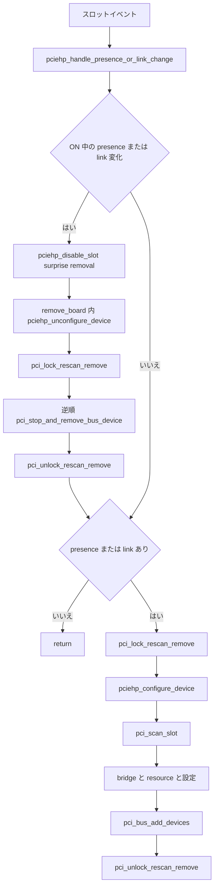

# 第24章 PCIe ホットプラグと再帰的削除

> 本章で読むソース
>
> - [`drivers/pci/probe.c` L3524-L3552](https://github.com/gregkh/linux/blob/v6.18.38/drivers/pci/probe.c#L3524-L3552)
> - [`drivers/pci/probe.c` L3577-L3609](https://github.com/gregkh/linux/blob/v6.18.38/drivers/pci/probe.c#L3577-L3609)
> - [`drivers/pci/remove.c` L92-L127](https://github.com/gregkh/linux/blob/v6.18.38/drivers/pci/remove.c#L92-L127)
> - [`drivers/pci/remove.c` L141-L155](https://github.com/gregkh/linux/blob/v6.18.38/drivers/pci/remove.c#L141-L155)
> - [`drivers/pci/hotplug/pciehp_core.c` L184-L242](https://github.com/gregkh/linux/blob/v6.18.38/drivers/pci/hotplug/pciehp_core.c#L184-L242)
> - [`drivers/pci/hotplug/pciehp_ctrl.c` L231-L296](https://github.com/gregkh/linux/blob/v6.18.38/drivers/pci/hotplug/pciehp_ctrl.c#L231-L296)
> - [`drivers/pci/hotplug/pciehp_pci.c` L32-L82](https://github.com/gregkh/linux/blob/v6.18.38/drivers/pci/hotplug/pciehp_pci.c#L32-L82)
> - [`drivers/pci/hotplug/pciehp_pci.c` L95-L141](https://github.com/gregkh/linux/blob/v6.18.38/drivers/pci/hotplug/pciehp_pci.c#L95-L141)

## この章の狙い

PCIe ホットプラグが稼働中のデバイス抜き差しから driver core 上の `struct device` を動的に生成と削除する仕組みであることを追う。
スロットイベント処理、挿入時の `pci_scan_slot` 経路、再帰的削除の二段階、`pci_rescan_remove_lock` の契約をソースで固定する。

## 前提

[unbind と remove とデバイス削除](../part04-links-devres-unbind/16-unbind-remove-del.md) で `device_release_driver` と `device_del` の位置づけを読んでいること。
[device の登録操作と削除規約](../part01-registration/04-device-add-del.md) で `device_add` と `device_del` の対称性を押さえていること。
[PCI バススキャンとデバイス生成](../part05-pci-enumeration/19-pci-bus-scan.md) で起動時の列挙経路を読んでいること。

## pciehp と PCIe port service

`pciehp_probe` は PCIe port service driver として hotplug controller を初期化する。
`PCIE_PORT_SERVICE_HP` 以外の service には応答せず、subordinate bus が無い bridge は拒否する。
スロット情報の登録、通知の有効化、`pci_hp_add` によるユーザー空間公開までを担う。

[`drivers/pci/hotplug/pciehp_core.c` L184-L242](https://github.com/gregkh/linux/blob/v6.18.38/drivers/pci/hotplug/pciehp_core.c#L184-L242)

```c
static int pciehp_probe(struct pcie_device *dev)
{
	int rc;
	struct controller *ctrl;

	/* If this is not a "hotplug" service, we have no business here. */
	if (dev->service != PCIE_PORT_SERVICE_HP)
		return -ENODEV;

	if (!dev->port->subordinate) {
		/* Can happen if we run out of bus numbers during probe */
		pci_err(dev->port,
			"Hotplug bridge without secondary bus, ignoring\n");
		return -ENODEV;
	}

	ctrl = pcie_init(dev);
	if (!ctrl) {
		pci_err(dev->port, "Controller initialization failed\n");
		return -ENODEV;
	}
	set_service_data(dev, ctrl);

	/* Setup the slot information structures */
	rc = init_slot(ctrl);
	if (rc) {
		if (rc == -EBUSY)
			ctrl_warn(ctrl, "Slot already registered by another hotplug driver\n");
		else
			ctrl_err(ctrl, "Slot initialization failed (%d)\n", rc);
		goto err_out_release_ctlr;
	}

	/* Enable events after we have setup the data structures */
	rc = pcie_init_notification(ctrl);
	if (rc) {
		ctrl_err(ctrl, "Notification initialization failed (%d)\n", rc);
		goto err_out_free_ctrl_slot;
	}

	/* Publish to user space */
	rc = pci_hp_add(&ctrl->hotplug_slot);
	if (rc) {
		ctrl_err(ctrl, "Publication to user space failed (%d)\n", rc);
		goto err_out_shutdown_notification;
	}

	pciehp_check_presence(ctrl);

	return 0;

err_out_shutdown_notification:
	pcie_shutdown_notification(ctrl);
err_out_free_ctrl_slot:
	cleanup_slot(ctrl);
err_out_release_ctlr:
	pciehp_release_ctrl(ctrl);
	return -ENODEV;
}
```

## スロットイベントと surprise removal

`pciehp_handle_presence_or_link_change` は単純に configure か remove の一方へ分岐するだけではない。
スロットが ON の状態で presence または link change を受けると、カードの同一性を仮定できないため、いったん surprise removal として `pciehp_disable_slot` を実行する。
その後の presence と link の状態に応じて再び追加する。

[`drivers/pci/hotplug/pciehp_ctrl.c` L231-L296](https://github.com/gregkh/linux/blob/v6.18.38/drivers/pci/hotplug/pciehp_ctrl.c#L231-L296)

```c
void pciehp_handle_presence_or_link_change(struct controller *ctrl, u32 events)
{
	int present, link_active;

	/*
	 * If the slot is on and presence or link has changed, turn it off.
	 * Even if it's occupied again, we cannot assume the card is the same.
	 */
	mutex_lock(&ctrl->state_lock);
	switch (ctrl->state) {
	case BLINKINGOFF_STATE:
		cancel_delayed_work(&ctrl->button_work);
		fallthrough;
	case ON_STATE:
		ctrl->state = POWEROFF_STATE;
		mutex_unlock(&ctrl->state_lock);
		if (events & PCI_EXP_SLTSTA_DLLSC)
			ctrl_info(ctrl, "Slot(%s): Link Down\n",
				  slot_name(ctrl));
		if (events & PCI_EXP_SLTSTA_PDC)
			ctrl_info(ctrl, "Slot(%s): Card not present\n",
				  slot_name(ctrl));
		pciehp_disable_slot(ctrl, SURPRISE_REMOVAL);
		break;
	default:
		mutex_unlock(&ctrl->state_lock);
		break;
	}

	/* Turn the slot on if it's occupied or link is up */
	mutex_lock(&ctrl->state_lock);
	present = pciehp_card_present(ctrl);
	link_active = pciehp_check_link_active(ctrl);
	if (present <= 0 && link_active <= 0) {
		if (ctrl->state == BLINKINGON_STATE) {
			ctrl->state = OFF_STATE;
			cancel_delayed_work(&ctrl->button_work);
			pciehp_set_indicators(ctrl, PCI_EXP_SLTCTL_PWR_IND_OFF,
					      INDICATOR_NOOP);
			ctrl_info(ctrl, "Slot(%s): Card not present\n",
				  slot_name(ctrl));
		}
		mutex_unlock(&ctrl->state_lock);
		return;
	}

	switch (ctrl->state) {
	case BLINKINGON_STATE:
		cancel_delayed_work(&ctrl->button_work);
		fallthrough;
	case OFF_STATE:
		ctrl->state = POWERON_STATE;
		mutex_unlock(&ctrl->state_lock);
		if (present)
			ctrl_info(ctrl, "Slot(%s): Card present\n",
				  slot_name(ctrl));
		if (link_active)
			ctrl_info(ctrl, "Slot(%s): Link Up\n",
				  slot_name(ctrl));
		ctrl->request_result = pciehp_enable_slot(ctrl);
		break;
	default:
		mutex_unlock(&ctrl->state_lock);
		break;
	}
}
```

## 挿入側 pciehp_configure_device

挿入側 `pciehp_configure_device` は `pci_rescan_bus` ではなく対象スロットを `pci_scan_slot` で走査する。
bridge の resource 割り当て、bus 設定、`pci_bus_add_devices` の順に処理する。
`pci_lock_rescan_remove` を内部で取得する。

[`drivers/pci/hotplug/pciehp_pci.c` L32-L82](https://github.com/gregkh/linux/blob/v6.18.38/drivers/pci/hotplug/pciehp_pci.c#L32-L82)

```c
int pciehp_configure_device(struct controller *ctrl)
{
	struct pci_dev *dev;
	struct pci_dev *bridge = ctrl->pcie->port;
	struct pci_bus *parent = bridge->subordinate;
	int num, ret = 0;

	pci_lock_rescan_remove();

	dev = pci_get_slot(parent, PCI_DEVFN(0, 0));
	if (dev) {
		/*
		 * The device is already there. Either configured by the
		 * boot firmware or a previous hotplug event.
		 */
		ctrl_dbg(ctrl, "Device %s already exists at %04x:%02x:00, skipping hot-add\n",
			 pci_name(dev), pci_domain_nr(parent), parent->number);
		pci_dev_put(dev);
		ret = -EEXIST;
		goto out;
	}

	num = pci_scan_slot(parent, PCI_DEVFN(0, 0));
	if (num == 0) {
		ctrl_err(ctrl, "No new device found\n");
		ret = -ENODEV;
		goto out;
	}

	for_each_pci_bridge(dev, parent)
		pci_hp_add_bridge(dev);

	pci_assign_unassigned_bridge_resources(bridge);
	pcie_bus_configure_settings(parent);

	/*
	 * Release reset_lock during driver binding
	 * to avoid AB-BA deadlock with device_lock.
	 */
	up_read(&ctrl->reset_lock);
	pci_bus_add_devices(parent);
	down_read_nested(&ctrl->reset_lock, ctrl->depth);

	dev = pci_get_slot(parent, PCI_DEVFN(0, 0));
	ctrl->dsn = pci_get_dsn(dev);
	pci_dev_put(dev);

 out:
	pci_unlock_rescan_remove();
	return ret;
}
```

`pci_hp_add_bridge` は挿入された bridge に bus number を割り当て、配下を再スキャンできるようにする。

[`drivers/pci/probe.c` L3577-L3609](https://github.com/gregkh/linux/blob/v6.18.38/drivers/pci/probe.c#L3577-L3609)

```c
int pci_hp_add_bridge(struct pci_dev *dev)
{
	struct pci_bus *parent = dev->bus;
	int busnr, start = parent->busn_res.start;
	unsigned int available_buses = 0;
	int end = parent->busn_res.end;

	for (busnr = start; busnr <= end; busnr++) {
		if (!pci_find_bus(pci_domain_nr(parent), busnr))
			break;
	}
	if (busnr-- > end) {
		pci_err(dev, "No bus number available for hot-added bridge\n");
		return -1;
	}

	/* Scan bridges that are already configured */
	busnr = pci_scan_bridge(parent, dev, busnr, 0);

	/*
	 * Distribute the available bus numbers between hotplug-capable
	 * bridges to make extending the chain later possible.
	 */
	available_buses = end - busnr;

	/* Scan bridges that need to be reconfigured */
	pci_scan_bridge_extend(parent, dev, busnr, available_buses, 1);

	if (!dev->subordinate)
		return -1;

	return 0;
}
```

## 抜去側と再帰的削除の二段階

抜去側 `pciehp_unconfigure_device` は逆順走査で `pci_stop_and_remove_bus_device` を呼ぶ。
SR-IOV PF 停止で VF が先に消えるため、リストを逆順に辿る。

[`drivers/pci/hotplug/pciehp_pci.c` L95-L141](https://github.com/gregkh/linux/blob/v6.18.38/drivers/pci/hotplug/pciehp_pci.c#L95-L141)

```c
void pciehp_unconfigure_device(struct controller *ctrl, bool presence)
{
	struct pci_dev *dev, *temp;
	struct pci_bus *parent = ctrl->pcie->port->subordinate;
	u16 command;

	ctrl_dbg(ctrl, "%s: domain:bus:dev = %04x:%02x:00\n",
		 __func__, pci_domain_nr(parent), parent->number);

	if (!presence)
		pci_walk_bus(parent, pci_dev_set_disconnected, NULL);

	pci_lock_rescan_remove();

	/*
	 * Stopping an SR-IOV PF device removes all the associated VFs,
	 * which will update the bus->devices list and confuse the
	 * iterator.  Therefore, iterate in reverse so we remove the VFs
	 * first, then the PF.  We do the same in pci_stop_bus_device().
	 */
	list_for_each_entry_safe_reverse(dev, temp, &parent->devices,
					 bus_list) {
		pci_dev_get(dev);

		/*
		 * Release reset_lock during driver unbinding
		 * to avoid AB-BA deadlock with device_lock.
		 */
		up_read(&ctrl->reset_lock);
		pci_stop_and_remove_bus_device(dev);
		down_read_nested(&ctrl->reset_lock, ctrl->depth);

		/*
		 * Ensure that no new Requests will be generated from
		 * the device.
		 */
		if (presence) {
			pci_read_config_word(dev, PCI_COMMAND, &command);
			command &= ~(PCI_COMMAND_MASTER | PCI_COMMAND_SERR);
			command |= PCI_COMMAND_INTX_DISABLE;
			pci_write_config_word(dev, PCI_COMMAND, command);
		}
		pci_dev_put(dev);
	}

	pci_unlock_rescan_remove();
}
```

再帰的削除は二段階である。
`pci_stop_bus_device` が subordinate 配下を先に停止してドライバを unbind し、`pci_remove_bus_device` が子、subordinate bus、本体の順に登録と資源を破棄する。
第19章のスキャンの逆である。

[`drivers/pci/remove.c` L92-L127](https://github.com/gregkh/linux/blob/v6.18.38/drivers/pci/remove.c#L92-L127)

```c
static void pci_stop_bus_device(struct pci_dev *dev)
{
	struct pci_bus *bus = dev->subordinate;
	struct pci_dev *child, *tmp;

	/*
	 * Stopping an SR-IOV PF device removes all the associated VFs,
	 * which will update the bus->devices list and confuse the
	 * iterator.  Therefore, iterate in reverse so we remove the VFs
	 * first, then the PF.
	 */
	if (bus) {
		list_for_each_entry_safe_reverse(child, tmp,
						 &bus->devices, bus_list)
			pci_stop_bus_device(child);
	}

	pci_stop_dev(dev);
}

static void pci_remove_bus_device(struct pci_dev *dev)
{
	struct pci_bus *bus = dev->subordinate;
	struct pci_dev *child, *tmp;

	if (bus) {
		list_for_each_entry_safe(child, tmp,
					 &bus->devices, bus_list)
			pci_remove_bus_device(child);

		pci_remove_bus(bus);
		dev->subordinate = NULL;
	}

	pci_destroy_dev(dev);
}
```

公開入口 `pci_stop_and_remove_bus_device` と `pci_rescan_bus` は、どちらも呼び出し側が `pci_rescan_remove_lock` を保持する契約である。
違いは、`pci_stop_and_remove_bus_device` が `lockdep_assert_held` を持ち `pci_stop_and_remove_bus_device_locked` という locked wrapper も提供する一方、`pci_rescan_bus` は内部取得も assertion も行わない点にある。

[`drivers/pci/remove.c` L141-L155](https://github.com/gregkh/linux/blob/v6.18.38/drivers/pci/remove.c#L141-L155)

```c
void pci_stop_and_remove_bus_device(struct pci_dev *dev)
{
	lockdep_assert_held(&pci_rescan_remove_lock);
	pci_stop_bus_device(dev);
	pci_remove_bus_device(dev);
}
```

[`drivers/pci/probe.c` L3524-L3552](https://github.com/gregkh/linux/blob/v6.18.38/drivers/pci/probe.c#L3524-L3552)

```c
unsigned int pci_rescan_bus(struct pci_bus *bus)
{
	unsigned int max;

	max = pci_scan_child_bus(bus);
	pci_assign_unassigned_bus_resources(bus);
	pci_bus_add_devices(bus);

	return max;
}
EXPORT_SYMBOL_GPL(pci_rescan_bus);

/*
 * pci_rescan_bus(), pci_rescan_bus_bridge_resize() and PCI device removal
 * routines should always be executed under this mutex.
 */
DEFINE_MUTEX(pci_rescan_remove_lock);

void pci_lock_rescan_remove(void)
{
	mutex_lock(&pci_rescan_remove_lock);
}
EXPORT_SYMBOL_GPL(pci_lock_rescan_remove);

void pci_unlock_rescan_remove(void)
{
	mutex_unlock(&pci_rescan_remove_lock);
}
EXPORT_SYMBOL_GPL(pci_unlock_rescan_remove);
```

## 処理の流れ



## 高速化と最適化の工夫

`pci_stop_bus_device` と `pci_remove_bus_device` の二段階で subordinate バスを再帰的に辿り、子デバイスから順に停止してから破棄する。
親を先に消して子が宙に浮く不整合を避けられる。
rescan と remove を `pci_rescan_remove_lock` で直列化し、複数スロットの同時イベントでも整合したツリー操作にする。

## まとめ

PCIe ホットプラグは surprise removal を挟むイベント処理、`pci_scan_slot` による局所列挙、二段階の再帰的削除で driver core と同期する。
`pci_rescan_bus` と `pci_stop_and_remove_bus_device` はどちらも呼び出し側のロック保持が前提であり、後者だけ `lockdep_assert_held` と locked wrapper を備える。

## 関連する章

- [unbind と remove とデバイス削除](../part04-links-devres-unbind/16-unbind-remove-del.md)
- [PCI バススキャンとデバイス生成](../part05-pci-enumeration/19-pci-bus-scan.md)
- [SR-IOV による VF 生成](25-sriov.md)
