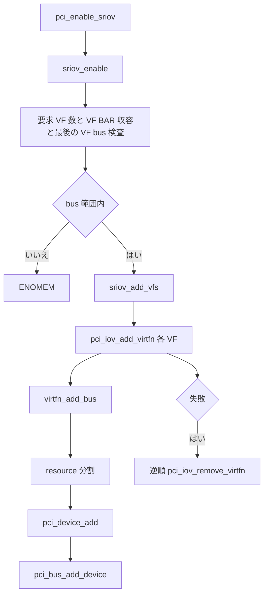

# 第25章 SR-IOV による VF 生成

> 本章で読むソース
>
> - [`drivers/pci/iov.c` L127-L145](https://github.com/gregkh/linux/blob/v6.18.38/drivers/pci/iov.c#L127-L145)
> - [`drivers/pci/iov.c` L105-L125](https://github.com/gregkh/linux/blob/v6.18.38/drivers/pci/iov.c#L105-L125)
> - [`drivers/pci/iov.c` L879-L905](https://github.com/gregkh/linux/blob/v6.18.38/drivers/pci/iov.c#L879-L905)
> - [`drivers/pci/iov.c` L346-L401](https://github.com/gregkh/linux/blob/v6.18.38/drivers/pci/iov.c#L346-L401)
> - [`drivers/pci/iov.c` L628-L647](https://github.com/gregkh/linux/blob/v6.18.38/drivers/pci/iov.c#L628-L647)
> - [`drivers/pci/iov.c` L649-L746](https://github.com/gregkh/linux/blob/v6.18.38/drivers/pci/iov.c#L649-L746)
> - [`drivers/pci/iov.c` L1160-L1168](https://github.com/gregkh/linux/blob/v6.18.38/drivers/pci/iov.c#L1160-L1168)
> - [`drivers/pci/iov.c` L1175-L1183](https://github.com/gregkh/linux/blob/v6.18.38/drivers/pci/iov.c#L1175-L1183)
> - [`drivers/pci/iov.c` L764-L794](https://github.com/gregkh/linux/blob/v6.18.38/drivers/pci/iov.c#L764-L794)

## この章の狙い

SR-IOV が 1 つの物理 function（PF）から複数の軽量な virtual function（VF）を提供し、仮想化で各 VM へ直接割り当てる仕組みであることを追う。
`pci_enable_sriov` から VF 生成、通常の `pci_device_add` と `pci_bus_add_device` への流し込み、VF のコンフィグ空間と resource 導出までをソースで固定する。

## 前提

[PCI バススキャンとデバイス生成](../part05-pci-enumeration/19-pci-bus-scan.md) で `pci_device_add` の第一段階を読んでいること。
[BAR 調査とリソース割り当てと二段階追加](../part05-pci-enumeration/20-pci-bar-resource-assign.md) で `pci_bus_add_device` の第二段階を押さえていること。
[PCIe ホットプラグと再帰的削除](24-pcie-hotplug.md) で PF 停止時に VF が先に削除される逆順走査を読んでいること。

## pci_enable_sriov の入口

`pci_enable_sriov` は PF デバイスに対して `sriov_enable` を呼ぶ公開 API である。
`might_sleep` を宣言し、非 PF には `-ENOSYS` を返す。

[`drivers/pci/iov.c` L1160-L1168](https://github.com/gregkh/linux/blob/v6.18.38/drivers/pci/iov.c#L1160-L1168)

```c
int pci_enable_sriov(struct pci_dev *dev, int nr_virtfn)
{
	might_sleep();

	if (!dev->is_physfn)
		return -ENOSYS;

	return sriov_enable(dev, nr_virtfn);
}
```

## 初期化時の capability 読み取りと enable 時の検査

VF Device ID、offset と stride、VF BAR aperture の読み取りと妥当性の多くは初期化側が担う。
`pci_iov_init` は SR-IOV extended capability を見つけて `sriov_init` を呼び、VF Device ID を `iov->vf_device` へ保存する。
`pci_iov_scan_device` はこの値を各 VF の `device` フィールドに使う。

[`drivers/pci/iov.c` L879-L905](https://github.com/gregkh/linux/blob/v6.18.38/drivers/pci/iov.c#L879-L905)

```c
	iov->pos = pos;
	iov->nres = nres;
	iov->ctrl = ctrl;
	iov->total_VFs = total;
	iov->driver_max_VFs = total;
	pci_read_config_word(dev, pos + PCI_SRIOV_VF_DID, &iov->vf_device);
	iov->pgsz = pgsz;
	iov->self = dev;
	iov->drivers_autoprobe = true;
	pci_read_config_dword(dev, pos + PCI_SRIOV_CAP, &iov->cap);
	pci_read_config_byte(dev, pos + PCI_SRIOV_FUNC_LINK, &iov->link);
	if (pci_pcie_type(dev) == PCI_EXP_TYPE_RC_END)
		iov->link = PCI_DEVFN(PCI_SLOT(dev->devfn), iov->link);
	iov->vf_rebar_cap = pci_find_ext_capability(dev, PCI_EXT_CAP_ID_VF_REBAR);

	if (pdev)
		iov->dev = pci_dev_get(pdev);
	else
		iov->dev = dev;

	dev->sriov = iov;
	dev->is_physfn = 1;
	rc = compute_max_vf_buses(dev);
	if (rc)
		goto fail_max_buses;

	return 0;
```

offset と stride の妥当性と最大 bus 消費量は `compute_max_vf_buses` が検査する。
有効な NumVFs ごとに offset と stride を読み、最後の VF の bus number の上限を `iov->max_VF_buses` へ記録する。

[`drivers/pci/iov.c` L105-L125](https://github.com/gregkh/linux/blob/v6.18.38/drivers/pci/iov.c#L105-L125)

```c
static int compute_max_vf_buses(struct pci_dev *dev)
{
	struct pci_sriov *iov = dev->sriov;
	int nr_virtfn, busnr, rc = 0;

	for (nr_virtfn = iov->total_VFs; nr_virtfn; nr_virtfn--) {
		pci_iov_set_numvfs(dev, nr_virtfn);
		if (!iov->offset || (nr_virtfn > 1 && !iov->stride)) {
			rc = -EIO;
			goto out;
		}

		busnr = pci_iov_virtfn_bus(dev, nr_virtfn - 1);
		if (busnr > iov->max_VF_buses)
			iov->max_VF_buses = busnr;
	}

out:
	pci_iov_set_numvfs(dev, 0);
	return rc;
}
```

`sriov_enable` が enable 時に直接行うのは、要求 VF 数の妥当性、VF BAR resource の収容と親 resource への登録状況、現在の `busn_res.end` に対する最後の VF bus の検査である。
バス番号は拡張しない。
最後の VF の bus number が既存の `busn_res.end` を越える場合は `-ENOMEM` を返す。

[`drivers/pci/iov.c` L649-L746](https://github.com/gregkh/linux/blob/v6.18.38/drivers/pci/iov.c#L649-L746)

```c
static int sriov_enable(struct pci_dev *dev, int nr_virtfn)
{
	int rc;
	int i;
	int nres;
	u16 initial;
	struct resource *res;
	struct pci_dev *pdev;
	struct pci_sriov *iov = dev->sriov;
	int bars = 0;
	int bus;

	if (!nr_virtfn)
		return 0;

	if (iov->num_VFs)
		return -EINVAL;

	pci_read_config_word(dev, iov->pos + PCI_SRIOV_INITIAL_VF, &initial);
	if (initial > iov->total_VFs ||
	    (!(iov->cap & PCI_SRIOV_CAP_VFM) && (initial != iov->total_VFs)))
		return -EIO;

	if (nr_virtfn < 0 || nr_virtfn > iov->total_VFs ||
	    (!(iov->cap & PCI_SRIOV_CAP_VFM) && (nr_virtfn > initial)))
		return -EINVAL;

	nres = 0;
	for (i = 0; i < PCI_SRIOV_NUM_BARS; i++) {
		int idx = pci_resource_num_from_vf_bar(i);
		resource_size_t vf_bar_sz = pci_iov_resource_size(dev, idx);

		bars |= (1 << idx);
		res = &dev->resource[idx];
		if (vf_bar_sz * nr_virtfn > resource_size(res))
			continue;
		if (res->parent)
			nres++;
	}
	if (nres != iov->nres) {
		pci_err(dev, "not enough MMIO resources for SR-IOV\n");
		return -ENOMEM;
	}

	bus = pci_iov_virtfn_bus(dev, nr_virtfn - 1);
	if (bus > dev->bus->busn_res.end) {
		pci_err(dev, "can't enable %d VFs (bus %02x out of range of %pR)\n",
			nr_virtfn, bus, &dev->bus->busn_res);
		return -ENOMEM;
	}

	if (pci_enable_resources(dev, bars)) {
		pci_err(dev, "SR-IOV: IOV BARS not allocated\n");
		return -ENOMEM;
	}

	if (iov->link != dev->devfn) {
		pdev = pci_get_slot(dev->bus, iov->link);
		if (!pdev)
			return -ENODEV;

		if (!pdev->is_physfn) {
			pci_dev_put(pdev);
			return -ENOSYS;
		}

		rc = sysfs_create_link(&dev->dev.kobj,
					&pdev->dev.kobj, "dep_link");
		pci_dev_put(pdev);
		if (rc)
			return rc;
	}

	iov->initial_VFs = initial;
	if (nr_virtfn < initial)
		initial = nr_virtfn;

	rc = pcibios_sriov_enable(dev, initial);
	if (rc) {
		pci_err(dev, "failure %d from pcibios_sriov_enable()\n", rc);
		goto err_pcibios;
	}

	pci_iov_set_numvfs(dev, nr_virtfn);
	iov->ctrl |= PCI_SRIOV_CTRL_VFE | PCI_SRIOV_CTRL_MSE;
	pci_cfg_access_lock(dev);
	pci_write_config_word(dev, iov->pos + PCI_SRIOV_CTRL, iov->ctrl);
	msleep(100);
	pci_cfg_access_unlock(dev);

	rc = sriov_add_vfs(dev, initial);
	if (rc)
		goto err_pcibios;

	kobject_uevent(&dev->dev.kobj, KOBJ_CHANGE);
	iov->num_VFs = nr_virtfn;

	return 0;

err_pcibios:
	iov->ctrl &= ~(PCI_SRIOV_CTRL_VFE | PCI_SRIOV_CTRL_MSE);
	pci_cfg_access_lock(dev);
	pci_write_config_word(dev, iov->pos + PCI_SRIOV_CTRL, iov->ctrl);
	ssleep(1);
	pci_cfg_access_unlock(dev);

	pcibios_sriov_disable(dev);

	if (iov->link != dev->devfn)
		sysfs_remove_link(&dev->dev.kobj, "dep_link");

	pci_iov_set_numvfs(dev, 0);
	return rc;
}
```

`virtfn_add_bus` は既存範囲内に仮想 bus を作る。
同一 bus number が既にあれば再利用し、無ければ `pci_add_new_bus` で 1 bus 分だけ追加する。

[`drivers/pci/iov.c` L127-L145](https://github.com/gregkh/linux/blob/v6.18.38/drivers/pci/iov.c#L127-L145)

```c
static struct pci_bus *virtfn_add_bus(struct pci_bus *bus, int busnr)
{
	struct pci_bus *child;

	if (bus->number == busnr)
		return bus;

	child = pci_find_bus(pci_domain_nr(bus), busnr);
	if (child)
		return child;

	child = pci_add_new_bus(bus, NULL, busnr);
	if (!child)
		return NULL;

	pci_bus_insert_busn_res(child, busnr, busnr);

	return child;
}
```

`pci_iov_add_virtfn` は各 VF について `virtfn_add_bus`、resource 分割、`pci_device_add`、`pci_bus_add_device` の順で通常の PCI device model へ流し込む。
VF の resource は PF 側の VF BAR を分割して組み立てられる。

[`drivers/pci/iov.c` L346-L401](https://github.com/gregkh/linux/blob/v6.18.38/drivers/pci/iov.c#L346-L401)

```c
int pci_iov_add_virtfn(struct pci_dev *dev, int id)
{
	struct pci_bus *bus;
	struct pci_dev *virtfn;
	struct resource *res;
	int rc, i;
	u64 size;

	bus = virtfn_add_bus(dev->bus, pci_iov_virtfn_bus(dev, id));
	if (!bus) {
		rc = -ENOMEM;
		goto failed;
	}

	virtfn = pci_iov_scan_device(dev, id, bus);
	if (IS_ERR(virtfn)) {
		rc = PTR_ERR(virtfn);
		goto failed0;
	}

	virtfn->dev.parent = dev->dev.parent;
	virtfn->multifunction = 0;

	for (i = 0; i < PCI_SRIOV_NUM_BARS; i++) {
		int idx = pci_resource_num_from_vf_bar(i);

		res = &dev->resource[idx];
		if (!res->parent)
			continue;
		virtfn->resource[i].name = pci_name(virtfn);
		virtfn->resource[i].flags = res->flags;
		size = pci_iov_resource_size(dev, idx);
		resource_set_range(&virtfn->resource[i],
				   res->start + size * id, size);
		rc = request_resource(res, &virtfn->resource[i]);
		BUG_ON(rc);
	}

	pci_device_add(virtfn, virtfn->bus);
	rc = pci_iov_sysfs_link(dev, virtfn, id);
	if (rc)
		goto failed1;

	pci_bus_add_device(virtfn);

	return 0;

failed1:
	pci_stop_and_remove_bus_device(virtfn);
	pci_dev_put(dev);
failed0:
	virtfn_remove_bus(dev->bus, bus);
failed:

	return rc;
}
```

## sriov_add_vfs と失敗時の逆順削除

`sriov_add_vfs` は `nr_virtfn` 個の VF について `pci_iov_add_virtfn` を呼ぶ。
途中の VF 追加に失敗すると、先に追加した VF を逆に削除する。

[`drivers/pci/iov.c` L628-L647](https://github.com/gregkh/linux/blob/v6.18.38/drivers/pci/iov.c#L628-L647)

```c
static int sriov_add_vfs(struct pci_dev *dev, u16 num_vfs)
{
	unsigned int i;
	int rc;

	if (dev->no_vf_scan)
		return 0;

	for (i = 0; i < num_vfs; i++) {
		rc = pci_iov_add_virtfn(dev, i);
		if (rc)
			goto failed;
	}
	return 0;
failed:
	while (i--)
		pci_iov_remove_virtfn(dev, i);

	return rc;
}
```

## VF のコンフィグ空間

VF は算出された Routing ID を持つ PCI function としてコンフィグ空間へアクセスされる。
PF の SR-IOV capability が VF Device ID、offset、stride、VF BAR aperture などの共通情報を提供する。
`pci_iov_scan_device` は vendor を PF から、device を `iov->vf_device` から取り、`pci_setup_device` で通常デバイスと同様にセットアップする。
SR-IOV 固有の別 device model を作らず、第19章と第20章の列挙と追加経路を再利用する。

## pci_disable_sriov

`pci_disable_sriov` は `sriov_disable` を呼び、VF を削除して capability の VFE と MSE を落とす。

[`drivers/pci/iov.c` L1175-L1183](https://github.com/gregkh/linux/blob/v6.18.38/drivers/pci/iov.c#L1175-L1183)

```c
void pci_disable_sriov(struct pci_dev *dev)
{
	might_sleep();

	if (!dev->is_physfn)
		return;

	sriov_disable(dev);
}
```

[`drivers/pci/iov.c` L764-L794](https://github.com/gregkh/linux/blob/v6.18.38/drivers/pci/iov.c#L764-L794)

```c
static void sriov_del_vfs(struct pci_dev *dev)
{
	struct pci_sriov *iov = dev->sriov;
	int i;

	for (i = 0; i < iov->num_VFs; i++)
		pci_iov_remove_virtfn(dev, i);
}

static void sriov_disable(struct pci_dev *dev)
{
	struct pci_sriov *iov = dev->sriov;

	if (!iov->num_VFs)
		return;

	sriov_del_vfs(dev);
	iov->ctrl &= ~(PCI_SRIOV_CTRL_VFE | PCI_SRIOV_CTRL_MSE);
	pci_cfg_access_lock(dev);
	pci_write_config_word(dev, iov->pos + PCI_SRIOV_CTRL, iov->ctrl);
	ssleep(1);
	pci_cfg_access_unlock(dev);

	pcibios_sriov_disable(dev);

	if (iov->link != dev->devfn)
		sysfs_remove_link(&dev->dev.kobj, "dep_link");

	iov->num_VFs = 0;
	pci_iov_set_numvfs(dev, 0);
}
```

## 処理の流れ



## 高速化と最適化の工夫

VF を通常の `pci_device_add` と `pci_bus_add_device` に載せることで、SR-IOV 専用のデバイス管理を作らず既存の列挙、probe、sysfs 基盤をそのまま再利用できる。
VF の resource を PF の VF BAR を分割して導出し、算出 Routing ID でアクセスすることで、各 VF に独立した BAR sizing を要さず軽量に増やせる。

## まとめ

SR-IOV は初期化時に capability 情報を読み取り、enable 時に要求 VF 数と resource 収容と bus 範囲を検査してから VF を生成する。
各 VF は通常の二段階追加経路で driver core に載る。
バス番号は拡張せず、範囲外は `-ENOMEM` で拒否する。

## 関連する章

- [PCI バススキャンとデバイス生成](../part05-pci-enumeration/19-pci-bus-scan.md)
- [BAR 調査とリソース割り当てと二段階追加](../part05-pci-enumeration/20-pci-bar-resource-assign.md)
- [PCIe ホットプラグと再帰的削除](24-pcie-hotplug.md)
