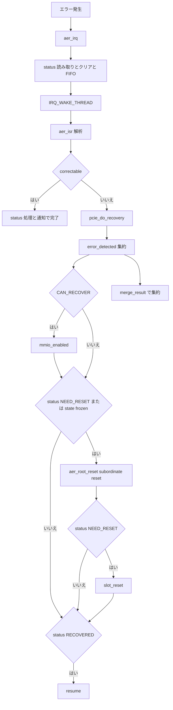

# 第26章 PCIe AER とエラー回復

> 本章で読むソース
>
> - [`drivers/pci/pcie/aer.c` L384-L418](https://github.com/gregkh/linux/blob/v6.18.38/drivers/pci/pcie/aer.c#L384-L418)
> - [`drivers/pci/pcie/aer.c` L1262-L1286](https://github.com/gregkh/linux/blob/v6.18.38/drivers/pci/pcie/aer.c#L1262-L1286)
> - [`drivers/pci/pcie/aer.c` L1540-L1580](https://github.com/gregkh/linux/blob/v6.18.38/drivers/pci/pcie/aer.c#L1540-L1580)
> - [`drivers/pci/pcie/aer.c` L1698-L1734](https://github.com/gregkh/linux/blob/v6.18.38/drivers/pci/pcie/aer.c#L1698-L1734)
> - [`drivers/pci/pcie/aer.c` L1758-L1808](https://github.com/gregkh/linux/blob/v6.18.38/drivers/pci/pcie/aer.c#L1758-L1808)
> - [`drivers/pci/pcie/err.c` L24-L47](https://github.com/gregkh/linux/blob/v6.18.38/drivers/pci/pcie/err.c#L24-L47)
> - [`drivers/pci/pcie/err.c` L49-L87](https://github.com/gregkh/linux/blob/v6.18.38/drivers/pci/pcie/err.c#L49-L87)
> - [`drivers/pci/pcie/err.c` L168-L185](https://github.com/gregkh/linux/blob/v6.18.38/drivers/pci/pcie/err.c#L168-L185)
> - [`drivers/pci/pcie/err.c` L210-L298](https://github.com/gregkh/linux/blob/v6.18.38/drivers/pci/pcie/err.c#L210-L298)

## この章の狙い

AER が PCIe の訂正可能と訂正不能エラーを収集し、ドライバと連携して回復する仕組みであることを追う。
`aer_irq` と `aer_isr` の分担、correctable が `pcie_do_recovery` に入らない点、`pcie_do_recovery` の段階順序、`merge_result` の規則をソースで固定する。

## 前提

[PCI ドライバのバインド](../part06-pci-driver/21-pci-driver-bind.md) で `pci_driver` と `probe` を読んでいること。
[コンフィグ空間アクセスと capability 探索](../part05-pci-enumeration/18-pci-config-capability.md) で PCIe extended capability の探索を押さえていること。

## pci_aer_init と aer_probe

列挙時 `pci_aer_init` は各デバイスの AER extended capability を見つけ、レートリミットと save buffer を用意する。

[`drivers/pci/pcie/aer.c` L384-L418](https://github.com/gregkh/linux/blob/v6.18.38/drivers/pci/pcie/aer.c#L384-L418)

```c
void pci_aer_init(struct pci_dev *dev)
{
	int n;

	dev->aer_cap = pci_find_ext_capability(dev, PCI_EXT_CAP_ID_ERR);
	if (!dev->aer_cap)
		return;

	dev->aer_info = kzalloc(sizeof(*dev->aer_info), GFP_KERNEL);
	if (!dev->aer_info) {
		dev->aer_cap = 0;
		return;
	}

	ratelimit_state_init(&dev->aer_info->correctable_ratelimit,
			     DEFAULT_RATELIMIT_INTERVAL, DEFAULT_RATELIMIT_BURST);
	ratelimit_state_init(&dev->aer_info->nonfatal_ratelimit,
			     DEFAULT_RATELIMIT_INTERVAL, DEFAULT_RATELIMIT_BURST);

	/*
	 * We save/restore PCI_ERR_UNCOR_MASK, PCI_ERR_UNCOR_SEVER,
	 * PCI_ERR_COR_MASK, and PCI_ERR_CAP.  Root and Root Complex Event
	 * Collectors also implement PCI_ERR_ROOT_COMMAND (PCIe r6.0, sec
	 * 7.8.4.9).
	 */
	n = pcie_cap_has_rtctl(dev) ? 5 : 4;
	pci_add_ext_cap_save_buffer(dev, PCI_EXT_CAP_ID_ERR, sizeof(u32) * n);

	pci_aer_clear_status(dev);

	if (pci_aer_available())
		pci_enable_pcie_error_reporting(dev);

	pcie_set_ecrc_checking(dev);
}
```

`aer_probe` は Root Port または RCEC に限定し、FIFO と threaded IRQ を準備する。
`devm_request_threaded_irq` で上半部 `aer_irq`、下半部 `aer_isr` を登録する。

[`drivers/pci/pcie/aer.c` L1698-L1734](https://github.com/gregkh/linux/blob/v6.18.38/drivers/pci/pcie/aer.c#L1698-L1734)

```c
static int aer_probe(struct pcie_device *dev)
{
	int status;
	struct aer_rpc *rpc;
	struct device *device = &dev->device;
	struct pci_dev *port = dev->port;

	BUILD_BUG_ON(ARRAY_SIZE(aer_correctable_error_string) <
		     AER_MAX_TYPEOF_COR_ERRS);
	BUILD_BUG_ON(ARRAY_SIZE(aer_uncorrectable_error_string) <
		     AER_MAX_TYPEOF_UNCOR_ERRS);

	/* Limit to Root Ports or Root Complex Event Collectors */
	if ((pci_pcie_type(port) != PCI_EXP_TYPE_RC_EC) &&
	    (pci_pcie_type(port) != PCI_EXP_TYPE_ROOT_PORT))
		return -ENODEV;

	rpc = devm_kzalloc(device, sizeof(struct aer_rpc), GFP_KERNEL);
	if (!rpc)
		return -ENOMEM;

	rpc->rpd = port;
	INIT_KFIFO(rpc->aer_fifo);
	set_service_data(dev, rpc);

	status = devm_request_threaded_irq(device, dev->irq, aer_irq, aer_isr,
					   IRQF_SHARED, "aerdrv", dev);
	if (status) {
		pci_err(port, "request AER IRQ %d failed\n", dev->irq);
		return status;
	}

	cxl_rch_enable_rcec(port);
	aer_enable_rootport(rpc);
	pci_info(port, "enabled with IRQ %d\n", dev->irq);
	return 0;
}
```

## aer_irq と aer_isr の分担

`aer_irq` は Root Error Status と Error Source を読み、status をクリアして FIFO へ積み `IRQ_WAKE_THREAD` を返す。
`aer_isr` は threaded handler として FIFO を取り出し、エラーを解析して処理する。
情報収集だけを `aer_isr` の役割とせず、上半部で status 取得と FIFO 投入まで行う。

[`drivers/pci/pcie/aer.c` L1540-L1580](https://github.com/gregkh/linux/blob/v6.18.38/drivers/pci/pcie/aer.c#L1540-L1580)

```c
static irqreturn_t aer_isr(int irq, void *context)
{
	struct pcie_device *dev = (struct pcie_device *)context;
	struct aer_rpc *rpc = get_service_data(dev);
	struct aer_err_source e_src;

	if (kfifo_is_empty(&rpc->aer_fifo))
		return IRQ_NONE;

	while (kfifo_get(&rpc->aer_fifo, &e_src))
		aer_isr_one_error(rpc->rpd, &e_src);
	return IRQ_HANDLED;
}

/**
 * aer_irq - Root Port's ISR
 * @irq: IRQ assigned to Root Port
 * @context: pointer to Root Port data structure
 *
 * Invoked when Root Port detects AER messages.
 */
static irqreturn_t aer_irq(int irq, void *context)
{
	struct pcie_device *pdev = (struct pcie_device *)context;
	struct aer_rpc *rpc = get_service_data(pdev);
	struct pci_dev *rp = rpc->rpd;
	int aer = rp->aer_cap;
	struct aer_err_source e_src = {};

	pci_read_config_dword(rp, aer + PCI_ERR_ROOT_STATUS, &e_src.status);
	if (!(e_src.status & AER_ERR_STATUS_MASK))
		return IRQ_NONE;

	pci_read_config_dword(rp, aer + PCI_ERR_ROOT_ERR_SRC, &e_src.id);
	pci_write_config_dword(rp, aer + PCI_ERR_ROOT_STATUS, e_src.status);

	if (!kfifo_put(&rpc->aer_fifo, e_src))
		return IRQ_HANDLED;

	return IRQ_WAKE_THREAD;
}
```

## correctable と uncorrectable の分岐

correctable error は status 処理と通知で完了し `pcie_do_recovery` へ入らない。
`pcie_do_recovery` の対象は uncorrectable の nonfatal と fatal である。

[`drivers/pci/pcie/aer.c` L1262-L1286](https://github.com/gregkh/linux/blob/v6.18.38/drivers/pci/pcie/aer.c#L1262-L1286)

```c
static void pci_aer_handle_error(struct pci_dev *dev, struct aer_err_info *info)
{
	int aer = dev->aer_cap;

	if (info->severity == AER_CORRECTABLE) {
		/*
		 * Correctable error does not need software intervention.
		 * No need to go through error recovery process.
		 */
		if (aer)
			pci_write_config_dword(dev, aer + PCI_ERR_COR_STATUS,
					info->status);
		if (pcie_aer_is_native(dev)) {
			struct pci_driver *pdrv = dev->driver;

			if (pdrv && pdrv->err_handler &&
			    pdrv->err_handler->cor_error_detected)
				pdrv->err_handler->cor_error_detected(dev);
			pcie_clear_device_status(dev);
		}
	} else if (info->severity == AER_NONFATAL)
		pcie_do_recovery(dev, pci_channel_io_normal, aer_root_reset);
	else if (info->severity == AER_FATAL)
		pcie_do_recovery(dev, pci_channel_io_frozen, aer_root_reset);
}
```

## pcie_do_recovery の回復順序

`pcie_do_recovery` は subordinate 木に対して段階的なコールバック列を実行する。
`error_detected` を集約した結果が `CAN_RECOVER` なら `mmio_enabled` を呼ぶ。
`NEED_RESET` または frozen state なら subordinate reset を実行する。
reset 後も集約結果が `NEED_RESET` の場合だけ `slot_reset` を呼ぶ。
frozen でも `error_detected` の集約結果が `NEED_RESET` でなければ、reset 後の `slot_reset` は呼ばれない。
最終結果が `RECOVERED` の場合だけ `resume` を呼ぶ。

[`drivers/pci/pcie/err.c` L210-L298](https://github.com/gregkh/linux/blob/v6.18.38/drivers/pci/pcie/err.c#L210-L298)

```c
pci_ers_result_t pcie_do_recovery(struct pci_dev *dev,
		pci_channel_state_t state,
		pci_ers_result_t (*reset_subordinates)(struct pci_dev *pdev))
{
	int type = pci_pcie_type(dev);
	struct pci_dev *bridge;
	pci_ers_result_t status = PCI_ERS_RESULT_CAN_RECOVER;
	struct pci_host_bridge *host = pci_find_host_bridge(dev->bus);

	/*
	 * If the error was detected by a Root Port, Downstream Port, RCEC,
	 * or RCiEP, recovery runs on the device itself.  For Ports, that
	 * also includes any subordinate devices.
	 *
	 * If it was detected by another device (Endpoint, etc), recovery
	 * runs on the device and anything else under the same Port, i.e.,
	 * everything under "bridge".
	 */
	if (type == PCI_EXP_TYPE_ROOT_PORT ||
	    type == PCI_EXP_TYPE_DOWNSTREAM ||
	    type == PCI_EXP_TYPE_RC_EC ||
	    type == PCI_EXP_TYPE_RC_END)
		bridge = dev;
	else
		bridge = pci_upstream_bridge(dev);

	pci_walk_bridge(bridge, pci_pm_runtime_get_sync, NULL);

	pci_dbg(bridge, "broadcast error_detected message\n");
	if (state == pci_channel_io_frozen)
		pci_walk_bridge(bridge, report_frozen_detected, &status);
	else
		pci_walk_bridge(bridge, report_normal_detected, &status);

	if (status == PCI_ERS_RESULT_CAN_RECOVER) {
		status = PCI_ERS_RESULT_RECOVERED;
		pci_dbg(bridge, "broadcast mmio_enabled message\n");
		pci_walk_bridge(bridge, report_mmio_enabled, &status);
	}

	if (status == PCI_ERS_RESULT_NEED_RESET ||
	    state == pci_channel_io_frozen) {
		if (reset_subordinates(bridge) != PCI_ERS_RESULT_RECOVERED) {
			pci_warn(bridge, "subordinate device reset failed\n");
			goto failed;
		}
	}

	if (status == PCI_ERS_RESULT_NEED_RESET) {
		/*
		 * TODO: Should call platform-specific
		 * functions to reset slot before calling
		 * drivers' slot_reset callbacks?
		 */
		status = PCI_ERS_RESULT_RECOVERED;
		pci_dbg(bridge, "broadcast slot_reset message\n");
		pci_walk_bridge(bridge, report_slot_reset, &status);
	}

	if (status != PCI_ERS_RESULT_RECOVERED)
		goto failed;

	pci_dbg(bridge, "broadcast resume message\n");
	pci_walk_bridge(bridge, report_resume, &status);

	/*
	 * If we have native control of AER, clear error status in the device
	 * that detected the error.  If the platform retained control of AER,
	 * it is responsible for clearing this status.  In that case, the
	 * signaling device may not even be visible to the OS.
	 */
	if (host->native_aer || pcie_ports_native) {
		pcie_clear_device_status(dev);
		pci_aer_clear_nonfatal_status(dev);
	}

	pci_walk_bridge(bridge, pci_pm_runtime_put, NULL);

	pci_info(bridge, "device recovery successful\n");
	return status;

failed:
	pci_walk_bridge(bridge, pci_pm_runtime_put, NULL);

	pci_walk_bridge(bridge, report_perm_failure_detected, NULL);

	pci_info(bridge, "device recovery failed\n");

	return status;
}
```

## merge_result の規則

`merge_result` は単純な重大度の最大値ではない。
`NO_AER_DRIVER` を優先し、`CAN_RECOVER` と `RECOVERED` は後続結果で更新する。
`DISCONNECT` は `NEED_RESET` の場合だけ更新する。

[`drivers/pci/pcie/err.c` L24-L47](https://github.com/gregkh/linux/blob/v6.18.38/drivers/pci/pcie/err.c#L24-L47)

```c
static pci_ers_result_t merge_result(enum pci_ers_result orig,
				  enum pci_ers_result new)
{
	if (new == PCI_ERS_RESULT_NO_AER_DRIVER)
		return PCI_ERS_RESULT_NO_AER_DRIVER;

	if (new == PCI_ERS_RESULT_NONE)
		return orig;

	switch (orig) {
	case PCI_ERS_RESULT_CAN_RECOVER:
	case PCI_ERS_RESULT_RECOVERED:
		orig = new;
		break;
	case PCI_ERS_RESULT_DISCONNECT:
		if (new == PCI_ERS_RESULT_NEED_RESET)
			orig = PCI_ERS_RESULT_NEED_RESET;
		break;
	default:
		break;
	}

	return orig;
}
```

`error_detected` と `mmio_enabled`、`slot_reset` は `merge_result` で集約する。
`resume` は返値を持たず集約対象ではない。

[`drivers/pci/pcie/err.c` L49-L87](https://github.com/gregkh/linux/blob/v6.18.38/drivers/pci/pcie/err.c#L49-L87)

```c
static int report_error_detected(struct pci_dev *dev,
				 pci_channel_state_t state,
				 enum pci_ers_result *result)
{
	struct pci_driver *pdrv;
	pci_ers_result_t vote;
	const struct pci_error_handlers *err_handler;

	device_lock(&dev->dev);
	pdrv = dev->driver;
	if (pci_dev_is_disconnected(dev)) {
		vote = PCI_ERS_RESULT_DISCONNECT;
	} else if (!pci_dev_set_io_state(dev, state)) {
		pci_info(dev, "can't recover (state transition %u -> %u invalid)\n",
			dev->error_state, state);
		vote = PCI_ERS_RESULT_NONE;
	} else if (!pdrv || !pdrv->err_handler ||
		   !pdrv->err_handler->error_detected) {
		/*
		 * If any device in the subtree does not have an error_detected
		 * callback, PCI_ERS_RESULT_NO_AER_DRIVER prevents subsequent
		 * error callbacks of "any" device in the subtree, and will
		 * exit in the disconnected error state.
		 */
		if (dev->hdr_type != PCI_HEADER_TYPE_BRIDGE) {
			vote = PCI_ERS_RESULT_NO_AER_DRIVER;
			pci_info(dev, "can't recover (no error_detected callback)\n");
		} else {
			vote = PCI_ERS_RESULT_NONE;
		}
	} else {
		err_handler = pdrv->err_handler;
		vote = err_handler->error_detected(dev, state);
	}
	pci_uevent_ers(dev, vote);
	*result = merge_result(*result, vote);
	device_unlock(&dev->dev);
	return 0;
}
```

[`drivers/pci/pcie/err.c` L168-L185](https://github.com/gregkh/linux/blob/v6.18.38/drivers/pci/pcie/err.c#L168-L185)

```c
static int report_resume(struct pci_dev *dev, void *data)
{
	struct pci_driver *pdrv;
	const struct pci_error_handlers *err_handler;

	device_lock(&dev->dev);
	pdrv = dev->driver;
	if (!pci_dev_set_io_state(dev, pci_channel_io_normal) ||
	    !pdrv || !pdrv->err_handler || !pdrv->err_handler->resume)
		goto out;

	err_handler = pdrv->err_handler;
	err_handler->resume(dev);
out:
	pci_uevent_ers(dev, PCI_ERS_RESULT_RECOVERED);
	device_unlock(&dev->dev);
	return 0;
}
```

## aer_root_reset

`aer_root_reset` は `pcie_do_recovery` から渡される reset コールバックとして、必要な subordinate reset を行う。
`PCI_EXP_TYPE_RC_EC` または `PCI_EXP_TYPE_RC_END` の場合は `pcie_reset_flr` を呼び、RCEC と RCiEP の両方が FLR 対象に含まれる。
それ以外の Port では `pci_bus_error_reset` を使う。

[`drivers/pci/pcie/aer.c` L1758-L1808](https://github.com/gregkh/linux/blob/v6.18.38/drivers/pci/pcie/aer.c#L1758-L1808)

```c
static pci_ers_result_t aer_root_reset(struct pci_dev *dev)
{
	int type = pci_pcie_type(dev);
	struct pci_dev *root;
	int aer;
	struct pci_host_bridge *host = pci_find_host_bridge(dev->bus);
	u32 reg32;
	int rc;

	/*
	 * Only Root Ports and RCECs have AER Root Command and Root Status
	 * registers.  If "dev" is an RCiEP, the relevant registers are in
	 * the RCEC.
	 */
	if (type == PCI_EXP_TYPE_RC_END)
		root = dev->rcec;
	else
		root = pcie_find_root_port(dev);

	/*
	 * If the platform retained control of AER, an RCiEP may not have
	 * an RCEC visible to us, so dev->rcec ("root") may be NULL.  In
	 * that case, firmware is responsible for these registers.
	 */
	aer = root ? root->aer_cap : 0;

	if ((host->native_aer || pcie_ports_native) && aer)
		aer_disable_irq(root);

	if (type == PCI_EXP_TYPE_RC_EC || type == PCI_EXP_TYPE_RC_END) {
		rc = pcie_reset_flr(dev, PCI_RESET_DO_RESET);
		if (!rc)
			pci_info(dev, "has been reset\n");
		else
			pci_info(dev, "not reset (no FLR support: %d)\n", rc);
	} else {
		rc = pci_bus_error_reset(dev);
		pci_info(dev, "%s Port link has been reset (%d)\n",
			pci_is_root_bus(dev->bus) ? "Root" : "Downstream", rc);
	}

	if ((host->native_aer || pcie_ports_native) && aer) {
		/* Clear Root Error Status */
		pci_read_config_dword(root, aer + PCI_ERR_ROOT_STATUS, &reg32);
		pci_write_config_dword(root, aer + PCI_ERR_ROOT_STATUS, reg32);

		aer_enable_irq(root);
	}

	return rc ? PCI_ERS_RESULT_DISCONNECT : PCI_ERS_RESULT_RECOVERED;
}
```

ドライバが `pci_driver.err_handler` を実装することで、nonfatal や fatal エラー後も `slot_reset` と `resume` でデバイスを再初期化して継続できる。

## 処理の流れ



## 高速化と最適化の工夫

`pcie_do_recovery` が回復を段階的なコールバック列に分け、ドライバは各段階の責務だけ実装すればよい。
AER コアが `merge_result` で全デバイスの結果を束ねて木全体の回復可否を判定する。
correctable error を割り込みで収集して通知で完結させ、回復を要する uncorrectable だけを recovery 経路へ回すことで、通常動作のオーバーヘッドを抑える。

## まとめ

AER は上半部で status を FIFO へ積み、threaded handler で解析する。
correctable は `pcie_do_recovery` に入らず、uncorrectable nonfatal と fatal だけが段階的 recovery を辿る。
`merge_result` は `NO_AER_DRIVER` 優先と条件付き更新であり、単純な最大値ではない。

## 関連する章

- [PCI ドライバのバインド](../part06-pci-driver/21-pci-driver-bind.md)
- [コンフィグ空間アクセスと capability 探索](../part05-pci-enumeration/18-pci-config-capability.md)
- [PCIe ホットプラグと再帰的削除](24-pcie-hotplug.md)
