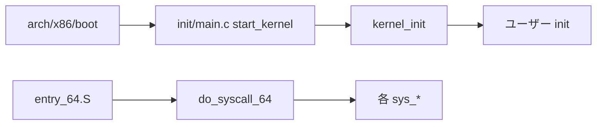

# 第1章 ソースツリーの地図

> 本章で読むソース
>
> - [`Makefile` L1-L6](https://github.com/gregkh/linux/blob/v6.18.38/Makefile#L1-L6)
> - [`Makefile` L376-L381](https://github.com/gregkh/linux/blob/v6.18.38/Makefile#L376-L381)
> - [`Kconfig` L1-L34](https://github.com/gregkh/linux/blob/v6.18.38/Kconfig#L1-L34)
> - [`init/main.c` L909-L920](https://github.com/gregkh/linux/blob/v6.18.38/init/main.c#L909-L920)
> - [`arch/x86/entry/entry_64.S` L87-L97](https://github.com/gregkh/linux/blob/v6.18.38/arch/x86/entry/entry_64.S#L87-L97)
> - [`include/linux/list.h` L13-L21](https://github.com/gregkh/linux/blob/v6.18.38/include/linux/list.h#L13-L21)
> - [`mm/Kconfig` L1-L15](https://github.com/gregkh/linux/blob/v6.18.38/mm/Kconfig#L1-L15)

## この章の狙い

Linux カーネルソースツリーの主要ディレクトリが何を担うかを把握し、後続の章で辿るパスを地図として固定する。

## 前提

C 言語のビルド（Makefile）と、カーネルがユーザー空間と特権空間に分かれることは知っている。

## バージョン情報とルート Makefile

カーネルツリーはルートの `Makefile` が全体の入口である。
バージョン番号はここで定義され、以降の Kbuild 全体がこの番号を参照する。

[`Makefile` L1-L6](https://github.com/gregkh/linux/blob/v6.18.38/Makefile#L1-L6)

```text
# SPDX-License-Identifier: GPL-2.0
VERSION = 6
PATCHLEVEL = 18
SUBLEVEL = 38
EXTRAVERSION =
NAME = Baby Opossum Posse
```

Kbuild の共通マクロは `scripts/Kbuild.include` から読み込まれる。
トップレベル `Makefile` は再帰ビルドの骨格を定義し、各サブディレクトリの `Makefile` / `Kbuild` へ処理を委譲する。

[`Makefile` L376-L381](https://github.com/gregkh/linux/blob/v6.18.38/Makefile#L376-L381)

```text
include $(srctree)/scripts/Kbuild.include

# Read KERNELRELEASE from include/config/kernel.release (if it exists)
KERNELRELEASE = $(call read-file, $(objtree)/include/config/kernel.release)
KERNELVERSION = $(VERSION)$(if $(PATCHLEVEL),.$(PATCHLEVEL)$(if $(SUBLEVEL),.$(SUBLEVEL)))$(EXTRAVERSION)
export VERSION PATCHLEVEL SUBLEVEL KERNELRELEASE KERNELVERSION
```

**最適化の工夫**：再帰 Make は `-rR` で組み込みルールを無効化し、不要な stat と暗黙ルール探索を省く。
サブ Makefile は自ディレクトリ内のファイルだけを更新する契約により、並列 `-j` ビルド時の再ビルド範囲を局所化できる。

## Kconfig による機能の束ね方

機能のオンオフは `Kconfig` ツリーで宣言される。
ルート `Kconfig` は各サブシステムの Kconfig を `source` で取り込む。

[`Kconfig` L1-L34](https://github.com/gregkh/linux/blob/v6.18.38/Kconfig#L1-L34)

```text
# SPDX-License-Identifier: GPL-2.0
#
# For a description of the syntax of this configuration file,
# see Documentation/kbuild/kconfig-language.rst.
#
mainmenu "Linux/$(ARCH) $(KERNELVERSION) Kernel Configuration"

source "scripts/Kconfig.include"

source "init/Kconfig"

source "kernel/Kconfig.freezer"

source "fs/Kconfig.binfmt"

source "mm/Kconfig"

source "net/Kconfig"

source "drivers/Kconfig"

source "fs/Kconfig"

source "security/Kconfig"

source "crypto/Kconfig"

source "lib/Kconfig"

source "lib/Kconfig.debug"

source "Documentation/Kconfig"

source "io_uring/Kconfig"
```

`make menuconfig` の結果は `.config` に落ち、自動生成ヘッダ `include/generated/autoconf.h` 経由で `#ifdef CONFIG_*` としてソースに反映される。
読解時は「そのファイルがビルドに含まれる条件」を常に意識する。

## トップレベルディレクトリの役割

次の表は、本分冊以降で頻出するディレクトリを機能別に整理したものである。

| ディレクトリ | 主な役割 |
|---|---|
| `arch/` | CPU アーキテクチャ依存コード（x86-64 では `arch/x86/`） |
| `kernel/` | スケジューラ、同期、IRQ、時間、BPF などコア |
| `mm/` | 物理メモリ、仮想メモリ、ページキャッシュ |
| `fs/` | VFS と各ファイルシステム |
| `net/` | ネットワークスタック |
| `drivers/` | デバイスドライバ |
| `include/linux/` | カーネル API ヘッダ |
| `lib/` | 汎用ライブラリ（rbtree など） |
| `init/` | 起動と init プロセス起動 |
| `security/` | LSM フック |
| `rust/` | Rust for Linux 統合 |
| `scripts/` | Kbuild、Kconfig、補助ツール |

`arch/` と `include/asm/` は同一概念をアーキテクチャ別に分岐させる層である。
x86-64 既定の読解では `arch/x86/` と `arch/x86/include/asm/` をセットで追う。

## 実行経路を結ぶ4つの代表入口

カーネル読解では、入口関数から辿る経路を先に固定すると迷子になりにくい。
本分冊で扱う代表入口は次の4つである。



起動はブートローダが `arch/x86/boot/` のイメージを載せ、`start_kernel` へ至る。

[`init/main.c` L909-L920](https://github.com/gregkh/linux/blob/v6.18.38/init/main.c#L909-L920)

```c
void start_kernel(void)
{
	char *command_line;
	char *after_dashes;

	set_task_stack_end_magic(&init_task);
	smp_setup_processor_id();
	debug_objects_early_init();
	init_vmlinux_build_id();

	cgroup_init_early();
```

ユーザー空間からの特権操作は x86-64 では `syscall` 命令が `entry_SYSCALL_64` へ飛ぶ。

[`arch/x86/entry/entry_64.S` L87-L97](https://github.com/gregkh/linux/blob/v6.18.38/arch/x86/entry/entry_64.S#L87-L97)

```asm
SYM_CODE_START(entry_SYSCALL_64)
	UNWIND_HINT_ENTRY
	ENDBR

	swapgs
	/* tss.sp2 is scratch space. */
	movq	%rsp, PER_CPU_VAR(cpu_tss_rw + TSS_sp2)
	SWITCH_TO_KERNEL_CR3 scratch_reg=%rsp
	movq	PER_CPU_VAR(cpu_current_top_of_stack), %rsp

SYM_INNER_LABEL(entry_SYSCALL_64_safe_stack, SYM_L_GLOBAL)
```

## 横断的に使われる lib と include

サブシステムをまたぐデータ構造は `include/linux/` と `lib/` に集約される。
例として、ほぼすべてのカーネルサブシステムが `list_head` による侵入型リストを使う。

[`include/linux/list.h` L13-L21](https://github.com/gregkh/linux/blob/v6.18.38/include/linux/list.h#L13-L21)

```c
/*
 * Circular doubly linked list implementation.
 *
 * Some of the internal functions ("__xxx") are useful when
 * manipulating whole lists rather than single entries, as
 * sometimes we already know the next/prev entries and we can
 * generate better code by using them directly rather than
 * using the generic single-entry routines.
 */
```

メモリ管理の設定は `mm/Kconfig` から始まり、後続のメモリ管理分冊の前提になる。

[`mm/Kconfig` L1-L15](https://github.com/gregkh/linux/blob/v6.18.38/mm/Kconfig#L1-L15)

```text
# SPDX-License-Identifier: GPL-2.0-only

menu "Memory Management options"

#
# For some reason microblaze and nios2 hard code SWAP=n.  Hopefully we can
# add proper SWAP support to them, in which case this can be remove.
#
config ARCH_NO_SWAP
	bool

menuconfig SWAP
	bool "Support for paging of anonymous memory (swap)"
	depends on MMU && BLOCK && !ARCH_NO_SWAP
	default y
```

## 設定とソースの対応づけ

1つの機能を追うときは、次の順序が定石である。

1. `.config` または `Kconfig` で `CONFIG_*` 名を確認する
2. `grep -r CONFIG_FOO` で条件付きコンパイル箇所を洗う
3. 関連ディレクトリの `Makefile` でオブジェクト一覧を見る
4. 入口関数から呼び出しグラフを辿る

この手順により、巨大ツリーでも「今読んでいるコードが自分のカーネルに存在するか」を切り分けられる。

## オブジェクトファイルから vmlinux へ

各ディレクトリの `.o` は `built-in.a` にリンクされ、最終的に `vmlinux` へ束ねられる。
モジュール（`.ko`）は `CONFIG_MODULES=y` のときだけ別経路でビルドされる。
`vmlinux` 本体に含まれるコードは起動時から常駐し、モジュールは `insmod` 後にテキストを拡張する。

## 読解の進め方

第0部ではツリーとビルドの骨組みを押さえる。
第1部で起動、第2部でシステムコール入口、第3部でデータ構造、第4部で sysfs とログ出力へ進む。
スケジューラやメモリ管理の詳細は後続分冊に委ねる。

> **7.x 系での変化**
> `rust/` ディレクトリの規模が 6.18 から 7.1 で約2倍に拡大している（[`rust/Makefile` L1-L20](https://github.com/gregkh/linux/blob/v7.1.3/rust/Makefile#L1-L20) 付近のオブジェクト定義が増加）。
> ドライバや抽象型の Rust 実装が増えても、起動とシステムコール入口の骨格は C 側の `init/` と `arch/x86/entry/` に残る。

## まとめ

Linux カーネルツリーは、Kconfig で機能を選び、Kbuild で再帰的にリンクする巨大な単一プロジェクトである。
`arch/`、`kernel/`、`mm/`、`fs/`、`net/`、`drivers/` が柱で、`include/linux/` と `lib/` が横断基盤を供給する。
起動は `start_kernel`、特権呼び出しは `entry_SYSCALL_64`、ユーザー init 起動は `kernel_init` が代表入口である。

## 関連する章

- [Kconfig と Kbuild](02-kconfig-kbuild.md)
- [x86-64 ブートパス](../part01-boot/03-x86-64-boot-path.md)
- [entry_64.S の入口と出口](../part02-syscall/07-entry-64-syscall-entry-exit.md)
