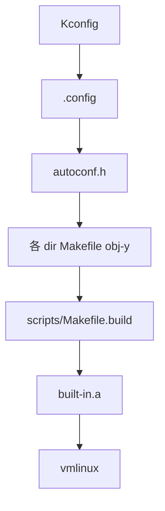

# 第2章 Kconfig と Kbuild

> 本章で読むソース
>
> - [`Kconfig` L1-L10](https://github.com/gregkh/linux/blob/v6.18.38/Kconfig#L1-L10)
> - [`scripts/Kbuild.include` L1-L16](https://github.com/gregkh/linux/blob/v6.18.38/scripts/Kbuild.include#L1-L16)
> - [`Makefile` L25-L49](https://github.com/gregkh/linux/blob/v6.18.38/Makefile#L25-L49)
> - [`Makefile` L376-L381](https://github.com/gregkh/linux/blob/v6.18.38/Makefile#L376-L381)
> - [`kernel/Kconfig.preempt` L17-L36](https://github.com/gregkh/linux/blob/v6.18.38/kernel/Kconfig.preempt#L17-L36)
> - [`scripts/kconfig/conf.c` L1-L25](https://github.com/gregkh/linux/blob/v6.18.38/scripts/kconfig/conf.c#L1-L25)
> - [`scripts/Makefile.build` L1-L25](https://github.com/gregkh/linux/blob/v6.18.38/scripts/Makefile.build#L1-L25)

## この章の狙い

カーネルがどのように設定項目を `.config` に落とし、各ディレクトリのオブジェクトを `vmlinux` へ再帰リンクするかを Kbuild の契約として理解する。

## 前提

Make の変数と include、C プリプロセッサの `#ifdef` を読めること。

## Kconfig ツリーの根

ルート `Kconfig` は `mainmenu` と `source` 連鎖だけを持つ薄い根である。
実際の選択肢は `init/Kconfig`、`mm/Kconfig`、`drivers/Kconfig` などに分散する。

[`Kconfig` L1-L10](https://github.com/gregkh/linux/blob/v6.18.38/Kconfig#L1-L10)

```text
# SPDX-License-Identifier: GPL-2.0
#
# For a description of the syntax of this configuration file,
# see Documentation/kbuild/kconfig-language.rst.
#
mainmenu "Linux/$(ARCH) $(KERNELVERSION) Kernel Configuration"

source "scripts/Kconfig.include"

source "init/Kconfig"
```

`make menuconfig` / `make olddefconfig` は `scripts/kconfig/` のフロントエンドが `.config` を生成する。
生成物は `syncconfig` 経由で `include/config/` と `include/generated/autoconf.h` へ反映される。

[`scripts/kconfig/conf.c` L1-L25](https://github.com/gregkh/linux/blob/v6.18.38/scripts/kconfig/conf.c#L1-L25)

```c
// SPDX-License-Identifier: GPL-2.0
/*
 * Copyright (C) 2002 Roman Zippel <zippel@linux-m68k.org>
 */

#include <ctype.h>
#include <limits.h>
#include <stdio.h>
#include <stdlib.h>
#include <string.h>
#include <time.h>
#include <unistd.h>
#include <getopt.h>
#include <sys/time.h>
#include <errno.h>

#include "internal.h"
#include "lkc.h"

static void conf(struct menu *menu);
static void check_conf(struct menu *menu);

enum input_mode {
	oldaskconfig,
	syncconfig,
```

## Kbuild.include の共通マクロ

各サブ Makefile は `scripts/Kbuild.include` を include する。
ここに、オブジェクトリスト生成、依存関係、コンパイラ呼び出しの共通規則が集約される。

[`scripts/Kbuild.include` L1-L16](https://github.com/gregkh/linux/blob/v6.18.38/scripts/Kbuild.include#L1-L16)

```c
# SPDX-License-Identifier: GPL-2.0
####
# kbuild: Generic definitions

# Convenient variables
comma   := ,
quote   := "
squote  := '
empty   :=
space   := $(empty) $(empty)
space_escape := _-_SPACE_-_
pound := \#
define newline


endef
```

**最適化の工夫**：`if_changed` 系マクロは、前提ファイルがターゲットより新しいか、保存済みコマンド文字列 `savedcmd_$@` と今回の `cmd_$1` が一致しないときだけ再実行する。
`cmd-check` は文字列比較、`newer-prereqs` は make の `$?` で更新された前提を拾う。
設定変更のないディレクトリは `.cmd` に記録された前回コマンドと一致する限りビルドを省略できる。

[`scripts/Kbuild.include` L156-L197](https://github.com/gregkh/linux/blob/v6.18.38/scripts/Kbuild.include#L156-L197)

```c
# if_changed      - execute command if any prerequisite is newer than
#                   target, or command line has changed
# if_changed_dep  - as if_changed, but uses fixdep to reveal dependencies
#                   including used config symbols
# if_changed_rule - as if_changed but execute rule instead
# See Documentation/kbuild/makefiles.rst for more info

ifneq ($(KBUILD_NOCMDDEP),1)
# Check if both commands are the same including their order. Result is empty
# string if equal. User may override this check using make KBUILD_NOCMDDEP=1
# If the target does not exist, the *.cmd file should not be included so
# $(savedcmd_$@) gets empty. Then, target will be built even if $(newer-prereqs)
# happens to become empty.
cmd-check = $(filter-out $(subst $(space),$(space_escape),$(strip $(savedcmd_$@))), \
                         $(subst $(space),$(space_escape),$(strip $(cmd_$1))))
else
# We still need to detect missing targets.
cmd-check = $(if $(strip $(savedcmd_$@)),,1)
endif

# Replace >$< with >$$< to preserve $ when reloading the .cmd file
# (needed for make)
# Replace >#< with >$(pound)< to avoid starting a comment in the .cmd file
# (needed for make)
# Replace >'< with >'\''< to be able to enclose the whole string in '...'
# (needed for the shell)
make-cmd = $(call escsq,$(subst $(pound),$$(pound),$(subst $$,$$$$,$(cmd_$(1)))))

# Find any prerequisites that are newer than target or that do not exist.
# PHONY targets skipped in both cases.
# If there is no prerequisite other than phony targets, $(newer-prereqs) becomes
# empty even if the target does not exist. cmd-check saves this corner case.
newer-prereqs = $(filter-out $(PHONY),$?)

# It is a typical mistake to forget the FORCE prerequisite. Check it here so
# no more breakage will slip in.
check-FORCE = $(if $(filter FORCE, $^),,$(warning FORCE prerequisite is missing))

if-changed-cond = $(newer-prereqs)$(cmd-check)$(check-FORCE)

# Execute command if command has changed or prerequisite(s) are updated.
if_changed = $(if $(if-changed-cond),$(cmd_and_savecmd),@:)
```

## トップ Makefile の再帰契約

トップ `Makefile` は、サブ Makefile が「自ディレクトリ外を直接書き換えない」ことを前提に再帰する。
グローバル効果を持つ準備（`prepare`）だけを先に実行し、その後 `$(MAKE) $(build)=dir` で降りる。

[`Makefile` L25-L49](https://github.com/gregkh/linux/blob/v6.18.38/Makefile#L25-L49)

```text
# We are using a recursive build, so we need to do a little thinking
# to get the ordering right.
#
# Most importantly: sub-Makefiles should only ever modify files in
# their own directory. If in some directory we have a dependency on
# a file in another dir (which doesn't happen often, but it's often
# unavoidable when linking the built-in.a targets which finally
# turn into vmlinux), we will call a sub make in that other dir, and
# after that we are sure that everything which is in that other dir
# is now up to date.
#
# The only cases where we need to modify files which have global
# effects are thus separated out and done before the recursive
# descending is started. They are now explicitly listed as the
# prepare rule.

this-makefile := $(lastword $(MAKEFILE_LIST))
abs_srctree := $(realpath $(dir $(this-makefile)))
abs_output := $(CURDIR)

ifneq ($(sub_make_done),1)

# Do not use make's built-in rules and variables
# (this increases performance and avoids hard-to-debug behaviour)
MAKEFLAGS += -rR
```

`KERNELRELEASE` はビルドツリー側の `include/config/kernel.release` から読む。
ソースツリーとオブジェクトツリーを分離した out-of-tree ビルドでも同じ Makefile が使える。

[`Makefile` L376-L381](https://github.com/gregkh/linux/blob/v6.18.38/Makefile#L376-L381)

```text
include $(srctree)/scripts/Kbuild.include

# Read KERNELRELEASE from include/config/kernel.release (if it exists)
KERNELRELEASE = $(call read-file, $(objtree)/include/config/kernel.release)
KERNELVERSION = $(VERSION)$(if $(PATCHLEVEL),.$(PATCHLEVEL)$(if $(SUBLEVEL),.$(SUBLEVEL)))$(EXTRAVERSION)
export VERSION PATCHLEVEL SUBLEVEL KERNELRELEASE KERNELVERSION
```

## ディレクトリ Makefile から built-in.a へ

各ディレクトリの `Makefile` / `Kbuild` は `obj-y` に `.o` 名を列挙する。
`scripts/Makefile.build` が1ディレクトリ分のコンパイルを担当し、結果を `built-in.a` にアーカイブする。

[`scripts/Makefile.build` L1-L25](https://github.com/gregkh/linux/blob/v6.18.38/scripts/Makefile.build#L1-L25)

```text
# SPDX-License-Identifier: GPL-2.0
# ==========================================================================
# Building
# ==========================================================================

src := $(srcroot)/$(obj)

PHONY := $(obj)/
$(obj)/:

# Init all relevant variables used in kbuild files so
# 1) they have correct type
# 2) they do not inherit any value from the environment
obj-y :=
obj-m :=
lib-y :=
lib-m :=
always-y :=
always-m :=
targets :=
subdir-y :=
subdir-m :=
asflags-y  :=
ccflags-y  :=
rustflags-y :=
```



## CONFIG 例：プリエンプションモデル

Kconfig の `choice` は相互排他の設定群を表す。
プリエンプションモデルはスケジューラの動き方に直結する代表例である。

[`kernel/Kconfig.preempt` L17-L36](https://github.com/gregkh/linux/blob/v6.18.38/kernel/Kconfig.preempt#L17-L36)

```c
choice
	prompt "Preemption Model"
	default PREEMPT_NONE

config PREEMPT_NONE
	bool "No Forced Preemption (Server)"
	depends on !PREEMPT_RT
	select PREEMPT_NONE_BUILD if !PREEMPT_DYNAMIC
	help
	  This is the traditional Linux preemption model, geared towards
	  throughput. It will still provide good latencies most of the
	  time, but there are no guarantees and occasional longer delays
	  are possible.

	  Select this option if you are building a kernel for a server or
	  scientific/computation system, or if you want to maximize the
	  raw processing power of the kernel, irrespective of scheduling
	  latencies.

config PREEMPT_VOLUNTARY
```

`select` / `depends on` により、無効な組み合わせは Kconfig 段階で排除される。
読解時は「その .c ファイルが `CONFIG_*` で囲まれているか」を grep する習慣が必要になる。

## モジュールビルドとの境界

`obj-m` はモジュール、`obj-y` は vmlinux 本体に静的リンクされる。
`CONFIG_MODULES` が無効なら `obj-m` はビルドされず、機能ごと落ちる。
ドライバ読解では `module_init` と `builtin` の二経路を区別する。

## 開発者向けターゲット

| コマンド | 用途 |
|---|---|
| `make menuconfig` | 対話的に `.config` 編集 |
| `make olddefconfig` | 新しい Kconfig 既定値をマージ |
| `make prepare` | ヘッダ生成とツールチェック |
| `make -jN` | 並列ビルド |
| `make M=dir modules` | 単一ディレクトリだけモジュールビルド |

`make V=1` は実際のコンパイルコマンドを表示し、コンパイルフラグと include パスを確認できる。

## 設定変更が及ぼす範囲

`.config` を1項目変えると、次の3層に影響する。

1. プリプロセッサ：`#ifdef CONFIG_FOO` でコード片が消える
2. Makefile：`obj-$(CONFIG_FOO)` でオブジェクト自体がリンクから外れる
3. 実行時：`/proc/config.gz` や `modinfo` で確認できるビルド時定数

この3層を混同すると、「ソースにはあるのに実行カーネルに無い」現象を説明できなくなる。

> **7.x 系での変化**
> 7.1 では `ARCH_HAS_PREEMPT_LAZY` を持つアーキテクチャで Kconfig の既定が `PREEMPT_LAZY` になる（[`kernel/Kconfig.preempt` L17-L20](https://github.com/gregkh/linux/blob/v7.1.3/kernel/Kconfig.preempt#L17-L20)）。
> 6.18 の既定 `PREEMPT_NONE` から、対応 CPU では遅延プリエンプション lazy preemption が標準に近づく。

## まとめ

Kconfig は機能の依存関係を宣言し、Kbuild は `.config` をオブジェクト集合へ写像する。
`scripts/Kbuild.include` と `scripts/Makefile.build` が再帰ビルドの共通規則を担い、`built-in.a` の連鎖が `vmlinux` になる。
読解では `CONFIG_*` と `obj-y` の両方を grep し、ビルドに含まれるコードだけを追う。

## 関連する章

- [ソースツリーの地図](01-source-tree-map.md)
- [start_kernel と initcall](../part01-boot/04-start-kernel-initcall.md)
