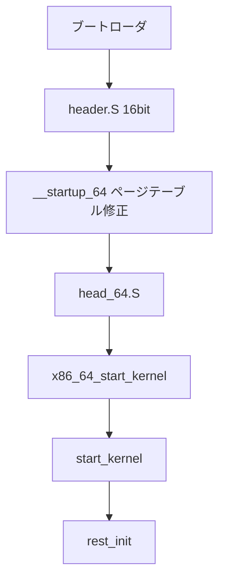

# 第3章 x86-64 ブートパス

> 本章で読むソース
>
> - [`arch/x86/boot/header.S` L28-L42](https://github.com/gregkh/linux/blob/v6.18.38/arch/x86/boot/header.S#L28-L42)
> - [`arch/x86/boot/startup/map_kernel.c` L87-L99](https://github.com/gregkh/linux/blob/v6.18.38/arch/x86/boot/startup/map_kernel.c#L87-L99)
> - [`arch/x86/kernel/head64.c` L222-L241](https://github.com/gregkh/linux/blob/v6.18.38/arch/x86/kernel/head64.c#L222-L241)
> - [`arch/x86/kernel/head64.c` L300-L310](https://github.com/gregkh/linux/blob/v6.18.38/arch/x86/kernel/head64.c#L300-L310)
> - [`arch/x86/kernel/head_64.S` L479-L479](https://github.com/gregkh/linux/blob/v6.18.38/arch/x86/kernel/head_64.S#L479-L479)
> - [`init/main.c` L909-L931](https://github.com/gregkh/linux/blob/v6.18.38/init/main.c#L909-L931)
> - [`arch/x86/boot/boot.h` L1-L30](https://github.com/gregkh/linux/blob/v6.18.38/arch/x86/boot/boot.h#L1-L30)

## この章の狙い

UEFI または BIOS 経由で載せられた x86-64 カーネルが、実モード相当のブートコードから64ビット長モードを経て `start_kernel` に到達するまでの経路を追う。

## 前提

x86 のセグメントとページングの用語、ブートローダが `boot_params` を渡すことは知っている。

## ブートセクタと header.S

`arch/x86/boot/` は圧縮カーネルイメージの先頭を形成する。
`header.S` は16ビット実モードで動き、後段の setup コードへ制御を渡す。

[`arch/x86/boot/header.S` L28-L42](https://github.com/gregkh/linux/blob/v6.18.38/arch/x86/boot/header.S#L28-L42)

```asm
BOOTSEG		= 0x07C0		/* original address of boot-sector */
SYSSEG		= 0x1000		/* historical load address >> 4 */

#ifndef SVGA_MODE
#define SVGA_MODE ASK_VGA
#endif

#ifndef ROOT_RDONLY
#define ROOT_RDONLY 1
#endif

	.set	salign, 0x1000
	.set	falign, 0x200

	.code16
```

コメントにもある通り、実モードではセグメント値に16を掛けたものが線形アドレスになる。
ここでの役割は、CPU モード切替のための最小限の環境整備と、カーネルイメージのロード情報の保持である。

## 圧縮解除と __startup_64

64ビット長モードへ入った直後は、まだリンカが想定する最終仮想アドレスにいない。
`__startup_64` は RIP 相対アドレスでページテーブルを修正し、カーネルの高い仮想アドレスへマップし直す。

[`arch/x86/boot/startup/map_kernel.c` L87-L99](https://github.com/gregkh/linux/blob/v6.18.38/arch/x86/boot/startup/map_kernel.c#L87-L99)

```c
unsigned long __init __startup_64(unsigned long p2v_offset,
				  struct boot_params *bp)
{
	pmd_t (*early_pgts)[PTRS_PER_PMD] = rip_rel_ptr(early_dynamic_pgts);
	unsigned long physaddr = (unsigned long)rip_rel_ptr(_text);
	unsigned long va_text, va_end;
	unsigned long pgtable_flags;
	unsigned long load_delta;
	pgdval_t *pgd;
	p4dval_t *p4d;
	pudval_t *pud;
	pmdval_t *pmd, pmd_entry;
	bool la57;
```

**最適化の工夫**：早期ブートはアロケータが使えない。
`early_dynamic_pgts` のような静的確保済みページテーブルだけで必要最小限のマップを行い、後の `paging_init` までの間、メモリ管理子システムを起動しない。

## x86_64_start_kernel への遷移

`head_64.S` は初期ページテーブル上で動き、最終的に C 関数 `x86_64_start_kernel` へジャンプする。
`initial_code` シンボルがその入口アドレスを保持する。

[`arch/x86/kernel/head_64.S` L479-L479](https://github.com/gregkh/linux/blob/v6.18.38/arch/x86/kernel/head_64.S#L479-L479)

```asm
SYM_DATA(initial_code,	.quad x86_64_start_kernel)
```

`x86_64_start_kernel` はアーキテクチャ固有の初期化を終え、`start_kernel` を呼ぶ。

[`arch/x86/kernel/head64.c` L222-L241](https://github.com/gregkh/linux/blob/v6.18.38/arch/x86/kernel/head64.c#L222-L241)

```c
asmlinkage __visible void __init __noreturn x86_64_start_kernel(char * real_mode_data)
{
	/*
	 * Build-time sanity checks on the kernel image and module
	 * area mappings. (these are purely build-time and produce no code)
	 */
	BUILD_BUG_ON(MODULES_VADDR < __START_KERNEL_map);
	BUILD_BUG_ON(MODULES_VADDR - __START_KERNEL_map < KERNEL_IMAGE_SIZE);
	BUILD_BUG_ON(MODULES_LEN + KERNEL_IMAGE_SIZE > 2*PUD_SIZE);
	BUILD_BUG_ON((__START_KERNEL_map & ~PMD_MASK) != 0);
	BUILD_BUG_ON((MODULES_VADDR & ~PMD_MASK) != 0);
	BUILD_BUG_ON(!(MODULES_VADDR > __START_KERNEL));
	MAYBE_BUILD_BUG_ON(!(((MODULES_END - 1) & PGDIR_MASK) ==
				(__START_KERNEL & PGDIR_MASK)));
	BUILD_BUG_ON(__fix_to_virt(__end_of_fixed_addresses) <= MODULES_END);

	cr4_init_shadow();

	/* Kill off the identity-map trampoline */
	reset_early_page_tables();
```

`BUILD_BUG_ON` 群は、リンク時レイアウトが x86-64 の固定マップ契約を破っていないかをコンパイル時に検証する。
実行時コストはゼロで、誤ったメモリ配置を早期に止める。

## start_kernel への到達

アーキテクチャ初期化の末尾で、汎用初期化 `start_kernel` が呼ばれる。

[`arch/x86/kernel/head64.c` L300-L310](https://github.com/gregkh/linux/blob/v6.18.38/arch/x86/kernel/head64.c#L300-L310)

```c
	x86_early_init_platform_quirks();

	switch (boot_params.hdr.hardware_subarch) {
	case X86_SUBARCH_INTEL_MID:
		x86_intel_mid_early_setup();
		break;
	default:
		break;
	}

	start_kernel();
```

以降はアーキテクチャ非依存の `init/main.c` が中心になる。

## start_kernel の冒頭

`start_kernel` は割り込み無効のまま、CPU とメモリの基盤を立てる。

[`init/main.c` L909-L931](https://github.com/gregkh/linux/blob/v6.18.38/init/main.c#L909-L931)

```c
void start_kernel(void)
{
	char *command_line;
	char *after_dashes;

	set_task_stack_end_magic(&init_task);
	smp_setup_processor_id();
	debug_objects_early_init();
	init_vmlinux_build_id();

	cgroup_init_early();

	local_irq_disable();
	early_boot_irqs_disabled = true;

	/*
	 * Interrupts are still disabled. Do necessary setups, then
	 * enable them.
	 */
	boot_cpu_init();
	page_address_init();
	pr_notice("%s", linux_banner);
	setup_arch(&command_line);
```

`setup_arch` は x86 側で `boot_params` からコマンドラインやメモリマップを引き出す。
ここまでが「ハードウェアとアーキテクチャ依存の起動」、以降が「汎用カーネルサービスの起動」である。

## ブートパスの全体像



## boot_params と早期コンソール

`arch/x86/boot/boot.h` は setup コード共通の定数とヘルパを集める。
`boot_params` 構造体は、フレームバッファ情報、メモリマップ、e820 テーブルなどを後段へ渡す。

[`arch/x86/boot/boot.h` L1-L30](https://github.com/gregkh/linux/blob/v6.18.38/arch/x86/boot/boot.h#L1-L30)

```c
/* SPDX-License-Identifier: GPL-2.0-only */
/* -*- linux-c -*- ------------------------------------------------------- *
 *
 *   Copyright (C) 1991, 1992 Linus Torvalds
 *   Copyright 2007 rPath, Inc. - All Rights Reserved
 *   Copyright 2009 Intel Corporation; author H. Peter Anvin
 *
 * ----------------------------------------------------------------------- */

/*
 * Header file for the real-mode kernel code
 */

#ifndef BOOT_BOOT_H
#define BOOT_BOOT_H

#define STACK_SIZE	1024	/* Minimum number of bytes for stack */

#ifndef __ASSEMBLER__

#include <linux/stdarg.h>
#include <linux/types.h>
#include <linux/edd.h>
#include <asm/setup.h>
#include <asm/asm.h>
#include "bitops.h"
#include "ctype.h"
#include "cpuflags.h"
#include "io.h"
```

早期 `early_printk` はまだ完全なコンソール層が無い段階でも、シリアル等へ1文字ずつ出せる。
本格的な `console_init` は `start_kernel` 後半で呼ばれる（第4章参照）。

## セカンダリ CPU の起動

ブート CPU だけが上記経路を踏む。
他 CPU は `smp_init` 以降に `start_secondary` 系の経路で同じ64ビットカーネルに合流する。
詳細は x86-64 アーキテクチャ分冊に委ねる。

## レガシー経路の扱い

BIOS ブートと UEFI stub は入口が異なるが、`x86_64_start_kernel` 以降は共通化される。
純粋な16ビット setup の細部は、歴史的経緯の理解に足りない場合は深追いしない。

## まとめ

x86-64 起動は `header.S` → `__startup_64` → `x86_64_start_kernel` → `start_kernel` の順で、実アドレスから固定仮想マップへ移行する。
早期段階は静的ページテーブルだけで動き、アロケータに依存しない。
`start_kernel` 以降はアーキテクチャ非依存の初期化が続く。

## 関連する章

- [start_kernel と initcall](../part01-boot/04-start-kernel-initcall.md)
- [kernel_init から init プロセス起動まで](../part01-boot/05-kernel-init-to-init.md)
