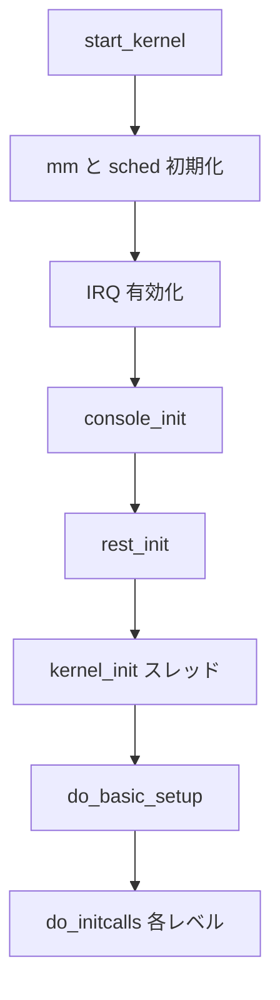

# 第4章 start_kernel と initcall

> 本章で読むソース
>
> - [`init/main.c` L909-L983](https://github.com/gregkh/linux/blob/v6.18.38/init/main.c#L909-L983)
> - [`init/main.c` L1037-L1047](https://github.com/gregkh/linux/blob/v6.18.38/init/main.c#L1037-L1047)
> - [`init/main.c` L1105-L1111](https://github.com/gregkh/linux/blob/v6.18.38/init/main.c#L1105-L1111)
> - [`init/main.c` L1272-L1298](https://github.com/gregkh/linux/blob/v6.18.38/init/main.c#L1272-L1298)
> - [`init/main.c` L1347-L1380](https://github.com/gregkh/linux/blob/v6.18.38/init/main.c#L1347-L1380)
> - [`init/main.c` L711-L749](https://github.com/gregkh/linux/blob/v6.18.38/init/main.c#L711-L749)
> - [`include/linux/init.h` L120-L145](https://github.com/gregkh/linux/blob/v6.18.38/include/linux/init.h#L120-L145)

## この章の狙い

`start_kernel` がカーネルサブシステムをどの順序で立ち上げ、`initcall` 機構でドライバ初期化を段階実行するかを追う。

## 前提

[x86-64 ブートパス](03-x86-64-boot-path.md) で `start_kernel` までの経路を読んでいること。

## start_kernel の段階的初期化

`start_kernel` は単一関数に長い初期化列が並ぶ。
前半は割り込み無効のまま、メモリ管理とスケジューラの前提を整える。

[`init/main.c` L909-L983](https://github.com/gregkh/linux/blob/v6.18.38/init/main.c#L909-L983)

```c
void start_kernel(void)
{
	char *command_line;
	char *after_dashes;

	set_task_stack_end_magic(&init_task);
	smp_setup_processor_id();
	debug_objects_early_init();
	init_vmlinux_build_id();

	cgroup_init_early();

	local_irq_disable();
	early_boot_irqs_disabled = true;

	/*
	 * Interrupts are still disabled. Do necessary setups, then
	 * enable them.
	 */
	boot_cpu_init();
	page_address_init();
	pr_notice("%s", linux_banner);
	setup_arch(&command_line);
	/* Static keys and static calls are needed by LSMs */
	jump_label_init();
	static_call_init();
	early_security_init();
	setup_boot_config();
	setup_command_line(command_line);
	setup_nr_cpu_ids();
	setup_per_cpu_areas();
	smp_prepare_boot_cpu();	/* arch-specific boot-cpu hooks */
	early_numa_node_init();
	boot_cpu_hotplug_init();

	pr_notice("Kernel command line: %s\n", saved_command_line);
	/* parameters may set static keys */
	parse_early_param();
	after_dashes = parse_args("Booting kernel",
				  static_command_line, __start___param,
				  __stop___param - __start___param,
				  -1, -1, NULL, &unknown_bootoption);
	print_unknown_bootoptions();
	if (!IS_ERR_OR_NULL(after_dashes))
		parse_args("Setting init args", after_dashes, NULL, 0, -1, -1,
			   NULL, set_init_arg);
	if (extra_init_args)
		parse_args("Setting extra init args", extra_init_args,
			   NULL, 0, -1, -1, NULL, set_init_arg);

	/* Architectural and non-timekeeping rng init, before allocator init */
	random_init_early(command_line);

	/*
	 * These use large bootmem allocations and must precede
	 * initalization of page allocator
	 */
	setup_log_buf(0);
	vfs_caches_init_early();
	sort_main_extable();
	trap_init();
	mm_core_init();
	maple_tree_init();
	poking_init();
	ftrace_init();

	/* trace_printk can be enabled here */
	early_trace_init();

	/*
	 * Set up the scheduler prior starting any interrupts (such as the
	 * timer interrupt). Full topology setup happens at smp_init()
	 * time - but meanwhile we still have a functioning scheduler.
	 */
	sched_init();
```

**最適化の工夫**：`sched_init` をタイマ割り込みより前に置くことで、以降の初期化コードがスケジューラ API を安全に呼べる。
順序を入れ替えると、未初期化のランキューや clocksource 上で `schedule` が走り、デバッグが困難なクラッシュになる。

## 割り込み有効化と console_init

タイマと softirq の準備が終わると、割り込みを再度有効にする。
その直後に `console_init` が呼ばれ、早期からの `printk` が実コンソールへ届く。

[`init/main.c` L1037-L1047](https://github.com/gregkh/linux/blob/v6.18.38/init/main.c#L1037-L1047)

```c
	early_boot_irqs_disabled = false;
	local_irq_enable();

	kmem_cache_init_late();

	/*
	 * HACK ALERT! This is early. We're enabling the console before
	 * we've done PCI setups etc, and console_init() must be aware of
	 * this. But we do want output early, in case something goes wrong.
	 */
	console_init();
```

コメントが示す通り、ここは意図的な順序の例外である。
障害解析のため、PCI 以前にコンソールを開く。

## rest_init への移行

`start_kernel` の末尾で `rest_init` が呼ばれ、以降は idle スレッドと init スレッドに役割が分かれる。

[`init/main.c` L1105-L1111](https://github.com/gregkh/linux/blob/v6.18.38/init/main.c#L1105-L1111)

```c
	acpi_subsystem_init();
	arch_post_acpi_subsys_init();
	kcsan_init();

	/* Do the rest non-__init'ed, we're now alive */
	rest_init();
```

`start_kernel` 自身は `__noreturn` だが、実際には `rest_init` 内でスケジューラに入る。

## initcall のレベル

ドライバやサブシステムの初期化関数は、リンカセクション `.initcall*` に配置される。
`do_initcalls` はレベルごとに順番に実行する。

[`init/main.c` L1347-L1380](https://github.com/gregkh/linux/blob/v6.18.38/init/main.c#L1347-L1380)

```c
static void __init do_initcalls(void)
{
	int level;
	size_t len = saved_command_line_len + 1;
	char *command_line;

	command_line = kzalloc(len, GFP_KERNEL);
	if (!command_line)
		panic("%s: Failed to allocate %zu bytes\n", __func__, len);

	for (level = 0; level < ARRAY_SIZE(initcall_levels) - 1; level++) {
		/* Parser modifies command_line, restore it each time */
		strcpy(command_line, saved_command_line);
		do_initcall_level(level, command_line);
	}

	kfree(command_line);
}

/*
 * Ok, the machine is now initialized. None of the devices
 * have been touched yet, but the CPU subsystem is up and
 * running, and memory and process management works.
 *
 * Now we can finally start doing some real work..
 */
static void __init do_basic_setup(void)
{
	cpuset_init_smp();
	driver_init();
	init_irq_proc();
	do_ctors();
	do_initcalls();
}
```

`device_initcall` や `late_initcall` など、マクロ名がレベルを決める。
依存関係を暗黙の順序で表現する代わりに、リンク順とレベル番号で制御する。

## do_one_initcall の安全網

各 initcall 実行後、プリエンプションカウントと IRQ 状態を検査する。

[`init/main.c` L1272-L1298](https://github.com/gregkh/linux/blob/v6.18.38/init/main.c#L1272-L1298)

```c
int __init_or_module do_one_initcall(initcall_t fn)
{
	int count = preempt_count();
	char msgbuf[64];
	int ret;

	if (initcall_blacklisted(fn))
		return -EPERM;

	do_trace_initcall_start(fn);
	ret = fn();
	do_trace_initcall_finish(fn, ret);

	msgbuf[0] = 0;

	if (preempt_count() != count) {
		sprintf(msgbuf, "preemption imbalance ");
		preempt_count_set(count);
	}
	if (irqs_disabled()) {
		strlcat(msgbuf, "disabled interrupts ", sizeof(msgbuf));
		local_irq_enable();
	}
	WARN(msgbuf[0], "initcall %pS returned with %s\n", fn, msgbuf);

	add_latent_entropy();
	return ret;
```

**最適化の工夫**：initcall 中に IRQ を閉じたまま戻るドライバは、実行時に不要なレイテンシを生む。
起動時だけ `WARN` で検出し、本番パスにそのまま持ち込まない。

## initcall マクロの配置

[`include/linux/init.h` L120-L145](https://github.com/gregkh/linux/blob/v6.18.38/include/linux/init.h#L120-L145)

```c
typedef initcall_t initcall_entry_t;

static inline initcall_t initcall_from_entry(initcall_entry_t *entry)
{
	return *entry;
}
#endif

extern initcall_entry_t __con_initcall_start[], __con_initcall_end[];

/* Used for constructor calls. */
typedef void (*ctor_fn_t)(void);

struct file_system_type;

/* Defined in init/main.c */
extern int do_one_initcall(initcall_t fn);
extern char __initdata boot_command_line[];
extern char *saved_command_line;
extern unsigned int saved_command_line_len;
extern unsigned int reset_devices;

/* used by init/main.c */
void setup_arch(char **);
void prepare_namespace(void);
void __init init_rootfs(void);
```



## rest_init と kernel_init スレッド

`rest_init` は `kernel_init` スレッドと `kthreadd` を生成する。
init プロセス用スレッドは PID 1 候補として先に作る必要がある。

[`init/main.c` L711-L749](https://github.com/gregkh/linux/blob/v6.18.38/init/main.c#L711-L749)

```c
static noinline void __ref __noreturn rest_init(void)
{
	struct task_struct *tsk;
	int pid;

	rcu_scheduler_starting();
	/*
	 * We need to spawn init first so that it obtains pid 1, however
	 * the init task will end up wanting to create kthreads, which, if
	 * we schedule it before we create kthreadd, will OOPS.
	 */
	pid = user_mode_thread(kernel_init, NULL, CLONE_FS);
	/*
	 * Pin init on the boot CPU. Task migration is not properly working
	 * until sched_init_smp() has been run. It will set the allowed
	 * CPUs for init to the non isolated CPUs.
	 */
	rcu_read_lock();
	tsk = find_task_by_pid_ns(pid, &init_pid_ns);
	tsk->flags |= PF_NO_SETAFFINITY;
	set_cpus_allowed_ptr(tsk, cpumask_of(smp_processor_id()));
	rcu_read_unlock();

	numa_default_policy();
	pid = kernel_thread(kthreadd, NULL, NULL, CLONE_FS | CLONE_FILES);
	rcu_read_lock();
	kthreadd_task = find_task_by_pid_ns(pid, &init_pid_ns);
	rcu_read_unlock();

	/*
	 * Enable might_sleep() and smp_processor_id() checks.
	 * They cannot be enabled earlier because with CONFIG_PREEMPTION=y
	 * kernel_thread() would trigger might_sleep() splats. With
	 * CONFIG_PREEMPT_VOLUNTARY=y the init task might have scheduled
	 * already, but it's stuck on the kthreadd_done completion.
	 */
	system_state = SYSTEM_SCHEDULING;

	complete(&kthreadd_done);
```

`kthreadd` が先に必要なのは、`kernel_init` 内でカーネルスレッドを作る処理があるためである。
順序を誤ると `kernel_thread` 呼び出しが OOPS する。

## init メモリの解放タイミング

`__init` セクションと initcall で使ったメモリは、起動完了後 `free_initmem` で回収される。
第5章で `kernel_init` が `free_initmem` を呼ぶ位置を確認する。

## initcall_debug

ブート引数 `initcall_debug` を付けると、各 initcall の所要時間がログに出る。
起動が遅いカーネルでは、どのドライバ init がボトルネックかを切り分けられる。

## まとめ

`start_kernel` は割り込み状態を制御しながら、スケジューラ、IRQ、タイマ、コンソールを順に立てる。
`do_basic_setup` → `do_initcalls` でドライバ初期化が段階実行され、`rest_init` が `kernel_init` スレッドを起動する。
initcall のレベルと `do_one_initcall` の検査が、起動順序の暗黙契約を守る。

## 関連する章

- [x86-64 ブートパス](03-x86-64-boot-path.md)
- [kernel_init から init プロセス起動まで](05-kernel-init-to-init.md)
- [printk](../part04-infra/14-printk.md)
