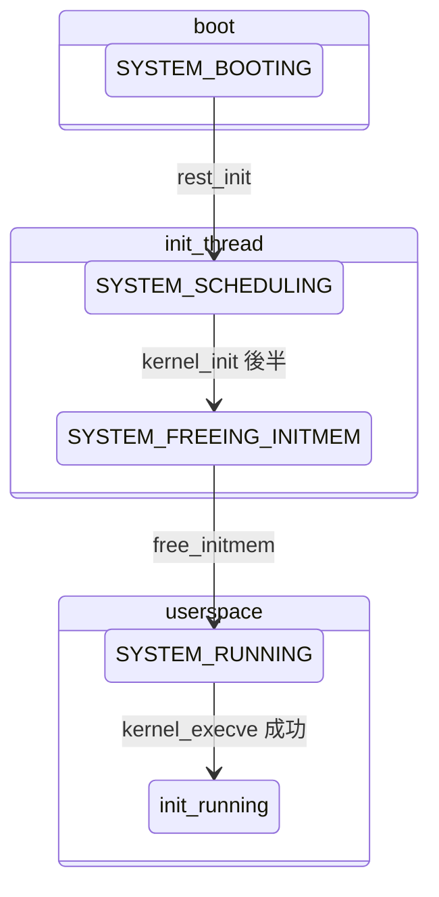

# 第5章 kernel_init から init プロセス起動まで

> 本章で読むソース
>
> - [`init/main.c` L1563-L1622](https://github.com/gregkh/linux/blob/v6.18.38/init/main.c#L1563-L1622)
> - [`init/main.c` L1473-L1513](https://github.com/gregkh/linux/blob/v6.18.38/init/main.c#L1473-L1513)
> - [`init/main.c` L1529-L1545](https://github.com/gregkh/linux/blob/v6.18.38/init/main.c#L1529-L1545)
> - [`init/main.c` L1391-L1403](https://github.com/gregkh/linux/blob/v6.18.38/init/main.c#L1391-L1403)
> - [`init/main.c` L1548-L1561](https://github.com/gregkh/linux/blob/v6.18.38/init/main.c#L1548-L1561)
> - [`fs/exec.c` L2088-L2105](https://github.com/gregkh/linux/blob/v6.18.38/fs/exec.c#L2088-L2105)
> - [`init/do_mounts.c` L1-L25](https://github.com/gregkh/linux/blob/v6.18.38/init/do_mounts.c#L1-L25)

## この章の狙い

`kernel_init` スレッドが SMP 起動、ルートファイルシステムの準備、ユーザー空間 init バイナリの exec までをどう進めるかを追う。

## 前提

[start_kernel と initcall](04-start-kernel-initcall.md) で `rest_init` と initcall を読んでいること。

## kernel_init_freeable の流れ

`kernel_init` は前半で init メモリを解放する前に `kernel_init_freeable` を呼ぶ。
ここで SMP、workqueue、基本セットアップが走る。

[`init/main.c` L1563-L1622](https://github.com/gregkh/linux/blob/v6.18.38/init/main.c#L1563-L1622)

```c
static noinline void __init kernel_init_freeable(void)
{
	/* Now the scheduler is fully set up and can do blocking allocations */
	gfp_allowed_mask = __GFP_BITS_MASK;

	/*
	 * init can allocate pages on any node
	 */
	set_mems_allowed(node_states[N_MEMORY]);

	cad_pid = get_pid(task_pid(current));

	smp_prepare_cpus(setup_max_cpus);

	workqueue_init();

	init_mm_internals();

	do_pre_smp_initcalls();
	lockup_detector_init();

	smp_init();
	sched_init_smp();

	workqueue_init_topology();
	async_init();
	padata_init();
	page_alloc_init_late();

	do_basic_setup();

	kunit_run_all_tests();

	wait_for_initramfs();
	console_on_rootfs();

	/*
	 * check if there is an early userspace init.  If yes, let it do all
	 * the work
	 */
	int ramdisk_command_access;
	ramdisk_command_access = init_eaccess(ramdisk_execute_command);
	if (ramdisk_command_access != 0) {
		pr_warn("check access for rdinit=%s failed: %i, ignoring\n",
			ramdisk_execute_command, ramdisk_command_access);
		ramdisk_execute_command = NULL;
		prepare_namespace();
	}

	/*
	 * Ok, we have completed the initial bootup, and
	 * we're essentially up and running. Get rid of the
	 * initmem segments and start the user-mode stuff..
	 *
	 * rootfs is available now, try loading the public keys
	 * and default modules
	 */

	integrity_load_keys();
}
```

**最適化の工夫**：`smp_init` より前に `do_pre_smp_initcalls` を走らせ、ブート CPU だけで済む初期化を他 CPU 起動コストより先に終える。
CPU ホットプラグの準備が遅れると、後続の並列 initcall が単一 CPU に偏る。

## init メモリ解放と SYSTEM_RUNNING

`kernel_init_freeable` 後、`free_initmem` で `__init` セクションを回収し、状態を `SYSTEM_RUNNING` に移す。

[`init/main.c` L1473-L1513](https://github.com/gregkh/linux/blob/v6.18.38/init/main.c#L1473-L1513)

```c
static int __ref kernel_init(void *unused)
{
	int ret;

	/*
	 * Wait until kthreadd is all set-up.
	 */
	wait_for_completion(&kthreadd_done);

	kernel_init_freeable();
	/* need to finish all async __init code before freeing the memory */
	async_synchronize_full();

	system_state = SYSTEM_FREEING_INITMEM;
	kprobe_free_init_mem();
	ftrace_free_init_mem();
	kgdb_free_init_mem();
	exit_boot_config();
	free_initmem();
	mark_readonly();

	/*
	 * Kernel mappings are now finalized - update the userspace page-table
	 * to finalize PTI.
	 */
	pti_finalize();

	system_state = SYSTEM_RUNNING;
	numa_default_policy();

	rcu_end_inkernel_boot();

	do_sysctl_args();

	if (ramdisk_execute_command) {
		ret = run_init_process(ramdisk_execute_command);
		if (!ret)
			return 0;
		pr_err("Failed to execute %s (error %d)\n",
		       ramdisk_execute_command, ret);
	}
```

`free_initmem` 以降は initcall 用コードが物理メモリから消える。
起動後に initcall 関数を呼べないのはこのためである。

## init バイナリの探索順

カーネルは複数候補を順に試し、最初に成功したプログラムを PID 1 とする。

[`init/main.c` L1529-L1545](https://github.com/gregkh/linux/blob/v6.18.38/init/main.c#L1529-L1545)

```c
	if (CONFIG_DEFAULT_INIT[0] != '\0') {
		ret = run_init_process(CONFIG_DEFAULT_INIT);
		if (ret)
			pr_err("Default init %s failed (error %d)\n",
			       CONFIG_DEFAULT_INIT, ret);
		else
			return 0;
	}

	if (!try_to_run_init_process("/sbin/init") ||
	    !try_to_run_init_process("/etc/init") ||
	    !try_to_run_init_process("/bin/init") ||
	    !try_to_run_init_process("/bin/sh"))
		return 0;

	panic("No working init found.  Try passing init= option to kernel. "
	      "See Linux Documentation/admin-guide/init.rst for guidance.");
```

優先順位は、カーネル引数 `init=`、initramfs の `rdinit=`、`CONFIG_DEFAULT_INIT`、固定パスである。
どれも失敗すると `panic` で停止する。

## run_init_process と kernel_execve

実際の exec は `kernel_execve` が担う。

[`init/main.c` L1391-L1403](https://github.com/gregkh/linux/blob/v6.18.38/init/main.c#L1391-L1403)

```c
static int run_init_process(const char *init_filename)
{
	const char *const *p;

	argv_init[0] = init_filename;
	pr_info("Run %s as init process\n", init_filename);
	pr_debug("  with arguments:\n");
	for (p = argv_init; *p; p++)
		pr_debug("    %s\n", *p);
	pr_debug("  with environment:\n");
	for (p = envp_init; *p; p++)
		pr_debug("    %s\n", *p);
	return kernel_execve(init_filename, argv_init, envp_init);
```

[`fs/exec.c` L2088-L2105](https://github.com/gregkh/linux/blob/v6.18.38/fs/exec.c#L2088-L2105)

```c

```

**最適化の工夫**：`kernel_execve` はユーザー空間の syscall ラッパーを経由せず、直接 `linux_binprm` を構築する。
起動直後は syscall テーブルと VFS の dentry キャッシュが冷えているが、init 1回だけのコストに抑えられる。

## ルートファイルシステムのマウント

initramfs が無い場合、`prepare_namespace` がブロックデバイス上のルートをマウントする。

[`init/do_mounts.c` L1-L25](https://github.com/gregkh/linux/blob/v6.18.38/init/do_mounts.c#L1-L25)

```c
// SPDX-License-Identifier: GPL-2.0-only
#include <linux/module.h>
#include <linux/sched.h>
#include <linux/ctype.h>
#include <linux/fd.h>
#include <linux/tty.h>
#include <linux/suspend.h>
#include <linux/root_dev.h>
#include <linux/security.h>
#include <linux/delay.h>
#include <linux/mount.h>
#include <linux/device.h>
#include <linux/init.h>
#include <linux/fs.h>
#include <linux/initrd.h>
#include <linux/async.h>
#include <linux/fs_struct.h>
#include <linux/slab.h>
#include <linux/ramfs.h>
#include <linux/shmem_fs.h>
#include <linux/ktime.h>

#include <linux/nfs_fs.h>
#include <linux/nfs_fs_sb.h>
#include <linux/nfs_mount.h>
```

`root=` 引数はここで解釈され、VFS 分冊の入口になる。

## console_on_rootfs

ルート fs 上の `/dev/console` を開き、標準入出力を接続する。

[`init/main.c` L1548-L1561](https://github.com/gregkh/linux/blob/v6.18.38/init/main.c#L1548-L1561)

```c
/* Open /dev/console, for stdin/stdout/stderr, this should never fail */
void __init console_on_rootfs(void)
{
	struct file *file = filp_open("/dev/console", O_RDWR, 0);

	if (IS_ERR(file)) {
		pr_err("Warning: unable to open an initial console.\n");
		return;
	}
	init_dup(file);
	init_dup(file);
	init_dup(file);
	fput(file);
}
```

init プロセスがユーザー空間に入った後も、カーネルログと init の stderr が同じコンソールに届く。

## 起動完了までの状態遷移



## initramfs と early userspace

initramfs が載っている場合、`wait_for_initramfs` までルートマウントを遅らせ、cpio イメージ内の `/init` が先に動く。
コンテナやディストロインストーラはこの経路を使う。

## まとめ

`kernel_init` は SMP と initcall を終え、init メモリを解放してからユーザー init を exec する。
`init=` / `rdinit=` / 既定パスの順で候補を試し、成功すれば PID 1 がユーザー空間プログラムになる。
`prepare_namespace` と `console_on_rootfs` が、ルート fs とコンソールの前提を整える。

## 関連する章

- [start_kernel と initcall](04-start-kernel-initcall.md)
- [システムコールテーブルと SYSCALL_DEFINE](../part02-syscall/06-syscall-table-syscall-define.md)
