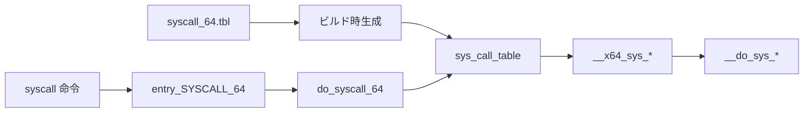

# 第6章 システムコールテーブルと SYSCALL_DEFINE

> 本章で読むソース
>
> - [`arch/x86/entry/syscalls/syscall_64.tbl` L1-L24](https://github.com/gregkh/linux/blob/v6.18.38/arch/x86/entry/syscalls/syscall_64.tbl#L1-L24)
> - [`include/linux/syscalls.h` L217-L267](https://github.com/gregkh/linux/blob/v6.18.38/include/linux/syscalls.h#L217-L267)
> - [`arch/x86/entry/syscall_64.c` L1-L50](https://github.com/gregkh/linux/blob/v6.18.38/arch/x86/entry/syscall_64.c#L1-L50)
> - [`arch/x86/entry/syscall_64.c` L87-L97](https://github.com/gregkh/linux/blob/v6.18.38/arch/x86/entry/syscall_64.c#L87-L97)
> - [`include/linux/syscalls.h` L178-L200](https://github.com/gregkh/linux/blob/v6.18.38/include/linux/syscalls.h#L178-L200)
> - [`arch/x86/entry/syscalls/Makefile` L11-L22](https://github.com/gregkh/linux/blob/v6.18.38/arch/x86/entry/syscalls/Makefile#L11-L22)
> - [`mm/mmap.c` L115-L130](https://github.com/gregkh/linux/blob/v6.18.38/mm/mmap.c#L115-L130)
> - [`include/uapi/asm-generic/unistd.h` L1-L25](https://github.com/gregkh/linux/blob/v6.18.38/include/uapi/asm-generic/unistd.h#L1-L25)

## この章の狙い

x86-64 のシステムコール番号がテーブルで定義され、`SYSCALL_DEFINE` マクロが `sys_*` 実装とトレース用メタデータを生成する仕組みを理解する。

## 前提

ユーザー空間が `syscall` 命令でカーネルに入ることは知っている。

## syscall_64.tbl の形式

アーキテクチャごとに、番号とエントリ関数名がテーブルファイルで管理される。
x86-64 では `arch/x86/entry/syscalls/syscall_64.tbl` が源である。

[`arch/x86/entry/syscalls/syscall_64.tbl` L1-L24](https://github.com/gregkh/linux/blob/v6.18.38/arch/x86/entry/syscalls/syscall_64.tbl#L1-L24)

```text
# SPDX-License-Identifier: GPL-2.0 WITH Linux-syscall-note
#
# 64-bit system call numbers and entry vectors
#
# The format is:
# <number> <abi> <name> <entry point> [<compat entry point> [noreturn]]
#
# The __x64_sys_*() stubs are created on-the-fly for sys_*() system calls
#
# The abi is "common", "64" or "x32" for this file.
#
0	common	read			sys_read
1	common	write			sys_write
2	common	open			sys_open
3	common	close			sys_close
4	common	stat			sys_newstat
5	common	fstat			sys_newfstat
6	common	lstat			sys_newlstat
7	common	poll			sys_poll
8	common	lseek			sys_lseek
9	common	mmap			sys_mmap
10	common	mprotect		sys_mprotect
11	common	munmap			sys_munmap
12	common	brk			sys_brk
```

ビルド時にこのテーブルからアセンブリとヘッダが生成され、番号と関数ポインタの対応が機械的に保たれる。
手で番号をずらすと、ユーザー空間 glibc とカーネルで不整合が起きる。

## ビルド時のテーブル生成

tbl ファイルは `syscallhdr.sh` と `syscalltbl.sh` 経由で UAPI ヘッダと `syscalls_64.h` を生成する。

[`arch/x86/entry/syscalls/Makefile` L11-L22](https://github.com/gregkh/linux/blob/v6.18.38/arch/x86/entry/syscalls/Makefile#L11-L22)

```makefile
syshdr := $(srctree)/scripts/syscallhdr.sh
systbl := $(srctree)/scripts/syscalltbl.sh
offset :=
prefix :=

quiet_cmd_syshdr = SYSHDR  $@
      cmd_syshdr = $(CONFIG_SHELL) $(syshdr) --abis $(abis) --emit-nr \
		$(if $(offset),--offset $(offset)) \
		$(if $(prefix),--prefix $(prefix)) \
		$< $@
quiet_cmd_systbl = SYSTBL  $@
      cmd_systbl = $(CONFIG_SHELL) $(systbl) --abis $(abis) $< $@
```

`syscall_64.tbl` を1か所編集すれば、番号定義と `__x64_sys_*` スタブ宣言が同期される。

## SYSCALL_DEFINE マクロ

カーネル内の実装は `SYSCALL_DEFINEn` で宣言する。
マクロは `sys_*` 本体、`__se_sys_*` ラッパー、トレースメタデータを一度に生む。

[`include/linux/syscalls.h` L217-L267](https://github.com/gregkh/linux/blob/v6.18.38/include/linux/syscalls.h#L217-L267)

```c
#ifndef SYSCALL_DEFINE0
#define SYSCALL_DEFINE0(sname)					\
	SYSCALL_METADATA(_##sname, 0);				\
	asmlinkage long sys_##sname(void);			\
	ALLOW_ERROR_INJECTION(sys_##sname, ERRNO);		\
	asmlinkage long sys_##sname(void)
#endif /* SYSCALL_DEFINE0 */

#define SYSCALL_DEFINE1(name, ...) SYSCALL_DEFINEx(1, _##name, __VA_ARGS__)
#define SYSCALL_DEFINE2(name, ...) SYSCALL_DEFINEx(2, _##name, __VA_ARGS__)
#define SYSCALL_DEFINE3(name, ...) SYSCALL_DEFINEx(3, _##name, __VA_ARGS__)
#define SYSCALL_DEFINE4(name, ...) SYSCALL_DEFINEx(4, _##name, __VA_ARGS__)
#define SYSCALL_DEFINE5(name, ...) SYSCALL_DEFINEx(5, _##name, __VA_ARGS__)
#define SYSCALL_DEFINE6(name, ...) SYSCALL_DEFINEx(6, _##name, __VA_ARGS__)

#define SYSCALL_DEFINE_MAXARGS	6

#define SYSCALL_DEFINEx(x, sname, ...)				\
	SYSCALL_METADATA(sname, x, __VA_ARGS__)			\
	__SYSCALL_DEFINEx(x, sname, __VA_ARGS__)

#define __PROTECT(...) asmlinkage_protect(__VA_ARGS__)

/*
 * The asmlinkage stub is aliased to a function named __se_sys_*() which
 * sign-extends 32-bit ints to longs whenever needed. The actual work is
 * done within __do_sys_*().
 */
#ifndef __SYSCALL_DEFINEx
#define __SYSCALL_DEFINEx(x, name, ...)					\
	__diag_push();							\
	__diag_ignore(GCC, 8, "-Wattribute-alias",			\
		      "Type aliasing is used to sanitize syscall arguments");\
	__diag_ignore(clang, 23, "-Wunknown-warning-option",		\
		      "Avoid breaking versions without -Wattribute-alias");\
	__diag_ignore(clang, 23, "-Wattribute-alias",			\
		      "Type aliasing is used to sanitize syscall arguments");\
	asmlinkage long sys##name(__MAP(x,__SC_DECL,__VA_ARGS__))	\
		__attribute__((alias(__stringify(__se_sys##name))));	\
	ALLOW_ERROR_INJECTION(sys##name, ERRNO);			\
	static inline long __do_sys##name(__MAP(x,__SC_DECL,__VA_ARGS__));\
	asmlinkage long __se_sys##name(__MAP(x,__SC_LONG,__VA_ARGS__));	\
	asmlinkage long __se_sys##name(__MAP(x,__SC_LONG,__VA_ARGS__))	\
	{								\
		long ret = __do_sys##name(__MAP(x,__SC_CAST,__VA_ARGS__));\
		__MAP(x,__SC_TEST,__VA_ARGS__);				\
		__PROTECT(x, ret,__MAP(x,__SC_ARGS,__VA_ARGS__));	\
		return ret;						\
	}								\
	__diag_pop();							\
	static inline long __do_sys##name(__MAP(x,__SC_DECL,__VA_ARGS__))
```

**最適化の工夫**：`__se_sys_*` ラッパーは32ビット引数の符号拡張と引数検査を1か所に集約する。
各 `__do_sys_*` は頻出経路としてインライン化されやすく、共通チェックのコードサイズ増を抑えられる。

## SYSCALL_METADATA

各 `SYSCALL_DEFINE` は `SYSCALL_METADATA` で ftrace 用 syscall enter/exit イベントと `struct syscall_metadata` を生成する。

[`include/linux/syscalls.h` L178-L200](https://github.com/gregkh/linux/blob/v6.18.38/include/linux/syscalls.h#L178-L200)

```c
#define SYSCALL_METADATA(sname, nb, ...)			\
	static const char *types_##sname[] = {			\
		__MAP(nb,__SC_STR_TDECL,__VA_ARGS__)		\
	};							\
	static const char *args_##sname[] = {			\
		__MAP(nb,__SC_STR_ADECL,__VA_ARGS__)		\
	};							\
	SYSCALL_TRACE_ENTER_EVENT(sname);			\
	SYSCALL_TRACE_EXIT_EVENT(sname);			\
	static struct syscall_metadata __used			\
	  __syscall_meta_##sname = {				\
		.name 		= "sys"#sname,			\
		.syscall_nr	= -1,	/* Filled in at boot */	\
		.nb_args 	= nb,				\
		.types		= nb ? types_##sname : NULL,	\
		.args		= nb ? args_##sname : NULL,	\
		.enter_event	= &event_enter_##sname,		\
		.exit_event	= &event_exit_##sname,		\
		.enter_fields	= LIST_HEAD_INIT(__syscall_meta_##sname.enter_fields), \
	};							\
	static struct syscall_metadata __used			\
	  __section("__syscalls_metadata")			\
	 *__p_syscall_meta_##sname = &__syscall_meta_##sname;
```

起動時に syscall 番号が埋まり、`kernel/trace/trace_syscalls.c` が ftrace の syscall トレースで参照する。

## x86-64 ディスパッチ

`arch/x86/entry/syscall_64.c` が番号から関数を引く。

[`arch/x86/entry/syscall_64.c` L87-L97](https://github.com/gregkh/linux/blob/v6.18.38/arch/x86/entry/syscall_64.c#L87-L97)

```c
__visible noinstr bool do_syscall_64(struct pt_regs *regs, int nr)
{
	add_random_kstack_offset();
	nr = syscall_enter_from_user_mode(regs, nr);

	instrumentation_begin();

	if (!do_syscall_x64(regs, nr) && !do_syscall_x32(regs, nr) && nr != -1) {
		/* Invalid system call, but still a system call. */
		regs->ax = __x64_sys_ni_syscall(regs);
	}
```

無効な番号は `__x64_sys_ni_syscall` に落ち、`-ENOSYS` 相当を返す。
`noinstr` は ftrace/kprobe のインストルメンテーション対象外にし、入口のオーバーヘッドを抑える。

## 具体例：sys_brk

[`mm/mmap.c` L115-L130](https://github.com/gregkh/linux/blob/v6.18.38/mm/mmap.c#L115-L130)

```c
SYSCALL_DEFINE1(brk, unsigned long, brk)
{
	unsigned long newbrk, oldbrk, origbrk;
	struct mm_struct *mm = current->mm;
	struct vm_area_struct *brkvma, *next = NULL;
	unsigned long min_brk;
	bool populate = false;
	LIST_HEAD(uf);
	struct vma_iterator vmi;

	if (mmap_write_lock_killable(mm))
		return -EINTR;

	origbrk = mm->brk;

	min_brk = mm->start_brk;
```

`SYSCALL_DEFINE1` により `sys_brk` と `__x64_sys_brk` が生成され、テーブル行 `12 common brk sys_brk` と接続される。

## ユーザー空間 ABI ヘッダ

[`include/uapi/asm-generic/unistd.h` L1-L25](https://github.com/gregkh/linux/blob/v6.18.38/include/uapi/asm-generic/unistd.h#L1-L25)

```c
/* SPDX-License-Identifier: GPL-2.0 WITH Linux-syscall-note */
#include <asm/bitsperlong.h>

/*
 * This file contains the system call numbers, based on the
 * layout of the x86-64 architecture, which embeds the
 * pointer to the syscall in the table.
 *
 * As a basic principle, no duplication of functionality
 * should be added, e.g. we don't use lseek when llseek
 * is present. New architectures should use this file
 * and implement the less feature-full calls in user space.
 */

#ifndef __SYSCALL
#define __SYSCALL(x, y)
#endif

#if __BITS_PER_LONG == 32 || defined(__SYSCALL_COMPAT)
#define __SC_3264(_nr, _32, _64) __SYSCALL(_nr, _32)
#else
#define __SC_3264(_nr, _32, _64) __SYSCALL(_nr, _64)
#endif

#ifdef __SYSCALL_COMPAT
```

UAPI ヘッダは glibc と共有される。
カーネル側テーブル変更はユーザー空間 ABI 変更と同義なので、番号の再利用は慎重に行われる。

## 番号から処理関数までの流れ



## compat と x32

同一 tbl ファイルに `64` と `common` の ABI 区分がある。
32ビット compat や x32 は別スタブ経由で同じ `sys_*` 実装に合流する場合がある。

## ftrace の syscall tracepoint

`SYSCALL_METADATA` は `CONFIG_FTRACE_SYSCALLS` 有効時に enter/exit の trace event と `struct syscall_metadata` を生成する。
利用側は `kernel/trace/trace_syscalls.c` である。
seccomp はこのメタデータを参照せず、syscall 入口の `secure_computing` で番号と引数を評価する（[第7章](07-entry-64-syscall-entry-exit.md) の `syscall_enter_from_user_mode_work`）。

## まとめ

x86-64 システムコール番号は `syscall_64.tbl` から機械生成され、`SYSCALL_DEFINE` が実装とラッパーを一体で定義する。
`do_syscall_64` が番号を引いて `__x64_sys_*` を呼び、無効番号は `ni_syscall` へ落ちる。
ABI 変更は tbl、UAPI ヘッダ、glibc の三者で同期する必要がある。

## 関連する章

- [entry_64.S の入口と出口](07-entry-64-syscall-entry-exit.md)
- [vDSO](08-vdso.md)
