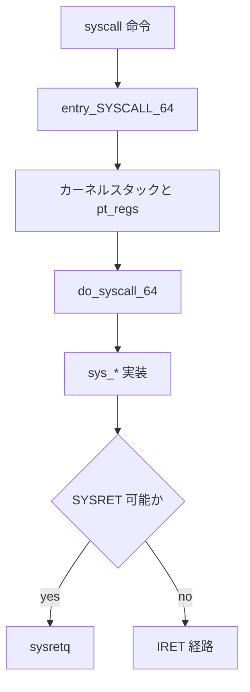

# 第7章 entry_64.S の入口と出口

> 本章で読むソース
>
> - [`arch/x86/entry/entry_64.S` L80-L121](https://github.com/gregkh/linux/blob/v6.18.38/arch/x86/entry/entry_64.S#L80-L121)
> - [`arch/x86/entry/entry_64.S` L123-L166](https://github.com/gregkh/linux/blob/v6.18.38/arch/x86/entry/entry_64.S#L123-L166)
> - [`arch/x86/entry/syscall_64.c` L87-L140](https://github.com/gregkh/linux/blob/v6.18.38/arch/x86/entry/syscall_64.c#L87-L140)
> - [`arch/x86/entry/common.c` L1-L40](https://github.com/gregkh/linux/blob/v6.18.38/arch/x86/entry/common.c#L1-L40)
> - [`arch/x86/entry/entry_64.S` L172-L200](https://github.com/gregkh/linux/blob/v6.18.38/arch/x86/entry/entry_64.S#L172-L200)
> - [`include/linux/entry-common.h` L100-L129](https://github.com/gregkh/linux/blob/v6.18.38/include/linux/entry-common.h#L100-L129)
> - [`include/linux/entry-common.h` L1-L35](https://github.com/gregkh/linux/blob/v6.18.38/include/linux/entry-common.h#L1-L35)
> - [`arch/x86/include/asm/syscall.h` L1-L35](https://github.com/gregkh/linux/blob/v6.18.38/arch/x86/include/asm/syscall.h#L1-L35)

## この章の狙い

x86-64 でユーザー空間から `syscall` 命令で入った後、カーネルスタックと `pt_regs` を構築し、処理後に SYSRET か IRET のどちらで戻るかを決める経路を追う。

## 前提

[システムコールテーブルと SYSCALL_DEFINE](06-syscall-table-syscall-define.md) で `do_syscall_64` の役割を知っていること。

## entry_SYSCALL_64 の入口

`syscall` 命令は `%rax` に番号、`%rdi` 以降に引数を載せ、`entry_SYSCALL_64` へ制御を移す。
入口では `swapgs` で GS ベースをカーネル per-CPU 領域へ切り替える。

[`arch/x86/entry/entry_64.S` L80-L121](https://github.com/gregkh/linux/blob/v6.18.38/arch/x86/entry/entry_64.S#L80-L121)

```asm
 * Only called from user space.
 *
 * When user can change pt_regs->foo always force IRET. That is because
 * it deals with uncanonical addresses better. SYSRET has trouble
 * with them due to bugs in both AMD and Intel CPUs.
 */

SYM_CODE_START(entry_SYSCALL_64)
	UNWIND_HINT_ENTRY
	ENDBR

	swapgs
	/* tss.sp2 is scratch space. */
	movq	%rsp, PER_CPU_VAR(cpu_tss_rw + TSS_sp2)
	SWITCH_TO_KERNEL_CR3 scratch_reg=%rsp
	movq	PER_CPU_VAR(cpu_current_top_of_stack), %rsp

SYM_INNER_LABEL(entry_SYSCALL_64_safe_stack, SYM_L_GLOBAL)
	ANNOTATE_NOENDBR

	/* Construct struct pt_regs on stack */
	pushq	$__USER_DS				/* pt_regs->ss */
	pushq	PER_CPU_VAR(cpu_tss_rw + TSS_sp2)	/* pt_regs->sp */
	pushq	%r11					/* pt_regs->flags */
	pushq	$__USER_CS				/* pt_regs->cs */
	pushq	%rcx					/* pt_regs->ip */
SYM_INNER_LABEL(entry_SYSCALL_64_after_hwframe, SYM_L_GLOBAL)
	pushq	%rax					/* pt_regs->orig_ax */

	PUSH_AND_CLEAR_REGS rax=$-ENOSYS

	/* IRQs are off. */
	movq	%rsp, %rdi
	/* Sign extend the lower 32bit as syscall numbers are treated as int */
	movslq	%eax, %rsi

	/* clobbers %rax, make sure it is after saving the syscall nr */
	IBRS_ENTER
	UNTRAIN_RET
	CLEAR_BRANCH_HISTORY

	call	do_syscall_64		/* returns with IRQs disabled */
```

**最適化の工夫**：ユーザー `%rsp` は TSS のスクラッチスロットへ退避し、カーネル専用スタックへ即切替する。
ユーザースタック上でカーネル処理を続けると、非特権コードがスタックを改ざんできるため、早期切替が必須である。

## pt_regs の構築

`PUSH_AND_CLEAR_REGS` は汎用レジスタをスタックに並べ、`struct pt_regs` レイアウトを形成する。
`%rdi` にスタックポインタ、`%rsi` に符号拡張済み syscall 番号を渡して C 関数を呼ぶ。

x86-64 syscall ABI では、返り先アドレスは `%rcx`、保存フラグは `%r11` に入る。
これらもスタックフレームに積み、後の SYSRET で復元する。

## do_syscall_64 と出口判定

C 側で処理関数を実行した後、SYSRET が安全かどうかを判定する。

[`arch/x86/entry/syscall_64.c` L87-L140](https://github.com/gregkh/linux/blob/v6.18.38/arch/x86/entry/syscall_64.c#L87-L140)

```c
__visible noinstr bool do_syscall_64(struct pt_regs *regs, int nr)
{
	add_random_kstack_offset();
	nr = syscall_enter_from_user_mode(regs, nr);

	instrumentation_begin();

	if (!do_syscall_x64(regs, nr) && !do_syscall_x32(regs, nr) && nr != -1) {
		/* Invalid system call, but still a system call. */
		regs->ax = __x64_sys_ni_syscall(regs);
	}

	instrumentation_end();
	syscall_exit_to_user_mode(regs);

	/*
	 * Check that the register state is valid for using SYSRET to exit
	 * to userspace.  Otherwise use the slower but fully capable IRET
	 * exit path.
	 */

	/* XEN PV guests always use the IRET path */
	if (cpu_feature_enabled(X86_FEATURE_XENPV))
		return false;

	/* SYSRET requires RCX == RIP and R11 == EFLAGS */
	if (unlikely(regs->cx != regs->ip || regs->r11 != regs->flags))
		return false;

	/* CS and SS must match the values set in MSR_STAR */
	if (unlikely(regs->cs != __USER_CS || regs->ss != __USER_DS))
		return false;

	/*
	 * On Intel CPUs, SYSRET with non-canonical RCX/RIP will #GP
	 * in kernel space.  This essentially lets the user take over
	 * the kernel, since userspace controls RSP.
	 *
	 * TASK_SIZE_MAX covers all user-accessible addresses other than
	 * the deprecated vsyscall page.
	 */
	if (unlikely(regs->ip >= TASK_SIZE_MAX))
		return false;

	/*
	 * SYSRET cannot restore RF.  It can restore TF, but unlike IRET,
	 * restoring TF results in a trap from userspace immediately after
	 * SYSRET.
	 */
	if (unlikely(regs->flags & (X86_EFLAGS_RF | X86_EFLAGS_TF)))
		return false;

	/* Use SYSRET to exit to userspace */
	return true;
```

**最適化の工夫**：条件を満たす「きれいな」返却経路では SYSRET が IRET より速い。
デバッグフラグや非 canonical アドレスなど例外条件では IRET に落とし、安全性を優先する。

## SYSRET 経路

アセンブリ側は `do_syscall_64` の戻り値 `%al` が非ゼロなら SYSRET へ進む。

[`arch/x86/entry/entry_64.S` L123-L166](https://github.com/gregkh/linux/blob/v6.18.38/arch/x86/entry/entry_64.S#L123-L166)

```asm
	/*
	 * Try to use SYSRET instead of IRET if we're returning to
	 * a completely clean 64-bit userspace context.  If we're not,
	 * go to the slow exit path.
	 * In the Xen PV case we must use iret anyway.
	 */

	ALTERNATIVE "testb %al, %al; jz swapgs_restore_regs_and_return_to_usermode", \
		"jmp swapgs_restore_regs_and_return_to_usermode", X86_FEATURE_XENPV

	/*
	 * We win! This label is here just for ease of understanding
	 * perf profiles. Nothing jumps here.
	 */
syscall_return_via_sysret:
	IBRS_EXIT
	POP_REGS pop_rdi=0

	/*
	 * Now all regs are restored except RSP and RDI.
	 * Save old stack pointer and switch to trampoline stack.
	 */
	movq	%rsp, %rdi
	movq	PER_CPU_VAR(cpu_tss_rw + TSS_sp0), %rsp
	UNWIND_HINT_END_OF_STACK

	pushq	RSP-RDI(%rdi)	/* RSP */
	pushq	(%rdi)		/* RDI */

	/*
	 * We are on the trampoline stack.  All regs except RDI are live.
	 * We can do future final exit work right here.
	 */
	STACKLEAK_ERASE_NOCLOBBER

	SWITCH_TO_USER_CR3_STACK scratch_reg=%rdi

	popq	%rdi
	popq	%rsp
SYM_INNER_LABEL(entry_SYSRETQ_unsafe_stack, SYM_L_GLOBAL)
	ANNOTATE_NOENDBR
	swapgs
	CLEAR_CPU_BUFFERS
	sysretq
```

トランポリンスタックを経由してユーザー CR3 に戻し、`sysretq` で PC と flags を一括復元する。

## entry-common 層

アーキテクチャ横断の入口処理は `linux/entry-common.h` に集約されつつある。

[`include/linux/entry-common.h` L1-L35](https://github.com/gregkh/linux/blob/v6.18.38/include/linux/entry-common.h#L1-L35)

```c
/* SPDX-License-Identifier: GPL-2.0 */
#ifndef __LINUX_ENTRYCOMMON_H
#define __LINUX_ENTRYCOMMON_H

#include <linux/irq-entry-common.h>
#include <linux/ptrace.h>
#include <linux/seccomp.h>
#include <linux/sched.h>
#include <linux/livepatch.h>
#include <linux/resume_user_mode.h>

#include <asm/entry-common.h>
#include <asm/syscall.h>

#ifndef _TIF_UPROBE
# define _TIF_UPROBE			(0)
#endif

/*
 * SYSCALL_WORK flags handled in syscall_enter_from_user_mode()
 */
#ifndef ARCH_SYSCALL_WORK_ENTER
# define ARCH_SYSCALL_WORK_ENTER	(0)
#endif

/*
 * SYSCALL_WORK flags handled in syscall_exit_to_user_mode()
 */
#ifndef ARCH_SYSCALL_WORK_EXIT
# define ARCH_SYSCALL_WORK_EXIT		(0)
#endif

#define SYSCALL_WORK_ENTER	(SYSCALL_WORK_SECCOMP |			\
				 SYSCALL_WORK_SYSCALL_TRACEPOINT |	\
				 SYSCALL_WORK_SYSCALL_TRACE |		\
```

`syscall_enter_from_user_mode` は seccomp、ptrace、audit のフックをまとめて走らせる。

## syscall_enter_from_user_mode

アセンブリから `do_syscall_64` が呼ぶ入口共通関数は、ユーザーモードからの遷移状態を確立したあと seccomp と ptrace を走らせる。

[`include/linux/entry-common.h` L100-L129](https://github.com/gregkh/linux/blob/v6.18.38/include/linux/entry-common.h#L100-L129)

```c
/**
 * syscall_enter_from_user_mode - Establish state and check and handle work
 *				  before invoking a syscall
 * @regs:	Pointer to currents pt_regs
 * @syscall:	The syscall number
 *
 * Invoked from architecture specific syscall entry code with interrupts
 * disabled. The calling code has to be non-instrumentable. When the
 * function returns all state is correct, interrupts are enabled and the
 * subsequent functions can be instrumented.
 *
 * This is combination of syscall_enter_from_user_mode_prepare() and
 * syscall_enter_from_user_mode_work().
 *
 * Returns: The original or a modified syscall number. See
 * syscall_enter_from_user_mode_work() for further explanation.
 */
static __always_inline long syscall_enter_from_user_mode(struct pt_regs *regs, long syscall)
{
	long ret;

	enter_from_user_mode(regs);

	instrumentation_begin();
	local_irq_enable();
	ret = syscall_enter_from_user_mode_work(regs, syscall);
	instrumentation_end();

	return ret;
}
```

`syscall_enter_from_user_mode_work` 内で `syscall_trace_enter` が ptrace と seccomp を処理する。
戻り値の syscall 番号がそのまま `do_syscall_x64` のディスパッチに渡る。

## コンテキストスイッチ入口

同ファイル `entry_64.S` には `__switch_to_asm` もある。
システムコール出口とは別経路だが、レジスタ保存形式が近い。

[`arch/x86/entry/entry_64.S` L172-L200](https://github.com/gregkh/linux/blob/v6.18.38/arch/x86/entry/entry_64.S#L172-L200)

```asm
/*
 * %rdi: prev task
 * %rsi: next task
 */
.pushsection .text, "ax"
SYM_FUNC_START(__switch_to_asm)
	ANNOTATE_NOENDBR
	/*
	 * Save callee-saved registers
	 * This must match the order in inactive_task_frame
	 */
	pushq	%rbp
	pushq	%rbx
	pushq	%r12
	pushq	%r13
	pushq	%r14
	pushq	%r15

	/* switch stack */
	movq	%rsp, TASK_threadsp(%rdi)
	movq	TASK_threadsp(%rsi), %rsp

#ifdef CONFIG_STACKPROTECTOR
	movq	TASK_stack_canary(%rsi), %rbx
	movq	%rbx, PER_CPU_VAR(__stack_chk_guard)
#endif

	/*
	 * When switching from a shallower to a deeper call stack
```

## 入口から出口までの流れ



## セキュリティ関連の命令

`ENDBR`、`IBRS_ENTER`、`CLEAR_BRANCH_HISTORY` は、間接分岐攻撃対策として入口に挿入される。
性能コストはあるが、ユーザー制御の分岐先からカーネルへ入る境界では標準的な税である。

> **7.x 系での変化**
> `arch/x86/entry/entry_64.S` 自体の差分は小さいが、[`include/linux/entry-common.h`](https://github.com/gregkh/linux/blob/v7.1.3/include/linux/entry-common.h#L21-L91) では syscall 入口の trace、audit、ptrace 処理がインライン化され、`SYSCALL_WORK_SYSCALL_RSEQ_SLICE` による RSEQ スライス処理が追加されている。
> 第7章で触れる `syscall_enter_from_user_mode` の内部契約は 7.x でも入口アセンブリよりこちらの変化が大きい。

## まとめ

`entry_SYSCALL_64` は GS 切替、カーネルスタック、pt_regs 構築を行い `do_syscall_64` を呼ぶ。
出口は条件付きで SYSRET を選び、例外時は IRET にフォールバックする。
`entry-common` 層が seccomp や ptrace を入口出口に統一的に差し込む。

## 関連する章

- [システムコールテーブルと SYSCALL_DEFINE](06-syscall-table-syscall-define.md)
- [vDSO](08-vdso.md)
