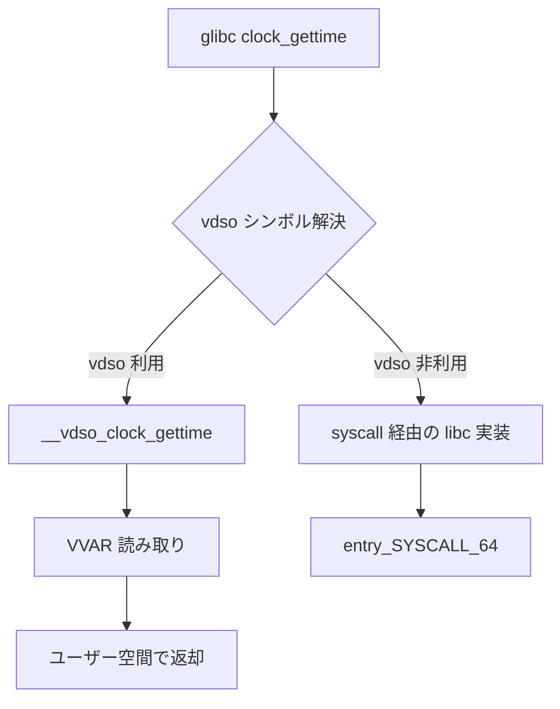

# 第8章 vDSO

> 本章で読むソース
>
> - [`arch/x86/entry/vdso/vclock_gettime.c` L1-L42](https://github.com/gregkh/linux/blob/v6.18.38/arch/x86/entry/vdso/vclock_gettime.c#L1-L42)
> - [`arch/x86/entry/vdso/vma.c` L1-L45](https://github.com/gregkh/linux/blob/v6.18.38/arch/x86/entry/vdso/vma.c#L1-L45)
> - [`lib/vdso/gettimeofday.c` L1-L40](https://github.com/gregkh/linux/blob/v6.18.38/lib/vdso/gettimeofday.c#L1-L40)
> - [`arch/x86/entry/vdso/vdso.lds.S` L1-L30](https://github.com/gregkh/linux/blob/v6.18.38/arch/x86/entry/vdso/vdso.lds.S#L1-L30)
> - [`arch/x86/entry/vdso/vgetcpu.c` L1-L35](https://github.com/gregkh/linux/blob/v6.18.38/arch/x86/entry/vdso/vgetcpu.c#L1-L35)
> - [`include/vdso/datapage.h` L1-L35](https://github.com/gregkh/linux/blob/v6.18.38/include/vdso/datapage.h#L1-L35)
> - [`arch/x86/entry/vdso/Makefile` L1-L25](https://github.com/gregkh/linux/blob/v6.18.38/arch/x86/entry/vdso/Makefile#L1-L25)

## この章の狙い

**vDSO**（virtual Dynamic Shared Object）がユーザー空間にマップされ、`clock_gettime` などをシステムコールなしで実行する仕組みを理解する。

## 前提

[entry_64.S の入口と出口](07-entry-64-syscall-entry-exit.md) で syscall 入口のコストを知っていること。

## vDSO とは何か

vDSO はカーネルが各プロセスのアドレス空間に特別マップする ELF 共有オブジェクトである。
glibc は通常の共有ライブラリと同様にシンボルを解決し、可能な関数は vDSO 実装へ直接ジャンプする。

x86-64 向けの時刻取得コードは `arch/x86/entry/vdso/vclock_gettime.c` にある。

[`arch/x86/entry/vdso/vclock_gettime.c` L1-L42](https://github.com/gregkh/linux/blob/v6.18.38/arch/x86/entry/vdso/vclock_gettime.c#L1-L42)

```c
// SPDX-License-Identifier: GPL-2.0-only
/*
 * Fast user context implementation of clock_gettime, gettimeofday, and time.
 *
 * Copyright 2006 Andi Kleen, SUSE Labs.
 * Copyright 2019 ARM Limited
 *
 * 32 Bit compat layer by Stefani Seibold <stefani@seibold.net>
 *  sponsored by Rohde & Schwarz GmbH & Co. KG Munich/Germany
 */
#include <linux/time.h>
#include <linux/kernel.h>
#include <linux/types.h>
#include <vdso/gettime.h>

#include "../../../../lib/vdso/gettimeofday.c"

int __vdso_gettimeofday(struct __kernel_old_timeval *tv, struct timezone *tz)
{
	return __cvdso_gettimeofday(tv, tz);
}

int gettimeofday(struct __kernel_old_timeval *, struct timezone *)
	__attribute__((weak, alias("__vdso_gettimeofday")));

__kernel_old_time_t __vdso_time(__kernel_old_time_t *t)
{
	return __cvdso_time(t);
}

__kernel_old_time_t time(__kernel_old_time_t *t)	__attribute__((weak, alias("__vdso_time")));


#if defined(CONFIG_X86_64) && !defined(BUILD_VDSO32_64)
/* both 64-bit and x32 use these */
int __vdso_clock_gettime(clockid_t clock, struct __kernel_timespec *ts)
{
	return __cvdso_clock_gettime(clock, ts);
}

int clock_gettime(clockid_t, struct __kernel_timespec *)
	__attribute__((weak, alias("__vdso_clock_gettime")));
```

`weak` と `alias` は vDSO イメージ内で `clock_gettime` などの公開シンボル名を `__vdso_clock_gettime` 実装へ結び付ける。
vDSO がプロセスにマップされていない、または glibc が vDSO を使わない設定のとき、システムコールへ落ちるかどうかは libc 側のシンボル解決と実装が決める。

## 共有アルゴリズム lib/vdso

実際の時刻計算はアーキテクチャ共通の `lib/vdso/gettimeofday.c` にある。
vDSO ページとカーネルが共有する **VVAR** データを読む。

[`lib/vdso/gettimeofday.c` L1-L40](https://github.com/gregkh/linux/blob/v6.18.38/lib/vdso/gettimeofday.c#L1-L40)

```c
// SPDX-License-Identifier: GPL-2.0
/*
 * Generic userspace implementations of gettimeofday() and similar.
 */
#include <vdso/auxclock.h>
#include <vdso/datapage.h>
#include <vdso/helpers.h>

/* Bring in default accessors */
#include <vdso/vsyscall.h>

#ifndef vdso_calc_ns

#ifdef VDSO_DELTA_NOMASK
# define VDSO_DELTA_MASK(vd)	ULLONG_MAX
#else
# define VDSO_DELTA_MASK(vd)	(vd->mask)
#endif

#ifdef CONFIG_GENERIC_VDSO_OVERFLOW_PROTECT
static __always_inline bool vdso_delta_ok(const struct vdso_clock *vc, u64 delta)
{
	return delta < vc->max_cycles;
}
#else
static __always_inline bool vdso_delta_ok(const struct vdso_clock *vc, u64 delta)
{
	return true;
}
#endif

#ifndef vdso_shift_ns
static __always_inline u64 vdso_shift_ns(u64 ns, u32 shift)
{
	return ns >> shift;
}
#endif

/*
 * Default implementation which works for all sane clocksources. That
```

**最適化の工夫**：カーネルが tick 更新時に VVAR へ書き込む時刻基準値を、ユーザー側が TSC 等のサイクルカウンタで補間する。
高頻度の `clock_gettime` を syscall 境界なしで返せるため、コンテキストスイッチとスタック構築コストを省ける。

## プロセスへのマップ

[`arch/x86/entry/vdso/vma.c` L1-L45](https://github.com/gregkh/linux/blob/v6.18.38/arch/x86/entry/vdso/vma.c#L1-L45)

```c
// SPDX-License-Identifier: GPL-2.0-only
/*
 * Copyright 2007 Andi Kleen, SUSE Labs.
 *
 * This contains most of the x86 vDSO kernel-side code.
 */
#include <linux/mm.h>
#include <linux/err.h>
#include <linux/sched.h>
#include <linux/sched/task_stack.h>
#include <linux/slab.h>
#include <linux/init.h>
#include <linux/random.h>
#include <linux/elf.h>
#include <linux/cpu.h>
#include <linux/ptrace.h>
#include <linux/vdso_datastore.h>

#include <asm/pvclock.h>
#include <asm/vgtod.h>
#include <asm/proto.h>
#include <asm/vdso.h>
#include <asm/tlb.h>
#include <asm/page.h>
#include <asm/desc.h>
#include <asm/cpufeature.h>
#include <asm/vdso/vsyscall.h>
#include <clocksource/hyperv_timer.h>

static_assert(VDSO_NR_PAGES + VDSO_NR_VCLOCK_PAGES == __VDSO_PAGES);

unsigned int vclocks_used __read_mostly;

#if defined(CONFIG_X86_64)
unsigned int __read_mostly vdso64_enabled = 1;
#endif

int __init init_vdso_image(const struct vdso_image *image)
{
	BUILD_BUG_ON(VDSO_CLOCKMODE_MAX >= 32);
	BUG_ON(image->size % PAGE_SIZE != 0);

	apply_alternatives((struct alt_instr *)(image->data + image->alt),
			   (struct alt_instr *)(image->data + image->alt +
						image->alt_len));
```

新規 `exec` 時に vDSO と VVAR の VMA が固定レイアウト近傍へ載る。
ASLR はベースアドレスにランダムオフセットを足すが、シンボル解決は動的リンカが処理する。

## VVAR データページ

[`include/vdso/datapage.h` L1-L35](https://github.com/gregkh/linux/blob/v6.18.38/include/vdso/datapage.h#L1-L35)

```c
/* SPDX-License-Identifier: GPL-2.0 */
#ifndef __VDSO_DATAPAGE_H
#define __VDSO_DATAPAGE_H

#ifndef __ASSEMBLY__

#include <linux/compiler.h>
#include <uapi/linux/bits.h>
#include <uapi/linux/time.h>
#include <uapi/linux/types.h>
#include <uapi/asm-generic/errno-base.h>

#include <vdso/align.h>
#include <vdso/bits.h>
#include <vdso/cache.h>
#include <vdso/clocksource.h>
#include <vdso/ktime.h>
#include <vdso/limits.h>
#include <vdso/math64.h>
#include <vdso/page.h>
#include <vdso/processor.h>
#include <vdso/time.h>
#include <vdso/time32.h>
#include <vdso/time64.h>

#ifdef CONFIG_ARCH_HAS_VDSO_TIME_DATA
#include <asm/vdso/time_data.h>
#else
struct arch_vdso_time_data {};
#endif

#if defined(CONFIG_ARCH_HAS_VDSO_ARCH_DATA)
#include <asm/vdso/arch_data.h>
#else
struct vdso_arch_data {
```

カーネル側タイマ更新がここへ書き、vDSO コードが読む。
ユーザーは書き込めない権限でマップされる。

## vgetcpu

CPU 番号取得も vDSO 化されている。

[`arch/x86/entry/vdso/vgetcpu.c` L1-L35](https://github.com/gregkh/linux/blob/v6.18.38/arch/x86/entry/vdso/vgetcpu.c#L1-L35)

```c
// SPDX-License-Identifier: GPL-2.0-only
/*
 * Copyright 2006 Andi Kleen, SUSE Labs.
 *
 * Fast user context implementation of getcpu()
 */

#include <linux/kernel.h>
#include <linux/getcpu.h>
#include <asm/segment.h>
#include <vdso/processor.h>

notrace long
__vdso_getcpu(unsigned *cpu, unsigned *node, struct getcpu_cache *unused)
{
	vdso_read_cpunode(cpu, node);

	return 0;
}

long getcpu(unsigned *cpu, unsigned *node, struct getcpu_cache *tcache)
	__attribute__((weak, alias("__vdso_getcpu")));
```

NUMA 局所性の高いユーザーコードは、syscall なしで CPU 番号を参照できる。

## リンクスクリプト

[`arch/x86/entry/vdso/vdso.lds.S` L1-L30](https://github.com/gregkh/linux/blob/v6.18.38/arch/x86/entry/vdso/vdso.lds.S#L1-L30)

```asm
/* SPDX-License-Identifier: GPL-2.0 */
/*
 * Linker script for 64-bit vDSO.
 * We #include the file to define the layout details.
 *
 * This file defines the version script giving the user-exported symbols in
 * the DSO.
 */

#define BUILD_VDSO64

#include "vdso-layout.lds.S"

/*
 * This controls what userland symbols we export from the vDSO.
 */
VERSION {
	LINUX_2.6 {
	global:
		clock_gettime;
		__vdso_clock_gettime;
		gettimeofday;
		__vdso_gettimeofday;
		getcpu;
		__vdso_getcpu;
		time;
		__vdso_time;
		clock_getres;
		__vdso_clock_getres;
#ifdef CONFIG_X86_SGX
```

vDSO は通常の `.so` より制約が強く、ページ境界と例外テーブル配置がリンク段階で固定される。

## vDSO と syscall の関係



> **7.x 系での変化**
> v7.1.3 では `arch/x86/entry/vdso/vclock_gettime.c`、`vgetcpu.c`、`vdso.lds.S` が直下から消え、[`common/`](https://github.com/gregkh/linux/blob/v7.1.3/arch/x86/entry/vdso/common/vclock_gettime.c)、[`vdso64/`](https://github.com/gregkh/linux/blob/v7.1.3/arch/x86/entry/vdso/vdso64/vclock_gettime.c)、[`vdso32/`](https://github.com/gregkh/linux/blob/v7.1.3/arch/x86/entry/vdso/vdso32/vclock_gettime.c) へ再編されている。
> トップ [`Makefile`](https://github.com/gregkh/linux/blob/v7.1.3/arch/x86/entry/vdso/Makefile#L1-L12) もオブジェクト列挙から `vdso64/` と `vdso32/` サブディレクトリ委譲型に変わっており、本章が引用するパスは 6.18 固定である。

## ビルド統合

[`arch/x86/entry/vdso/Makefile` L1-L25](https://github.com/gregkh/linux/blob/v6.18.38/arch/x86/entry/vdso/Makefile#L1-L25)

```text
# SPDX-License-Identifier: GPL-2.0
#
# Building vDSO images for x86.
#

# Include the generic Makefile to check the built vDSO:
include $(srctree)/lib/vdso/Makefile.include

# Files to link into the vDSO:
vobjs-y := vdso-note.o vclock_gettime.o vgetcpu.o vgetrandom.o vgetrandom-chacha.o
vobjs32-y := vdso32/note.o vdso32/system_call.o vdso32/sigreturn.o
vobjs32-y += vdso32/vclock_gettime.o vdso32/vgetcpu.o
vobjs-$(CONFIG_X86_SGX)	+= vsgx.o

# Files to link into the kernel:
obj-y						+= vma.o extable.o

# vDSO images to build:
obj-$(CONFIG_X86_64)				+= vdso-image-64.o
obj-$(CONFIG_X86_X32_ABI)			+= vdso-image-x32.o
obj-$(CONFIG_COMPAT_32)				+= vdso-image-32.o vdso32-setup.o

vobjs := $(addprefix $(obj)/, $(vobjs-y))
vobjs32 := $(addprefix $(obj)/, $(vobjs32-y))
```

vDSO は独立した小さなリンク単位として `vdso.so` を生成し、カーネルイメージに埋め込む。

## まとめ

vDSO はユーザー空間にマップされたカーネル提供コードであり、時刻取得や getcpu を syscall なしで実行する。
VVAR 共有ページが基準時刻を配信し、vDSO 側が高速なサイクルカウンタで補間する。
入口アセンブリを毎回通らないため、高頻度 API のレイテンシを下げられる。

## 関連する章

- [entry_64.S の入口と出口](07-entry-64-syscall-entry-exit.md)
- [kernel_init から init プロセス起動まで](../part01-boot/05-kernel-init-to-init.md)
