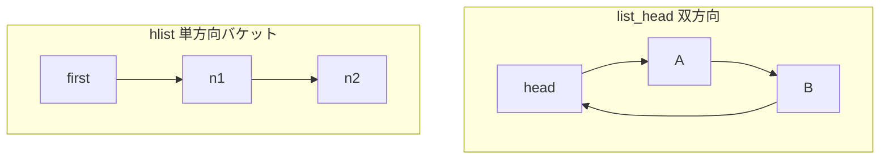

# 第9章 list_head と hlist

> 本章で読むソース
>
> - [`include/linux/list.h` L23-L47](https://github.com/gregkh/linux/blob/v6.18.38/include/linux/list.h#L23-L47)
> - [`include/linux/list.h` L100-L130](https://github.com/gregkh/linux/blob/v6.18.38/include/linux/list.h#L100-L130)
> - [`include/linux/list.h` L920-L945](https://github.com/gregkh/linux/blob/v6.18.38/include/linux/list.h#L920-L945)
> - [`include/linux/list.h` L1025-L1041](https://github.com/gregkh/linux/blob/v6.18.38/include/linux/list.h#L1025-L1041)
> - [`include/linux/list.h` L49-L75](https://github.com/gregkh/linux/blob/v6.18.38/include/linux/list.h#L49-L75)
> - [`kernel/sched/core.c` L9110-L9126](https://github.com/gregkh/linux/blob/v6.18.38/kernel/sched/core.c#L9110-L9126)
> - [`kernel/sched/fair.c` L4221-L4227](https://github.com/gregkh/linux/blob/v6.18.38/kernel/sched/fair.c#L4221-L4227)
> - [`include/linux/list.h` L700-L730](https://github.com/gregkh/linux/blob/v6.18.38/include/linux/list.h#L700-L730)

## この章の狙い

カーネル全体で使われる侵入型双方向リスト `list_head` と、ハッシュバケット向け単方向リスト `hlist` のデータ構造と操作を理解する。

## 前提

C の `container_of` マクロと、ポインタ1本追加で複数リストに参加できる設計は概ね知っている。

## list_head の基本

[`include/linux/list.h` L23-L47](https://github.com/gregkh/linux/blob/v6.18.38/include/linux/list.h#L23-L47)

```c
/**
 * LIST_HEAD_INIT - initialize a &struct list_head's links to point to itself
 * @name: name of the list_head
 */
#define LIST_HEAD_INIT(name) { &(name), &(name) }

/**
 * LIST_HEAD - definition of a &struct list_head with initialization values
 * @name: name of the list_head
 */
#define LIST_HEAD(name) \
	struct list_head name = LIST_HEAD_INIT(name)

/**
 * INIT_LIST_HEAD - Initialize a list_head structure
 * @list: list_head structure to be initialized.
 *
 * Initializes the list_head to point to itself.  If it is a list header,
 * the result is an empty list.
 */
static inline void INIT_LIST_HEAD(struct list_head *list)
{
	WRITE_ONCE(list->next, list);
	WRITE_ONCE(list->prev, list);
}
```

空リストは head の `next` と `prev` が自分自身を指す。
要素追加は head の近傍4ポインタ更新だけで O(1) である。

## list_add と list_del

[`include/linux/list.h` L100-L130](https://github.com/gregkh/linux/blob/v6.18.38/include/linux/list.h#L100-L130)

```c
/*
 * Performs the full set of list corruption checks before __list_del_entry().
 * On list corruption reports a warning, and returns false.
 */
bool __list_valid_slowpath __list_del_entry_valid_or_report(struct list_head *entry);

/*
 * Performs list corruption checks before __list_del_entry(). Returns false if a
 * corruption is detected, true otherwise.
 *
 * With CONFIG_LIST_HARDENED only, performs minimal list integrity checking
 * inline to catch non-faulting corruptions, and only if a corruption is
 * detected calls the reporting function __list_del_entry_valid_or_report().
 */
static __always_inline bool __list_del_entry_valid(struct list_head *entry)
{
	bool ret = true;

	if (!IS_ENABLED(CONFIG_DEBUG_LIST)) {
		struct list_head *prev = entry->prev;
		struct list_head *next = entry->next;

		/*
		 * With the hardening version, elide checking if next and prev
		 * are NULL, LIST_POISON1 or LIST_POISON2, since the immediate
		 * dereference of them below would result in a fault.
		 */
		if (likely(prev->next == entry && next->prev == entry))
			return true;
		ret = false;
	}
```

**最適化の工夫**：専用アロケータを使わず、オブジェクト内の `list_head` メンバだけでキューイングできる。
別途リンクノードを確保する設計よりキャッシュミスとアロケータ負荷が少ない。

## 走査と container_of

[`include/linux/list.h` L700-L730](https://github.com/gregkh/linux/blob/v6.18.38/include/linux/list.h#L700-L730)

```c
	(list_is_first(&(pos)->member, head) ? \
	list_last_entry(head, typeof(*(pos)), member) : list_prev_entry(pos, member))

/**
 * list_for_each	-	iterate over a list
 * @pos:	the &struct list_head to use as a loop cursor.
 * @head:	the head for your list.
 */
#define list_for_each(pos, head) \
	for (pos = (head)->next; !list_is_head(pos, (head)); pos = pos->next)

/**
 * list_for_each_continue - continue iteration over a list
 * @pos:	the &struct list_head to use as a loop cursor.
 * @head:	the head for your list.
 *
 * Continue to iterate over a list, continuing after the current position.
 */
#define list_for_each_continue(pos, head) \
	for (pos = pos->next; !list_is_head(pos, (head)); pos = pos->next)

/**
 * list_for_each_prev	-	iterate over a list backwards
 * @pos:	the &struct list_head to use as a loop cursor.
 * @head:	the head for your list.
 */
#define list_for_each_prev(pos, head) \
	for (pos = (head)->prev; !list_is_head(pos, (head)); pos = pos->prev)

/**
 * list_for_each_safe - iterate over a list safe against removal of list entry
```

cgroup スケジューラの task_group 列挙、ファイルの inode リスト、デバイスモデルの sibling リストなど、走査パターンはこのマクロに統一される。

## hlist：ハッシュバケット向け

ハッシュ表の衝突鎖では head から next だけ辿れば足り、prev は不要である。
`hlist_head` はポインタ1本、`hlist_node` は `next` と `pprev` を持つ。

[`include/linux/list.h` L920-L945](https://github.com/gregkh/linux/blob/v6.18.38/include/linux/list.h#L920-L945)

```c

/**
 * list_safe_reset_next - reset a stale list_for_each_entry_safe loop
 * @pos:	the loop cursor used in the list_for_each_entry_safe loop
 * @n:		temporary storage used in list_for_each_entry_safe
 * @member:	the name of the list_head within the struct.
 *
 * list_safe_reset_next is not safe to use in general if the list may be
 * modified concurrently (eg. the lock is dropped in the loop body). An
 * exception to this is if the cursor element (pos) is pinned in the list,
 * and list_safe_reset_next is called after re-taking the lock and before
 * completing the current iteration of the loop body.
 */
#define list_safe_reset_next(pos, n, member)				\
	n = list_next_entry(pos, member)

/*
 * Double linked lists with a single pointer list head.
 * Mostly useful for hash tables where the two pointer list head is
 * too wasteful.
 * You lose the ability to access the tail in O(1).
 */

#define HLIST_HEAD_INIT { .first = NULL }
#define HLIST_HEAD(name) struct hlist_head name = {  .first = NULL }
#define INIT_HLIST_HEAD(ptr) ((ptr)->first = NULL)
```

**最適化の工夫**：バケット head がポインタ1本のため、巨大ハッシュ表のメタデータ占有を抑えられる。
`pprev` により、単方向リストでありながら O(1) 削除が可能である。

## hlist_add_head

[`include/linux/list.h` L1025-L1041](https://github.com/gregkh/linux/blob/v6.18.38/include/linux/list.h#L1025-L1041)

```c
/**
 * hlist_add_head - add a new entry at the beginning of the hlist
 * @n: new entry to be added
 * @h: hlist head to add it after
 *
 * Insert a new entry after the specified head.
 * This is good for implementing stacks.
 */
static inline void hlist_add_head(struct hlist_node *n, struct hlist_head *h)
{
	struct hlist_node *first = h->first;
	WRITE_ONCE(n->next, first);
	if (first)
		WRITE_ONCE(first->pprev, &n->next);
	WRITE_ONCE(h->first, n);
	WRITE_ONCE(n->pprev, &h->first);
}
```

最近追加要素を先頭に置く LIFO 動作は、dentry や inode キャッシュのハッシュ鎖でよく使われる。

## LIST_HARDENED

[`include/linux/list.h` L49-L75](https://github.com/gregkh/linux/blob/v6.18.38/include/linux/list.h#L49-L75)

```c
#ifdef CONFIG_LIST_HARDENED

#ifdef CONFIG_DEBUG_LIST
# define __list_valid_slowpath
#else
# define __list_valid_slowpath __cold __preserve_most
#endif

/*
 * Performs the full set of list corruption checks before __list_add().
 * On list corruption reports a warning, and returns false.
 */
bool __list_valid_slowpath __list_add_valid_or_report(struct list_head *new,
						      struct list_head *prev,
						      struct list_head *next);

/*
 * Performs list corruption checks before __list_add(). Returns false if a
 * corruption is detected, true otherwise.
 *
 * With CONFIG_LIST_HARDENED only, performs minimal list integrity checking
 * inline to catch non-faulting corruptions, and only if a corruption is
 * detected calls the reporting function __list_add_valid_or_report().
 */
static __always_inline bool __list_add_valid(struct list_head *new,
					     struct list_head *prev,
					     struct list_head *next)
```

use-after-free や二重リンクを早期検出する hardened パスがある。
本番カーネルでも最小限のインライン検査を入れ、破損時だけ slow path へ落とす。

## 利用箇所の例：task_group

CFS の実行順序は rbtree で管理される。
`list_head` は cgroup スケジューラの `task_group` 階層で使われる。

新しい task group をオンラインにするとき、`sched_online_group` が global リストと親子リンクを更新する。

[`kernel/sched/core.c` L9110-L9126](https://github.com/gregkh/linux/blob/v6.18.38/kernel/sched/core.c#L9110-L9126)

```c
void sched_online_group(struct task_group *tg, struct task_group *parent)
{
	unsigned long flags;

	spin_lock_irqsave(&task_group_lock, flags);
	list_add_tail_rcu(&tg->list, &task_groups);

	/* Root should already exist: */
	WARN_ON(!parent);

	tg->parent = parent;
	INIT_LIST_HEAD(&tg->children);
	list_add_rcu(&tg->siblings, &parent->children);
	spin_unlock_irqrestore(&task_group_lock, flags);

	online_fair_sched_group(tg);
}
```

`task_groups` head への `list_add_tail_rcu` と、親の `children` への `list_add_rcu` が追加経路である。
読み側は RCU ロックの下で `list_for_each_entry_rcu` により全 group を走査する。

[`kernel/sched/fair.c` L4221-L4227](https://github.com/gregkh/linux/blob/v6.18.38/kernel/sched/fair.c#L4221-L4227)

```c
	rcu_read_lock();
	list_for_each_entry_rcu(tg, &task_groups, list) {
		struct cfs_rq *cfs_rq = tg->cfs_rq[cpu_of(rq)];

		clear_tg_load_avg(cfs_rq);
	}
	rcu_read_unlock();
```

読解時は「どの head にぶら下がっているか」を図示すると追いやすい。

## list と hlist の使い分け



| 構造 | 削除 | head サイズ | 典型用途 |
|---|---|---|---|
| list_head | O(1) | 2ポインタ | ランキュー、デバイス sibling |
| hlist | O(1) | 1ポインタ | dentry、inode ハッシュ |

## RCU 走査との組み合わせ

読み側がロックを取らない RCU リスト走査では、`list_for_each_entry_rcu` 系マクロが使われる。
削除側は `list_del_rcu` の後に grace period を待つ。
list 操作の基本は同じだが、可視性の契約が追加される。

## まとめ

`list_head` はカーネル標準の侵入型双方向リストであり、`hlist` はハッシュバケット向けの軽量単方向リストである。
どちらも追加削除 O(1) を狙い、専用ノード確保を避ける。
スケジューラから dentry まで、サブシステム横断の基盤データ構造である。

## 関連する章

- [rbtree](../part03-datastructures/10-rbtree.md)
- [XArray](11-xarray.md)
