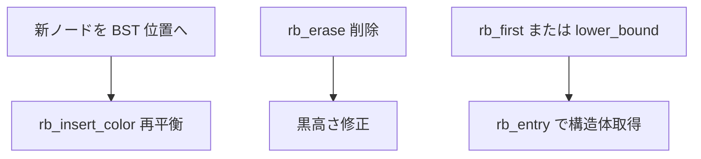

# 第10章 rbtree

> 本章で読むソース
>
> - [`lib/rbtree.c` L15-L33](https://github.com/gregkh/linux/blob/v6.18.38/lib/rbtree.c#L15-L33)
> - [`lib/rbtree.c` L36-L57](https://github.com/gregkh/linux/blob/v6.18.38/lib/rbtree.c#L36-L57)
> - [`lib/rbtree.c` L434-L447](https://github.com/gregkh/linux/blob/v6.18.38/lib/rbtree.c#L434-L447)
> - [`lib/rbtree.c` L466-L475](https://github.com/gregkh/linux/blob/v6.18.38/lib/rbtree.c#L466-L475)
> - [`include/linux/rbtree_types.h` L1-L14](https://github.com/gregkh/linux/blob/v6.18.38/include/linux/rbtree_types.h#L1-L14)
> - [`include/linux/rbtree.h` L1-L45](https://github.com/gregkh/linux/blob/v6.18.38/include/linux/rbtree.h#L1-L45)
> - [`include/linux/rbtree_augmented.h` L1-L35](https://github.com/gregkh/linux/blob/v6.18.38/include/linux/rbtree_augmented.h#L1-L35)
> - [`kernel/sched/deadline.c` L525-L537](https://github.com/gregkh/linux/blob/v6.18.38/kernel/sched/deadline.c#L525-L537)
> - [`kernel/sched/deadline.c` L2130-L2138](https://github.com/gregkh/linux/blob/v6.18.38/kernel/sched/deadline.c#L2130-L2138)
> - [`kernel/sched/deadline.c` L508-L510](https://github.com/gregkh/linux/blob/v6.18.38/kernel/sched/deadline.c#L508-L510)

## この章の狙い

カーネル標準の赤黒木 `rbtree` が保証する平衡性と、挿入、削除、走査の API を読み、スケジューラや VMA 管理での使い方の前提を固める。

## 前提

平衡二分探索木の O(log n) 操作と、赤黒木の色不変条件は概ね知っている。

## 赤黒木の不変条件

[`lib/rbtree.c` L15-L33](https://github.com/gregkh/linux/blob/v6.18.38/lib/rbtree.c#L15-L33)

```c
/*
 * red-black trees properties:  https://en.wikipedia.org/wiki/Rbtree
 *
 *  1) A node is either red or black
 *  2) The root is black
 *  3) All leaves (NULL) are black
 *  4) Both children of every red node are black
 *  5) Every simple path from root to leaves contains the same number
 *     of black nodes.
 *
 *  4 and 5 give the O(log n) guarantee, since 4 implies you cannot have two
 *  consecutive red nodes in a path and every red node is therefore followed by
 *  a black. So if B is the number of black nodes on every simple path (as per
 *  5), then the longest possible path due to 4 is 2B.
 *
 *  We shall indicate color with case, where black nodes are uppercase and red
 *  nodes will be lowercase. Unknown color nodes shall be drawn as red within
 *  parentheses and have some accompanying text comment.
 */
```

条件4と5から、最長パス長が黒高さの2倍以内に抑えられる。
ソート済み挿入でも木の高さが線形に伸びない。

## ロックレス走査の契約

[`lib/rbtree.c` L36-L57](https://github.com/gregkh/linux/blob/v6.18.38/lib/rbtree.c#L36-L57)

```c
 * Notes on lockless lookups:
 *
 * All stores to the tree structure (rb_left and rb_right) must be done using
 * WRITE_ONCE(). And we must not inadvertently cause (temporary) loops in the
 * tree structure as seen in program order.
 *
 * These two requirements will allow lockless iteration of the tree -- not
 * correct iteration mind you, tree rotations are not atomic so a lookup might
 * miss entire subtrees.
 *
 * But they do guarantee that any such traversal will only see valid elements
 * and that it will indeed complete -- does not get stuck in a loop.
 *
 * It also guarantees that if the lookup returns an element it is the 'correct'
 * one. But not returning an element does _NOT_ mean it's not present.
 *
 * NOTE:
 *
 * Stores to __rb_parent_color are not important for simple lookups so those
 * are left undone as of now. Nor did I check for loops involving parent
 * pointers.
 */
```

**最適化の工夫**：読み取り側がスピンロックを取らずに走査できる。
引用コメントが保証するのは、`WRITE_ONCE` とループ禁止の構造契約の下で走査が完了すること、返却値が正しいこと、見落としは起きうることである。
ノード寿命の保護までは約束しない。

## 公開 API

[`lib/rbtree.c` L434-L447](https://github.com/gregkh/linux/blob/v6.18.38/lib/rbtree.c#L434-L447)

```c
void rb_insert_color(struct rb_node *node, struct rb_root *root)
{
	__rb_insert(node, root, dummy_rotate);
}
EXPORT_SYMBOL(rb_insert_color);

void rb_erase(struct rb_node *node, struct rb_root *root)
{
	struct rb_node *rebalance;
	rebalance = __rb_erase_augmented(node, root, &dummy_callbacks);
	if (rebalance)
		____rb_erase_color(rebalance, root, dummy_rotate);
}
EXPORT_SYMBOL(rb_erase);
```

挿入は新ノードを赤で置いた後 `rb_insert_color` で再平衡する。
削除は successor 入替と色修正を内部で行う。

## 最小要素の取得

[`lib/rbtree.c` L466-L475](https://github.com/gregkh/linux/blob/v6.18.38/lib/rbtree.c#L466-L475)

```c
struct rb_node *rb_first(const struct rb_root *root)
{
	struct rb_node	*n;

	n = root->rb_node;
	if (!n)
		return NULL;
	while (n->rb_left)
		n = n->rb_left;
	return n;
```

interval tree では `rb_first` で最も早いノードを O(log n) で取り出す。
タイマーホイールは別構造であり、本章の rbtree 利用例とは混同しない。

## スケジューラ DL クラスでの利用例

deadline スケジューラクラスは `dl_rq->root` という `rb_root_cached` で期限順にタスクを並べる。

[`kernel/sched/deadline.c` L525-L537](https://github.com/gregkh/linux/blob/v6.18.38/kernel/sched/deadline.c#L525-L537)

```c
void init_dl_rq(struct dl_rq *dl_rq)
{
	dl_rq->root = RB_ROOT_CACHED;

	/* zero means no -deadline tasks */
	dl_rq->earliest_dl.curr = dl_rq->earliest_dl.next = 0;

	dl_rq->overloaded = 0;
	dl_rq->pushable_dl_tasks_root = RB_ROOT_CACHED;

	dl_rq->running_bw = 0;
	dl_rq->this_bw = 0;
	init_dl_rq_bw_ratio(dl_rq);
```

エンキュー時は `rb_add_cached` で挿入し、最左ノード判定に `rb_first_cached` を使う。

[`kernel/sched/deadline.c` L2130-L2138](https://github.com/gregkh/linux/blob/v6.18.38/kernel/sched/deadline.c#L2130-L2138)

```c
static void __enqueue_dl_entity(struct sched_dl_entity *dl_se)
{
	struct dl_rq *dl_rq = dl_rq_of_se(dl_se);

	WARN_ON_ONCE(!RB_EMPTY_NODE(&dl_se->rb_node));

	rb_add_cached(&dl_se->rb_node, &dl_rq->root, __dl_less);

	inc_dl_tasks(dl_se, dl_rq);
```

[`kernel/sched/deadline.c` L508-L510](https://github.com/gregkh/linux/blob/v6.18.38/kernel/sched/deadline.c#L508-L510)

```c
static inline int is_leftmost(struct sched_dl_entity *dl_se, struct dl_rq *dl_rq)
{
	return rb_first_cached(&dl_rq->root) == &dl_se->rb_node;
```

**最適化の工夫**：`rb_root_cached` は最左ノードへのポインタをキャッシュし、次に実行すべき DL タスクの取得を定数時間に近づける。

## ノード構造

[`include/linux/rbtree_types.h` L1-L14](https://github.com/gregkh/linux/blob/v6.18.38/include/linux/rbtree_types.h#L1-L14)

```c
/* SPDX-License-Identifier: GPL-2.0-or-later */
#ifndef _LINUX_RBTREE_TYPES_H
#define _LINUX_RBTREE_TYPES_H

struct rb_node {
	unsigned long  __rb_parent_color;
	struct rb_node *rb_right;
	struct rb_node *rb_left;
} __attribute__((aligned(sizeof(long))));
/* The alignment might seem pointless, but allegedly CRIS needs it */

struct rb_root {
	struct rb_node *rb_node;
};
```

`__rb_parent_color` に親ポインタと色を1ワードに詰め、左右子ポインタと合わせてノードあたり3ワードである。
キャッシュライン消費を抑える。

[`include/linux/rbtree.h` L1-L45](https://github.com/gregkh/linux/blob/v6.18.38/include/linux/rbtree.h#L1-L45)

```c
/* SPDX-License-Identifier: GPL-2.0-or-later */
/*
  Red Black Trees
  (C) 1999  Andrea Arcangeli <andrea@suse.de>
  

  linux/include/linux/rbtree.h

  To use rbtrees you'll have to implement your own insert and search cores.
  This will avoid us to use callbacks and to drop drammatically performances.
  I know it's not the cleaner way,  but in C (not in C++) to get
  performances and genericity...

  See Documentation/core-api/rbtree.rst for documentation and samples.
*/

#ifndef	_LINUX_RBTREE_H
#define	_LINUX_RBTREE_H

#include <linux/container_of.h>
#include <linux/rbtree_types.h>

#include <linux/stddef.h>
#include <linux/rcupdate.h>

#define rb_parent(r)   ((struct rb_node *)((r)->__rb_parent_color & ~3))

#define	rb_entry(ptr, type, member) container_of(ptr, type, member)

#define RB_EMPTY_ROOT(root)  (READ_ONCE((root)->rb_node) == NULL)

/* 'empty' nodes are nodes that are known not to be inserted in an rbtree */
#define RB_EMPTY_NODE(node)  \
	((node)->__rb_parent_color == (unsigned long)(node))
#define RB_CLEAR_NODE(node)  \
	((node)->__rb_parent_color = (unsigned long)(node))


extern void rb_insert_color(struct rb_node *, struct rb_root *);
extern void rb_erase(struct rb_node *, struct rb_root *);


/* Find logical next and previous nodes in a tree */
extern struct rb_node *rb_next(const struct rb_node *);
extern struct rb_node *rb_prev(const struct rb_node *);
```

`rb_parent` マクロが `__rb_parent_color` から親を復元する。
挿入と削除の本体は `lib/rbtree.c` にある。

## augmented rbtree

interval tree では各ノードに subtree 最大値などの集約値を載せる。

[`include/linux/rbtree_augmented.h` L1-L35](https://github.com/gregkh/linux/blob/v6.18.38/include/linux/rbtree_augmented.h#L1-L35)

```c
/* SPDX-License-Identifier: GPL-2.0-or-later */
/*
  Red Black Trees
  (C) 1999  Andrea Arcangeli <andrea@suse.de>
  (C) 2002  David Woodhouse <dwmw2@infradead.org>
  (C) 2012  Michel Lespinasse <walken@google.com>


  linux/include/linux/rbtree_augmented.h
*/

#ifndef _LINUX_RBTREE_AUGMENTED_H
#define _LINUX_RBTREE_AUGMENTED_H

#include <linux/compiler.h>
#include <linux/rbtree.h>
#include <linux/rcupdate.h>

/*
 * Please note - only struct rb_augment_callbacks and the prototypes for
 * rb_insert_augmented() and rb_erase_augmented() are intended to be public.
 * The rest are implementation details you are not expected to depend on.
 *
 * See Documentation/core-api/rbtree.rst for documentation and samples.
 */

struct rb_augment_callbacks {
	void (*propagate)(struct rb_node *node, struct rb_node *stop);
	void (*copy)(struct rb_node *old, struct rb_node *new);
	void (*rotate)(struct rb_node *old, struct rb_node *new);
};

extern void __rb_insert_augmented(struct rb_node *node, struct rb_root *root,
	void (*augment_rotate)(struct rb_node *old, struct rb_node *new));
```

回転時にコールバックで集約値を更新し、範囲検索を O(log n) に保つ。

## 操作の流れ



## list との使い分け

| 要件 | 選ぶ構造 |
|---|---|
| 全要素走査、O(1) 末尾追加 | list_head |
| キー順、範囲検索 | rbtree |
| 整数インデックス、疎配列 | XArray |

## まとめ

`rbtree` はカーネル内の汎用平衡木であり、挿入削除は O(log n) である。
`WRITE_ONCE` 契約によりロックレス走査が可能で、augmented 版は interval tree を支える。
スケジューラや VMA など、順序付き集合が必要な箇所の標準選択肢である。

## 関連する章

- [list_head と hlist](09-list-head-hlist.md)
- [XArray](11-xarray.md)
- [Maple Tree](12-maple-tree.md)
