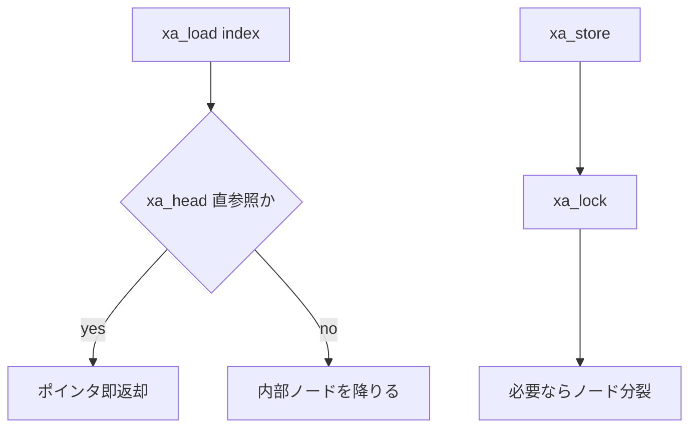

# 第11章 XArray

> 本章で読むソース
>
> - [`include/linux/xarray.h` L27-L47](https://github.com/gregkh/linux/blob/v6.18.38/include/linux/xarray.h#L27-L47)
> - [`include/linux/xarray.h` L300-L311](https://github.com/gregkh/linux/blob/v6.18.38/include/linux/xarray.h#L300-L311)
> - [`include/linux/xarray.h` L355-L358](https://github.com/gregkh/linux/blob/v6.18.38/include/linux/xarray.h#L355-L358)
> - [`include/linux/xarray.h` L58-L74](https://github.com/gregkh/linux/blob/v6.18.38/include/linux/xarray.h#L58-L74)
> - [`lib/xarray.c` L1-L40](https://github.com/gregkh/linux/blob/v6.18.38/lib/xarray.c#L1-L40)
> - [`lib/xarray.c` L200-L230](https://github.com/gregkh/linux/blob/v6.18.38/lib/xarray.c#L200-L230)
> - [`include/linux/fs.h` L484-L508](https://github.com/gregkh/linux/blob/v6.18.38/include/linux/fs.h#L484-L508)
> - [`mm/filemap.c` L1900-L1929](https://github.com/gregkh/linux/blob/v6.18.38/mm/filemap.c#L1900-L1929)

## この章の狙い

**XArray**（eXtensible Array）が整数インデックスからポインタを O(log n) で保持し、Radix Tree の後継としてページキャッシュ等で使われる仕組みを理解する。

## 前提

[rbtree](10-rbtree.md) で平衡木の用途を知っていること。
スパースな整数キー集合を扱う場面を想定できること。

## エントリのエンコーディング

XArray はスロット下位2ビットでエントリ種別を区別する。

[`include/linux/xarray.h` L27-L47](https://github.com/gregkh/linux/blob/v6.18.38/include/linux/xarray.h#L27-L47)

```c
/*
 * The bottom two bits of the entry determine how the XArray interprets
 * the contents:
 *
 * 00: Pointer entry
 * 10: Internal entry
 * x1: Value entry or tagged pointer
 *
 * Attempting to store internal entries in the XArray is a bug.
 *
 * Most internal entries are pointers to the next node in the tree.
 * The following internal entries have a special meaning:
 *
 * 0-62: Sibling entries
 * 256: Retry entry
 * 257: Zero entry
 *
 * Errors are also represented as internal entries, but use the negative
 * space (-4094 to -2).  They're never stored in the slots array; only
 * returned by the normal API.
 */
```

ポインタと小整数値を同一スロットに載せられる。
タグ付きポインタにより、逆参照マップなどで追加ビット情報を載せる。

## xarray 構造体

[`include/linux/xarray.h` L300-L311](https://github.com/gregkh/linux/blob/v6.18.38/include/linux/xarray.h#L300-L311)

```c
struct xarray {
	spinlock_t	xa_lock;
/* private: The rest of the data structure is not to be used directly. */
	gfp_t		xa_flags;
	void __rcu *	xa_head;
};

#define XARRAY_INIT(name, flags) {				\
	.xa_lock = __SPIN_LOCK_UNLOCKED(name.xa_lock),		\
	.xa_flags = flags,					\
	.xa_head = NULL,					\
}
```

単一エントリだけのときは内部ノードを確保せず `xa_head` に直接保持する。
**最適化の工夫**：要素数1のケースで木走査を完全に省略し、ページキャッシュの先頭ページ参照を頻出経路化する。

## 基本 API

[`include/linux/xarray.h` L355-L358](https://github.com/gregkh/linux/blob/v6.18.38/include/linux/xarray.h#L355-L358)

```c
void *xa_load(struct xarray *, unsigned long index);
void *xa_store(struct xarray *, unsigned long index, void *entry, gfp_t);
void *xa_erase(struct xarray *, unsigned long index);
void *xa_store_range(struct xarray *, unsigned long first, unsigned long last,
```

`xa_load` は RCU 読み取り可能で、ページフォールト処理の頻出経路に載る。
更新は `xa_lock` を取り、必要に応じて内部ノードを分裂させる。

## 値エントリ

[`include/linux/xarray.h` L58-L74](https://github.com/gregkh/linux/blob/v6.18.38/include/linux/xarray.h#L58-L74)

```c
static inline void *xa_mk_value(unsigned long v)
{
	WARN_ON((long)v < 0);
	return (void *)((v << 1) | 1);
}

/**
 * xa_to_value() - Get value stored in an XArray entry.
 * @entry: XArray entry.
 *
 * Context: Any context.
 * Return: The value stored in the XArray entry.
 */
static inline unsigned long xa_to_value(const void *entry)
{
	return (unsigned long)entry >> 1;
}
```

ポインタ確保なしに整数を格納できる。
参照カウントや状態フラグの格納に使われる。

## 実装ファイル

[`lib/xarray.c` L1-L40](https://github.com/gregkh/linux/blob/v6.18.38/lib/xarray.c#L1-L40)

```c
// SPDX-License-Identifier: GPL-2.0+
/*
 * XArray implementation
 * Copyright (c) 2017-2018 Microsoft Corporation
 * Copyright (c) 2018-2020 Oracle
 * Author: Matthew Wilcox <willy@infradead.org>
 */

#include <linux/bitmap.h>
#include <linux/export.h>
#include <linux/list.h>
#include <linux/slab.h>
#include <linux/xarray.h>

#include "radix-tree.h"

/*
 * Coding conventions in this file:
 *
 * @xa is used to refer to the entire xarray.
 * @xas is the 'xarray operation state'.  It may be either a pointer to
 * an xa_state, or an xa_state stored on the stack.  This is an unfortunate
 * ambiguity.
 * @index is the index of the entry being operated on
 * @mark is an xa_mark_t; a small number indicating one of the mark bits.
 * @node refers to an xa_node; usually the primary one being operated on by
 * this function.
 * @offset is the index into the slots array inside an xa_node.
 * @parent refers to the @xa_node closer to the head than @node.
 * @entry refers to something stored in a slot in the xarray
 */

static inline unsigned int xa_lock_type(const struct xarray *xa)
{
	return (__force unsigned int)xa->xa_flags & 3;
}

static inline void xas_lock_type(struct xa_state *xas, unsigned int lock_type)
{
	if (lock_type == XA_LOCK_IRQ)
```

Radix Tree からの移行期には `radix-tree.h` 内部ヘッダを共有している。

## マルチインデックス操作

[`lib/xarray.c` L200-L230](https://github.com/gregkh/linux/blob/v6.18.38/lib/xarray.c#L200-L230)

```c
	xas->xa_node = NULL;
	return entry;
}

static __always_inline void *xas_descend(struct xa_state *xas,
					struct xa_node *node)
{
	unsigned int offset = get_offset(xas->xa_index, node);
	void *entry = xa_entry(xas->xa, node, offset);

	xas->xa_node = node;
	while (xa_is_sibling(entry)) {
		offset = xa_to_sibling(entry);
		entry = xa_entry(xas->xa, node, offset);
		if (node->shift && xa_is_node(entry))
			entry = XA_RETRY_ENTRY;
	}

	xas->xa_offset = offset;
	return entry;
}

/**
 * xas_load() - Load an entry from the XArray (advanced).
 * @xas: XArray operation state.
 *
 * Usually walks the @xas to the appropriate state to load the entry
 * stored at xa_index.  However, it will do nothing and return %NULL if
 * @xas is in an error state.  xas_load() will never expand the tree.
 *
 * If the xa_state is set up to operate on a multi-index entry, xas_load()
```

マーク付き走査は dirty page の列挙など、writeback 経路で使われる。

## ページキャッシュでの利用

`address_space` の `i_pages` メンバが XArray である。

[`include/linux/fs.h` L484-L508](https://github.com/gregkh/linux/blob/v6.18.38/include/linux/fs.h#L484-L508)

```c
/**
 * struct address_space - Contents of a cacheable, mappable object.
 * @host: Owner, either the inode or the block_device.
 * @i_pages: Cached pages.
 * @invalidate_lock: Guards coherency between page cache contents and
 *   file offset->disk block mappings in the filesystem during invalidates.
 *   It is also used to block modification of page cache contents through
 *   memory mappings.
 * @gfp_mask: Memory allocation flags to use for allocating pages.
 * @i_mmap_writable: Number of VM_SHARED, VM_MAYWRITE mappings.
 * @nr_thps: Number of THPs in the pagecache (non-shmem only).
 * @i_mmap: Tree of private and shared mappings.
 * @i_mmap_rwsem: Protects @i_mmap and @i_mmap_writable.
 * @nrpages: Number of page entries, protected by the i_pages lock.
 * @writeback_index: Writeback starts here.
 * @a_ops: Methods.
 * @flags: Error bits and flags (AS_*).
 * @wb_err: The most recent error which has occurred.
 * @i_private_lock: For use by the owner of the address_space.
 * @i_private_list: For use by the owner of the address_space.
 * @i_private_data: For use by the owner of the address_space.
 */
struct address_space {
	struct inode		*host;
	struct xarray		i_pages;
	struct rw_semaphore	invalidate_lock;
	gfp_t			gfp_mask;
	atomic_t		i_mmap_writable;
```

ファイルオフセット（ページインデックス）から folio を引く代表経路は `filemap_get_entry` である。
`XA_STATE` で `i_pages` を指し、`xas_load` でエントリを読む。

[`mm/filemap.c` L1900-L1929](https://github.com/gregkh/linux/blob/v6.18.38/mm/filemap.c#L1900-L1929)

```c
void *filemap_get_entry(struct address_space *mapping, pgoff_t index)
{
	XA_STATE(xas, &mapping->i_pages, index);
	struct folio *folio;

	rcu_read_lock();
repeat:
	xas_reset(&xas);
	folio = xas_load(&xas);
	if (xas_retry(&xas, folio))
		goto repeat;
	/*
	 * A shadow entry of a recently evicted page, or a swap entry from
	 * shmem/tmpfs.  Return it without attempting to raise page count.
	 */
	if (!folio || xa_is_value(folio))
		goto out;

	if (!folio_try_get(folio))
		goto repeat;

	if (unlikely(folio != xas_reload(&xas))) {
		folio_put(folio);
		goto repeat;
	}
out:
	rcu_read_unlock();

	return folio;
}
```

`__filemap_get_folio` はこの関数を呼び出し、見つかった folio の参照カウントを上げる。
ページフォールトや read 経路の頻出入口である。

## 操作フロー



## XA_FLAGS_ALLOC

ID 自動採番モードでは、空きインデックスを XArray 自身が管理する。
idr 互換 API は XArray 上に薄く載っている。

## まとめ

XArray は整数インデックスからポインタまたは値を保持する Radix Tree 後継である。
単一要素最適化、タグ付きエントリ、マーク走査を備える。
ページキャッシュの `i_pages` が代表例で、ファイル I/O の頻出経路を支える。

## 関連する章

- [Maple Tree](12-maple-tree.md)
- [rbtree](10-rbtree.md)
