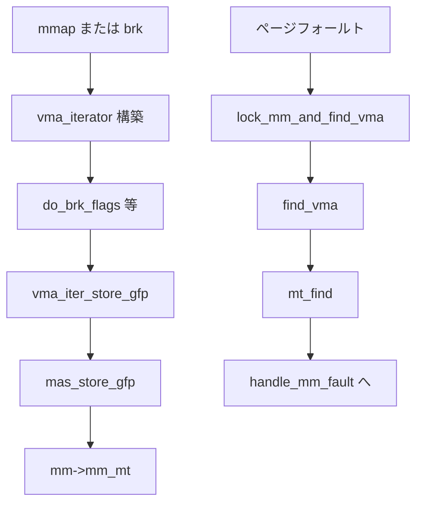

# 第12章 Maple Tree

> 本章で読むソース
>
> - [`include/linux/maple_tree.h` L16-L39](https://github.com/gregkh/linux/blob/v6.18.38/include/linux/maple_tree.h#L16-L39)
> - [`include/linux/maple_tree.h` L229-L238](https://github.com/gregkh/linux/blob/v6.18.38/include/linux/maple_tree.h#L229-L238)
> - [`include/linux/maple_tree.h` L77-L80](https://github.com/gregkh/linux/blob/v6.18.38/include/linux/maple_tree.h#L77-L80)
> - [`mm/mmap.c` L904-L910](https://github.com/gregkh/linux/blob/v6.18.38/mm/mmap.c#L904-L910)
> - [`mm/mmap_lock.c` L424-L434](https://github.com/gregkh/linux/blob/v6.18.38/mm/mmap_lock.c#L424-L434)
> - [`mm/vma.h` L211-L225](https://github.com/gregkh/linux/blob/v6.18.38/mm/vma.h#L211-L225)
> - [`mm/vma.c` L2805-L2856](https://github.com/gregkh/linux/blob/v6.18.38/mm/vma.c#L2805-L2856)
> - [`init/main.c` L970-L971](https://github.com/gregkh/linux/blob/v6.18.38/init/main.c#L970-L971)

## この章の狙い

**Maple Tree** が範囲インデックスを RCU 安全に保持し、VMA 管理の背骨として XArray とは異なる設計を取る理由を理解する。

## 前提

[XArray](11-xarray.md) で整数インデックス配列の基本を読んでいること。

## 設計目標

[`include/linux/maple_tree.h` L16-L39](https://github.com/gregkh/linux/blob/v6.18.38/include/linux/maple_tree.h#L16-L39)

```c
/*
 * Allocated nodes are mutable until they have been inserted into the tree,
 * at which time they cannot change their type until they have been removed
 * from the tree and an RCU grace period has passed.
 *
 * Removed nodes have their ->parent set to point to themselves.  RCU readers
 * check ->parent before relying on the value that they loaded from the
 * slots array.  This lets us reuse the slots array for the RCU head.
 *
 * Nodes in the tree point to their parent unless bit 0 is set.
 */
#if defined(CONFIG_64BIT) || defined(BUILD_VDSO32_64)
/* 64bit sizes */
#define MAPLE_NODE_SLOTS	31	/* 256 bytes including ->parent */
#define MAPLE_RANGE64_SLOTS	16	/* 256 bytes */
#define MAPLE_ARANGE64_SLOTS	10	/* 240 bytes */
#define MAPLE_ALLOC_SLOTS	(MAPLE_NODE_SLOTS - 1)
#else
/* 32bit sizes */
#define MAPLE_NODE_SLOTS	63	/* 256 bytes including ->parent */
#define MAPLE_RANGE64_SLOTS	32	/* 256 bytes */
#define MAPLE_ARANGE64_SLOTS	21	/* 240 bytes */
#define MAPLE_ALLOC_SLOTS	(MAPLE_NODE_SLOTS - 2)
#endif /* defined(CONFIG_64BIT) || defined(BUILD_VDSO32_64) */
```

x86-64 ではノード全体を 256 バイトに揃え、64bit 値用と範囲用でスロット数を変える。
コメントはキャッシュラインではなく固定サイズである。
**最適化の工夫**：VMA のように「連続アドレス範囲」を1ノードで表現し、木の深さとメモリ消費を XArray 単点インデックスより抑える。

## maple_tree 構造体

[`include/linux/maple_tree.h` L229-L238](https://github.com/gregkh/linux/blob/v6.18.38/include/linux/maple_tree.h#L229-L238)

```c
struct maple_tree {
	union {
		spinlock_t		ma_lock;
#ifdef CONFIG_LOCKDEP
		struct lockdep_map	*ma_external_lock;
#endif
	};
	unsigned int	ma_flags;
	void __rcu      *ma_root;
};
```

`ma_flags` は RCU モードや alloc range モードなど木全体の不変属性を保持する。
更新は `ma_lock` または外部 lockdep マップで直列化する。

## メタデータによる gap 探索

[`include/linux/maple_tree.h` L77-L80](https://github.com/gregkh/linux/blob/v6.18.38/include/linux/maple_tree.h#L77-L80)

```c
struct maple_metadata {
	unsigned char end;	/* end of data */
	unsigned char gap;	/* offset of largest gap */
};
```

各ノードは部分木内の最大 gap 位置をキャッシュする。
`mmap` で空き VMA を探すとき、全葉を走査せずに枝刈りできる。

## mas_store API

[`include/linux/maple_tree.h` L522-L525](https://github.com/gregkh/linux/blob/v6.18.38/include/linux/maple_tree.h#L522-L525)

```c
void *mas_store(struct ma_state *mas, void *entry);
void *mas_erase(struct ma_state *mas);
int mas_store_gfp(struct ma_state *mas, void *entry, gfp_t gfp);
void mas_store_prealloc(struct ma_state *mas, void *entry);
```

`ma_state` は走査カーソルであり、同じ走査位置への連続 store を低コストにする。
**最適化の工夫**：状態付き API により、範囲 store のたびに根から再走査せず、局所ノード更新に留められる。

## mt_find と mas_* の役割分担

[`include/linux/maple_tree.h` L883-L883](https://github.com/gregkh/linux/blob/v6.18.38/include/linux/maple_tree.h#L883-L883)

```c
void *mt_find(struct maple_tree *mt, unsigned long *index, unsigned long max);
```

`mt_find` は木全体をインデックスから順に探すユーティリティである。
VMA 更新の本体は `vma_iterator` が `mas_*` ラッパー経由で `ma_state` を操作する。

[`mm/vma.h` L211-L225](https://github.com/gregkh/linux/blob/v6.18.38/mm/vma.h#L211-L225)

```c
static inline int vma_iter_store_gfp(struct vma_iterator *vmi,
			struct vm_area_struct *vma, gfp_t gfp)

{
	if (vmi->mas.status != ma_start &&
	    ((vmi->mas.index > vma->vm_start) || (vmi->mas.last < vma->vm_start)))
		vma_iter_invalidate(vmi);

	__mas_set_range(&vmi->mas, vma->vm_start, vma->vm_end - 1);
	mas_store_gfp(&vmi->mas, vma, gfp);
	if (unlikely(mas_is_err(&vmi->mas)))
		return -ENOMEM;

	vma_mark_attached(vma);
	return 0;
```

## mmap 登録経路

[`mm/vma.c` L2805-L2856](https://github.com/gregkh/linux/blob/v6.18.38/mm/vma.c#L2805-L2856)

```c
int do_brk_flags(struct vma_iterator *vmi, struct vm_area_struct *vma,
		 unsigned long addr, unsigned long len, vm_flags_t vm_flags)
{
	struct mm_struct *mm = current->mm;

	/*
	 * Check against address space limits by the changed size
	 * Note: This happens *after* clearing old mappings in some code paths.
	 */
	vm_flags |= VM_DATA_DEFAULT_FLAGS | VM_ACCOUNT | mm->def_flags;
	vm_flags = ksm_vma_flags(mm, NULL, vm_flags);
	if (!may_expand_vm(mm, vm_flags, len >> PAGE_SHIFT))
		return -ENOMEM;

	if (mm->map_count > sysctl_max_map_count)
		return -ENOMEM;

	if (security_vm_enough_memory_mm(mm, len >> PAGE_SHIFT))
		return -ENOMEM;

	/*
	 * Expand the existing vma if possible; Note that singular lists do not
	 * occur after forking, so the expand will only happen on new VMAs.
	 */
	if (vma && vma->vm_end == addr) {
		VMG_STATE(vmg, mm, vmi, addr, addr + len, vm_flags, PHYS_PFN(addr));

		vmg.prev = vma;
		/* vmi is positioned at prev, which this mode expects. */
		vmg.just_expand = true;

		if (vma_merge_new_range(&vmg))
			goto out;
		else if (vmg_nomem(&vmg))
			goto unacct_fail;
	}

	if (vma)
		vma_iter_next_range(vmi);
	/* create a vma struct for an anonymous mapping */
	vma = vm_area_alloc(mm);
	if (!vma)
		goto unacct_fail;

	vma_set_anonymous(vma);
	vma_set_range(vma, addr, addr + len, addr >> PAGE_SHIFT);
	vm_flags_init(vma, vm_flags);
	vma->vm_page_prot = vm_get_page_prot(vm_flags);
	vma_start_write(vma);
	if (vma_iter_store_gfp(vmi, vma, GFP_KERNEL))
		goto mas_store_fail;
```

`sys_brk` や `mmap` は `vma_iterator` を組み立て、`do_brk_flags` 等から `vma_iter_store_gfp` で `mm->mm_mt` に VMA を載せる。

## ページフォールト時の VMA 検索

フォールト処理は `lock_mm_and_find_vma` から入り、`find_vma` が Maple Tree を引く。

[`mm/mmap_lock.c` L424-L434](https://github.com/gregkh/linux/blob/v6.18.38/mm/mmap_lock.c#L424-L434)

```c
struct vm_area_struct *lock_mm_and_find_vma(struct mm_struct *mm,
			unsigned long addr, struct pt_regs *regs)
{
	struct vm_area_struct *vma;

	if (!get_mmap_lock_carefully(mm, regs))
		return NULL;

	vma = find_vma(mm, addr);
	if (likely(vma && (vma->vm_start <= addr)))
		return vma;
```

[`mm/mmap.c` L904-L910](https://github.com/gregkh/linux/blob/v6.18.38/mm/mmap.c#L904-L910)

```c
struct vm_area_struct *find_vma(struct mm_struct *mm, unsigned long addr)
{
	unsigned long index = addr;

	mmap_assert_locked(mm);
	return mt_find(&mm->mm_mt, &index, ULONG_MAX);
}
```

フォールト本体はここで得た VMA を使って `handle_mm_fault` へ進む。
代表 API は `mt_find` 単体ではなく、`find_vma` と `vma_iterator` である。

## 実装の概要

[`lib/maple_tree.c` L1-L45](https://github.com/gregkh/linux/blob/v6.18.38/lib/maple_tree.c#L1-L45)

```c
// SPDX-License-Identifier: GPL-2.0+
/*
 * Maple Tree implementation
 * Copyright (c) 2018-2022 Oracle Corporation
 * Authors: Liam R. Howlett <Liam.Howlett@oracle.com>
 *	    Matthew Wilcox <willy@infradead.org>
 * Copyright (c) 2023 ByteDance
 * Author: Peng Zhang <zhangpeng.00@bytedance.com>
 */

/*
 * DOC: Interesting implementation details of the Maple Tree
 *
 * Each node type has a number of slots for entries and a number of slots for
 * pivots.  In the case of dense nodes, the pivots are implied by the position
 * and are simply the slot index + the minimum of the node.
 *
 * In regular B-Tree terms, pivots are called keys.  The term pivot is used to
 * indicate that the tree is specifying ranges.  Pivots may appear in the
 * subtree with an entry attached to the value whereas keys are unique to a
 * specific position of a B-tree.  Pivot values are inclusive of the slot with
 * the same index.
 *
 *
 * The following illustrates the layout of a range64 nodes slots and pivots.
 *
 *
 *  Slots -> | 0 | 1 | 2 | ... | 12 | 13 | 14 | 15 |
 *           ┬   ┬   ┬   ┬     ┬    ┬    ┬    ┬    ┬
 *           │   │   │   │     │    │    │    │    └─ Implied maximum
 *           │   │   │   │     │    │    │    └─ Pivot 14
 *           │   │   │   │     │    │    └─ Pivot 13
 *           │   │   │   │     │    └─ Pivot 12
 *           │   │   │   │     └─ Pivot 11
 *           │   │   │   └─ Pivot 2
 *           │   │   └─ Pivot 1
 *           │   └─ Pivot 0
 *           └─  Implied minimum
 *
 * Slot contents:
 *  Internal (non-leaf) nodes contain pointers to other nodes.
 *  Leaf nodes contain entries.
 *
 * The location of interest is often referred to as an offset.  All offsets have
 * a slot, but the last offset has an implied pivot from the node above (or
```

内部ヘッダ `maple_tree.h` は lib 専用で、外部 API は `include/linux/maple_tree.h` のみである。

## 起動時初期化

[`init/main.c` L970-L971](https://github.com/gregkh/linux/blob/v6.18.38/init/main.c#L970-L971)

```c
	mm_core_init();
	maple_tree_init();
```

`maple_tree_init` はスラブキャッシュ等を用意し、以降の VMA 操作が Maple Tree を使えるようにする。
`start_kernel` 前半で呼ばれるため、プロセス生成より前に必須である。

## VMA 管理での位置づけ



`mm_struct->mm_mt` がアドレス空間全体の VMA を保持する。
従来の linked list 走査より、広いアドレス空間でも検索コストが抑えられる。

## XArray との比較

| 特性 | XArray | Maple Tree |
|---|---|---|
| キー | 単一整数 | 範囲 |
| 典型用途 | ページインデックス | VMA |
| RCU | あり | あり |
| 連続範囲 | store_range で同一値 | 範囲ノード型が主目的 |

## RCU とノード再利用

削除ノードは `parent` を自分自身へ向け、RCU 読者が古いスロットを検出できる。
grace period 後にノードを再利用し、解放コストを平準化する。

## まとめ

Maple Tree は範囲インデックス向けの RCU 安全木であり、VMA 管理の標準背骨である。
gap メタデータと `ma_state` により、mmap と fault の頻出経路を高速化する。
`start_kernel` 早期に初期化され、プロセスのアドレス空間全体に効く。

## 関連する章

- [XArray](11-xarray.md)
- [kernel_init から init プロセス起動まで](../part01-boot/05-kernel-init-to-init.md)
