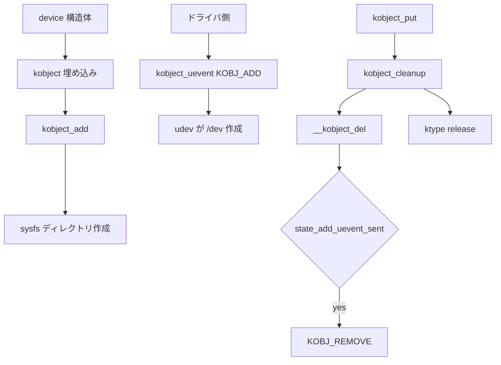

# 第13章 kobject と sysfs

> 本章で読むソース
>
> - [`lib/kobject.c` L1-L11](https://github.com/gregkh/linux/blob/v6.18.38/lib/kobject.c#L1-L11)
> - [`lib/kobject.c` L210-L257](https://github.com/gregkh/linux/blob/v6.18.38/lib/kobject.c#L210-L257)
> - [`lib/kobject.c` L586-L610](https://github.com/gregkh/linux/blob/v6.18.38/lib/kobject.c#L586-L610)
> - [`lib/kobject.c` L663-L699](https://github.com/gregkh/linux/blob/v6.18.38/lib/kobject.c#L663-L699)
> - [`lib/kobject_uevent.c` L463-L491](https://github.com/gregkh/linux/blob/v6.18.38/lib/kobject_uevent.c#L463-L491)
> - [`lib/kobject.c` L266-L297](https://github.com/gregkh/linux/blob/v6.18.38/lib/kobject.c#L266-L297)
> - [`fs/sysfs/dir.c` L40-L68](https://github.com/gregkh/linux/blob/v6.18.38/fs/sysfs/dir.c#L40-L68)
> - [`fs/kernfs/inode.c` L249-L257](https://github.com/gregkh/linux/blob/v6.18.38/fs/kernfs/inode.c#L249-L257)

## この章の狙い

**kobject** が参照カウントと sysfs ディレクトリを統合し、デバイスモデルの統一表現を提供する仕組みを理解する。

## 前提

VFS と procfs/sysfs がユーザー空間からカーネル状態を読む入口であることは知っている。

## kobject の位置づけ

[`lib/kobject.c` L1-L11](https://github.com/gregkh/linux/blob/v6.18.38/lib/kobject.c#L1-L11)

```c
// SPDX-License-Identifier: GPL-2.0
/*
 * kobject.c - library routines for handling generic kernel objects
 *
 * Copyright (c) 2002-2003 Patrick Mochel <mochel@osdl.org>
 * Copyright (c) 2006-2007 Greg Kroah-Hartman <greg@kroah.com>
 * Copyright (c) 2006-2007 Novell Inc.
 *
 * Please see the file Documentation/core-api/kobject.rst for critical information
 * about using the kobject interface.
 */
```

kobject 単体は何もしない薄い層に近い。
`kobj_type` が release、sysfs 属性、namespace 操作を提供する。

## kobject 構造

[`include/linux/kobject.h` L65-L95](https://github.com/gregkh/linux/blob/v6.18.38/include/linux/kobject.h#L65-L95)

```c
	const char		*name;
	struct list_head	entry;
	struct kobject		*parent;
	struct kset		*kset;
	const struct kobj_type	*ktype;
	struct kernfs_node	*sd; /* sysfs directory entry */
	struct kref		kref;

	unsigned int state_initialized:1;
	unsigned int state_in_sysfs:1;
	unsigned int state_add_uevent_sent:1;
	unsigned int state_remove_uevent_sent:1;
	unsigned int uevent_suppress:1;

#ifdef CONFIG_DEBUG_KOBJECT_RELEASE
	struct delayed_work	release;
#endif
};

__printf(2, 3) int kobject_set_name(struct kobject *kobj, const char *name, ...);
__printf(2, 0) int kobject_set_name_vargs(struct kobject *kobj, const char *fmt, va_list vargs);

static inline const char *kobject_name(const struct kobject *kobj)
{
	return kobj->name;
}

void kobject_init(struct kobject *kobj, const struct kobj_type *ktype);
__printf(3, 4) __must_check int kobject_add(struct kobject *kobj,
					    struct kobject *parent,
					    const char *fmt, ...);
```

`parent` チェーンが sysfs のパス `/sys/devices/...` を決める。
`kref` 参照カウントが 0 になると `ktype->release` が呼ばれる。

## kobject_set_name_vargs と kstrdup_const

デバイス名は `kobject_set_name` 経由で printf 形式文字列から生成される。
内部では `kvasprintf_const` が使われ、フォーマット文字列がリテラルのとき `.rodata` へのポインタをそのまま返す。

[`lib/kobject.c` L266-L297](https://github.com/gregkh/linux/blob/v6.18.38/lib/kobject.c#L266-L297)

```c
int kobject_set_name_vargs(struct kobject *kobj, const char *fmt,
				  va_list vargs)
{
	const char *s;

	if (kobj->name && !fmt)
		return 0;

	s = kvasprintf_const(GFP_KERNEL, fmt, vargs);
	if (!s)
		return -ENOMEM;

	/*
	 * ewww... some of these buggers have '/' in the name ... If
	 * that's the case, we need to make sure we have an actual
	 * allocated copy to modify, since kvasprintf_const may have
	 * returned something from .rodata.
	 */
	if (strchr(s, '/')) {
		char *t;

		t = kstrdup(s, GFP_KERNEL);
		kfree_const(s);
		if (!t)
			return -ENOMEM;
		s = strreplace(t, '/', '!');
	}
	kfree_const(kobj->name);
	kobj->name = s;

	return 0;
}
```

**最適化の工夫**：固定名（`"pci"` や `"devices"` など）では `kstrdup` 相当のヒープ確保を省略し、リテラル文字列を参照するだけに留める。
動的に組み立てた名前だけが kmalloc 領域を消費する。
`kobject_cleanup` の `kfree_const` は、どちらの保存形式でも安全に解放できる。

## kobject_add_internal と sysfs 作成

`kobject_add` は内部で `kobject_add_internal` を呼び、`create_dir` までが sysfs 登録である。

[`lib/kobject.c` L210-L257](https://github.com/gregkh/linux/blob/v6.18.38/lib/kobject.c#L210-L257)

```c
static int kobject_add_internal(struct kobject *kobj)
{
	int error = 0;
	struct kobject *parent;

	if (!kobj)
		return -ENOENT;

	if (!kobj->name || !kobj->name[0]) {
		WARN(1,
		     "kobject: (%p): attempted to be registered with empty name!\n",
		     kobj);
		return -EINVAL;
	}

	parent = kobject_get(kobj->parent);

	/* join kset if set, use it as parent if we do not already have one */
	if (kobj->kset) {
		if (!parent)
			parent = kobject_get(&kobj->kset->kobj);
		kobj_kset_join(kobj);
		kobj->parent = parent;
	}

	pr_debug("'%s' (%p): %s: parent: '%s', set: '%s'\n",
		 kobject_name(kobj), kobj, __func__,
		 parent ? kobject_name(parent) : "<NULL>",
		 kobj->kset ? kobject_name(&kobj->kset->kobj) : "<NULL>");

	error = create_dir(kobj);
	if (error) {
		kobj_kset_leave(kobj);
		kobject_put(parent);
		kobj->parent = NULL;

		/* be noisy on error issues */
		if (error == -EEXIST)
			pr_err("%s failed for %s with -EEXIST, don't try to register things with the same name in the same directory.\n",
			       __func__, kobject_name(kobj));
		else
			pr_err("%s failed for %s (error: %d parent: %s)\n",
			       __func__, kobject_name(kobj), error,
			       parent ? kobject_name(parent) : "'none'");
	} else
		kobj->state_in_sysfs = 1;

	return error;
```

ADD uevent はここでは送らない。
ドライバやバスコードが `kobject_uevent(kobj, KOBJ_ADD)` を別途呼ぶ。

[`lib/kobject_uevent.c` L463-L491](https://github.com/gregkh/linux/blob/v6.18.38/lib/kobject_uevent.c#L463-L491)

```c
/**
 * kobject_uevent_env - send an uevent with environmental data
 *
 * @kobj: struct kobject that the action is happening to
 * @action: action that is happening
 * @envp_ext: pointer to environmental data
 *
 * Returns 0 if kobject_uevent_env() is completed with success or the
 * corresponding error when it fails.
 */
int kobject_uevent_env(struct kobject *kobj, enum kobject_action action,
		       char *envp_ext[])
{
	struct kobj_uevent_env *env;
	const char *action_string = kobject_actions[action];
	const char *devpath = NULL;
	const char *subsystem;
	struct kobject *top_kobj;
	struct kset *kset;
	const struct kset_uevent_ops *uevent_ops;
	int i = 0;
	int retval = 0;

	/*
	 * Mark "remove" event done regardless of result, for some subsystems
	 * do not want to re-trigger "remove" event via automatic cleanup.
	 */
	if (action == KOBJ_REMOVE)
		kobj->state_remove_uevent_sent = 1;
```

## kobject_add

[`lib/kobject.c` L410-L430](https://github.com/gregkh/linux/blob/v6.18.38/lib/kobject.c#L410-L430)

```c
int kobject_add(struct kobject *kobj, struct kobject *parent,
		const char *fmt, ...)
{
	va_list args;
	int retval;

	if (!kobj)
		return -EINVAL;

	if (!kobj->state_initialized) {
		pr_err("kobject '%s' (%p): tried to add an uninitialized object, something is seriously wrong.\n",
		       kobject_name(kobj), kobj);
		dump_stack_lvl(KERN_ERR);
		return -EINVAL;
	}
	va_start(args, fmt);
	retval = kobject_add_varg(kobj, parent, fmt, args);
	va_end(args);

	return retval;
}
```

名前は printf 形式で生成でき、バス上の動的デバイス番号などに使う。
登録後は必ず `kobject_put` で寿命を管理する。

## kobject_put と release

[`lib/kobject.c` L730-L739](https://github.com/gregkh/linux/blob/v6.18.38/lib/kobject.c#L730-L739)

```c
void kobject_put(struct kobject *kobj)
{
	if (kobj) {
		if (!kobj->state_initialized)
			WARN(1, KERN_WARNING
				"kobject: '%s' (%p): is not initialized, yet kobject_put() is being called.\n",
			     kobject_name(kobj), kobj);
		kref_put(&kobj->kref, kobject_release);
	}
}
```

`kobject_put` で参照カウントが 0 になると `kobject_release` が `kobject_cleanup` を呼ぶ。
cleanup は sysfs 削除、条件付き REMOVE uevent、`ktype->release` の順で進む。

[`lib/kobject.c` L586-L610](https://github.com/gregkh/linux/blob/v6.18.38/lib/kobject.c#L586-L610)

```c
static void __kobject_del(struct kobject *kobj)
{
	struct kernfs_node *sd;
	const struct kobj_type *ktype;

	sd = kobj->sd;
	ktype = get_ktype(kobj);

	if (ktype)
		sysfs_remove_groups(kobj, ktype->default_groups);

	/* send "remove" if the caller did not do it but sent "add" */
	if (kobj->state_add_uevent_sent && !kobj->state_remove_uevent_sent) {
		pr_debug("'%s' (%p): auto cleanup 'remove' event\n",
			 kobject_name(kobj), kobj);
		kobject_uevent(kobj, KOBJ_REMOVE);
	}

	sysfs_remove_dir(kobj);
	sysfs_put(sd);

	kobj->state_in_sysfs = 0;
	kobj_kset_leave(kobj);
	kobj->parent = NULL;
}
```

[`lib/kobject.c` L663-L699](https://github.com/gregkh/linux/blob/v6.18.38/lib/kobject.c#L663-L699)

```c
static void kobject_cleanup(struct kobject *kobj)
{
	struct kobject *parent = kobj->parent;
	const struct kobj_type *t = get_ktype(kobj);
	const char *name = kobj->name;

	pr_debug("'%s' (%p): %s, parent %p\n",
		 kobject_name(kobj), kobj, __func__, kobj->parent);

	if (t && !t->release)
		pr_debug("'%s' (%p): does not have a release() function, it is broken and must be fixed. See Documentation/core-api/kobject.rst.\n",
			 kobject_name(kobj), kobj);

	/* remove from sysfs if the caller did not do it */
	if (kobj->state_in_sysfs) {
		pr_debug("'%s' (%p): auto cleanup kobject_del\n",
			 kobject_name(kobj), kobj);
		__kobject_del(kobj);
	} else {
		/* avoid dropping the parent reference unnecessarily */
		parent = NULL;
	}

	if (t && t->release) {
		pr_debug("'%s' (%p): calling ktype release\n",
			 kobject_name(kobj), kobj);
		t->release(kobj);
	}

	/* free name if we allocated it */
	if (name) {
		pr_debug("'%s': free name\n", name);
		kfree_const(name);
	}

	kobject_put(parent);
}
```

参照カウントモデルにより、sysfs 参照とカーネル内参照を同一寿命で束ねる。

## kobj_type

[`include/linux/kobject.h` L1-L45](https://github.com/gregkh/linux/blob/v6.18.38/include/linux/kobject.h#L1-L45)

```c
// SPDX-License-Identifier: GPL-2.0
/*
 * kobject.h - generic kernel object infrastructure.
 *
 * Copyright (c) 2002-2003 Patrick Mochel
 * Copyright (c) 2002-2003 Open Source Development Labs
 * Copyright (c) 2006-2008 Greg Kroah-Hartman <greg@kroah.com>
 * Copyright (c) 2006-2008 Novell Inc.
 *
 * Please read Documentation/core-api/kobject.rst before using the kobject
 * interface, ESPECIALLY the parts about reference counts and object
 * destructors.
 */

#ifndef _KOBJECT_H_
#define _KOBJECT_H_

#include <linux/types.h>
#include <linux/list.h>
#include <linux/sysfs.h>
#include <linux/compiler.h>
#include <linux/container_of.h>
#include <linux/spinlock.h>
#include <linux/kref.h>
#include <linux/kobject_ns.h>
#include <linux/wait.h>
#include <linux/atomic.h>
#include <linux/workqueue.h>
#include <linux/uidgid.h>

#define UEVENT_HELPER_PATH_LEN		256
#define UEVENT_NUM_ENVP			64	/* number of env pointers */
#define UEVENT_BUFFER_SIZE		2048	/* buffer for the variables */

#ifdef CONFIG_UEVENT_HELPER
/* path to the userspace helper executed on an event */
extern char uevent_helper[];
#endif

/* counter to tag the uevent, read only except for the kobject core */
extern atomic64_t uevent_seqnum;

/*
 * The actions here must match the index to the string array
 * in lib/kobject_uevent.c
```

`uevent` により udev がデバイスノード作成タイミングを知る。
netlink でユーザー空間へ非同期通知する。

## sysfs 内部

kobject の sysfs 登録は `sysfs_create_dir_ns` が kernfs ノードを作り、`kobj->sd` に保持する。

[`fs/sysfs/dir.c` L40-L68](https://github.com/gregkh/linux/blob/v6.18.38/fs/sysfs/dir.c#L40-L68)

```c
int sysfs_create_dir_ns(struct kobject *kobj, const void *ns)
{
	struct kernfs_node *parent, *kn;
	kuid_t uid;
	kgid_t gid;

	if (WARN_ON(!kobj))
		return -EINVAL;

	if (kobj->parent)
		parent = kobj->parent->sd;
	else
		parent = sysfs_root_kn;

	if (!parent)
		return -ENOENT;

	kobject_get_ownership(kobj, &uid, &gid);

	kn = kernfs_create_dir_ns(parent, kobject_name(kobj), 0755, uid, gid,
				  kobj, ns);
	if (IS_ERR(kn)) {
		if (PTR_ERR(kn) == -EEXIST)
			sysfs_warn_dup(parent, kobject_name(kobj));
		return PTR_ERR(kn);
	}

	kobj->sd = kn;
	return 0;
}
```

VFS がパスを辿って dentry を要求したときだけ、対応する `kernfs_node` から inode を生成する。
常駐 inode を全ノード分確保しない。

[`fs/kernfs/inode.c` L249-L257](https://github.com/gregkh/linux/blob/v6.18.38/fs/kernfs/inode.c#L249-L257)

```c
struct inode *kernfs_get_inode(struct super_block *sb, struct kernfs_node *kn)
{
	struct inode *inode;

	inode = iget_locked(sb, kernfs_ino(kn));
	if (inode && (inode->i_state & I_NEW))
		kernfs_init_inode(kn, inode);

	return inode;
}
```

**最適化の工夫**：sysfs の正本は `kernfs_node` の木だけであり、dentry と inode は lookup 時にオンデマンド生成される。
未参照ノードは VFS オブジェクトを持たないため、巨大な `/sys` 木でもカーネルメモリ占有を抑えられる。
inode 破棄時は `kernfs_evict_inode` が `kernfs_put` でノード参照を落とし、再利用可能にする。

## デバイス登録フロー



## kset との関係

kset は kobject の集合に共有 `ktype` と uevent フィルタを提供する。
`/sys/bus/pci/devices` のような一覧は kset と list で構成される。

## まとめ

kobject は参照カウント付きカーネルオブジェクトの共通骨格であり、sysfs パスと uevent を分離して扱う。
`kobject_add` で sysfs に現れ、ADD uevent は呼び出し側が明示する。
`kobject_put` で cleanup が走り、条件を満たせば REMOVE uevent の後に `ktype->release` が呼ばれる。
デバイスモデル分冊の入口は、この kobject チェーンである。

## 関連する章

- [printk](14-printk.md)
- [ソースツリーの地図](../part00-overview/01-source-tree-map.md)
