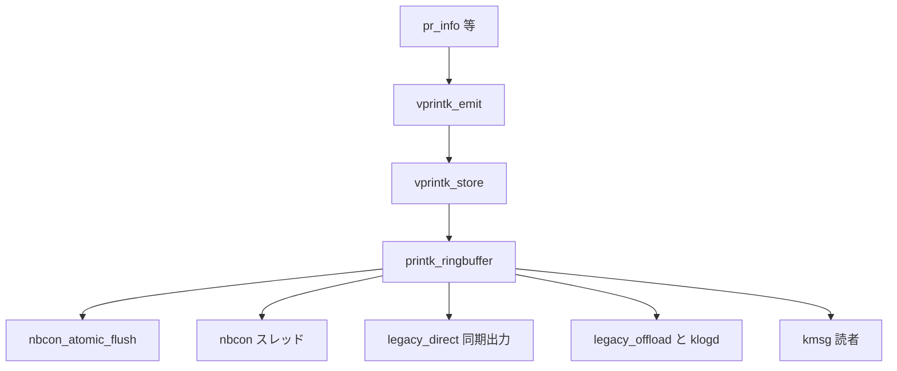

# 第14章 printk

> 本章で読むソース
>
> - [`kernel/printk/printk.c` L65-L70](https://github.com/gregkh/linux/blob/v6.18.38/kernel/printk/printk.c#L65-L70)
> - [`kernel/printk/printk.c` L90-L99](https://github.com/gregkh/linux/blob/v6.18.38/kernel/printk/printk.c#L90-L99)
> - [`kernel/printk/printk.c` L2217-L2244](https://github.com/gregkh/linux/blob/v6.18.38/kernel/printk/printk.c#L2217-L2244)
> - [`kernel/printk/printk.c` L2370-L2435](https://github.com/gregkh/linux/blob/v6.18.38/kernel/printk/printk.c#L2370-L2435)
> - [`kernel/printk/printk.c` L2445-L2460](https://github.com/gregkh/linux/blob/v6.18.38/kernel/printk/printk.c#L2445-L2460)
> - [`kernel/printk/printk_ringbuffer.h` L1-L35](https://github.com/gregkh/linux/blob/v6.18.38/kernel/printk/printk_ringbuffer.h#L1-L35)
> - [`include/linux/printk.h` L1-L35](https://github.com/gregkh/linux/blob/v6.18.38/include/linux/printk.h#L1-L35)

## この章の狙い

**printk** がログレベル、リングバッファ、コンソール出力をどう束ね、起動初期から dmesg まで一貫して使われるかを理解する。

## 前提

[start_kernel と initcall](../part01-boot/04-start-kernel-initcall.md) で `console_init` の位置を知っていること。

## ログレベル設定

[`kernel/printk/printk.c` L65-L70](https://github.com/gregkh/linux/blob/v6.18.38/kernel/printk/printk.c#L65-L70)

```c
int console_printk[4] = {
	CONSOLE_LOGLEVEL_DEFAULT,	/* console_loglevel */
	MESSAGE_LOGLEVEL_DEFAULT,	/* default_message_loglevel */
	CONSOLE_LOGLEVEL_MIN,		/* minimum_console_loglevel */
	CONSOLE_LOGLEVEL_DEFAULT,	/* default_console_loglevel */
};
```

`/proc/sys/kernel/printk` から4要素配列を変更できる。
コンソール表示閾値と、メッセージ自体の既定レベルが分離されている。

## コンソール一覧と console_sem

[`kernel/printk/printk.c` L90-L99](https://github.com/gregkh/linux/blob/v6.18.38/kernel/printk/printk.c#L90-L99)

```c
static DEFINE_MUTEX(console_mutex);

/*
 * console_sem protects updates to console->seq
 * and also provides serialization for console printing.
 */
static DEFINE_SEMAPHORE(console_sem, 1);
HLIST_HEAD(console_list);
EXPORT_SYMBOL_GPL(console_list);
DEFINE_STATIC_SRCU(console_srcu);
```

`console_sem` はコンソールドライバへの逐次アクセスを保証する。
複数 CPU から同時に UART 等へ書くと文字化けするため、出力経路は直列化される。

## vprintk_store とリングバッファ

[`kernel/printk/printk.c` L2217-L2244](https://github.com/gregkh/linux/blob/v6.18.38/kernel/printk/printk.c#L2217-L2244)

```c
int vprintk_store(int facility, int level,
		  const struct dev_printk_info *dev_info,
		  const char *fmt, va_list args)
{
	struct prb_reserved_entry e;
	enum printk_info_flags flags = 0;
	struct printk_record r;
	unsigned long irqflags;
	u16 trunc_msg_len = 0;
	char prefix_buf[8];
	u8 *recursion_ptr;
	u16 reserve_size;
	va_list args2;
	u32 caller_id;
	u16 text_len;
	int ret = 0;
	u64 ts_nsec;

	if (!printk_enter_irqsave(recursion_ptr, irqflags))
		return 0;

	/*
	 * Since the duration of printk() can vary depending on the message
	 * and state of the ringbuffer, grab the timestamp now so that it is
	 * close to the call of printk(). This provides a more deterministic
	 * timestamp with respect to the caller.
	 */
	ts_nsec = local_clock();
```

**最適化の工夫**：メッセージはまず lockless リングバッファ `printk_ringbuffer` に書き、コンソール出力は後段で行う。
`dmesg` や `/dev/kmsg` 読者はコンソール速度に縛られず、バッファから直接読める。

## printk_ringbuffer

[`kernel/printk/printk_ringbuffer.h` L1-L35](https://github.com/gregkh/linux/blob/v6.18.38/kernel/printk/printk_ringbuffer.h#L1-L35)

```c
/* SPDX-License-Identifier: GPL-2.0 */

#ifndef _KERNEL_PRINTK_RINGBUFFER_H
#define _KERNEL_PRINTK_RINGBUFFER_H

#include <linux/atomic.h>
#include <linux/bits.h>
#include <linux/dev_printk.h>
#include <linux/stddef.h>
#include <linux/types.h>

/*
 * Meta information about each stored message.
 *
 * All fields are set by the printk code except for @seq, which is
 * set by the ringbuffer code.
 */
struct printk_info {
	u64	seq;		/* sequence number */
	u64	ts_nsec;	/* timestamp in nanoseconds */
	u16	text_len;	/* length of text message */
	u8	facility;	/* syslog facility */
	u8	flags:5;	/* internal record flags */
	u8	level:3;	/* syslog level */
	u32	caller_id;	/* thread id or processor id */

	struct dev_printk_info	dev_info;
};

/*
 * A structure providing the buffers, used by writers and readers.
 *
 * Writers:
 * Using prb_rec_init_wr(), a writer sets @text_buf_size before calling
 * prb_reserve(). On success, prb_reserve() sets @info and @text_buf to
```

各レコードに seq とタイムスタンプが付き、順序と欠落検出が可能である。
`struct dev_printk_info` により SUBSYSTEM や DEVICE 名などの付加情報を載せられる。
リングバッファ本体に保存されるのは整形済みテキストである。

## vprintk_emit

[`kernel/printk/printk.c` L2370-L2435](https://github.com/gregkh/linux/blob/v6.18.38/kernel/printk/printk.c#L2370-L2435)

```c
asmlinkage int vprintk_emit(int facility, int level,
			    const struct dev_printk_info *dev_info,
			    const char *fmt, va_list args)
{
	struct console_flush_type ft;
	int printed_len;

	/* Suppress unimportant messages after panic happens */
	if (unlikely(suppress_printk))
		return 0;

	/*
	 * The messages on the panic CPU are the most important. If
	 * non-panic CPUs are generating any messages, they will be
	 * silently dropped.
	 */
	if (panic_on_other_cpu() &&
	    !debug_non_panic_cpus &&
	    !panic_triggering_all_cpu_backtrace)
		return 0;

	printk_get_console_flush_type(&ft);

	/* If called from the scheduler, we can not call up(). */
	if (level == LOGLEVEL_SCHED) {
		level = LOGLEVEL_DEFAULT;
		ft.legacy_offload |= ft.legacy_direct && !console_irqwork_blocked;
		ft.legacy_direct = false;
	}

	printk_delay(level);

	printed_len = vprintk_store(facility, level, dev_info, fmt, args);

	if (ft.nbcon_atomic)
		nbcon_atomic_flush_pending();

	if (ft.nbcon_offload)
		nbcon_kthreads_wake();

	if (ft.legacy_direct) {
		/*
		 * The caller may be holding system-critical or
		 * timing-sensitive locks. Disable preemption during
		 * printing of all remaining records to all consoles so that
		 * this context can return as soon as possible. Hopefully
		 * another printk() caller will take over the printing.
		 */
		preempt_disable();
		/*
		 * Try to acquire and then immediately release the console
		 * semaphore. The release will print out buffers. With the
		 * spinning variant, this context tries to take over the
		 * printing from another printing context.
		 */
		if (console_trylock_spinning())
			console_unlock();
		preempt_enable();
	}

	if (ft.legacy_offload)
		defer_console_output();
	else if (!console_irqwork_blocked)
		wake_up_klogd();

	return printed_len;
```

**最適化の工夫**：記録 `vprintk_store` と出力 `legacy_direct` / `legacy_offload` / `nbcon_*` を分岐させ、スケジューラ文脈や panic 文脈でコンソール直書きを避けられる。
スケジューラからの printk は `LOGLEVEL_SCHED` 経由で offload 側へ寄せる。

panic 後はスパムを抑止し、クラッシュ情報の可読性を保つ。

## _printk 入口

[`kernel/printk/printk.c` L2445-L2460](https://github.com/gregkh/linux/blob/v6.18.38/kernel/printk/printk.c#L2445-L2460)

```c
asmlinkage __visible int _printk(const char *fmt, ...)
{
	va_list args;
	int r;

	va_start(args, fmt);
	r = vprintk(fmt, args);
	va_end(args);

	return r;
}
EXPORT_SYMBOL(_printk);

static bool __pr_flush(struct console *con, int timeout_ms, bool reset_on_progress);

#else /* CONFIG_PRINTK */
```

`pr_info` 等のマクロは `_printk` または `dev_printk` へ展開される。

## 公開マクロ

[`include/linux/printk.h` L1-L35](https://github.com/gregkh/linux/blob/v6.18.38/include/linux/printk.h#L1-L35)

```c
/* SPDX-License-Identifier: GPL-2.0 */
#ifndef __KERNEL_PRINTK__
#define __KERNEL_PRINTK__

#include <linux/stdarg.h>
#include <linux/init.h>
#include <linux/kern_levels.h>
#include <linux/linkage.h>
#include <linux/ratelimit_types.h>
#include <linux/once_lite.h>

struct console;

extern const char linux_banner[];
extern const char linux_proc_banner[];

extern int oops_in_progress;	/* If set, an oops, panic(), BUG() or die() is in progress */

#define PRINTK_MAX_SINGLE_HEADER_LEN 2

static inline int printk_get_level(const char *buffer)
{
	if (buffer[0] == KERN_SOH_ASCII && buffer[1]) {
		switch (buffer[1]) {
		case '0' ... '7':
		case 'c':	/* KERN_CONT */
			return buffer[1];
		}
	}
	return 0;
}

static inline const char *printk_skip_level(const char *buffer)
{
	if (printk_get_level(buffer))
```

`KERN_INFO` 等のレベルプレフィックスは文字列連結で `_printk` 引数に埋め込まれる。

## printk 処理フロー



> **7.x 系での変化**
> v7.1.3 では [`kernel/printk/printk.c`](https://github.com/gregkh/linux/blob/v7.1.3/kernel/printk/printk.c#L2144-L2246) に `CONFIG_PRINTK_EXECUTION_CTX` が追加され、実行文脈ごとの printk 処理が整理されている。
> コンソール出力も `console_flush_one_record` へ分離され、本章の `legacy_direct` / `nbcon_*` 分岐は 7.x でも残るが内部構造がさらに細分化される。

## early_printk と console_init

起動非常早期は `early_printk` が直接シリアルへ書く。
`console_init` 後は登録済み `struct console` 経由で統一される（第4章参照）。

## ratelimit

`printk_ratelimit` により、同一箇所からの洪水ログを抑える。
ネットワークドライバのエラー経路など、高頻度 IRQ 内 printk のオーバーヘッドを制限する。

## まとめ

printk はリングバッファへの記録とコンソール出力を分離し、ログレベルで表示を制御する。
`console_sem` が出力直列化を保証し、panic 時は追加抑制が入る。
カーネル読解の最初の観測手段であり、kobject や initcall のデバッグにも不可欠である。

## 関連する章

- [start_kernel と initcall](../part01-boot/04-start-kernel-initcall.md)
- [kobject と sysfs](13-kobject-sysfs.md)
