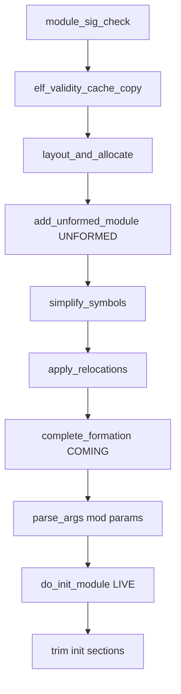
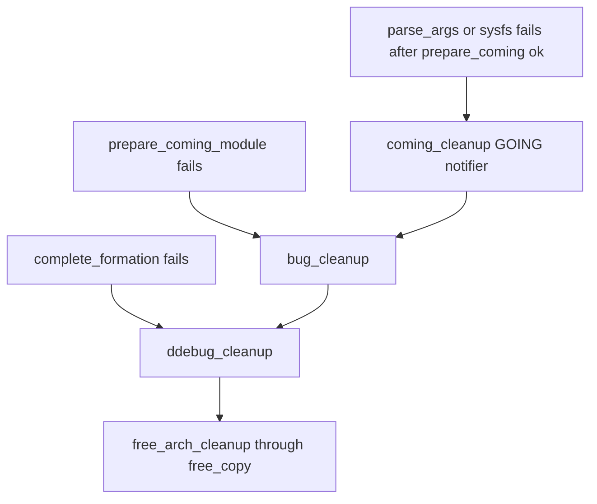

# 第15章 モジュールローダ

> 本章で読むソース
>
> - [`include/linux/module.h` L311-L316](https://github.com/gregkh/linux/blob/v6.18.38/include/linux/module.h#L311-L316)
> - [`kernel/module/main.c` L182-L191](https://github.com/gregkh/linux/blob/v6.18.38/kernel/module/main.c#L182-L191)
> - [`kernel/module/signing.c` L70-L125](https://github.com/gregkh/linux/blob/v6.18.38/kernel/module/signing.c#L70-L125)
> - [`kernel/module/main.c` L2367-L2395](https://github.com/gregkh/linux/blob/v6.18.38/kernel/module/main.c#L2367-L2395)
> - [`kernel/module/main.c` L2883-L2928](https://github.com/gregkh/linux/blob/v6.18.38/kernel/module/main.c#L2883-L2928)
> - [`kernel/module/main.c` L1513-L1588](https://github.com/gregkh/linux/blob/v6.18.38/kernel/module/main.c#L1513-L1588)
> - [`kernel/module/main.c` L1591-L1630](https://github.com/gregkh/linux/blob/v6.18.38/kernel/module/main.c#L1591-L1630)
> - [`kernel/module/main.c` L3358-L3516](https://github.com/gregkh/linux/blob/v6.18.38/kernel/module/main.c#L3358-L3516)
> - [`kernel/module/main.c` L3017-L3064](https://github.com/gregkh/linux/blob/v6.18.38/kernel/module/main.c#L3017-L3064)
> - [`kernel/module/main.c` L776-L854](https://github.com/gregkh/linux/blob/v6.18.38/kernel/module/main.c#L776-L854)
> - [`kernel/module/main.c` L729-L757](https://github.com/gregkh/linux/blob/v6.18.38/kernel/module/main.c#L729-L757)
> - [`kernel/module/main.c` L3518-L3567](https://github.com/gregkh/linux/blob/v6.18.38/kernel/module/main.c#L3518-L3567)
> - [`kernel/module/main.c` L3570-L3591](https://github.com/gregkh/linux/blob/v6.18.38/kernel/module/main.c#L3570-L3591)

## この章の狙い

`init_module` と `finit_module` から `load_module` がどう ELF を検証し、メモリ配置とシンボル解決、リロケーションを経て `MODULE_STATE_LIVE` に至るかを追う。
`delete_module` によるアンロードと、`CONFIG_MODULE_SIG` 有効時の署名検証の概観も押さえる。

## 前提

[Kconfig と Kbuild](../part00-overview/02-kconfig-kbuild.md) で `CONFIG_MODULES` がビルド時にオブジェクトを除外する仕組みを知っていること。
[システムコールテーブルと SYSCALL_DEFINE](../part02-syscall/06-syscall-table-syscall-define.md) でシステムコール入口を読んだことがあると入口の位置づけが明確になる。

## MODULE_STATE と寿命

モジュールは `struct module` の `state` で寿命を表す。
`MODULE_STATE_UNFORMED` はリスト登録直後、`COMING` は形成完了から `module_init` 実行中、`LIVE` は初期化成功後、`GOING` はアンロード中である。

[`include/linux/module.h` L311-L316](https://github.com/gregkh/linux/blob/v6.18.38/include/linux/module.h#L311-L316)

```c
enum module_state {
	MODULE_STATE_LIVE,	/* Normal state. */
	MODULE_STATE_COMING,	/* Full formed, running module_init. */
	MODULE_STATE_GOING,	/* Going away. */
	MODULE_STATE_UNFORMED,	/* Still setting it up. */
};
```

`strong_try_module_get()` は参照取得の成否を返す。
`MODULE_STATE_UNFORMED` では `BUG_ON` で止める。
`MODULE_STATE_COMING` では `-EBUSY` を返し、初期化完了を待つ必要がある。
`MODULE_STATE_LIVE` では `try_module_get()` が成功すれば 0 を返す。
`MODULE_STATE_GOING` や参照が取れない場合は `try_module_get()` が失敗し `-ENOENT` になる。

[`kernel/module/main.c` L182-L191](https://github.com/gregkh/linux/blob/v6.18.38/kernel/module/main.c#L182-L191)

```c
static inline int strong_try_module_get(struct module *mod)
{
	BUG_ON(mod && mod->state == MODULE_STATE_UNFORMED);
	if (mod && mod->state == MODULE_STATE_COMING)
		return -EBUSY;
	if (try_module_get(mod))
		return 0;
	else
		return -ENOENT;
}
```

ロード失敗経路では `GOING` に落として notifier と後始末を走らせる。

## システムコール入口

ユーザー空間は `init_module`（バッファ渡し）か `finit_module`（fd 渡し）を呼ぶ。
いずれも `may_init_module()` で権限と `modules_disabled` を確認したあと `load_module()` へ入る。

[`kernel/module/main.c` L3570-L3591](https://github.com/gregkh/linux/blob/v6.18.38/kernel/module/main.c#L3570-L3591)

```c
SYSCALL_DEFINE3(init_module, void __user *, umod,
		unsigned long, len, const char __user *, uargs)
{
	int err;
	struct load_info info = { };

	err = may_init_module();
	if (err)
		return err;

	pr_debug("init_module: umod=%p, len=%lu, uargs=%p\n",
	       umod, len, uargs);

	err = copy_module_from_user(umod, len, &info);
	if (err) {
		mod_stat_inc(&failed_kreads);
		mod_stat_add_long(len, &invalid_kread_bytes);
		return err;
	}

	return load_module(&info, uargs, 0);
}
```

`finit_module` は同一 ELF に対する並行ロードを `idempotent_init_module()` で直列化し、重複 `vmalloc` を抑える（`CONFIG_MODULE_STATS` 有効時は統計も取る）。

## 署名検証の位置づけ

`CONFIG_MODULE_SIG` が有効なとき、ELF 本体の検証より先に `module_sig_check()` が走る。
末尾の `~Module signature appended~` マーカーを見つけたら署名長を `info->len` から削り、検証に通れば `info->sig_ok` を立てる。
署名が無い場合は `is_module_sig_enforced()` が真なら `-EKEYREJECTED`、そうでなければ `security_locked_down(LOCKDOWN_MODULE_SIGNATURE)` の結果で続行可否が決まる。

[`kernel/module/signing.c` L70-L125](https://github.com/gregkh/linux/blob/v6.18.38/kernel/module/signing.c#L70-L125)

```c
int module_sig_check(struct load_info *info, int flags)
{
	int err = -ENODATA;
	const unsigned long markerlen = sizeof(MODULE_SIG_STRING) - 1;
	const char *reason;
	const void *mod = info->hdr;
	bool mangled_module = flags & (MODULE_INIT_IGNORE_MODVERSIONS |
				       MODULE_INIT_IGNORE_VERMAGIC);
	// ... (中略) ...
	if (!mangled_module &&
	    info->len > markerlen &&
	    memcmp(mod + info->len - markerlen, MODULE_SIG_STRING, markerlen) == 0) {
		/* We truncate the module to discard the signature */
		info->len -= markerlen;
		err = mod_verify_sig(mod, info);
		if (!err) {
			info->sig_ok = true;
			return 0;
		}
	}
	// ... (中略) ...
	if (is_module_sig_enforced()) {
		pr_notice("Loading of %s is rejected\n", reason);
		return -EKEYREJECTED;
	}

	return security_locked_down(LOCKDOWN_MODULE_SIGNATURE);
}
```

`MODULE_INIT_IGNORE_MODVERSIONS` や `MODULE_INIT_IGNORE_VERMAGIC` が付いた「改変済み」モジュールは署名付きでも検証対象外になる。
署名は改変前のバイナリに対するものだからである。

## ELF 検証とレイアウト

`elf_validity_cache_copy()` はセクションヘッダ、セクション名、modinfo、シンボル表の各インデックスを順に検証し、一時コピー上の `struct module` プレースホルダを指す。

[`kernel/module/main.c` L2367-L2395](https://github.com/gregkh/linux/blob/v6.18.38/kernel/module/main.c#L2367-L2395)

```c
static int elf_validity_cache_copy(struct load_info *info, int flags)
{
	int err;

	err = elf_validity_cache_sechdrs(info);
	if (err < 0)
		return err;
	err = elf_validity_cache_secstrings(info);
	if (err < 0)
		return err;
	err = elf_validity_cache_index(info, flags);
	if (err < 0)
		return err;
	err = elf_validity_cache_strtab(info);
	if (err < 0)
		return err;

	/* This is temporary: point mod into copy of data. */
	info->mod = (void *)info->hdr + info->sechdrs[info->index.mod].sh_offset;

	/*
	 * If we didn't load the .modinfo 'name' field earlier, fall back to
	 * on-disk struct mod 'name' field.
	 */
	if (!info->name)
		info->name = info->mod->name;

	return 0;
}
```

検証通過後、`layout_and_allocate()` がセクション配置を計算し `move_module()` で最終配置先へコピーする。
per-CPU セクションはここでは `SHF_ALLOC` を外し、後段の `percpu_modcopy()` で各 CPU へ複製する。

[`kernel/module/main.c` L2883-L2928](https://github.com/gregkh/linux/blob/v6.18.38/kernel/module/main.c#L2883-L2928)

```c
static struct module *layout_and_allocate(struct load_info *info, int flags)
{
	struct module *mod;
	int err;

	/* Allow arches to frob section contents and sizes.  */
	err = module_frob_arch_sections(info->hdr, info->sechdrs,
					info->secstrings, info->mod);
	if (err < 0)
		return ERR_PTR(err);

	err = module_enforce_rwx_sections(info->hdr, info->sechdrs,
					  info->secstrings, info->mod);
	if (err < 0)
		return ERR_PTR(err);

	/* We will do a special allocation for per-cpu sections later. */
	info->sechdrs[info->index.pcpu].sh_flags &= ~(unsigned long)SHF_ALLOC;

	// ... (中略) ...
	layout_sections(info->mod, info);
	layout_symtab(info->mod, info);

	/* Allocate and move to the final place */
	err = move_module(info->mod, info);
	if (err)
		return ERR_PTR(err);

	/* Module has been copied to its final place now: return it. */
	mod = (void *)info->sechdrs[info->index.mod].sh_addr;
	kmemleak_load_module(mod, info);
	codetag_module_replaced(info->mod, mod);

	return mod;
}
```

## シンボル解決とリロケーション

`simplify_symbols()` は未定義シンボル（`SHN_UNDEF`）をカーネルまたは他モジュールから `resolve_symbol_wait()` で引き、定義済みシンボルはセクション基址を `st_value` に加算する。
GPL 限定シンボルは `find_symbol()` 側で `fsa->gplok` が偽なら解決されない。

[`kernel/module/main.c` L1513-L1588](https://github.com/gregkh/linux/blob/v6.18.38/kernel/module/main.c#L1513-L1588)

```c
static int simplify_symbols(struct module *mod, const struct load_info *info)
{
	Elf_Shdr *symsec = &info->sechdrs[info->index.sym];
	Elf_Sym *sym = (void *)symsec->sh_addr;
	unsigned long secbase;
	unsigned int i;
	int ret = 0;
	const struct kernel_symbol *ksym;

	for (i = 1; i < symsec->sh_size / sizeof(Elf_Sym); i++) {
		const char *name = info->strtab + sym[i].st_name;

		switch (sym[i].st_shndx) {
		// ... (中略) ...
		case SHN_UNDEF:
			ksym = resolve_symbol_wait(mod, info, name);
			/* Ok if resolved.  */
			if (ksym && !IS_ERR(ksym)) {
				sym[i].st_value = kernel_symbol_value(ksym);
				break;
			}

			/* Ok if weak or ignored.  */
			if (!ksym &&
			    (ELF_ST_BIND(sym[i].st_info) == STB_WEAK ||
			     ignore_undef_symbol(info->hdr->e_machine, name)))
				break;

			ret = PTR_ERR(ksym) ?: -ENOENT;
			pr_warn("%s: Unknown symbol %s (err %d)\n",
				mod->name, name, ret);
			break;
		// ... (中略) ...
		}
	}

	return ret;
}
```

`apply_relocations()` は `SHT_REL` と `SHT_RELA` を走査し、`SHF_RELA_LIVEPATCH` 付きセクションだけ `klp_apply_section_relocs()` に委譲する。
通常セクションは `apply_relocate` か `apply_relocate_add` へ入る。

[`kernel/module/main.c` L1591-L1630](https://github.com/gregkh/linux/blob/v6.18.38/kernel/module/main.c#L1591-L1630)

```c
static int apply_relocations(struct module *mod, const struct load_info *info)
{
	unsigned int i;
	int err = 0;

	/* Now do relocations. */
	for (i = 1; i < info->hdr->e_shnum; i++) {
		unsigned int infosec = info->sechdrs[i].sh_info;

		/* Not a valid relocation section? */
		if (infosec >= info->hdr->e_shnum)
			continue;

		// ... (中略) ...
		if (info->sechdrs[i].sh_flags & SHF_RELA_LIVEPATCH)
			err = klp_apply_section_relocs(mod, info->sechdrs,
						       info->secstrings,
						       info->strtab,
						       info->index.sym, i,
						       NULL);
		else if (info->sechdrs[i].sh_type == SHT_REL)
			err = apply_relocate(info->sechdrs, info->strtab,
					     info->index.sym, i, mod);
		else if (info->sechdrs[i].sh_type == SHT_RELA)
			err = apply_relocate_add(info->sechdrs, info->strtab,
						 info->index.sym, i, mod);
		if (err < 0)
			break;
	}
	return err;
}
```

livepatch 本体の適用と置換は `kernel/livepatch/` が担う。
本章はローダが livepatch 用リロケーションセクションを分岐する境界までとし、パッチ適用の詳細は別途扱う。

## load_module の処理の流れ

`load_module()` は署名、ELF 検証、`layout_and_allocate`、`add_unformed_module`（`UNFORMED`）、シンボル解決、リロケーション、`complete_formation`（`COMING`）、モジュール引数の `parse_args`、sysfs 登録の順で進み、成功時は `do_init_module()` を呼ぶ。



[`kernel/module/main.c` L3358-L3516](https://github.com/gregkh/linux/blob/v6.18.38/kernel/module/main.c#L3358-L3516)

```c
static int load_module(struct load_info *info, const char __user *uargs,
		       int flags)
{
	struct module *mod;
	bool module_allocated = false;
	long err = 0;
	char *after_dashes;

	err = module_sig_check(info, flags);
	if (err)
		goto free_copy;

	err = elf_validity_cache_copy(info, flags);
	if (err)
		goto free_copy;

	err = early_mod_check(info, flags);
	if (err)
		goto free_copy;

	mod = layout_and_allocate(info, flags);
	if (IS_ERR(mod)) {
		err = PTR_ERR(mod);
		goto free_copy;
	}

	module_allocated = true;
	// ... (中略) ...
	err = simplify_symbols(mod, info);
	if (err < 0)
		goto free_modinfo;

	err = apply_relocations(mod, info);
	if (err < 0)
		goto free_modinfo;
	// ... (中略) ...
	err = complete_formation(mod, info);
	if (err)
		goto ddebug_cleanup;

	err = prepare_coming_module(mod);
	if (err)
		goto bug_cleanup;
	// ... (中略) ...
	return do_init_module(mod);
```

## load_module 失敗時の巻き戻し

失敗位置で入るクリーンアップラベルが異なる。
`complete_formation` の失敗は `ddebug_cleanup` へ直行し、`ftrace_release_mod` と RCU 同期から解放する。
`prepare_coming_module` の失敗は `bug_cleanup` へ入り、`module_bug_cleanup` を実行してから `ddebug_cleanup` へ落ちる。
`prepare_coming_module` 成功後の `parse_args` や `mod_sysfs_setup` の失敗は `coming_cleanup` から入り、`MODULE_STATE_GOING` の notifier と `module_destroy_params`、`klp_module_going` を走らせてから `bug_cleanup` へ続く。



[`kernel/module/main.c` L3518-L3567](https://github.com/gregkh/linux/blob/v6.18.38/kernel/module/main.c#L3518-L3567)

```c
 sysfs_cleanup:
	mod_sysfs_teardown(mod);
 coming_cleanup:
	mod->state = MODULE_STATE_GOING;
	module_destroy_params(mod->kp, mod->num_kp);
	blocking_notifier_call_chain(&module_notify_list,
				     MODULE_STATE_GOING, mod);
	klp_module_going(mod);
 bug_cleanup:
	mod->state = MODULE_STATE_GOING;
	/* module_bug_cleanup needs module_mutex protection */
	mutex_lock(&module_mutex);
	module_bug_cleanup(mod);
	mutex_unlock(&module_mutex);

 ddebug_cleanup:
	ftrace_release_mod(mod);
	synchronize_rcu();
	kfree(mod->args);
 free_arch_cleanup:
	module_arch_cleanup(mod);
 free_modinfo:
	free_modinfo(mod);
 free_unload:
	module_unload_free(mod);
 unlink_mod:
	mutex_lock(&module_mutex);
	/* Unlink carefully: kallsyms could be walking list. */
	list_del_rcu(&mod->list);
	mod_tree_remove(mod);
	wake_up_all(&module_wq);
	/* Wait for RCU-sched synchronizing before releasing mod->list. */
	synchronize_rcu();
	mutex_unlock(&module_mutex);
 free_module:
	mod_stat_bump_invalid(info, flags);
	module_memory_restore_rox(mod);
	module_deallocate(mod, info);
 free_copy:
	/*
	 * The info->len is always set. We distinguish between
	 * failures once the proper module was allocated and
	 * before that.
	 */
	if (!module_allocated) {
		audit_log_kern_module(info->name ? info->name : "?");
		mod_stat_bump_becoming(info, flags);
	}
	free_copy(info, flags);
	return err;
}
```

`unlink_mod` でモジュールリストから外し、RCU 待ちのあと `module_deallocate` と `free_copy` でメモリを返す。

## 初期化と init セクション解放

`do_init_module()` は `mod->init` を `do_one_initcall()` で実行し、成功すれば `MODULE_STATE_LIVE` に遷移する。
続けて init テキストと init データを解放し、コア kallsyms へ切り替える。

[`kernel/module/main.c` L3017-L3064](https://github.com/gregkh/linux/blob/v6.18.38/kernel/module/main.c#L3017-L3064)

```c
static noinline int do_init_module(struct module *mod)
{
	int ret = 0;
	struct mod_initfree *freeinit;
	// ... (中略) ...
	do_mod_ctors(mod);
	/* Start the module */
	if (mod->init != NULL)
		ret = do_one_initcall(mod->init);
	if (ret < 0) {
		goto fail_free_freeinit;
	}
	// ... (中略) ...

	/* Now it's a first class citizen! */
	mod->state = MODULE_STATE_LIVE;
	blocking_notifier_call_chain(&module_notify_list,
				     MODULE_STATE_LIVE, mod);

	/* Delay uevent until module has finished its init routine */
	kobject_uevent(&mod->mkobj.kobj, KOBJ_ADD);
	// ... (中略) ...
```

`init` セクションをロード直後に捨てることで、実行後のコード領域を常駐カーネルから外し、テキストキャッシュとメモリ占有を減らす。

## delete_module とアンロード

`delete_module` は `CAP_SYS_MODULE` と `module_mutex` の下で対象を探す。
`source_list` が空でない（他モジュールが依存）なら `-EWOULDBLOCK` を返す。
`state` が `LIVE` でないときは `-EBUSY` である。
参照カウントは `try_release_module_ref()` が `MODULE_REF_BASE` を引き、0 でなければモジュールはまだ使われている。
`try_stop_module()` は参照が残ると `-EWOULDBLOCK` を返す。
`CONFIG_MODULE_FORCE_UNLOAD` が有効で flags に `O_TRUNC` が付いているときだけ `try_force_unload()` が真を返し、`TAINT_FORCED_RMMOD` を付けて強制アンロードに進む。
成功時は `MODULE_STATE_GOING` へ遷移する。

[`kernel/module/main.c` L729-L757](https://github.com/gregkh/linux/blob/v6.18.38/kernel/module/main.c#L729-L757)

```c
static int try_release_module_ref(struct module *mod)
{
	int ret;

	/* Try to decrement refcnt which we set at loading */
	ret = atomic_sub_return(MODULE_REF_BASE, &mod->refcnt);
	BUG_ON(ret < 0);
	if (ret)
		/* Someone can put this right now, recover with checking */
		ret = atomic_add_unless(&mod->refcnt, MODULE_REF_BASE, 0);

	return ret;
}

static int try_stop_module(struct module *mod, int flags, int *forced)
{
	/* If it's not unused, quit unless we're forcing. */
	if (try_release_module_ref(mod) != 0) {
		*forced = try_force_unload(flags);
		if (!(*forced))
			return -EWOULDBLOCK;
	}

	/* Mark it as dying. */
	mod->state = MODULE_STATE_GOING;

	return 0;
}
```

[`kernel/module/main.c` L776-L854](https://github.com/gregkh/linux/blob/v6.18.38/kernel/module/main.c#L776-L854)

```c
SYSCALL_DEFINE2(delete_module, const char __user *, name_user,
		unsigned int, flags)
{
	struct module *mod;
	char name[MODULE_NAME_LEN];
	char buf[MODULE_FLAGS_BUF_SIZE];
	int ret, len, forced = 0;

	if (!capable(CAP_SYS_MODULE) || modules_disabled)
		return -EPERM;
	// ... (中略) ...
	if (!list_empty(&mod->source_list)) {
		/* Other modules depend on us: get rid of them first. */
		ret = -EWOULDBLOCK;
		goto out;
	}

	/* Doing init or already dying? */
	if (mod->state != MODULE_STATE_LIVE) {
		/* FIXME: if (force), slam module count damn the torpedoes */
		pr_debug("%s already dying\n", mod->name);
		ret = -EBUSY;
		goto out;
	}
	// ... (中略) ...
	ret = try_stop_module(mod, flags, &forced);
	if (ret != 0)
		goto out;

	mutex_unlock(&module_mutex);
	/* Final destruction now no one is using it. */
	if (mod->exit != NULL)
		mod->exit();
	blocking_notifier_call_chain(&module_notify_list,
				     MODULE_STATE_GOING, mod);
	// ... (中略) ...
	free_module(mod);
	// ... (中略) ...
}
```

`init` だけあり `exit` が無いモジュールは、デフォルトでは `-EBUSY` になる。
`CONFIG_MODULE_FORCE_UNLOAD` 有効時に flags の `O_TRUNC` が立っているときだけ `try_force_unload()` が通り、`TAINT_FORCED_RMMOD` が付く。

## 高速化と最適化の工夫

`COPY_CHUNK_SIZE`（16 ページ）単位の `copy_chunked_from_user()` は、巨大モジュールのユーザー空間コピー中に `cond_resched()` を挟み、ロード専有時間を分割する。
`finit_module` の idempotent ハッシュは同一 cookie の並行ロードを1本にまとめ、重複する `vmalloc` と ELF 検証コストを避ける。
init セクション解放と `flush_module_icache()` の順序は、実行可能領域を最小化しつつ I-cache 一貫性を保つ。

> **7.x 系での変化**
> [`kernel/module/main.c`](https://github.com/gregkh/linux/blob/v7.1.3/kernel/module/main.c) は v6.18.38 の 3,913 行に対し v7.1.3 は 3,988 行（差分 +143/-68）である。
> [`find_symbol()`](https://github.com/gregkh/linux/blob/v7.1.3/kernel/module/main.c#L390-L420) は GPL 専用テーブルと通常テーブルの二重走査から、単一 `__ksymtab` と `__kflagstab` による走査へ統合されている。
> シンボル解決の入口は同じだが、GPL 判定は `KSYM_FLAG_GPL_ONLY` フラグ参照に変わる。
> `load_module()` の大枠（署名、ELF 検証、配置、リロケーション、`do_init_module`）は維持されている。

## まとめ

モジュールロードは `module_sig_check`、ELF 検証、配置、シンボル解決、リロケーション、`MODULE_STATE` 遷移の直列パイプラインである。
`CONFIG_MODULES` が無効なカーネルではこの経路自体が存在しない。
livepatch 用リロケーションはローダ内で分岐するが、パッチエンジン本体は `kernel/livepatch/` にある。

## 関連する章

- [Kconfig と Kbuild](../part00-overview/02-kconfig-kbuild.md)
- [システムコールテーブルと SYSCALL_DEFINE](../part02-syscall/06-syscall-table-syscall-define.md)
- [kobject と sysfs](../part04-infra/13-kobject-sysfs.md)
- [printk](../part04-infra/14-printk.md)
