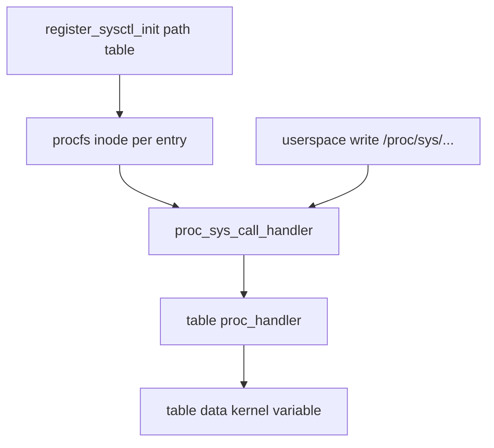

# 第16章 sysctl とカーネルパラメータ

> 本章で読むソース
>
> - [`include/linux/init.h` L331-L354](https://github.com/gregkh/linux/blob/v6.18.38/include/linux/init.h#L331-L354)
> - [`init/main.c` L761-L780](https://github.com/gregkh/linux/blob/v6.18.38/init/main.c#L761-L780)
> - [`init/main.c` L944-L951](https://github.com/gregkh/linux/blob/v6.18.38/init/main.c#L944-L951)
> - [`kernel/params.c` L117-L212](https://github.com/gregkh/linux/blob/v6.18.38/kernel/params.c#L117-L212)
> - [`kernel/sysctl.c` L1457-L1508](https://github.com/gregkh/linux/blob/v6.18.38/kernel/sysctl.c#L1457-L1508)
> - [`kernel/sysctl.c` L672-L676](https://github.com/gregkh/linux/blob/v6.18.38/kernel/sysctl.c#L672-L676)
> - [`fs/proc/proc_sysctl.c` L1462-L1472](https://github.com/gregkh/linux/blob/v6.18.38/fs/proc/proc_sysctl.c#L1462-L1472)
> - [`fs/proc/proc_sysctl.c` L553-L617](https://github.com/gregkh/linux/blob/v6.18.38/fs/proc/proc_sysctl.c#L553-L617)
> - [`fs/proc/proc_sysctl.c` L1615-L1638](https://github.com/gregkh/linux/blob/v6.18.38/fs/proc/proc_sysctl.c#L1615-L1638)
> - [`fs/proc/proc_sysctl.c` L1587-L1593](https://github.com/gregkh/linux/blob/v6.18.38/fs/proc/proc_sysctl.c#L1587-L1593)
> - [`init/main.c` L265](https://github.com/gregkh/linux/blob/v6.18.38/init/main.c#L265)
> - [`fs/proc/proc_sysctl.c` L1710-L1726](https://github.com/gregkh/linux/blob/v6.18.38/fs/proc/proc_sysctl.c#L1710-L1726)

## この章の狙い

ブート時のコマンドラインが `early_param` と `__setup`、共通の `parse_args()` でどう処理されるかを押さえる。
実行時の sysctl は `ctl_table` 登録、`proc_handler`、procfs 経由の読み書きへつながる。
[Kconfig と Kbuild](../part00-overview/02-kconfig-kbuild.md) のビルド時設定との違いも区別する。

## 前提

[Kconfig と Kbuild](../part00-overview/02-kconfig-kbuild.md) で `.config` がコンパイル時に `#ifdef` へ落ちる流れを読んでいること。
[kobject と sysfs](../part04-infra/13-kobject-sysfs.md) で sysfs 属性の登録を知っていると、sysctl ノードとの役割分担が分かりやすい。

## Kconfig とカーネルパラメータの違い

Kconfig は `make menuconfig` などで `.config` を生成し、ビルドがオブジェクトやデフォルト値を決める。
**ブートパラメータ**（`early_param` と `__setup`）は起動時のコマンドラインから一度だけカーネル変数や初期化を変える。
書込権限付きの `module_param` と `core_param` は、モジュールロード時の引数と sysfs 経由で実行時に値を変えられる。
**sysctl** は `/proc/sys` 以下で、登録済み `ctl_table` を procfs 経由で読み書きする実行時インタフェースである。

四者は対象が重なることがある（例: ログレベルは実行時 sysctl、起動時の `loglevel=` は `early_param`、Kconfig 既定値が別経路で効く）が、変更できるタイミングと経路が異なる。
[Kconfig と Kbuild](../part00-overview/02-kconfig-kbuild.md) はビルド時に機能の有無を決め、ブートパラメータは起動時、sysctl は実行時に変数値を変える点で対照的である。

## early_param と __setup の登録

`__setup_param` マクロは `.init.setup` セクションに `obs_kernel_param` を置く。
`early` フィールドが 1 なら `early_param`、0 なら通常の `__setup` である。

[`include/linux/init.h` L331-L354](https://github.com/gregkh/linux/blob/v6.18.38/include/linux/init.h#L331-L354)

```c
#define __setup_param(str, unique_id, fn, early)			\
	static const char __setup_str_##unique_id[] __initconst		\
		__aligned(1) = str; 					\
	static struct obs_kernel_param __setup_##unique_id		\
		__used __section(".init.setup")				\
		__aligned(__alignof__(struct obs_kernel_param))		\
		= { __setup_str_##unique_id, fn, early }

#define __setup(str, fn)						\
	__setup_param(str, fn, fn, 0)

#define early_param(str, fn)						\
	__setup_param(str, fn, fn, 1)
```

`__setup` のハンドラは「処理した」なら非ゼロを返す。
`early_param` も同じ `obs_kernel_param::setup_func`（`int (*)(char *)`）に登録されるが、戻り値の解釈が異なる。
`early_param` は 0 が成功、通常の `__setup` は非ゼロが handled である。

## ブート時の parse_args 経路

`parse_early_options()` は `boot_command_line` を `parse_args()` に渡し、未知のキーは `do_early_param` が受ける。
`do_early_param` は `.init.setup` を走査し、`p->early` が真で名前が一致したエントリだけ `setup_func` を呼ぶ。

[`init/main.c` L761-L780](https://github.com/gregkh/linux/blob/v6.18.38/init/main.c#L761-L780)

```c
static int __init do_early_param(char *param, char *val,
				 const char *unused, void *arg)
{
	const struct obs_kernel_param *p;

	for (p = __setup_start; p < __setup_end; p++) {
		if (p->early && parameq(param, p->str)) {
			if (p->setup_func(val) != 0)
				pr_warn("Malformed early option '%s'\n", param);
		}
	}
	/* We accept everything at this stage. */
	return 0;
}

void __init parse_early_options(char *cmdline)
{
	parse_args("early options", cmdline, NULL, 0, 0, 0, NULL,
		   do_early_param);
}
```

通常の `__setup` と `kernel_param` 表は、`start_kernel()` がアーキテクチャ初期化のあとに処理される。
`parse_early_param()` の直後に `parse_args("Booting kernel", ... __start___param ..., unknown_bootoption)` が走り、ビルトインの `kernel_param` と通常の `__setup` を処理する。

[`init/main.c` L944-L951](https://github.com/gregkh/linux/blob/v6.18.38/init/main.c#L944-L951)

```c
	pr_notice("Kernel command line: %s\n", saved_command_line);
	/* parameters may set static keys */
	parse_early_param();
	after_dashes = parse_args("Booting kernel",
				  static_command_line, __start___param,
				  __stop___param - __start___param,
				  -1, -1, NULL, &unknown_bootoption);
```

`early_param` は通常の `parse_args` より前に走るため、後段のパーサが使えない段階で必要な設定を扱える。
個々の early ハンドラが安全かどうかは実装依存であり、「early なら常に安全」とは言えない。

## parse_args と parse_one

`parse_args()` は `foo=bar baz=qux` のように空白で区切られた引数を `next_arg()` で取り出す。
カンマは値の一部として残り得る（ソースコメントの `foo=bar,bar2 baz=fuz` がその例である）。
登録済み `kernel_param` 表か `handle_unknown` へ渡す。
モジュールロード時も `load_module()` 末尾でモジュール固有の `mod->kp` に対して同関数が使われる。

[`kernel/params.c` L117-L212](https://github.com/gregkh/linux/blob/v6.18.38/kernel/params.c#L117-L212)

```c
static int parse_one(char *param,
		     char *val,
		     const char *doing,
		     const struct kernel_param *params,
		     unsigned num_params,
		     s16 min_level,
		     s16 max_level,
		     void *arg, parse_unknown_fn handle_unknown)
{
	unsigned int i;
	int err;

	/* Find parameter */
	for (i = 0; i < num_params; i++) {
		if (parameq(param, params[i].name)) {
			if (params[i].level < min_level
			    || params[i].level > max_level)
				return 0;
			// ... (中略) ...
			if (param_check_unsafe(&params[i]))
				err = params[i].ops->set(val, &params[i]);
			else
				err = -EPERM;
			kernel_param_unlock(params[i].mod);
			return err;
		}
	}

	if (handle_unknown) {
		pr_debug("doing %s: %s='%s'\n", doing, param, val);
		return handle_unknown(param, val, doing, arg);
	}

	pr_debug("Unknown argument '%s'\n", param);
	return -ENOENT;
}

char *parse_args(const char *doing,
		 char *args,
		 const struct kernel_param *params,
		 unsigned num,
		 s16 min_level,
		 s16 max_level,
		 void *arg, parse_unknown_fn unknown)
{
	char *param, *val, *err = NULL;

	/* Chew leading spaces */
	args = skip_spaces(args);
	// ... (中略) ...
	while (*args) {
		int ret;
		int irq_was_disabled;

		args = next_arg(args, &param, &val);
		/* Stop at -- */
		if (!val && strcmp(param, "--") == 0)
			return err ?: args;
		// ... (中略) ...
		ret = parse_one(param, val, doing, params, num,
				min_level, max_level, arg, unknown);
		// ... (中略) ...
	}

	return err;
}
```

`KERNEL_PARAM_FL_HWPARAM` や `security_locked_down(LOCKDOWN_MODULE_PARAMETERS)` は、危険なパラメータ書き込みをブロックする。

## ctl_table 登録

各サブシステムは `ctl_table` 配列を定義し、`register_sysctl_init()` で `/proc/sys` 以下のパスにぶら下げる。
`sysctl_init_bases()` はコアの `kernel` サブツリー根を登録する。

[`kernel/sysctl.c` L1457-L1508](https://github.com/gregkh/linux/blob/v6.18.38/kernel/sysctl.c#L1457-L1508)

```c
static const struct ctl_table sysctl_subsys_table[] = {
#ifdef CONFIG_PROC_SYSCTL
	{
		.procname	= "sysctl_writes_strict",
		.data		= &sysctl_writes_strict,
		.maxlen		= sizeof(int),
		.mode		= 0644,
		.proc_handler	= proc_dointvec_minmax,
		.extra1		= SYSCTL_NEG_ONE,
		.extra2		= SYSCTL_ONE,
	},
#endif
	{
		.procname	= "ngroups_max",
		.data		= (void *)&ngroups_max,
		.maxlen		= sizeof (int),
		.mode		= 0444,
		.proc_handler	= proc_dointvec,
	},
	// ... (中略) ...
};

int __init sysctl_init_bases(void)
{
	register_sysctl_init("kernel", sysctl_subsys_table);

	return 0;
}
```

`CONFIG_SYSCTL` が無効なビルドではこの登録と proc ノード自体が存在しない。

[`fs/proc/proc_sysctl.c` L1462-L1472](https://github.com/gregkh/linux/blob/v6.18.38/fs/proc/proc_sysctl.c#L1462-L1472)

```c
void __init __register_sysctl_init(const char *path, const struct ctl_table *table,
				 const char *table_name, size_t table_size)
{
	struct ctl_table_header *hdr = register_sysctl_sz(path, table, table_size);

	if (unlikely(!hdr)) {
		pr_err("failed when register_sysctl_sz %s to %s\n", table_name, path);
		return;
	}
	kmemleak_not_leak(hdr);
}
```

## proc_handler と procfs 接続

ユーザー空間が `/proc/sys/kernel/...` を read/write すると、`proc_sys_call_handler()` が `table->proc_handler` を呼ぶ。
典型例の `proc_dointvec` は内部の `do_proc_dointvec()` でカーネル変数 `table->data` と ASCII バッファを変換する。

[`kernel/sysctl.c` L672-L676](https://github.com/gregkh/linux/blob/v6.18.38/kernel/sysctl.c#L672-L676)

```c
int proc_dointvec(const struct ctl_table *table, int write, void *buffer,
		  size_t *lenp, loff_t *ppos)
{
	return do_proc_dointvec(table, write, buffer, lenp, ppos, NULL, NULL);
}
```

[`fs/proc/proc_sysctl.c` L553-L617](https://github.com/gregkh/linux/blob/v6.18.38/fs/proc/proc_sysctl.c#L553-L617)

```c
static ssize_t proc_sys_call_handler(struct kiocb *iocb, struct iov_iter *iter,
		int write)
{
	struct inode *inode = file_inode(iocb->ki_filp);
	struct ctl_table_header *head = grab_header(inode);
	const struct ctl_table *table = PROC_I(inode)->sysctl_entry;
	size_t count = iov_iter_count(iter);
	char *kbuf;
	ssize_t error;

	if (IS_ERR(head))
		return PTR_ERR(head);

	error = -EPERM;
	if (sysctl_perm(head, table, write ? MAY_WRITE : MAY_READ))
		goto out;

	error = -EINVAL;
	if (!table->proc_handler)
		goto out;
	// ... (中略) ...
	error = table->proc_handler(table, write, kbuf, &count, &iocb->ki_pos);
	// ... (中略) ...
}
```

`sysctl_perm()` は `table->mode` と capability を照合し、読み取り専用エントリへの書き込みを拒否する。

## ブート引数からの sysctl 設定

`sysctl.` または `sysctl/` で始まるブート引数は、procfs が立ち上がったあと `do_sysctl_args()` が `process_sysctl_arg` 経由で proc ファイルへ書き込む。
`next_arg()` は空白で引数を分ける。
`sysctl.kernel.printk=4 4 1 7` のように引用符無しで書くと、値は `4` だけが第1引数に渡り残りは別トークンになる。
複数整数をまとめて渡すときは `sysctl.kernel.printk="4 4 1 7"` のように値を引用符で囲む。
空白を含まない単値なら `sysctl.kernel.hung_task_panic=1` のように書ける。

[`fs/proc/proc_sysctl.c` L1615-L1638](https://github.com/gregkh/linux/blob/v6.18.38/fs/proc/proc_sysctl.c#L1615-L1638)

```c
static int process_sysctl_arg(char *param, char *val,
			       const char *unused, void *arg)
{
	char *path;
	struct vfsmount **proc_mnt = arg;
	// ... (中略) ...

	if (strncmp(param, "sysctl", sizeof("sysctl") - 1) == 0) {
		param += sizeof("sysctl") - 1;

		if (param[0] != '/' && param[0] != '.')
			return 0;

		param++;
	} else {
		param = (char *) sysctl_find_alias(param);
		if (!param)
			return 0;
	}
```

[`fs/proc/proc_sysctl.c` L1710-L1726](https://github.com/gregkh/linux/blob/v6.18.38/fs/proc/proc_sysctl.c#L1710-L1726)

```c
void do_sysctl_args(void)
{
	char *command_line;
	struct vfsmount *proc_mnt = NULL;

	command_line = kstrdup(saved_command_line, GFP_KERNEL);
	if (!command_line)
		panic("%s: Failed to allocate copy of command line\n", __func__);

	parse_args("Setting sysctl args", command_line,
		   NULL, 0, -1, -1, &proc_mnt, process_sysctl_arg);

	if (proc_mnt)
		kern_unmount(proc_mnt);

	kfree(command_line);
}
```

`hung_task_panic=` は `sysctl_aliases` に登録された別名であり、`sysctl_find_alias` 経由で `kernel.hung_task_panic` へ解決される。
v6.18.38 の alias 表に載るのは次の4件だけである。

[`fs/proc/proc_sysctl.c` L1587-L1593](https://github.com/gregkh/linux/blob/v6.18.38/fs/proc/proc_sysctl.c#L1587-L1593)

```c
static const struct sysctl_alias sysctl_aliases[] = {
	{"hardlockup_all_cpu_backtrace",	"kernel.hardlockup_all_cpu_backtrace" },
	{"hung_task_panic",			"kernel.hung_task_panic" },
	{"numa_zonelist_order",			"vm.numa_zonelist_order" },
	{"softlockup_all_cpu_backtrace",	"kernel.softlockup_all_cpu_backtrace" },
	{ }
};
```

`loglevel=` はこの表に無い。
`init/main.c` の `early_param` として登録され、起動の `parse_early_param` 経路で処理される。

[`init/main.c` L265](https://github.com/gregkh/linux/blob/v6.18.38/init/main.c#L265)

```c
early_param("loglevel", loglevel);
```

## 処理の流れ（実行時 sysctl）



## 高速化と最適化の工夫

`ctl_table` は静的配列としてリンク時に置かれ、実行時はポインタ辿りだけで handler に到達する。
proc ハンドラはユーザーバッファを `kvzalloc` で一度に取り、`sysctl_writes_strict` が `SYSCTL_WRITES_STRICT` のときは file position 0 以外の数値 sysctl 書き込みを拒否する。
これにより部分書き込みによる不整合なカーネル変数を防ぎ、検証コストを handler 入口に集約する。

> **7.x 系での変化**
> [`kernel/params.c`](https://github.com/gregkh/linux/blob/v7.1.3/kernel/params.c) は v6.18.38 の 997 行に対し v7.1.3 は 996 行（差分 +4/-5）であり、`parse_args` と `early_param` の構造は実質同じである。
> [`kernel/sysctl.c`](https://github.com/gregkh/linux/blob/v7.1.3/kernel/sysctl.c) は 1,525 行から 1,438 行へ（差分 +382/-469）再編されている。
> v7.1.3 では `proc_handler` の `write` 引数が方向を表す `dir` に改名され、`SYSCTL_USER_TO_KERN(dir)` マクロで読み書きを判定する（[`proc_dostring`](https://github.com/gregkh/linux/blob/v7.1.3/kernel/sysctl.c#L186-L196) 参照）。
> 登録 API（`register_sysctl_init`）と `/proc/sys` 経由の流れは維持されている。

## まとめ

ブートパラメータは `early_param`（先行）と `__setup`、ビルトイン `kernel_param`（`start_kernel` 内の `parse_args`）が担う。
実行時 sysctl は `ctl_table` と `proc_handler` を procfs に公開する。
Kconfig はビルド時、ブートパラメータは起動時、sysctl は実行時に変数値を変える。

## 関連する章

- [Kconfig と Kbuild](../part00-overview/02-kconfig-kbuild.md)
- [printk](../part04-infra/14-printk.md)
- [モジュールローダ](15-module-loader.md)
- [kobject と sysfs](../part04-infra/13-kobject-sysfs.md)
