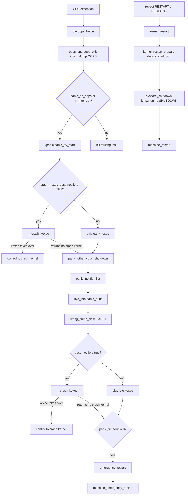

# 第17章 panic と reboot

> 本章で読むソース
>
> - [`arch/x86/kernel/dumpstack.c` L349-L398](https://github.com/gregkh/linux/blob/v6.18.38/arch/x86/kernel/dumpstack.c#L349-L398)
> - [`arch/x86/kernel/dumpstack.c` L453-L461](https://github.com/gregkh/linux/blob/v6.18.38/arch/x86/kernel/dumpstack.c#L453-L461)
> - [`kernel/panic.c` L429-L538](https://github.com/gregkh/linux/blob/v6.18.38/kernel/panic.c#L429-L538)
> - [`kernel/panic.c` L558-L583](https://github.com/gregkh/linux/blob/v6.18.38/kernel/panic.c#L558-L583)
> - [`kernel/panic.c` L622-L629](https://github.com/gregkh/linux/blob/v6.18.38/kernel/panic.c#L622-L629)
> - [`kernel/panic.c` L857-L863](https://github.com/gregkh/linux/blob/v6.18.38/kernel/panic.c#L857-L863)
> - [`kernel/reboot.c` L92-L106](https://github.com/gregkh/linux/blob/v6.18.38/kernel/reboot.c#L92-L106)
> - [`kernel/reboot.c` L720-L727](https://github.com/gregkh/linux/blob/v6.18.38/kernel/reboot.c#L720-L727)
> - [`kernel/reboot.c` L764-L796](https://github.com/gregkh/linux/blob/v6.18.38/kernel/reboot.c#L764-L796)
> - [`kernel/reboot.c` L287-L299](https://github.com/gregkh/linux/blob/v6.18.38/kernel/reboot.c#L287-L299)

## この章の狙い

カーネルバグや致命例外から `die` と oops 処理を経て `panic` に至る経路を追う。
`panic` 内の notifier、kmsg dump、他 CPU 停止、`emergency_restart` までを押さえる。
計画的な再起動である `kernel_restart` との違いも区別する。

## 前提

[printk](../part04-infra/14-printk.md) でリングバッファと `kmsg_dump` の位置づけを読んでいること。
[x86-64 ブートパス](../part01-boot/03-x86-64-boot-path.md) で `machine_restart` がアーキテクチャ依存であることを知っていると、再起動の最終段が分かりやすい。

## oops と die の入口

x86 では例外ハンドラが `die()` を呼ぶ。
`oops_begin()` がローカル IRQ を止め、`die_lock` で複数 CPU の同時 oops 出力を直列化する。
`oops_end()` は `oops_exit()` で kmsg dump を走らせ、条件を満たせば `panic()` へ進む。

[`arch/x86/kernel/dumpstack.c` L453-L461](https://github.com/gregkh/linux/blob/v6.18.38/arch/x86/kernel/dumpstack.c#L453-L461)

```c
void die(const char *str, struct pt_regs *regs, long err)
{
	unsigned long flags = oops_begin();
	int sig = SIGSEGV;

	if (__die(str, regs, err))
		sig = 0;
	oops_end(flags, regs, sig);
}
```

[`arch/x86/kernel/dumpstack.c` L375-L398](https://github.com/gregkh/linux/blob/v6.18.38/arch/x86/kernel/dumpstack.c#L375-L398)

```c
void oops_end(unsigned long flags, struct pt_regs *regs, int signr)
{
	if (regs && kexec_should_crash(current))
		crash_kexec(regs);

	bust_spinlocks(0);
	die_owner = -1;
	add_taint(TAINT_DIE, LOCKDEP_NOW_UNRELIABLE);
	die_nest_count--;
	if (!die_nest_count)
		/* Nest count reaches zero, release the lock. */
		arch_spin_unlock(&die_lock);
	raw_local_irq_restore(flags);
	oops_exit();

	/* Executive summary in case the oops scrolled away */
	__show_regs(&exec_summary_regs, SHOW_REGS_ALL, KERN_DEFAULT);

	if (!signr)
		return;
	if (in_interrupt())
		panic("Fatal exception in interrupt");
	if (panic_on_oops)
		panic("Fatal exception");
```

`panic_on_oops` はブート引数や sysctl で変えられる。
偽のときはタスクを `rewind_stack_and_make_dead()` で殺すだけで、システム全体は続行する。

[`kernel/panic.c` L857-L863](https://github.com/gregkh/linux/blob/v6.18.38/kernel/panic.c#L857-L863)

```c
void oops_exit(void)
{
	do_oops_enter_exit();
	print_oops_end_marker();
	nbcon_cpu_emergency_exit();
	kmsg_dump(KMSG_DUMP_OOPS);
}
```

oops 時のログは [printk](../part04-infra/14-printk.md) のリングバッファに残り、`kmsg_dump(KMSG_DUMP_OOPS)` で crash 保存や pstore へ渡る。

## panic の単一 CPU 実行

`panic()` は `vpanic()` を呼ぶ。
最初に `panic_try_start()` で `panic_cpu` を取った CPU だけが本処理に入り、他 CPU は `panic_smp_self_stop()` か `smp_send_stop()` で止まる。

[`kernel/panic.c` L429-L538](https://github.com/gregkh/linux/blob/v6.18.38/kernel/panic.c#L429-L538)

```c
void vpanic(const char *fmt, va_list args)
{
	static char buf[1024];
	long i, i_next = 0, len;
	int state = 0;
	bool _crash_kexec_post_notifiers = crash_kexec_post_notifiers;
	// ... (中略) ...
	local_irq_disable();
	preempt_disable_notrace();
	// ... (中略) ...
	if (panic_try_start()) {
		/* go ahead */
	} else if (panic_on_other_cpu())
		panic_smp_self_stop();

	console_verbose();
	bust_spinlocks(1);
	len = vscnprintf(buf, sizeof(buf), fmt, args);
	// ... (中略) ...
	pr_emerg("Kernel panic - not syncing: %s\n", buf);
	// ... (中略) ...
	if (!_crash_kexec_post_notifiers)
		__crash_kexec(NULL);

	panic_other_cpus_shutdown(_crash_kexec_post_notifiers);

	printk_legacy_allow_panic_sync();

	atomic_notifier_call_chain(&panic_notifier_list, 0, buf);

	sys_info(panic_print);

	kmsg_dump_desc(KMSG_DUMP_PANIC, buf);
	// ... (中略) ...
	if (_crash_kexec_post_notifiers)
		__crash_kexec(NULL);

	console_unblank();
```

`crash_kexec_post_notifiers` が偽（既定）のときは、他 CPU 停止の前に `__crash_kexec()` が走る。
crash kernel へ制御が移れば `vpanic` は戻らない。
`__crash_kexec` が何もせず戻った場合だけ `panic_other_cpus_shutdown` 以降（notifier、`kmsg_dump` 等）へ進む。
真のときは先行 kexec を省略し、`panic_other_cpus_shutdown`、panic notifier、`sys_info`、`kmsg_dump_desc(KMSG_DUMP_PANIC)` のあとで `__crash_kexec()` が呼ばれる。
この後段の呼び出しでも crash kernel へ制御が移れば戻らず、何もせず戻った場合だけ `panic_timeout` の判定へ進む。
ソースコメントが述べるとおり、後者は notifier がクラッシュしたカーネルを不安定化させ、kdump 失敗リスクを上げる代わりに、panic 情報を kdump より前に残せる。

## panic からの再起動

`panic_timeout` が正のとき、ビジーウェイトで待ってから `emergency_restart()` を呼ぶ。
`panic_reboot_mode` が定義されていれば `reboot_mode` を上書きする。

[`kernel/panic.c` L558-L583](https://github.com/gregkh/linux/blob/v6.18.38/kernel/panic.c#L558-L583)

```c
	if (panic_timeout > 0) {
		/*
		 * Delay timeout seconds before rebooting the machine.
		 * We can't use the "normal" timers since we just panicked.
		 */
		pr_emerg("Rebooting in %d seconds..\n", panic_timeout);

		for (i = 0; i < panic_timeout * 1000; i += PANIC_TIMER_STEP) {
			touch_nmi_watchdog();
			// ... (中略) ...
			mdelay(PANIC_TIMER_STEP);
		}
	}
	if (panic_timeout != 0) {
		/*
		 * This will not be a clean reboot, with everything
		 * shutting down.  But if there is a chance of
		 * rebooting the system it will be rebooted.
		 */
		if (panic_reboot_mode != REBOOT_UNDEFINED)
			reboot_mode = panic_reboot_mode;
		emergency_restart();
	}
```

公開 API の `panic()` は `vpanic()` への薄いラッパーである。

[`kernel/panic.c` L622-L629](https://github.com/gregkh/linux/blob/v6.18.38/kernel/panic.c#L622-L629)

```c
void panic(const char *fmt, ...)
{
	va_list args;

	va_start(args, fmt);
	vpanic(fmt, args);
	va_end(args);
}
```

## emergency_restart と kernel_restart

`emergency_restart()` は reboot notifier、`usermodehelper_disable`、`device_shutdown`、`kernel_restart_prepare` 相当の段階を省略し、`kmsg_dump(KMSG_DUMP_EMERG)` のあと `machine_emergency_restart()` へ入る。
割り込み文脈からも呼べる最後の手段である。

[`kernel/reboot.c` L92-L106](https://github.com/gregkh/linux/blob/v6.18.38/kernel/reboot.c#L92-L106)

```c
void emergency_restart(void)
{
	kmsg_dump(KMSG_DUMP_EMERG);
	system_state = SYSTEM_RESTART;
	machine_emergency_restart();
}
EXPORT_SYMBOL_GPL(emergency_restart);

void kernel_restart_prepare(char *cmd)
{
	blocking_notifier_call_chain(&reboot_notifier_list, SYS_RESTART, cmd);
	system_state = SYSTEM_RESTART;
	usermodehelper_disable();
	device_shutdown();
}
```

計画的な再起動は `kernel_restart()` が `kernel_restart_prepare()` で notifier とデバイス停止を済ませ、`syscore_shutdown()` と `kmsg_dump(KMSG_DUMP_SHUTDOWN)` を経て `machine_restart()` を呼ぶ。
`reboot(2)` のコメントは sync をしない旨を明記しており、`kernel_restart` もファイルシステムの sync を直接は行わない。

[`kernel/reboot.c` L720-L727](https://github.com/gregkh/linux/blob/v6.18.38/kernel/reboot.c#L720-L727)

```c
/*
 * Reboot system call: for obvious reasons only root may call it,
 * and even root needs to set up some magic numbers in the registers
 * so that some mistake won't make this reboot the whole machine.
 * You can also set the meaning of the ctrl-alt-del-key here.
 *
 * reboot doesn't sync: do that yourself before calling this.
 */
```

[`kernel/reboot.c` L764-L796](https://github.com/gregkh/linux/blob/v6.18.38/kernel/reboot.c#L764-L796)

```c
	mutex_lock(&system_transition_mutex);
	switch (cmd) {
	case LINUX_REBOOT_CMD_RESTART:
		kernel_restart(NULL);
		break;

	case LINUX_REBOOT_CMD_CAD_ON:
		C_A_D = 1;
		break;

	case LINUX_REBOOT_CMD_CAD_OFF:
		C_A_D = 0;
		break;

	case LINUX_REBOOT_CMD_HALT:
		kernel_halt();
		do_exit(0);

	case LINUX_REBOOT_CMD_POWER_OFF:
		kernel_power_off();
		do_exit(0);
		break;

	case LINUX_REBOOT_CMD_RESTART2:
		ret = strncpy_from_user(&buffer[0], arg, sizeof(buffer) - 1);
		if (ret < 0) {
			ret = -EFAULT;
			break;
		}
		buffer[sizeof(buffer) - 1] = '\0';

		kernel_restart(buffer);
		break;
```

`LINUX_REBOOT_CMD_RESTART` と `RESTART2` だけが `kernel_restart` へ入る。
`HALT` と `POWER_OFF` はそれぞれ `kernel_halt` と `kernel_power_off` である。
panic からの `emergency_restart` は上記の prepare 系を飛ばす点が対照的である。

[`kernel/reboot.c` L287-L299](https://github.com/gregkh/linux/blob/v6.18.38/kernel/reboot.c#L287-L299)

```c
void kernel_restart(char *cmd)
{
	kernel_restart_prepare(cmd);
	do_kernel_restart_prepare();
	migrate_to_reboot_cpu();
	syscore_shutdown();
	if (!cmd)
		pr_emerg("Restarting system\n");
	else
		pr_emerg("Restarting system with command '%s'\n", cmd);
	kmsg_dump(KMSG_DUMP_SHUTDOWN);
	machine_restart(cmd);
}
```

## 処理の流れ



## 高速化と最適化の工夫

panic 経路では通常のタイマーを使わず `mdelay(PANIC_TIMER_STEP)` で待つ。
タイマーサブシステムが壊れていても再起動カウントダウンが進む。
`console_flush_on_panic()` は `debug_locks_off()` のあとコンソールロックを best-effort で取り、リングバッファに残ったメッセージを物理コンソールへ追い出す。
oops 時点で既に printk に書かれた行は、panic 後の replay で失われない。

> **7.x 系での変化**
> [`kernel/panic.c`](https://github.com/gregkh/linux/blob/v7.1.3/kernel/panic.c) は v6.18.38 の 1,058 行に対し v7.1.3 は 1,263 行（差分 +242/-37）である。
> v7.1.3 では [`panic_force_cpu`](https://github.com/gregkh/linux/blob/v7.1.3/kernel/panic.c#L310-L330) ブートパラメータと `panic_try_force_cpu()` により、指定 CPU へ panic 処理をリダイレクトする経路が追加されている（`CONFIG_SMP` かつ `CONFIG_CRASH_DUMP` 時）。
> [`kernel/reboot.c`](https://github.com/gregkh/linux/blob/v7.1.3/kernel/reboot.c) は 1,419 行で差分 +1/-1 と実質同一であり、`emergency_restart` と `kernel_restart` の分岐は変わらない。

## まとめ

oops は診断出力と `TAINT_DIE` 付与が主で、`panic_on_oops` が偽ならプロセス単位で終わる。
`panic` は単一 CPU が、条件付きで先行または後段の `__crash_kexec`、他 CPU 停止、notifier、`kmsg_dump` を順に実行し、必要なら `emergency_restart` する。
`kernel_restart` は `reboot(2)` の RESTART 系コマンドから入り、notifier とデバイス停止を経て再起動する。

## 関連する章

- [printk](../part04-infra/14-printk.md)
- [x86-64 ブートパス](../part01-boot/03-x86-64-boot-path.md)
- [sysctl とカーネルパラメータ](16-sysctl-kernel-parameters.md)
