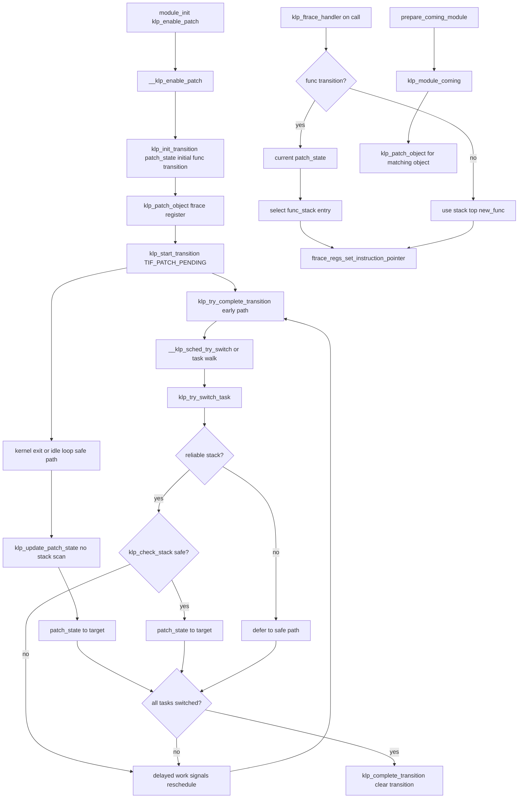

# 第18章 livepatch

> 本章で読むソース
>
> - [`include/linux/livepatch.h` L56-L78](https://github.com/gregkh/linux/blob/v6.18.38/include/linux/livepatch.h#L56-L78)
> - [`include/linux/livepatch.h` L117-L130](https://github.com/gregkh/linux/blob/v6.18.38/include/linux/livepatch.h#L117-L130)
> - [`include/linux/livepatch.h` L158-L173](https://github.com/gregkh/linux/blob/v6.18.38/include/linux/livepatch.h#L158-L173)
> - [`kernel/livepatch/core.c` L1040-L1093](https://github.com/gregkh/linux/blob/v6.18.38/kernel/livepatch/core.c#L1040-L1093)
> - [`kernel/livepatch/core.c` L1259-L1312](https://github.com/gregkh/linux/blob/v6.18.38/kernel/livepatch/core.c#L1259-L1312)
> - [`kernel/livepatch/patch.c` L40-L125](https://github.com/gregkh/linux/blob/v6.18.38/kernel/livepatch/patch.c#L40-L125)
> - [`kernel/livepatch/patch.c` L160-L221](https://github.com/gregkh/linux/blob/v6.18.38/kernel/livepatch/patch.c#L160-L221)
> - [`kernel/livepatch/transition.c` L175-L199](https://github.com/gregkh/linux/blob/v6.18.38/kernel/livepatch/transition.c#L175-L199)
> - [`kernel/livepatch/transition.c` L254-L298](https://github.com/gregkh/linux/blob/v6.18.38/kernel/livepatch/transition.c#L254-L298)
> - [`kernel/livepatch/transition.c` L509-L545](https://github.com/gregkh/linux/blob/v6.18.38/kernel/livepatch/transition.c#L509-L545)
> - [`kernel/livepatch/transition.c` L552-L619](https://github.com/gregkh/linux/blob/v6.18.38/kernel/livepatch/transition.c#L552-L619)
> - [`kernel/livepatch/shadow.c` L83-L101](https://github.com/gregkh/linux/blob/v6.18.38/kernel/livepatch/shadow.c#L83-L101)
> - [`kernel/module/main.c` L3284-L3300](https://github.com/gregkh/linux/blob/v6.18.38/kernel/module/main.c#L3284-L3300)

## この章の狙い

**livepatch**（カーネルライブパッチ）は、再起動なしでカーネル関数を置換する機構である。
`klp_patch`、`klp_object`、`klp_func` の階層構造、ftrace による命令ポインタの差し替え、タスクごとの遷移状態、shadow 変数の役割を、`kernel/livepatch/` の実装から追う。

## 前提

[モジュールローダ](15-module-loader.md) で `load_module` と `MODULE_STATE` を読んでいること。
パッチモジュールは通常のロード可能カーネルモジュールとして載り、`module_init` から `klp_enable_patch()` を呼ぶ。
ftrace のフィルタ登録や `ftrace_ops` の仕組み自体は、計画中の「BPF とトレーシング」分冊の担当とし、本章は livepatch が ftrace をどう使うかの境界だけ示す。

## パッチの3層構造

livepatch モジュールは静的に `struct klp_patch` を定義し、その中にパッチ対象オブジェクトと関数の配列を並べる。

**`klp_func`** は置換対象の関数名（`old_name`）、新実装（`new_func`）、内部で解決した `old_func` アドレスを持つ。
`patched` と `transition` の組み合わせで、関数が ftrace スタックに載っているか、遷移中かを表す。

[`include/linux/livepatch.h` L56-L78](https://github.com/gregkh/linux/blob/v6.18.38/include/linux/livepatch.h#L56-L78)

```c
struct klp_func {
	/* external */
	const char *old_name;
	void *new_func;
	// ... (中略) ...
	unsigned long old_sympos;

	/* internal */
	void *old_func;
	struct kobject kobj;
	struct list_head node;
	struct list_head stack_node;
	unsigned long old_size, new_size;
	bool nop;
	bool patched;
	bool transition;
};
```

**`klp_object`** は vmlinux（`name == NULL`）かモジュール名をキーに、複数の `klp_func` を束ねる。
`callbacks` でパッチ前後のフックを登録できる。

[`include/linux/livepatch.h` L117-L130](https://github.com/gregkh/linux/blob/v6.18.38/include/linux/livepatch.h#L117-L130)

```c
struct klp_object {
	/* external */
	const char *name;
	struct klp_func *funcs;
	struct klp_callbacks callbacks;

	/* internal */
	struct kobject kobj;
	struct list_head func_list;
	struct list_head node;
	struct module *mod;
	bool dynamic;
	bool patched;
};
```

**`klp_patch`** は livepatch モジュール本体への参照と、`objs` 配列、`replace` フラグ（既存パッチの置換）を持つ。
`enabled` はパッチが有効化されたが遷移が未完了の場合も真になりうる。

[`include/linux/livepatch.h` L158-L173](https://github.com/gregkh/linux/blob/v6.18.38/include/linux/livepatch.h#L158-L173)

```c
struct klp_patch {
	/* external */
	struct module *mod;
	struct klp_object *objs;
	struct klp_state *states;
	bool replace;

	/* internal */
	struct list_head list;
	struct kobject kobj;
	struct list_head obj_list;
	bool enabled;
	bool forced;
	struct work_struct free_work;
	struct completion finish;
};
```

## 有効化の入口

`klp_enable_patch()` は livepatch モジュールの `module_init` から呼ばれる公開 API である。
内部の `__klp_enable_patch()` が遷移の初期化、ftrace 登録、全タスクの切り替え試行までを一連で進める。

[`kernel/livepatch/core.c` L1040-L1093](https://github.com/gregkh/linux/blob/v6.18.38/kernel/livepatch/core.c#L1040-L1093)

```c
static int __klp_enable_patch(struct klp_patch *patch)
{
	struct klp_object *obj;
	int ret;

	if (klp_transition_patch)
		return -EBUSY;

	if (WARN_ON(patch->enabled))
		return -EINVAL;

	pr_notice("enabling patch '%s'\n", patch->mod->name);

	klp_init_transition(patch, KLP_TRANSITION_PATCHED);

	/*
	 * Enforce the order of the func->transition writes in
	 * klp_init_transition() and the ops->func_stack writes in
	 * klp_patch_object(), so that klp_ftrace_handler() will see the
	 * func->transition updates before the handler is registered and the
	 * new funcs become visible to the handler.
	 */
	smp_wmb();

	klp_for_each_object(patch, obj) {
		if (!klp_is_object_loaded(obj))
			continue;

		ret = klp_pre_patch_callback(obj);
		if (ret) {
			pr_warn("pre-patch callback failed for object '%s'\n",
				klp_is_module(obj) ? obj->name : "vmlinux");
			goto err;
		}

		ret = klp_patch_object(obj);
		if (ret) {
			pr_warn("failed to patch object '%s'\n",
				klp_is_module(obj) ? obj->name : "vmlinux");
			goto err;
		}
	}

	klp_start_transition();
	patch->enabled = true;
	klp_try_complete_transition();

	return 0;
err:
	pr_warn("failed to enable patch '%s'\n", patch->mod->name);

	klp_cancel_transition();
	return ret;
}
```

`klp_init_transition` で全タスクの `patch_state` を初期状態に揃え、各 `klp_func` の `transition` を真にする。
続く `klp_patch_object` が ftrace ハンドラを登録し、`klp_start_transition` が `TIF_PATCH_PENDING` を全タスクに立てる。

## ftrace による関数置換

livepatch はカーネルテキストを直接書き換えない。
`klp_patch_func()` が `ftrace_location()` で元関数のアドレスを特定し、`register_ftrace_function()` で `klp_ftrace_handler` を接続する。
同一 `old_func` への複数パッチは `klp_ops` の `func_stack` に積み、最新がスタック先頭になる。

[`kernel/livepatch/patch.c` L160-L221](https://github.com/gregkh/linux/blob/v6.18.38/kernel/livepatch/patch.c#L160-L221)

```c
static int klp_patch_func(struct klp_func *func)
{
	struct klp_ops *ops;
	int ret;

	if (WARN_ON(!func->old_func))
		return -EINVAL;

	if (WARN_ON(func->patched))
		return -EINVAL;

	ops = klp_find_ops(func->old_func);
	if (!ops) {
		unsigned long ftrace_loc;

		ftrace_loc = ftrace_location((unsigned long)func->old_func);
		if (!ftrace_loc) {
			pr_err("failed to find location for function '%s'\n",
				func->old_name);
			return -EINVAL;
		}

		ops = kzalloc(sizeof(*ops), GFP_KERNEL);
		if (!ops)
			return -ENOMEM;

		ops->fops.func = klp_ftrace_handler;
		ops->fops.flags = FTRACE_OPS_FL_DYNAMIC |
#ifndef CONFIG_HAVE_DYNAMIC_FTRACE_WITH_ARGS
				  FTRACE_OPS_FL_SAVE_REGS |
#endif
				  FTRACE_OPS_FL_IPMODIFY |
				  FTRACE_OPS_FL_PERMANENT;

		list_add(&ops->node, &klp_ops);

		INIT_LIST_HEAD(&ops->func_stack);
		list_add_rcu(&func->stack_node, &ops->func_stack);

		ret = ftrace_set_filter_ip(&ops->fops, ftrace_loc, 0, 0);
		// ... (中略) ...
		ret = register_ftrace_function(&ops->fops);
		// ... (中略) ...

	} else {
		list_add_rcu(&func->stack_node, &ops->func_stack);
	}

	func->patched = true;

	return 0;
	// ... (中略) ...
}
```

ハンドラは `func_stack` 先頭の `klp_func` を読み、遷移中なら `current->patch_state` に応じて旧版か新版を選ぶ。
最終的に `ftrace_regs_set_instruction_pointer` で命令ポインタを `new_func` へ向ける。

[`kernel/livepatch/patch.c` L40-L125](https://github.com/gregkh/linux/blob/v6.18.38/kernel/livepatch/patch.c#L40-L125)

```c
static void notrace klp_ftrace_handler(unsigned long ip,
				       unsigned long parent_ip,
				       struct ftrace_ops *fops,
				       struct ftrace_regs *fregs)
{
	struct klp_ops *ops;
	struct klp_func *func;
	int patch_state;
	int bit;

	ops = container_of(fops, struct klp_ops, fops);

	bit = ftrace_test_recursion_trylock(ip, parent_ip);
	if (WARN_ON_ONCE(bit < 0))
		return;

	func = list_first_or_null_rcu(&ops->func_stack, struct klp_func,
				      stack_node);

	if (WARN_ON_ONCE(!func))
		goto unlock;

	smp_rmb();

	if (unlikely(func->transition)) {

		smp_rmb();

		patch_state = current->patch_state;

		WARN_ON_ONCE(patch_state == KLP_TRANSITION_IDLE);

		if (patch_state == KLP_TRANSITION_UNPATCHED) {
			func = list_entry_rcu(func->stack_node.next,
					      struct klp_func, stack_node);

			if (&func->stack_node == &ops->func_stack)
				goto unlock;
		}
	}

	if (func->nop)
		goto unlock;

	ftrace_regs_set_instruction_pointer(fregs, (unsigned long)func->new_func);

unlock:
	ftrace_test_recursion_unlock(bit);
}
```

`FTRACE_OPS_FL_IPMODIFY` により命令ポインタの変更が許可される。
livepatch 以外の ftrace 利用（kprobes、BPF トレース等）との詳細な相互作用はトレーシング分冊で扱う。

## per-task 遷移と整合性モデル

パッチ適用中、タスクは `task_struct::patch_state` で `KLP_TRANSITION_UNPATCHED`（旧コード）か `KLP_TRANSITION_PATCHED`（新コード）のどちらを使うか決まる。
遷移開始時は全タスクを初期状態に戻し、各関数に `transition = true` を立てる。

[`kernel/livepatch/transition.c` L552-L619](https://github.com/gregkh/linux/blob/v6.18.38/kernel/livepatch/transition.c#L552-L619)

```c
void klp_init_transition(struct klp_patch *patch, int state)
{
	struct task_struct *g, *task;
	unsigned int cpu;
	struct klp_object *obj;
	struct klp_func *func;
	int initial_state = !state;

	WARN_ON_ONCE(klp_target_state != KLP_TRANSITION_IDLE);

	klp_transition_patch = patch;

	klp_target_state = state;

	read_lock(&tasklist_lock);
	for_each_process_thread(g, task) {
		WARN_ON_ONCE(task->patch_state != KLP_TRANSITION_IDLE);
		task->patch_state = initial_state;
	}
	read_unlock(&tasklist_lock);

	for_each_possible_cpu(cpu) {
		task = idle_task(cpu);
		WARN_ON_ONCE(task->patch_state != KLP_TRANSITION_IDLE);
		task->patch_state = initial_state;
	}

	smp_wmb();

	klp_for_each_object(patch, obj)
		klp_for_each_func(obj, func)
			func->transition = true;
}
```

ftrace 登録後、`klp_start_transition()` が全タスクに `TIF_PATCH_PENDING` をセットする。
以降、タスクを目標の `patch_state` へ揃える経路は二つある。

**安全点での切り替え**は、システムコールや例外からのカーネル出口など、パッチ対象関数がスタックに残らない地点で行う。
`entry/common.c` の `exit_to_user_mode_loop` は `_TIF_PATCH_PENDING` を見つけると `klp_update_patch_state(current)` を呼ぶ。
idle ループでも同様の呼び出しがある。
この経路はスタック走査をせず、`TIF_PATCH_PENDING` を消して `patch_state` を `klp_target_state` に直接合わせる。

**早期移行**は、停止中タスクや `current` を走査して、カーネル出口を待たずに切り替えを試みる。
`klp_try_complete_transition()` が全タスクを `klp_try_switch_task()` で走査し、`__schedule` 直前の `__klp_sched_try_switch()` も同じ判定を `current` に対して行う。
こちらは `klp_check_and_switch_task()` 経由で `klp_check_stack()` を呼び、対象関数のアドレス範囲がスタックに無いことを確認してから `patch_state` を更新する。
保留されたタスクには遅延ワーク、フェイクシグナル、再スケジュールで後から再試行する。

[`kernel/livepatch/transition.c` L509-L545](https://github.com/gregkh/linux/blob/v6.18.38/kernel/livepatch/transition.c#L509-L545)

```c
void klp_start_transition(void)
{
	struct task_struct *g, *task;
	unsigned int cpu;

	WARN_ON_ONCE(klp_target_state == KLP_TRANSITION_IDLE);

	pr_notice("'%s': starting %s transition\n",
		  klp_transition_patch->mod->name,
		  klp_target_state == KLP_TRANSITION_PATCHED ? "patching" : "unpatching");

	read_lock(&tasklist_lock);
	for_each_process_thread(g, task)
		if (task->patch_state != klp_target_state)
			set_tsk_thread_flag(task, TIF_PATCH_PENDING);
	read_unlock(&tasklist_lock);

	for_each_possible_cpu(cpu) {
		task = idle_task(cpu);
		if (task->patch_state != klp_target_state)
			set_tsk_thread_flag(task, TIF_PATCH_PENDING);
	}

	klp_resched_enable();

	klp_signals_cnt = 0;
}
```

`klp_update_patch_state()` は安全点経路の本体である。
`TIF_PATCH_PENDING` を見つけたタスクの `patch_state` をグローバルな `klp_target_state` に合わせ、スタック検査は行わない。
`test_and_clear_tsk_thread_flag` はメモリバリアの役割も担い、ハンドラ側の `func->transition` 読み取りと順序を揃える。

[`kernel/livepatch/transition.c` L175-L199](https://github.com/gregkh/linux/blob/v6.18.38/kernel/livepatch/transition.c#L175-L199)

```c
void klp_update_patch_state(struct task_struct *task)
{
	preempt_disable_notrace();

	if (test_and_clear_tsk_thread_flag(task, TIF_PATCH_PENDING))
		task->patch_state = READ_ONCE(klp_target_state);

	preempt_enable_notrace();
}
```

早期移行経路では、切り替え前に `klp_check_stack()` がスタックトレースを取得し、対象関数の旧版または新版のアドレス範囲に戻りアドレスが含まれていないか検査する。
スタック上に残っているタスクは `-EADDRINUSE` で保留され、安全点経路か次の早期移行試行で追い込まれる。

[`kernel/livepatch/transition.c` L254-L298](https://github.com/gregkh/linux/blob/v6.18.38/kernel/livepatch/transition.c#L254-L298)

```c
static int klp_check_stack(struct task_struct *task, const char **oldname)
{
	unsigned long *entries = this_cpu_ptr(klp_stack_entries);
	struct klp_object *obj;
	struct klp_func *func;
	int ret, nr_entries;

	lockdep_assert_preemption_disabled();

	ret = stack_trace_save_tsk_reliable(task, entries, MAX_STACK_ENTRIES);
	if (ret < 0)
		return -EINVAL;
	nr_entries = ret;

	klp_for_each_object(klp_transition_patch, obj) {
		if (!obj->patched)
			continue;
		klp_for_each_func(obj, func) {
			ret = klp_check_stack_func(func, entries, nr_entries);
			if (ret) {
				*oldname = func->old_name;
				return -EADDRINUSE;
			}
		}
	}

	return 0;
}

static int klp_check_and_switch_task(struct task_struct *task, void *arg)
{
	int ret;

	if (task_curr(task) && task != current)
		return -EBUSY;

	ret = klp_check_stack(task, arg);
	if (ret)
		return ret;

	clear_tsk_thread_flag(task, TIF_PATCH_PENDING);
	task->patch_state = klp_target_state;
	return 0;
}
```

`CONFIG_STACKTRACE` と `CONFIG_HAVE_RELIABLE_STACKTRACE` が無いアーキテクチャでは、`klp_try_switch_task()` が偽を返し、スタック走査による早期移行は使えない。
遷移そのものは止まらず、カーネル出口などの `klp_update_patch_state()` に依存する。
この経路では警告は出さず、`pr_debug` で早期移行を諦めた旨だけ記録する。

## shadow 変数

パッチがデータ構造のサイズやレイアウトを変えるとき、既存オブジェクトに紐づく拡張領域を **shadow 変数**で持つ。
`<obj, id>` ペアをキーに RCU 対応ハッシュテーブル `klp_shadow_hash` で管理する。

[`kernel/livepatch/shadow.c` L83-L101](https://github.com/gregkh/linux/blob/v6.18.38/kernel/livepatch/shadow.c#L83-L101)

```c
void *klp_shadow_get(void *obj, unsigned long id)
{
	struct klp_shadow *shadow;

	rcu_read_lock();

	hash_for_each_possible_rcu(klp_shadow_hash, shadow, node,
				   (unsigned long)obj) {

		if (klp_shadow_match(shadow, obj, id)) {
			rcu_read_unlock();
			return shadow->data;
		}
	}

	rcu_read_unlock();

	return NULL;
}
```

`klp_shadow_alloc()` はスピンロック下で重複を再確認し、コンストラクタで初期化する。
排他制御は呼び出し側の責任であり、shadow データ自体のロックは livepatch コアが提供しない。

## モジュールローダとの接続

[第15章](15-module-loader.md) の `prepare_coming_module()` は、モジュールが `MODULE_STATE_COMING` に入った直後に `klp_module_coming()` を呼ぶ。
既存の livepatch がそのモジュール名を `klp_object` に持っていれば、ロード途中でパッチを適用する。

[`kernel/module/main.c` L3284-L3300](https://github.com/gregkh/linux/blob/v6.18.38/kernel/module/main.c#L3284-L3300)

```c
static int prepare_coming_module(struct module *mod)
{
	int err;

	ftrace_module_enable(mod);
	err = klp_module_coming(mod);
	if (err)
		return err;

	err = blocking_notifier_call_chain_robust(&module_notify_list,
			MODULE_STATE_COMING, MODULE_STATE_GOING, mod);
	err = notifier_to_errno(err);
	if (err)
		klp_module_going(mod);

	return err;
}
```

`klp_module_coming()` は一致する `klp_object` に対しシンボル解決と `klp_patch_object()` を実行する。
失敗時はモジュールロード自体を拒否する。
アンロード経路では `klp_module_going()` がパッチを片付ける。
ローダ内の `SHF_RELA_LIVEPATCH` セクション処理（`klp_apply_section_relocs`）は第15章で触れた境界の続きである。

[`kernel/livepatch/core.c` L1259-L1312](https://github.com/gregkh/linux/blob/v6.18.38/kernel/livepatch/core.c#L1259-L1312)

```c
int klp_module_coming(struct module *mod)
{
	int ret;
	struct klp_patch *patch;
	struct klp_object *obj;

	if (WARN_ON(mod->state != MODULE_STATE_COMING))
		return -EINVAL;

	if (!strcmp(mod->name, "vmlinux")) {
		pr_err("vmlinux.ko: invalid module name\n");
		return -EINVAL;
	}

	mutex_lock(&klp_mutex);
	/*
	 * Each module has to know that klp_module_coming()
	 * has been called. We never know what module will
	 * get patched by a new patch.
	 */
	mod->klp_alive = true;

	klp_for_each_patch(patch) {
		klp_for_each_object(patch, obj) {
			if (!klp_is_module(obj) || strcmp(obj->name, mod->name))
				continue;

			obj->mod = mod;

			ret = klp_init_object_loaded(patch, obj);
			if (ret) {
				pr_warn("failed to initialize patch '%s' for module '%s' (%d)\n",
					patch->mod->name, obj->mod->name, ret);
				goto err;
			}

			pr_notice("applying patch '%s' to loading module '%s'\n",
				  patch->mod->name, obj->mod->name);

			ret = klp_pre_patch_callback(obj);
			if (ret) {
				pr_warn("pre-patch callback failed for object '%s'\n",
					obj->name);
				goto err;
			}

			ret = klp_patch_object(obj);
			if (ret) {
				pr_warn("failed to apply patch '%s' to module '%s' (%d)\n",
					patch->mod->name, obj->mod->name, ret);

				klp_post_unpatch_callback(obj);
				goto err;
			}
```

## 処理の流れ



## 高速化と最適化の工夫

関数呼び出しのたびに `klp_ftrace_handler` が走るが、遷移が完了して `func->transition` が偽になれば、ハンドラは `func_stack` 先頭を読んで命令ポインタを書き換えるだけの経路に収束する。
遷移中だけ `current->patch_state` に応じた分岐と二重の `smp_rmb()` が入り、全タスクが新版に揃ったあとは分岐コストが消える。

`func_stack` は同一 `old_func` へのパッチを積み重ねる設計で、`klp_ops` と ftrace フィルタの登録は最初のパッチ時だけ行う。
後続パッチは RCU リストへの追加だけで済み、置換のたびに ftrace を再登録しない。

`klp_synchronize_transition()` は `schedule_on_each_cpu` による強制同期で、RCU が監視していない区間（例: `user_exit` 手前）でも `func_stack` の更新とハンドラの読み取りを安全に分離する。
通常の `synchronize_rcu()` だけでは足りない経路向けの代償である。

スタック検査は早期移行経路だけが `stack_trace_save_tsk_reliable` と per-CPU バッファ `klp_stack_entries` を使う。
安全と判断できた停止中タスクだけ即時切り替えし、残りは安全点の `klp_update_patch_state`、フェイクシグナル、再スケジュールで追い込む。

> **7.x 系での変化**
> [`kernel/livepatch/transition.c`](https://github.com/gregkh/linux/blob/v7.1.3/kernel/livepatch/transition.c) と [`kernel/livepatch/shadow.c`](https://github.com/gregkh/linux/blob/v7.1.3/kernel/livepatch/shadow.c) は v6.18.38 と同一である。
> per-task 遷移、ftrace の `func_stack`、shadow 変数の核心は変わらない。
> [`kernel/livepatch/patch.c`](https://github.com/gregkh/linux/blob/v7.1.3/kernel/livepatch/patch.c) の差分は `klp_ops` 確保を `kzalloc_obj` に置き換えた程度である。
> 公開構造体まわりでは [`struct klp_callbacks`](https://github.com/gregkh/linux/blob/v7.1.3/include/linux/livepatch_external.h#L45-L51) が [`include/linux/livepatch_external.h`](https://github.com/gregkh/linux/blob/v7.1.3/include/linux/livepatch_external.h) へ分離され、[`klp_find_section_by_name()`](https://github.com/gregkh/linux/blob/v7.1.3/kernel/livepatch/core.c#L1359-L1376) が [`kernel/livepatch/core.c`](https://github.com/gregkh/linux/blob/v7.1.3/kernel/livepatch/core.c) に追加されている。

## まとめ

livepatch は `klp_patch` → `klp_object` → `klp_func` の階層で置換対象を記述し、ftrace の `IPMODIFY` ハンドラで実行時に新版へ飛ばす。
整合性は per-task の `patch_state` と `TIF_PATCH_PENDING` で保ち、切り替えは安全点の `klp_update_patch_state`（スタック走査なし）と、早期移行の `klp_check_stack`（停止中タスクの即時切り替え）の二経路で進む。
モジュールローダは `klp_module_coming` と `klp_module_going` でロードとアンロードのライフサイクルに連携する。
データ構造の拡張には shadow 変数 API が用意される。

## 関連する章

- [モジュールローダ](15-module-loader.md): `SHF_RELA_LIVEPATCH`、`prepare_coming_module`、`klp_module_going`
- [kobject と sysfs](../part04-infra/13-kobject-sysfs.md): livepatch の sysfs ノード（`livepatch` 配下）
- [システムコールテーブルと SYSCALL_DEFINE](../part02-syscall/06-syscall-table-syscall-define.md): モジュールロードの入口
