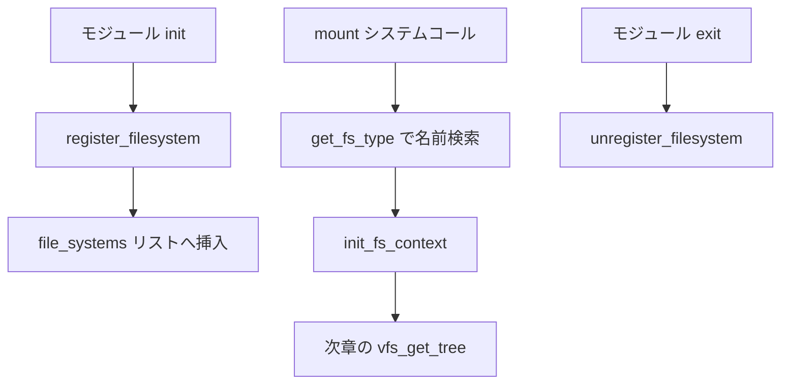

# 第1章 file_system_type とファイルシステム登録

> **本章で読むソース**
>
> - [`include/linux/fs.h` L2684-L2715](https://github.com/gregkh/linux/blob/v6.18.38/include/linux/fs.h#L2684-L2715)
> - [`fs/filesystems.c` L72-L92](https://github.com/gregkh/linux/blob/v6.18.38/fs/filesystems.c#L72-L92)
> - [`fs/filesystems.c` L108-L127](https://github.com/gregkh/linux/blob/v6.18.38/fs/filesystems.c#L108-L127)
> - [`fs/filesystems.c` L265-L290](https://github.com/gregkh/linux/blob/v6.18.38/fs/filesystems.c#L265-L290)
> - [`fs/ext4/super.c` L7415-L7422](https://github.com/gregkh/linux/blob/v6.18.38/fs/ext4/super.c#L7415-L7422)
> - [`fs/ext4/super.c` L7468-L7475](https://github.com/gregkh/linux/blob/v6.18.38/fs/ext4/super.c#L7468-L7475)

## この章の狙い

個別ファイルシステムがカーネルに登録される仕組みを、`struct file_system_type` と `register_filesystem` から追う。
マウント時に名前で型を引ける前提を押さえ、次章の `fill_super` 接続へ進む。

## 前提

- [VFS 層の位置づけ](../../vfs/part00-overview/01-vfs-layer-overview.md) で VFS の4大オブジェクトを読んでいること。

## file_system_type の役割

各ファイルシステムは `struct file_system_type` で名前と操作を登録する。
名前は `mount` システムコールの `type` 引数と一致し、`init_fs_context` がマウントパラメータの解析入口になる。
`kill_sb` はアンマウント時の super_block 破棄を担う。

[`include/linux/fs.h` L2684-L2715](https://github.com/gregkh/linux/blob/v6.18.38/include/linux/fs.h#L2684-L2715)

```c
struct file_system_type {
	const char *name;
	int fs_flags;
#define FS_REQUIRES_DEV		1 
#define FS_BINARY_MOUNTDATA	2
#define FS_HAS_SUBTYPE		4
#define FS_USERNS_MOUNT		8	/* Can be mounted by userns root */
#define FS_DISALLOW_NOTIFY_PERM	16	/* Disable fanotify permission events */
#define FS_ALLOW_IDMAP         32      /* FS has been updated to handle vfs idmappings. */
#define FS_MGTIME		64	/* FS uses multigrain timestamps */
#define FS_LBS			128	/* FS supports LBS */
#define FS_POWER_FREEZE		256	/* Always freeze on suspend/hibernate */
#define FS_RENAME_DOES_D_MOVE	32768	/* FS will handle d_move() during rename() internally. */
	int (*init_fs_context)(struct fs_context *);
	const struct fs_parameter_spec *parameters;
	struct dentry *(*mount) (struct file_system_type *, int,
		       const char *, void *);
	void (*kill_sb) (struct super_block *);
	struct module *owner;
	struct file_system_type * next;
	struct hlist_head fs_supers;

	struct lock_class_key s_lock_key;
	struct lock_class_key s_umount_key;
	struct lock_class_key s_vfs_rename_key;
	struct lock_class_key s_writers_key[SB_FREEZE_LEVELS];

	struct lock_class_key i_lock_key;
	struct lock_class_key i_mutex_key;
	struct lock_class_key invalidate_lock_key;
	struct lock_class_key i_mutex_dir_key;
};
```

`fs_flags` はマウント可否と挙動を制限する。
`FS_REQUIRES_DEV` はブロックデバイス必須を示し、ext4 のようにディスク上の形式を持つ実装で立つ。
`FS_USERNS_MOUNT` はユーザー namespace 内からのマウントを許す仮想ファイルシステム向けである。

## register_filesystem の処理

モジュール初期化時、各ファイルシステムは `register_filesystem` でカーネル内の連結リストへ挿入する。
同名の型が既にあれば `-EBUSY` を返し、二重登録を防ぐ。

[`fs/filesystems.c` L72-L92](https://github.com/gregkh/linux/blob/v6.18.38/fs/filesystems.c#L72-L92)

```c
int register_filesystem(struct file_system_type * fs)
{
	int res = 0;
	struct file_system_type ** p;

	if (fs->parameters &&
	    !fs_validate_description(fs->name, fs->parameters))
		return -EINVAL;

	BUG_ON(strchr(fs->name, '.'));
	if (fs->next)
		return -EBUSY;
	write_lock(&file_systems_lock);
	p = find_filesystem(fs->name, strlen(fs->name));
	if (*p)
		res = -EBUSY;
	else
		*p = fs;
	write_unlock(&file_systems_lock);
	return res;
}
```

`parameters` が非 NULL のときは `fs_validate_description` でマウントオプション記述の整合を検証する。
`file_systems_lock` は読み取り側の `get_fs_type` と排他する。

アンマウント後に型定義を解放してよいのは `unregister_filesystem` が成功したあとである。

[`fs/filesystems.c` L108-L127](https://github.com/gregkh/linux/blob/v6.18.38/fs/filesystems.c#L108-L127)

```c
int unregister_filesystem(struct file_system_type * fs)
{
	struct file_system_type ** tmp;

	write_lock(&file_systems_lock);
	tmp = &file_systems;
	while (*tmp) {
		if (fs == *tmp) {
			*tmp = fs->next;
			fs->next = NULL;
			write_unlock(&file_systems_lock);
			synchronize_rcu();
			return 0;
		}
		tmp = &(*tmp)->next;
	}
	write_unlock(&file_systems_lock);

	return -EINVAL;
}
```

`unregister_filesystem` は RCU 読者が終わるまで `synchronize_rcu` で待ってからリストから外す。
モジュールアンロードと名前解決の競合を避けるためである。

## マウント時の型検索

`mount` 経路は `get_fs_type` で名前一致の `file_system_type` を取得する。
参照カウントは `owner` モジュールの `try_module_get` で保護される。

[`fs/filesystems.c` L265-L290](https://github.com/gregkh/linux/blob/v6.18.38/fs/filesystems.c#L265-L290)

```c
static struct file_system_type *__get_fs_type(const char *name, int len)
{
	struct file_system_type *fs;

	read_lock(&file_systems_lock);
	fs = *(find_filesystem(name, len));
	if (fs && !try_module_get(fs->owner))
		fs = NULL;
	read_unlock(&file_systems_lock);
	return fs;
}

struct file_system_type *get_fs_type(const char *name)
{
	struct file_system_type *fs;
	const char *dot = strchr(name, '.');
	int len = dot ? dot - name : strlen(name);

	fs = __get_fs_type(name, len);
	if (!fs && (request_module("fs-%.*s", len, name) == 0)) {
		fs = __get_fs_type(name, len);
		if (!fs)
			pr_warn_once("request_module fs-%.*s succeeded, but still no fs?\n",
				     len, name);
	}

```

名前は完全一致であり、部分一致は認めない。
モジュールがロード中にアンロードされないよう、`try_module_get` 失敗時は NULL を返す。

## ext4 の登録例

ext4 は `ext4_init_fs` で内部サブシステムを初期化したうえで `register_filesystem` を呼ぶ。
`init_fs_context` にマウントパラメータ解析を、`kill_sb` にクリーンアップを委譲する。

[`fs/ext4/super.c` L7415-L7422](https://github.com/gregkh/linux/blob/v6.18.38/fs/ext4/super.c#L7415-L7422)

```c
static struct file_system_type ext4_fs_type = {
	.owner			= THIS_MODULE,
	.name			= "ext4",
	.init_fs_context	= ext4_init_fs_context,
	.parameters		= ext4_param_specs,
	.kill_sb		= ext4_kill_sb,
	.fs_flags		= FS_REQUIRES_DEV | FS_ALLOW_IDMAP | FS_MGTIME,
};
```

登録呼び出しはモジュール初期化の末尾で行われる。

[`fs/ext4/super.c` L7468-L7475](https://github.com/gregkh/linux/blob/v6.18.38/fs/ext4/super.c#L7468-L7475)

```c
		goto out05;

	register_as_ext3();
	register_as_ext2();
	err = register_filesystem(&ext4_fs_type);
	if (err)
		goto out;

```

ext4 は互換名 `ext4dev` も別型として登録する。
いずれも同じ `init_fs_context` を共有し、マウント時の振る舞いを揃える。

## 処理の流れ



モジュールロード時に型を公開し、マウント時に名前で引く。
`init_fs_context` が成功すると `fs_context` にファイルシステム固有の状態が載る。

## 高速化と最適化の工夫

`get_fs_type` は読み取りロック下の線形リスト走査だが、登録数は数十程度に収まる。
ホットパスはマウント時だけであり、登録は起動時またはモジュールロード時に一度きりである。
`try_module_get` と RCU による `unregister` の同期で、参照中の型が消えないことを保証し、ロック保持時間を最小化している。

## まとめ

`file_system_type` はファイルシステム名と `init_fs_context`、`kill_sb` を束ねる登録単位である。
`register_filesystem` と `get_fs_type` が名前空間を提供し、マウントはここから `fs_context` 構築へ進む。

## 関連する章

- 次章：[fill_super とマウント接続の流れ](02-fill-super-mount-flow.md)
- [VFS 層の位置づけ](../../vfs/part00-overview/01-vfs-layer-overview.md)
- [マウント namespace](../../vfs/part02-mount-inode/08-mount-namespace.md)
