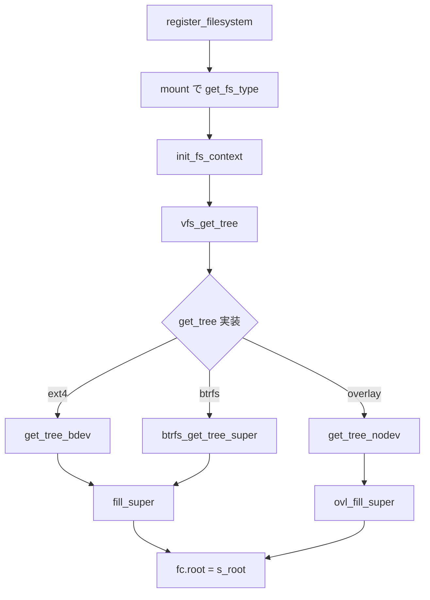

# 第1章 個別 FS の登録とマウント入口

> **本章で読むソース**
>
> - [`include/linux/fs.h` L2684-L2715](https://github.com/gregkh/linux/blob/v6.18.38/include/linux/fs.h#L2684-L2715)
> - [`fs/filesystems.c` L72-L92](https://github.com/gregkh/linux/blob/v6.18.38/fs/filesystems.c#L72-L92)
> - [`fs/super.c` L1666-L1709](https://github.com/gregkh/linux/blob/v6.18.38/fs/super.c#L1666-L1709)
> - [`fs/ext4/super.c` L5772-L5775](https://github.com/gregkh/linux/blob/v6.18.38/fs/ext4/super.c#L5772-L5775)
> - [`fs/btrfs/super.c` L2041-L2093](https://github.com/gregkh/linux/blob/v6.18.38/fs/btrfs/super.c#L2041-L2093)
> - [`fs/btrfs/super.c` L2118-L2123](https://github.com/gregkh/linux/blob/v6.18.38/fs/btrfs/super.c#L2118-L2123)
> - [`fs/btrfs/super.c` L1842-L1956](https://github.com/gregkh/linux/blob/v6.18.38/fs/btrfs/super.c#L1842-L1956)
> - [`fs/overlayfs/params.c` L728-L731](https://github.com/gregkh/linux/blob/v6.18.38/fs/overlayfs/params.c#L728-L731)

## この章の狙い

個別ファイルシステムがカーネルへ登録され、マウント時に `fill_super` へ接続される入口を追う。
ext4、btrfs、overlayfs の3型を比較し、本分冊が読む on-disk 初期化の起点を特定する。
VFS のパス解決や4大オブジェクト一般論は [VFS 分冊](../../vfs/README.md) を参照する。

## 前提

- [VFS 層の位置づけ](../../vfs/part00-overview/01-vfs-layer-overview.md) で VFS の4大オブジェクトを読んでいること。

## file_system_type と登録

各ファイルシステムは `struct file_system_type` で名前と `init_fs_context` を登録する。
`register_filesystem` は同名の二重登録を `-EBUSY` で拒否する。

[`include/linux/fs.h` L2684-L2715](https://github.com/gregkh/linux/blob/v6.18.38/include/linux/fs.h#L2684-L2715)

```c
struct file_system_type {
	const char *name;
	int fs_flags;
#define FS_REQUIRES_DEV		1 
#define FS_BINARY_MOUNTDATA	2
#define FS_HAS_SUBTYPE		4
#define FS_USERNS_MOUNT		8	/* Can be mounted by userns root */
#define FS_DISALLOW_NOTIFY_PERM	16	/* Disable fanotify permission events */
#define FS_ALLOW_IDMAP         32      /* FS has been updated to handle vfs idmappings. */
#define FS_MGTIME		64	/* FS uses multigrain timestamps */
#define FS_LBS			128	/* FS supports LBS */
#define FS_POWER_FREEZE		256	/* Always freeze on suspend/hibernate */
#define FS_RENAME_DOES_D_MOVE	32768	/* FS will handle d_move() during rename() internally. */
	int (*init_fs_context)(struct fs_context *);
	const struct fs_parameter_spec *parameters;
	struct dentry *(*mount) (struct file_system_type *, int,
		       const char *, void *);
	void (*kill_sb) (struct super_block *);
	struct module *owner;
	struct file_system_type * next;
	struct hlist_head fs_supers;

	struct lock_class_key s_lock_key;
	struct lock_class_key s_umount_key;
	struct lock_class_key s_vfs_rename_key;
	struct lock_class_key s_writers_key[SB_FREEZE_LEVELS];

	struct lock_class_key i_lock_key;
	struct lock_class_key i_mutex_key;
	struct lock_class_key invalidate_lock_key;
	struct lock_class_key i_mutex_dir_key;
};
```

[`fs/filesystems.c` L72-L92](https://github.com/gregkh/linux/blob/v6.18.38/fs/filesystems.c#L72-L92)

```c
int register_filesystem(struct file_system_type * fs)
{
	int res = 0;
	struct file_system_type ** p;

	if (fs->parameters &&
	    !fs_validate_description(fs->name, fs->parameters))
		return -EINVAL;

	BUG_ON(strchr(fs->name, '.'));
	if (fs->next)
		return -EBUSY;
	write_lock(&file_systems_lock);
	p = find_filesystem(fs->name, strlen(fs->name));
	if (*p)
		res = -EBUSY;
	else
		*p = fs;
	write_unlock(&file_systems_lock);
	return res;
}
```

## get_tree_bdev と fill_super

ディスク型ファイルシステムは `get_tree_bdev` がブロックデバイスを引き、初回マウントだけ `fill_super` を呼ぶ。
再マウントでは既存 `s_root` を再利用し、ディスクメタデータの再読込を省略する。

[`fs/super.c` L1666-L1709](https://github.com/gregkh/linux/blob/v6.18.38/fs/super.c#L1666-L1709)

```c
int get_tree_bdev_flags(struct fs_context *fc,
		int (*fill_super)(struct super_block *sb,
				  struct fs_context *fc), unsigned int flags)
{
	struct super_block *s;
	int error = 0;
	dev_t dev;

	if (!fc->source)
		return invalf(fc, "No source specified");

	error = lookup_bdev(fc->source, &dev);
	if (error) {
		if (!(flags & GET_TREE_BDEV_QUIET_LOOKUP))
			errorf(fc, "%s: Can't lookup blockdev", fc->source);
		return error;
	}
	fc->sb_flags |= SB_NOSEC;
	s = sget_dev(fc, dev);
	if (IS_ERR(s))
		return PTR_ERR(s);

	if (s->s_root) {
		/* Don't summarily change the RO/RW state. */
		if ((fc->sb_flags ^ s->s_flags) & SB_RDONLY) {
			warnf(fc, "%pg: Can't mount, would change RO state", s->s_bdev);
			deactivate_locked_super(s);
			return -EBUSY;
		}
	} else {
		error = setup_bdev_super(s, fc->sb_flags, fc);
		if (!error)
			error = fill_super(s, fc);
		if (error) {
			deactivate_locked_super(s);
			return error;
		}
		s->s_flags |= SB_ACTIVE;
	}

	BUG_ON(fc->root);
	fc->root = dget(s->s_root);
	return 0;
}
```

## ext4 のマウント入口

`ext4_init_fs_context` は `ext4_fs_context` を確保し、`get_tree` から `get_tree_bdev` へ委譲する。
`ext4_fill_super` は `ext4_sb_info` を載せ、`__ext4_fill_super` で on-disk super block を読む。

[`fs/ext4/super.c` L2002-L2017](https://github.com/gregkh/linux/blob/v6.18.38/fs/ext4/super.c#L2002-L2017)

```c
int ext4_init_fs_context(struct fs_context *fc)
{
	struct ext4_fs_context *ctx;

	ctx = kzalloc(sizeof(struct ext4_fs_context), GFP_KERNEL);
	if (!ctx)
		return -ENOMEM;

	fc->fs_private = ctx;
	fc->ops = &ext4_context_ops;

	/* i_version is always enabled now */
	fc->sb_flags |= SB_I_VERSION;

	return 0;
}
```

[`fs/ext4/super.c` L5772-L5775](https://github.com/gregkh/linux/blob/v6.18.38/fs/ext4/super.c#L5772-L5775)

```c
static int ext4_get_tree(struct fs_context *fc)
{
	return get_tree_bdev(fc, ext4_fill_super);
}
```

## btrfs のマウント入口

btrfs は `get_tree_bdev` を使わない。
`btrfs_get_tree` は `btrfs_get_tree_subvol` へ委譲し、subvolume 指定を処理する。
`btrfs_get_tree_subvol` は `btrfs_get_tree_super` を呼び、そこから `btrfs_scan_one_device`、`sget_fc`、`btrfs_open_devices`、`btrfs_fill_super` へ進む。

[`fs/btrfs/super.c` L2118-L2123](https://github.com/gregkh/linux/blob/v6.18.38/fs/btrfs/super.c#L2118-L2123)

```c
static int btrfs_get_tree(struct fs_context *fc)
{
	ASSERT(fc->s_fs_info == NULL);

	return btrfs_get_tree_subvol(fc);
}
```

[`fs/btrfs/super.c` L2041-L2093](https://github.com/gregkh/linux/blob/v6.18.38/fs/btrfs/super.c#L2041-L2093)

```c
static int btrfs_get_tree_subvol(struct fs_context *fc)
{
	struct btrfs_fs_info *fs_info = NULL;
	struct btrfs_fs_context *ctx = fc->fs_private;
	struct fs_context *dup_fc;
	struct dentry *dentry;
	struct vfsmount *mnt;
	int ret = 0;

	// ... (中略) ...
	dup_fc->s_fs_info = fs_info;

	ret = btrfs_get_tree_super(dup_fc);
	if (ret)
		goto error;

	ret = btrfs_reconfigure_for_mount(dup_fc);
	// ... (中略) ...
}
```

[`fs/btrfs/super.c` L1842-L1956](https://github.com/gregkh/linux/blob/v6.18.38/fs/btrfs/super.c#L1842-L1956)

```c
static int btrfs_get_tree_super(struct fs_context *fc)
{
	struct btrfs_fs_info *fs_info = fc->s_fs_info;
	struct btrfs_fs_context *ctx = fc->fs_private;
	struct btrfs_fs_devices *fs_devices = NULL;
	struct btrfs_device *device;
	struct super_block *sb;
	blk_mode_t mode = sb_open_mode(fc->sb_flags);
	int ret;

	btrfs_ctx_to_info(fs_info, ctx);
	mutex_lock(&uuid_mutex);

	/*
	 * With 'true' passed to btrfs_scan_one_device() (mount time) we expect
	 * either a valid device or an error.
	 */
	device = btrfs_scan_one_device(fc->source, true);
	ASSERT(device != NULL);
	if (IS_ERR(device)) {
		mutex_unlock(&uuid_mutex);
		return PTR_ERR(device);
	}
	fs_devices = device->fs_devices;
	// ... (中略) ...
	sb = sget_fc(fc, btrfs_fc_test_super, set_anon_super_fc);
	if (IS_ERR(sb)) {
		// ... (中略) ...
		return PTR_ERR(sb);
	}

	if (sb->s_root) {
		// ... (中略) ...
	} else {
		struct block_device *bdev;

		// ... (中略) ...
		ret = btrfs_open_devices(fs_devices, mode, sb);
		// ... (中略) ...
		ret = btrfs_fill_super(sb, fs_devices);
		if (ret) {
			deactivate_locked_super(sb);
			return ret;
		}
	}

	btrfs_clear_oneshot_options(fs_info);

	fc->root = dget(sb->s_root);
	return 0;
}
```

## overlayfs の違い

overlayfs は `FS_USERNS_MOUNT` を立て、ブロックデバイスを要求しない。
`ovl_get_tree` は `get_tree_nodev` へ `ovl_fill_super` を渡し、layer パス解決とスタッキング用 `ovl_fs` 構築を行う。
on-disk 形式は持たず、既存ファイルシステムの dentry を合成する点が ext4/btrfs と対照的である。

[`fs/overlayfs/params.c` L728-L731](https://github.com/gregkh/linux/blob/v6.18.38/fs/overlayfs/params.c#L728-L731)

```c
static int ovl_get_tree(struct fs_context *fc)
{
	return get_tree_nodev(fc, ovl_fill_super);
}
```

## 3型の比較

| 観点 | ext4 | btrfs | overlayfs |
|---|---|---|---|
| デバイス | 必須 (`get_tree_bdev`) | 必須 (`btrfs_get_tree_super`) | 不要 (`get_tree_nodev`) |
| `get_tree` の主作業 | `fill_super` で super block | `open_ctree` まで含む `fill_super` | layer パス解決 |
| `s_fs_info` | `ext4_sb_info` | `btrfs_fs_info` | `ovl_fs` |

## 処理の流れ



## 高速化と最適化の工夫

`sget_dev` は同一デバイスへの super_block を共有し、再マウントで `fill_super` を省略する。
`get_fs_type` の線形リスト走査はマウント時だけであり、登録は起動時またはモジュールロード時に一度きりである。
`try_module_get` と RCU 同期で、参照中の型定義がアンロードで消えないことを保証する。

## まとめ

個別ファイルシステムは `file_system_type` で名前を公開し、`init_fs_context` と `fill_super` で super_block を初期化する。
ext4 は `get_tree_bdev`、btrfs は独自の `btrfs_get_tree_super`、overlayfs は `get_tree_nodev` 経由でそれぞれの `fill_super` へ接続する。

## 関連する章

- 次章：[ディスクレイアウトの読み方](02-on-disk-layout-reading.md)
- [マウント namespace](../../vfs/part02-mount-inode/08-mount-namespace.md)
- [ext4 の super block と block group](../part01-ext4/03-ext4-super-block-group.md)
