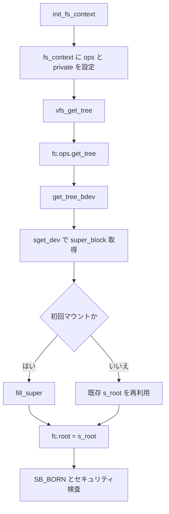

# 第2章 fill_super とマウント接続の流れ

> **本章で読むソース**
>
> - [`fs/super.c` L1747-L1799](https://github.com/gregkh/linux/blob/v6.18.38/fs/super.c#L1747-L1799)
> - [`fs/super.c` L1666-L1709](https://github.com/gregkh/linux/blob/v6.18.38/fs/super.c#L1666-L1709)
> - [`fs/super.c` L1717-L1722](https://github.com/gregkh/linux/blob/v6.18.38/fs/super.c#L1717-L1722)
> - [`fs/ext4/super.c` L2002-L2017](https://github.com/gregkh/linux/blob/v6.18.38/fs/ext4/super.c#L2002-L2017)
> - [`fs/ext4/super.c` L5722-L5775](https://github.com/gregkh/linux/blob/v6.18.38/fs/ext4/super.c#L5722-L5775)
> - [`include/linux/fs.h` L1446-L1463](https://github.com/gregkh/linux/blob/v6.18.38/include/linux/fs.h#L1446-L1463)

## この章の狙い

`vfs_get_tree` から `get_tree_bdev`、各ファイルシステムの `fill_super` まで、マウント可能なルート dentry が作られる経路を追う。
VFS 分冊で扱ったマウント namespace との境界を明示し、個別実装が super_block を初期化する地点を特定する。

## 前提

- 前章：[file_system_type とファイルシステム登録](01-file-system-type-registration.md)
- [vfsmount と mount namespace](../../vfs/part02-mount-inode/08-mount-namespace.md)

## vfs_get_tree の責務

`vfs_get_tree` は `fs_context` に登録された `get_tree` 操作を呼び、マウント可能なルート dentry を `fc->root` に設定する。
成功時は `SB_BORN` を立て、セキュリティフックと `s_maxbytes` の検査を行う。

[`fs/super.c` L1747-L1799](https://github.com/gregkh/linux/blob/v6.18.38/fs/super.c#L1747-L1799)

```c
int vfs_get_tree(struct fs_context *fc)
{
	struct super_block *sb;
	int error;

	if (fc->root)
		return -EBUSY;

	/* Get the mountable root in fc->root, with a ref on the root and a ref
	 * on the superblock.
	 */
	error = fc->ops->get_tree(fc);
	if (error < 0)
		return error;

	if (!fc->root) {
		pr_err("Filesystem %s get_tree() didn't set fc->root, returned %i\n",
		       fc->fs_type->name, error);
		/* We don't know what the locking state of the superblock is -
		 * if there is a superblock.
		 */
		BUG();
	}

	sb = fc->root->d_sb;
	WARN_ON(!sb->s_bdi);

	/*
	 * super_wake() contains a memory barrier which also care of
	 * ordering for super_cache_count(). We place it before setting
	 * SB_BORN as the data dependency between the two functions is
	 * the superblock structure contents that we just set up, not
	 * the SB_BORN flag.
	 */
	super_wake(sb, SB_BORN);

	error = security_sb_set_mnt_opts(sb, fc->security, 0, NULL);
	if (unlikely(error)) {
		fc_drop_locked(fc);
		return error;
	}

	/*
	 * filesystems should never set s_maxbytes larger than MAX_LFS_FILESIZE
	 * but s_maxbytes was an unsigned long long for many releases. Throw
	 * this warning for a little while to try and catch filesystems that
	 * violate this rule.
	 */
	WARN((sb->s_maxbytes < 0), "%s set sb->s_maxbytes to "
		"negative value (%lld)\n", fc->fs_type->name, sb->s_maxbytes);

	return 0;
}
```

`fc->root` が未設定のまま戻る実装はカーネルバグとして `BUG()` する。
VFS 分冊側はマウントポイントへの接続までを扱い、本分冊は `get_tree` 内部の super_block 初期化に焦点を当てる。

## get_tree_bdev によるブロックデバイスマウント

ディスク型ファイルシステムの多くは `get_tree_bdev` を `get_tree` 実装として登録する。
ブロックデバイスを引き、既存 super_block がなければ `fill_super` で初期化する。

[`fs/super.c` L1666-L1709](https://github.com/gregkh/linux/blob/v6.18.38/fs/super.c#L1666-L1709)

```c
int get_tree_bdev_flags(struct fs_context *fc,
		int (*fill_super)(struct super_block *sb,
				  struct fs_context *fc), unsigned int flags)
{
	struct super_block *s;
	int error = 0;
	dev_t dev;

	if (!fc->source)
		return invalf(fc, "No source specified");

	error = lookup_bdev(fc->source, &dev);
	if (error) {
		if (!(flags & GET_TREE_BDEV_QUIET_LOOKUP))
			errorf(fc, "%s: Can't lookup blockdev", fc->source);
		return error;
	}
	fc->sb_flags |= SB_NOSEC;
	s = sget_dev(fc, dev);
	if (IS_ERR(s))
		return PTR_ERR(s);

	if (s->s_root) {
		/* Don't summarily change the RO/RW state. */
		if ((fc->sb_flags ^ s->s_flags) & SB_RDONLY) {
			warnf(fc, "%pg: Can't mount, would change RO state", s->s_bdev);
			deactivate_locked_super(s);
			return -EBUSY;
		}
	} else {
		error = setup_bdev_super(s, fc->sb_flags, fc);
		if (!error)
			error = fill_super(s, fc);
		if (error) {
			deactivate_locked_super(s);
			return error;
		}
		s->s_flags |= SB_ACTIVE;
	}

	BUG_ON(fc->root);
	fc->root = dget(s->s_root);
	return 0;
}
```

`s->s_root` が既にある場合は再マウント相当であり、`fill_super` は呼ばれない。
初回マウントだけ `setup_bdev_super` と `fill_super` が走る。

薄いラッパー `get_tree_bdev` はフラグなしで上記を呼ぶ。

[`fs/super.c` L1717-L1722](https://github.com/gregkh/linux/blob/v6.18.38/fs/super.c#L1717-L1722)

```c
int get_tree_bdev(struct fs_context *fc,
		int (*fill_super)(struct super_block *,
				  struct fs_context *))
{
	return get_tree_bdev_flags(fc, fill_super, 0);
}
```

## ext4 の fs_context 初期化

`init_fs_context` はマウントパラメータ用の `ext4_fs_context` を確保し、`fc->ops` に操作テーブルを設定する。
`SB_I_VERSION` を立て、inode バージョン追跡を有効にする。

[`fs/ext4/super.c` L2002-L2017](https://github.com/gregkh/linux/blob/v6.18.38/fs/ext4/super.c#L2002-L2017)

```c
int ext4_init_fs_context(struct fs_context *fc)
{
	struct ext4_fs_context *ctx;

	ctx = kzalloc(sizeof(struct ext4_fs_context), GFP_KERNEL);
	if (!ctx)
		return -ENOMEM;

	fc->fs_private = ctx;
	fc->ops = &ext4_context_ops;

	/* i_version is always enabled now */
	fc->sb_flags |= SB_I_VERSION;

	return 0;
}
```

`ext4_context_ops` の `get_tree` メンバが `ext4_get_tree` を指し、そこから `get_tree_bdev` へ委譲する。

## ext4_fill_super の入口

`ext4_fill_super` は super_block に ext4 固有の `ext4_sb_info` を載せ、ディスク上の super block を読み、ジャーナルを接続する。
本章では入口と `get_tree` 接続だけを示し、on-disk 解析の詳細は第4章へ委ねる。

[`fs/ext4/super.c` L5722-L5775](https://github.com/gregkh/linux/blob/v6.18.38/fs/ext4/super.c#L5722-L5775)

```c
static int ext4_fill_super(struct super_block *sb, struct fs_context *fc)
{
	struct ext4_fs_context *ctx = fc->fs_private;
	struct ext4_sb_info *sbi;
	const char *descr;
	int ret;

	sbi = ext4_alloc_sbi(sb);
	if (!sbi)
		return -ENOMEM;

	fc->s_fs_info = sbi;

	/* Cleanup superblock name */
	strreplace(sb->s_id, '/', '!');

	sbi->s_sb_block = 1;	/* Default super block location */
	if (ctx->spec & EXT4_SPEC_s_sb_block)
		sbi->s_sb_block = ctx->s_sb_block;

	ret = __ext4_fill_super(fc, sb);
	if (ret < 0)
		goto free_sbi;

	if (sbi->s_journal) {
		if (test_opt(sb, DATA_FLAGS) == EXT4_MOUNT_JOURNAL_DATA)
			descr = " journalled data mode";
		else if (test_opt(sb, DATA_FLAGS) == EXT4_MOUNT_ORDERED_DATA)
			descr = " ordered data mode";
		else
			descr = " writeback data mode";
	} else
		descr = "out journal";

	if (___ratelimit(&ext4_mount_msg_ratelimit, "EXT4-fs mount"))
		ext4_msg(sb, KERN_INFO, "mounted filesystem %pU %s with%s. "
			 "Quota mode: %s.", &sb->s_uuid,
			 sb_rdonly(sb) ? "ro" : "r/w", descr,
			 ext4_quota_mode(sb));

	/* Update the s_overhead_clusters if necessary */
	ext4_update_overhead(sb, false);
	return 0;

free_sbi:
	ext4_free_sbi(sbi);
	fc->s_fs_info = NULL;
	return ret;
}

static int ext4_get_tree(struct fs_context *fc)
{
	return get_tree_bdev(fc, ext4_fill_super);
}
```

`__ext4_fill_super` 内でブロックサイズ検証、feature フラグ判定、ルート inode の `iget` が続く。
成功すると `s_root` にルート dentry が載り、`get_tree_bdev` が `fc->root` へ複製する。

## super_block が受け持つ接続点

`fill_super` 完了後の `super_block` は、VFS 分冊で読んだ4大オブジェクトのうち super 層のハブになる。
`s_type` が `file_system_type` を、`s_op` がファイルシステム操作を指す。

[`include/linux/fs.h` L1446-L1463](https://github.com/gregkh/linux/blob/v6.18.38/include/linux/fs.h#L1446-L1463)

```c
struct super_block {
	struct list_head	s_list;		/* Keep this first */
	dev_t			s_dev;		/* search index; _not_ kdev_t */
	unsigned char		s_blocksize_bits;
	unsigned long		s_blocksize;
	loff_t			s_maxbytes;	/* Max file size */
	struct file_system_type	*s_type;
	const struct super_operations	*s_op;
	const struct dquot_operations	*dq_op;
	const struct quotactl_ops	*s_qcop;
	const struct export_operations *s_export_op;
	unsigned long		s_flags;
	unsigned long		s_iflags;	/* internal SB_I_* flags */
	unsigned long		s_magic;
	struct dentry		*s_root;
	struct rw_semaphore	s_umount;
	int			s_count;
	atomic_t		s_active;
```

`s_fs_info` には ext4 なら `ext4_sb_info`、btrfs なら `btrfs_fs_info` が載る。
個別ファイルシステムの on-disk メタデータへのポインタはここに集約される。

## 処理の流れ



ブロックデバイス型は `get_tree_bdev` が共通骨格であり、差分は `fill_super` に閉じる。
tmpfs や procfs のようにデバイス不要な型は `get_tree_nodev` 等の別ヘルパを使う。

## 高速化と最適化の工夫

`sget_dev` は同一デバイスへの重複 super_block 生成を防ぎ、マルチマウントを1つの `super_block` で共有する。
再マウント時に `fill_super` を省略することで、ディスクメタデータの再読込とジャーナル再接続コストを避ける。
`fc->root` への `dget` は参照カウントだけを増やし、ルート dentry の実体は1つに保つ。

## まとめ

マウント接続は `init_fs_context`、 `vfs_get_tree`、 `get_tree_bdev`、 `fill_super` の連鎖で super_block とルート dentry が成立する。
個別ファイルシステムは `fill_super` 内で on-disk 形式を解釈し、VFS オブジェクトへ操作テーブルを接続する。

## 関連する章

- 前章：[file_system_type とファイルシステム登録](01-file-system-type-registration.md)
- 次章：[ディスクレイアウトの読み方](03-on-disk-layout-reading.md)
- [super_block、inode、dentry、file の関係](../../vfs/part00-overview/02-vfs-core-objects.md)
