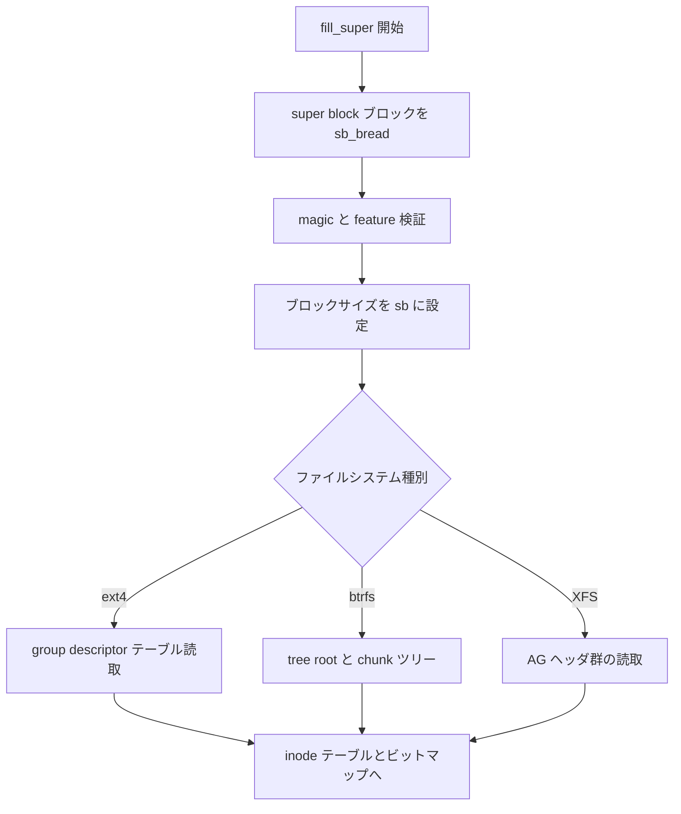

# 第3章 ディスクレイアウトの読み方

> **本章で読むソース**
>
> - [`fs/ext4/super.c` L229-L257](https://github.com/gregkh/linux/blob/v6.18.38/fs/ext4/super.c#L229-L257)
> - [`fs/ext4/ext4.h` L1326-L1345](https://github.com/gregkh/linux/blob/v6.18.38/fs/ext4/ext4.h#L1326-L1345)
> - [`fs/ext4/ext4.h` L395-L420](https://github.com/gregkh/linux/blob/v6.18.38/fs/ext4/ext4.h#L395-L420)
> - [`include/linux/buffer_head.h` L39-L58](https://github.com/gregkh/linux/blob/v6.18.38/include/linux/buffer_head.h#L39-L58)
> - [`fs/xfs/libxfs/xfs_format.h` L95-L111](https://github.com/gregkh/linux/blob/v6.18.38/fs/xfs/libxfs/xfs_format.h#L95-L111)
> - [`include/uapi/linux/btrfs_tree.h` L481-L496](https://github.com/gregkh/linux/blob/v6.18.38/include/uapi/linux/btrfs_tree.h#L481-L496)

## この章の狙い

ブロックデバイス上のメタデータをカーネルがどう読むかを、`buffer_head` と super block 構造体の対応から整理する。
ext4、btrfs、XFS で共通する「固定オフセットの super block を読み、以降のテーブルへ辿る」読み方を押さえる。

## 前提

- 前章：[fill_super とマウント接続の流れ](02-fill-super-mount-flow.md)
- [bio とブロック I/O](../../block/README.md) はブロック層分冊の対象とする。

## buffer_head によるブロック読取

ディスク上の1ブロックは `buffer_head` でキャッシュされる。
`b_blocknr` が論理ブロック番号、`b_data` がメモリ上の内容を指す。

[`include/linux/buffer_head.h` L39-L58](https://github.com/gregkh/linux/blob/v6.18.38/include/linux/buffer_head.h#L39-L58)

```c
	BH_PrivateStart,/* not a state bit, but the first bit available
			 * for private allocation by other entities
			 */
};

#define MAX_BUF_PER_PAGE (PAGE_SIZE / 512)

struct page;
struct buffer_head;
struct address_space;
typedef void (bh_end_io_t)(struct buffer_head *bh, int uptodate);

/*
 * Historically, a buffer_head was used to map a single block
 * within a page, and of course as the unit of I/O through the
 * filesystem and block layers.  Nowadays the basic I/O unit
 * is the bio, and buffer_heads are used for extracting block
 * mappings (via a get_block_t call), for tracking state within
 * a folio (via a folio_mapping) and for wrapping bio submission
 * for backward compatibility reasons (e.g. submit_bh).
```

`ext4_sb_bread` はブロックをキャッシュに載せ、未読なら `ext4_read_bh_lock` でデバイスから読み込む。
`REQ_META` フラグでメタデータ読取であることをブロック層へ伝える。

[`fs/ext4/super.c` L229-L257](https://github.com/gregkh/linux/blob/v6.18.38/fs/ext4/super.c#L229-L257)

```c
static struct buffer_head *__ext4_sb_bread_gfp(struct super_block *sb,
					       sector_t block,
					       blk_opf_t op_flags, gfp_t gfp)
{
	struct buffer_head *bh;
	int ret;

	bh = sb_getblk_gfp(sb, block, gfp);
	if (bh == NULL)
		return ERR_PTR(-ENOMEM);
	if (ext4_buffer_uptodate(bh))
		return bh;

	ret = ext4_read_bh_lock(bh, REQ_META | op_flags, true);
	if (ret) {
		put_bh(bh);
		return ERR_PTR(ret);
	}
	return bh;
}

struct buffer_head *ext4_sb_bread(struct super_block *sb, sector_t block,
				   blk_opf_t op_flags)
{
	gfp_t gfp = mapping_gfp_constraint(sb->s_bdev->bd_mapping,
			~__GFP_FS) | __GFP_MOVABLE;

	return __ext4_sb_bread_gfp(sb, block, op_flags, gfp);
}
```

`ext4_buffer_uptodate` が真ならディスク I/O を省略する。
マウント直後のメタデータ走査ではキャッシュ命中が効き、同一ブロックの再読込を避ける。

## ext4 super block のフィールド

ext4 の on-disk super block は `struct ext4_super_block` で表現される。
先頭付近にブロック数、inode 数、ブロックサイズ、feature フラグが並ぶ。

[`fs/ext4/ext4.h` L1326-L1345](https://github.com/gregkh/linux/blob/v6.18.38/fs/ext4/ext4.h#L1326-L1345)

```c
struct ext4_super_block {
/*00*/	__le32	s_inodes_count;		/* Inodes count */
	__le32	s_blocks_count_lo;	/* Blocks count */
	__le32	s_r_blocks_count_lo;	/* Reserved blocks count */
	__le32	s_free_blocks_count_lo;	/* Free blocks count */
/*10*/	__le32	s_free_inodes_count;	/* Free inodes count */
	__le32	s_first_data_block;	/* First Data Block */
	__le32	s_log_block_size;	/* Block size */
	__le32	s_log_cluster_size;	/* Allocation cluster size */
/*20*/	__le32	s_blocks_per_group;	/* # Blocks per group */
	__le32	s_clusters_per_group;	/* # Clusters per group */
	__le32	s_inodes_per_group;	/* # Inodes per group */
	__le32	s_mtime;		/* Mount time */
/*30*/	__le32	s_wtime;		/* Write time */
	__le16	s_mnt_count;		/* Mount count */
	__le16	s_max_mnt_count;	/* Maximal mount count */
	__le16	s_magic;		/* Magic signature */
	__le16	s_state;		/* File system state */
	__le16	s_errors;		/* Behaviour when detecting errors */
	__le16	s_minor_rev_level;	/* minor revision level */
```

`s_magic` が `EXT4_SUPER_MAGIC` と一致するかを `fill_super` 冒頭で検証する。
`s_feature_incompat` に未知ビットが立っていればマウント拒否となる。

## block group descriptor への展開

super block は全体統計を持ち、各 **block group** の位置は **group descriptor** テーブルで引く。
ビットマップと inode テーブルのブロック番号がここに入る。

[`fs/ext4/ext4.h` L395-L420](https://github.com/gregkh/linux/blob/v6.18.38/fs/ext4/ext4.h#L395-L420)

```c
struct ext4_group_desc
{
	__le32	bg_block_bitmap_lo;	/* Blocks bitmap block */
	__le32	bg_inode_bitmap_lo;	/* Inodes bitmap block */
	__le32	bg_inode_table_lo;	/* Inodes table block */
	__le16	bg_free_blocks_count_lo;/* Free blocks count */
	__le16	bg_free_inodes_count_lo;/* Free inodes count */
	__le16	bg_used_dirs_count_lo;	/* Directories count */
	__le16	bg_flags;		/* EXT4_BG_flags (INODE_UNINIT, etc) */
	__le32  bg_exclude_bitmap_lo;   /* Exclude bitmap for snapshots */
	__le16  bg_block_bitmap_csum_lo;/* crc32c(s_uuid+grp_num+bbitmap) LE */
	__le16  bg_inode_bitmap_csum_lo;/* crc32c(s_uuid+grp_num+ibitmap) LE */
	__le16  bg_itable_unused_lo;	/* Unused inodes count */
	__le16  bg_checksum;		/* crc16(sb_uuid+group+desc) */
	__le32	bg_block_bitmap_hi;	/* Blocks bitmap block MSB */
	__le32	bg_inode_bitmap_hi;	/* Inodes bitmap block MSB */
	__le32	bg_inode_table_hi;	/* Inodes table block MSB */
	__le16	bg_free_blocks_count_hi;/* Free blocks count MSB */
	__le16	bg_free_inodes_count_hi;/* Free inodes count MSB */
	__le16	bg_used_dirs_count_hi;	/* Directories count MSB */
	__le16  bg_itable_unused_hi;    /* Unused inodes count MSB */
	__le32  bg_exclude_bitmap_hi;   /* Exclude bitmap block MSB */
	__le16  bg_block_bitmap_csum_hi;/* crc32c(s_uuid+grp_num+bbitmap) BE */
	__le16  bg_inode_bitmap_csum_hi;/* crc32c(s_uuid+grp_num+ibitmap) BE */
	__u32   bg_reserved;
};
```

グループ番号から descriptor を引き、inode 番号からグループとテーブル内オフセットを計算する。
この対応が `ext4_iget` のディスク読取位置を決める。

## XFS super block の読み方

XFS も先頭付近に magic、ブロックサイズ、**アロケーショングループ** 数とサイズを持つ。
`sb_agcount` と `sb_agblocks` がボリュームを AG 単位に分割する。

[`fs/xfs/libxfs/xfs_format.h` L95-L111](https://github.com/gregkh/linux/blob/v6.18.38/fs/xfs/libxfs/xfs_format.h#L95-L111)

```c
typedef struct xfs_sb {
	uint32_t	sb_magicnum;	/* magic number == XFS_SB_MAGIC */
	uint32_t	sb_blocksize;	/* logical block size, bytes */
	xfs_rfsblock_t	sb_dblocks;	/* number of data blocks */
	xfs_rfsblock_t	sb_rblocks;	/* number of realtime blocks */
	xfs_rtbxlen_t	sb_rextents;	/* number of realtime extents */
	uuid_t		sb_uuid;	/* user-visible file system unique id */
	xfs_fsblock_t	sb_logstart;	/* starting block of log if internal */
	xfs_ino_t	sb_rootino;	/* root inode number */
	xfs_ino_t	sb_rbmino;	/* bitmap inode for realtime extents */
	xfs_ino_t	sb_rsumino;	/* summary inode for rt bitmap */
	xfs_agblock_t	sb_rextsize;	/* realtime extent size, blocks */
	xfs_agblock_t	sb_agblocks;	/* size of an allocation group */
	xfs_agnumber_t	sb_agcount;	/* number of allocation groups */
	xfs_extlen_t	sb_rbmblocks;	/* number of rt bitmap blocks */
	xfs_extlen_t	sb_logblocks;	/* number of log blocks */
	uint16_t	sb_versionnum;	/* header version == XFS_SB_VERSION */
```

AG 番号と AG 内ブロック番号へ分解してから inode や空きブロック管理へ進む。
詳細は第13章で扱う。

## btrfs ツリーブロックヘッダ

btrfs は固定 super block のあと、B-tree ノードが `btrfs_header` で始まる。
チェックサム、fsid、論理アドレス `bytenr`、アイテム数 `nritems` が共通ヘッダに載る。

[`include/uapi/linux/btrfs_tree.h` L481-L496](https://github.com/gregkh/linux/blob/v6.18.38/include/uapi/linux/btrfs_tree.h#L481-L496)

```c
struct btrfs_header {
	/* These first four must match the super block */
	__u8 csum[BTRFS_CSUM_SIZE];
	/* FS specific uuid */
	__u8 fsid[BTRFS_FSID_SIZE];
	/* Which block this node is supposed to live in */
	__le64 bytenr;
	__le64 flags;

	/* Allowed to be different from the super from here on down */
	__u8 chunk_tree_uuid[BTRFS_UUID_SIZE];
	__le64 generation;
	__le64 owner;
	__le32 nritems;
	__u8 level;
} __attribute__ ((__packed__));
```

btrfs は ext4 のように固定グループレイアウトを持たず、chunk ツリーが論理アドレスを物理へ写す。
読み方の差は「グループ descriptor テーブル」対「B-tree キー検索」に集約される。

## 処理の流れ



いずれも最初に super block 相当の1ブロック（または少数ブロック）を読み、以降のメタデータ位置を計算する。
カーネル実装は `buffer_head` キャッシュを共有し、同じブロックの繰り返し読取を抑える。

## 高速化と最適化の工夫

`ext4_sb_bread` は `__GFP_MOVABLE` を付け、メタデータバッファのメモリ圧力下での移動を許す。
`ext4_buffer_uptodate` による短絡は、マウント時の複数パスが同一 super block ブロックを触る場面で I/O を省略する。
グループ単位のメタデータはマウント時に全部読まず、必要なグループだけ遅延読取する実装も多い。

## まとめ

on-disk レイアウトの読み方は super block から始まり、ファイルシステムごとの索引構造へ展開する。
ext4 は group descriptor、XFS は AG、btrfs は B-tree と chunk マップが次の入口である。

## 関連する章

- 次章：[ext4 の super block と block group](../part01-ext4/04-ext4-super-block-group.md)
- [fill_super とマウント接続の流れ](02-fill-super-mount-flow.md)
- [XFS のアロケーショングループ](../part03-xfs/13-xfs-allocation-groups.md)
