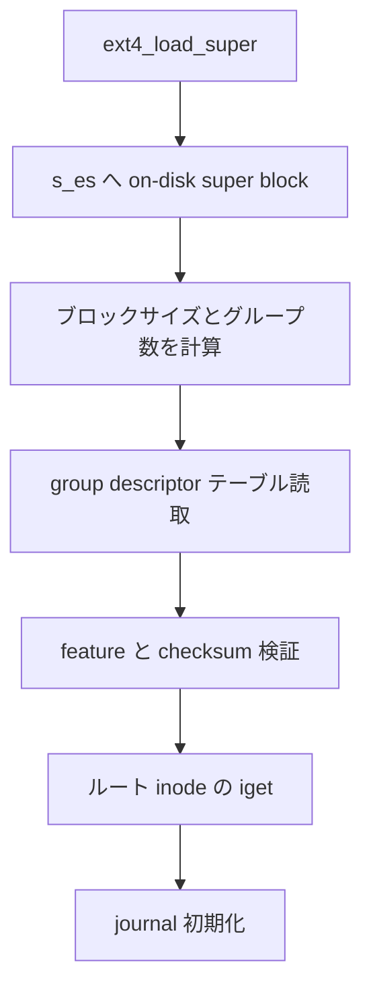

# 第4章 ext4 の super block と block group

> **本章で読むソース**
>
> - [`fs/ext4/super.c` L5260-L5294](https://github.com/gregkh/linux/blob/v6.18.38/fs/ext4/super.c#L5260-L5294)
> - [`fs/ext4/ext4.h` L1326-L1371](https://github.com/gregkh/linux/blob/v6.18.38/fs/ext4/ext4.h#L1326-L1371)
> - [`fs/ext4/ext4.h` L395-L407](https://github.com/gregkh/linux/blob/v6.18.38/fs/ext4/ext4.h#L395-L407)
> - [`fs/ext4/ext4.h` L439-L441](https://github.com/gregkh/linux/blob/v6.18.38/fs/ext4/ext4.h#L439-L441)
> - [`fs/ext4/balloc.c` L255-L280](https://github.com/gregkh/linux/blob/v6.18.38/fs/ext4/balloc.c#L255-L280)
> - [`fs/ext4/super.c` L5772-L5775](https://github.com/gregkh/linux/blob/v6.18.38/fs/ext4/super.c#L5772-L5775)

## この章の狙い

ext4 の `__ext4_fill_super` が super block と block group descriptor をどう読み、ボリューム全体のブロックサイズとグループ分割を確定するかを追う。
以降の inode 読取とブロック割当の前提となる on-disk 幾何を押さえる。

## 前提

- [ディスクレイアウトの読み方](../part00-overview/03-on-disk-layout-reading.md)
- [fill_super とマウント接続の流れ](../part00-overview/02-fill-super-mount-flow.md)

## __ext4_fill_super の冒頭

`__ext4_fill_super` は `ext4_load_super` でディスク上の super block を `ext4_sb_info->s_es` へ載せる。
続けてメタデータチェックサム初期化とデフォルトマウントオプション適用を行う。

[`fs/ext4/super.c` L5260-L5294](https://github.com/gregkh/linux/blob/v6.18.38/fs/ext4/super.c#L5260-L5294)

```c
static int __ext4_fill_super(struct fs_context *fc, struct super_block *sb)
{
	struct ext4_super_block *es = NULL;
	struct ext4_sb_info *sbi = EXT4_SB(sb);
	ext4_fsblk_t logical_sb_block;
	struct inode *root;
	int needs_recovery;
	int err;
	ext4_group_t first_not_zeroed;
	struct ext4_fs_context *ctx = fc->fs_private;
	int silent = fc->sb_flags & SB_SILENT;

	/* Set defaults for the variables that will be set during parsing */
	if (!(ctx->spec & EXT4_SPEC_JOURNAL_IOPRIO))
		ctx->journal_ioprio = EXT4_DEF_JOURNAL_IOPRIO;

	sbi->s_inode_readahead_blks = EXT4_DEF_INODE_READAHEAD_BLKS;
	sbi->s_sectors_written_start =
		part_stat_read(sb->s_bdev, sectors[STAT_WRITE]);

	err = ext4_load_super(sb, &logical_sb_block, silent);
	if (err)
		goto out_fail;

	es = sbi->s_es;
	sbi->s_kbytes_written = le64_to_cpu(es->s_kbytes_written);

	err = ext4_init_metadata_csum(sb, es);
	if (err)
		goto failed_mount;

	ext4_set_def_opts(sb, es);

	sbi->s_resuid = make_kuid(&init_user_ns, ext4_get_resuid(es));
	sbi->s_resgid = make_kgid(&init_user_ns, ext4_get_resuid(es));
```

`logical_sb_block` は super block の論理位置であり、1024 バイトブロック時代の互換で 0 または 1 になりうる。
`ext4_init_metadata_csum` は `metadata_csum` feature 有効時の検証経路を準備する。

## super block の容量と feature フラグ

super block にはボリューム全体のブロック数、inode 数、グループあたりのブロック数が入る。
`s_feature_incompat` にカーネル未対応ビットがあればマウントは拒否される。

[`fs/ext4/ext4.h` L1326-L1371](https://github.com/gregkh/linux/blob/v6.18.38/fs/ext4/ext4.h#L1326-L1371)

```c
struct ext4_super_block {
/*00*/	__le32	s_inodes_count;		/* Inodes count */
	__le32	s_blocks_count_lo;	/* Blocks count */
	__le32	s_r_blocks_count_lo;	/* Reserved blocks count */
	__le32	s_free_blocks_count_lo;	/* Free blocks count */
/*10*/	__le32	s_free_inodes_count;	/* Free inodes count */
	__le32	s_first_data_block;	/* First Data Block */
	__le32	s_log_block_size;	/* Block size */
	__le32	s_log_cluster_size;	/* Allocation cluster size */
/*20*/	__le32	s_blocks_per_group;	/* # Blocks per group */
	__le32	s_clusters_per_group;	/* # Clusters per group */
	__le32	s_inodes_per_group;	/* # Inodes per group */
	__le32	s_mtime;		/* Mount time */
/*30*/	__le32	s_wtime;		/* Write time */
	__le16	s_mnt_count;		/* Mount count */
	__le16	s_max_mnt_count;	/* Maximal mount count */
	__le16	s_magic;		/* Magic signature */
	__le16	s_state;		/* File system state */
	__le16	s_errors;		/* Behaviour when detecting errors */
	__le16	s_minor_rev_level;	/* minor revision level */
/*40*/	__le32	s_lastcheck;		/* time of last check */
	__le32	s_checkinterval;	/* max. time between checks */
	__le32	s_creator_os;		/* OS */
	__le32	s_rev_level;		/* Revision level */
/*50*/	__le16	s_def_resuid;		/* Default uid for reserved blocks */
	__le16	s_def_resgid;		/* Default gid for reserved blocks */
	/*
	 * These fields are for EXT4_DYNAMIC_REV superblocks only.
	 *
	 * Note: the difference between the compatible feature set and
	 * the incompatible feature set is that if there is a bit set
	 * in the incompatible feature set that the kernel doesn't
	 * know about, it should refuse to mount the filesystem.
	 *
	 * e2fsck's requirements are more strict; if it doesn't know
	 * about a feature in either the compatible or incompatible
	 * feature set, it must abort and not try to meddle with
	 * things it doesn't understand...
	 */
	__le32	s_first_ino;		/* First non-reserved inode */
	__le16  s_inode_size;		/* size of inode structure */
	__le16	s_block_group_nr;	/* block group # of this superblock */
	__le32	s_feature_compat;	/* compatible feature set */
/*60*/	__le32	s_feature_incompat;	/* incompatible feature set */
	__le32	s_feature_ro_compat;	/* readonly-compatible feature set */
/*68*/	__u8	s_uuid[16];		/* 128-bit uuid for volume */
```

`s_log_block_size` から `sb->s_blocksize` が導出され、以降のすべてのメタデータ I/O の単位になる。
`s_clusters_per_group` は bigalloc feature 有効時の割当単位をクラスタへ拡張する。

## block group descriptor

各グループはブロックビットマップ、inode ビットマップ、inode テーブルの開始ブロックを descriptor で持つ。
空きブロック数と空き inode 数もここにキャッシュされる。

[`fs/ext4/ext4.h` L395-L407](https://github.com/gregkh/linux/blob/v6.18.38/fs/ext4/ext4.h#L395-L407)

```c
struct ext4_group_desc
{
	__le32	bg_block_bitmap_lo;	/* Blocks bitmap block */
	__le32	bg_inode_bitmap_lo;	/* Inodes bitmap block */
	__le32	bg_inode_table_lo;	/* Inodes table block */
	__le16	bg_free_blocks_count_lo;/* Free blocks count */
	__le16	bg_free_inodes_count_lo;/* Free inodes count */
	__le16	bg_used_dirs_count_lo;	/* Directories count */
	__le16	bg_flags;		/* EXT4_BG_flags (INODE_UNINIT, etc) */
	__le32  bg_exclude_bitmap_lo;   /* Exclude bitmap for snapshots */
	__le16  bg_block_bitmap_csum_lo;/* crc32c(s_uuid+grp_num+bbitmap) LE */
	__le16  bg_inode_bitmap_csum_lo;/* crc32c(s_uuid+grp_num+ibitmap) LE */
	__le16  bg_itable_unused_lo;	/* Unused inodes count */
```

`bg_flags` の `EXT4_BG_INODE_UNINIT` は inode テーブルが未初期化であることを示し、初回割当時にゼロ埋めを遅延できる。

[`fs/ext4/ext4.h` L439-L441](https://github.com/gregkh/linux/blob/v6.18.38/fs/ext4/ext4.h#L439-L441)

```c
#define EXT4_BG_INODE_UNINIT	0x0001 /* Inode table/bitmap not in use */
#define EXT4_BG_BLOCK_UNINIT	0x0002 /* Block bitmap not in use */
#define EXT4_BG_INODE_ZEROED	0x0004 /* On-disk itable initialized to zero */
```

## マウント時のグループ統計読取

`ext4_fill_super` 完了後、各グループの空きブロック統計はメモリ上の `flex_groups` や per-group カウンタへ反映される。
`balloc.c` ではマウント時にグループ情報を読み、以降の割当判断に使う。

[`fs/ext4/balloc.c` L255-L280](https://github.com/gregkh/linux/blob/v6.18.38/fs/ext4/balloc.c#L255-L280)

```c
 * when a file system is mounted (see ext4_fill_super).
 */

/**
 * ext4_get_group_desc() -- load group descriptor from disk
 * @sb:			super block
 * @block_group:	given block group
 * @bh:			pointer to the buffer head to store the block
 *			group descriptor
 */
struct ext4_group_desc * ext4_get_group_desc(struct super_block *sb,
					     ext4_group_t block_group,
					     struct buffer_head **bh)
{
	unsigned int group_desc;
	unsigned int offset;
	ext4_group_t ngroups = ext4_get_groups_count(sb);
	struct ext4_group_desc *desc;
	struct ext4_sb_info *sbi = EXT4_SB(sb);
	struct buffer_head *bh_p;

	KUNIT_STATIC_STUB_REDIRECT(ext4_get_group_desc,
				   sb, block_group, bh);

	if (block_group >= ngroups) {
		ext4_error(sb, "block_group >= groups_count - block_group = %u,"
```

ビットマップは必要になるまで読まない経路もあるが、割当の直前には必ず descriptor からブロック番号を引く。

## get_tree との接続

ext4 の公開入口は `ext4_get_tree` で、内部で `get_tree_bdev` と `ext4_fill_super` を結ぶ。

[`fs/ext4/super.c` L5772-L5775](https://github.com/gregkh/linux/blob/v6.18.38/fs/ext4/super.c#L5772-L5775)

```c
static int ext4_get_tree(struct fs_context *fc)
{
	return get_tree_bdev(fc, ext4_fill_super);
}
```

## 処理の流れ



super block と group descriptor がボリュームの地図であり、inode 番号からグループへの変換はここで固定される。

## 高速化と最適化の工夫

`flex_groups` は複数グループの空きクラスタ数をまとめて保持し、割当時の descriptor 読取回数を減らす。
`EXT4_BG_INODE_UNINIT` により新規グループの inode テーブル全ブロック読込をマウント時から遅延できる。
メタデータ checksum はビットマップと descriptor の破損を早期検出し、誤割当による広範囲書き換えを防ぐ。

## まとめ

ext4 の super block はボリューム全体の幾何と feature を定義し、block group descriptor が各グループのビットマップ位置を与える。
`__ext4_fill_super` がこの2層を読み終えて初めて inode とデータブロックへ進める。

## 関連する章

- 次章：[ext4 の inode と inode table](05-ext4-inode-table.md)
- [ディスクレイアウトの読み方](../part00-overview/03-on-disk-layout-reading.md)
- [jbd2 のジャーナリング](07-jbd2-journaling.md)
