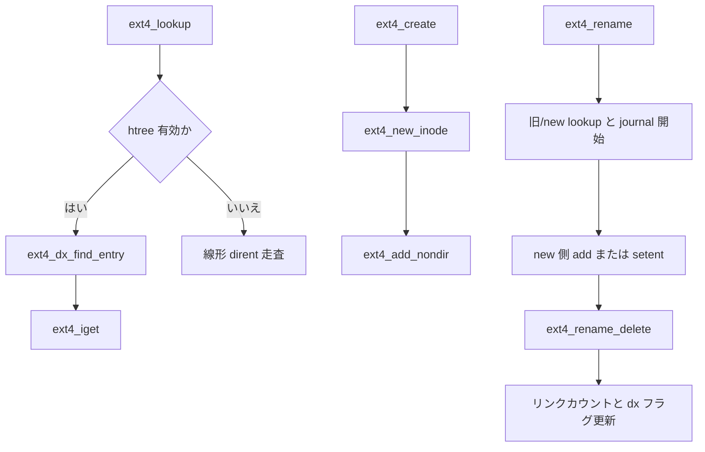

# 第5章 ext4 の directory、htree、rename

> **本章で読むソース**
>
> - [`fs/ext4/namei.c` L1689-L1707](https://github.com/gregkh/linux/blob/v6.18.38/fs/ext4/namei.c#L1689-L1707)
> - [`fs/ext4/namei.c` L1709-L1752](https://github.com/gregkh/linux/blob/v6.18.38/fs/ext4/namei.c#L1709-L1752)
> - [`fs/ext4/namei.c` L1762-L1793](https://github.com/gregkh/linux/blob/v6.18.38/fs/ext4/namei.c#L1762-L1793)
> - [`fs/ext4/namei.c` L2808-L2833](https://github.com/gregkh/linux/blob/v6.18.38/fs/ext4/namei.c#L2808-L2833)
> - [`fs/ext4/namei.c` L2468-L2526](https://github.com/gregkh/linux/blob/v6.18.38/fs/ext4/namei.c#L2468-L2526)
> - [`fs/ext4/namei.c` L3789-L3839](https://github.com/gregkh/linux/blob/v6.18.38/fs/ext4/namei.c#L3789-L3839)
> - [`fs/ext4/namei.c` L3854-L3903](https://github.com/gregkh/linux/blob/v6.18.38/fs/ext4/namei.c#L3854-L3903)
> - [`fs/ext4/namei.c` L3633-L3657](https://github.com/gregkh/linux/blob/v6.18.38/fs/ext4/namei.c#L3633-L3657)
> - [`fs/ext4/namei.c` L3928-L3956](https://github.com/gregkh/linux/blob/v6.18.38/fs/ext4/namei.c#L3928-L3956)
> - [`fs/ext4/namei.c` L3951-L3983](https://github.com/gregkh/linux/blob/v6.18.38/fs/ext4/namei.c#L3951-L3983)

## この章の狙い

ext4 がディレクトリエントリを lookup、作成、削除、rename する経路を `namei.c` から追う。
**htree**（ハッシュ付きディレクトリインデックス）が大規模ディレクトリの線形走査をどう避けるかを読む。
VFS のパス walk 一般論は [VFS 分冊](../../vfs/README.md) の担当とし、本章は ext4 固有の on-disk 操作に限定する。

## 前提

- [ext4 の inode と inode table](04-ext4-inode-table.md)
- [inode のライフサイクル](../../vfs/part02-mount-inode/09-inode-lifecycle.md)

## lookup 入口

`ext4_lookup` は `ext4_lookup_entry` でディレクトリブロックを引き、inode 番号から `ext4_iget` する。
名前長は `EXT4_NAME_LEN` を超えると `-ENAMETOOLONG` を返す。

[`fs/ext4/namei.c` L1762-L1793](https://github.com/gregkh/linux/blob/v6.18.38/fs/ext4/namei.c#L1762-L1793)

```c
static struct dentry *ext4_lookup(struct inode *dir, struct dentry *dentry, unsigned int flags)
{
	struct inode *inode;
	struct ext4_dir_entry_2 *de;
	struct buffer_head *bh;

	if (dentry->d_name.len > EXT4_NAME_LEN)
		return ERR_PTR(-ENAMETOOLONG);

	bh = ext4_lookup_entry(dir, dentry, &de);
	if (IS_ERR(bh))
		return ERR_CAST(bh);
	inode = NULL;
	if (bh) {
		__u32 ino = le32_to_cpu(de->inode);
		brelse(bh);
		if (!ext4_valid_inum(dir->i_sb, ino)) {
			EXT4_ERROR_INODE(dir, "bad inode number: %u", ino);
			return ERR_PTR(-EFSCORRUPTED);
		}
		if (unlikely(ino == dir->i_ino)) {
			EXT4_ERROR_INODE(dir, "'%pd' linked to parent dir",
					 dentry);
			return ERR_PTR(-EFSCORRUPTED);
		}
		inode = ext4_iget(dir->i_sb, ino, EXT4_IGET_NORMAL);
		if (inode == ERR_PTR(-ESTALE)) {
			EXT4_ERROR_INODE(dir,
					 "deleted inode referenced: %u",
					 ino);
			return ERR_PTR(-EFSCORRUPTED);
		}
```

`ext4_lookup_entry` はファイル名を `ext4_filename` に正規化してから `__ext4_find_entry` を呼ぶ。

[`fs/ext4/namei.c` L1689-L1707](https://github.com/gregkh/linux/blob/v6.18.38/fs/ext4/namei.c#L1689-L1707)

```c
static struct buffer_head *ext4_lookup_entry(struct inode *dir,
					     struct dentry *dentry,
					     struct ext4_dir_entry_2 **res_dir)
{
	int err;
	struct ext4_filename fname;
	struct buffer_head *bh;

	err = ext4_fname_prepare_lookup(dir, dentry, &fname);
	if (err == -ENOENT)
		return NULL;
	if (err)
		return ERR_PTR(err);

	bh = __ext4_find_entry(dir, &fname, res_dir, NULL);

	ext4_fname_free_filename(&fname);
	return bh;
}
```

## htree による検索

`EXT4_INDEX_FL` が立つディレクトリは `ext4_dx_find_entry` がハッシュツリーを辿る。
`dx_probe` でインデックスブロックを辿り、葉ブロックで `search_dirblock` する。

[`fs/ext4/namei.c` L1709-L1752](https://github.com/gregkh/linux/blob/v6.18.38/fs/ext4/namei.c#L1709-L1752)

```c
static struct buffer_head * ext4_dx_find_entry(struct inode *dir,
			struct ext4_filename *fname,
			struct ext4_dir_entry_2 **res_dir)
{
	struct super_block * sb = dir->i_sb;
	struct dx_frame frames[EXT4_HTREE_LEVEL], *frame;
	struct buffer_head *bh;
	ext4_lblk_t block;
	int retval;

#ifdef CONFIG_FS_ENCRYPTION
	*res_dir = NULL;
#endif
	frame = dx_probe(fname, dir, NULL, frames);
	if (IS_ERR(frame))
		return ERR_CAST(frame);
	do {
		block = dx_get_block(frame->at);
		bh = ext4_read_dirblock(dir, block, DIRENT_HTREE);
		if (IS_ERR(bh))
			goto errout;

		retval = search_dirblock(bh, dir, fname,
					 block << EXT4_BLOCK_SIZE_BITS(sb),
					 res_dir);
		if (retval == 1)
			goto success;
		brelse(bh);
		if (retval < 0) {
			bh = ERR_PTR(ERR_BAD_DX_DIR);
			goto errout;
		}

		/* Check to see if we should continue to search */
		retval = ext4_htree_next_block(dir, fname->hinfo.hash, frame,
					       frames, NULL);
		if (retval < 0) {
			ext4_warning_inode(dir,
				"error %d reading directory index block",
				retval);
			bh = ERR_PTR(retval);
			goto errout;
		}
	} while (retval == 1);
```

htree はハッシュで候補葉ブロックを絞り込み、葉内の線形スキャン範囲を小さくする。
ハッシュ衝突時は `ext4_htree_next_block` で隣接葉を辿る。

## htree への挿入と分割

`ext4_dx_add_entry` は `dx_probe` で葉を特定し、満杯ならインデックスブロックの分割へ進む。
`add_dirent_to_buf` が `-ENOSPC` を返すと、新ブロックを `ext4_append` し htree 深さを増やす。

[`fs/ext4/namei.c` L2468-L2526](https://github.com/gregkh/linux/blob/v6.18.38/fs/ext4/namei.c#L2468-L2526)

```c
static int ext4_dx_add_entry(handle_t *handle, struct ext4_filename *fname,
			     struct inode *dir, struct inode *inode)
{
	struct dx_frame frames[EXT4_HTREE_LEVEL], *frame;
	struct dx_entry *entries, *at;
	struct buffer_head *bh;
	struct super_block *sb = dir->i_sb;
	struct ext4_dir_entry_2 *de;
	int restart;
	int err;

again:
	restart = 0;
	frame = dx_probe(fname, dir, NULL, frames);
	if (IS_ERR(frame))
		return PTR_ERR(frame);
	entries = frame->entries;
	at = frame->at;
	bh = ext4_read_dirblock(dir, dx_get_block(frame->at), DIRENT_HTREE);
	if (IS_ERR(bh)) {
		err = PTR_ERR(bh);
		bh = NULL;
		goto cleanup;
	}

	BUFFER_TRACE(bh, "get_write_access");
	err = ext4_journal_get_write_access(handle, sb, bh, EXT4_JTR_NONE);
	if (err)
		goto journal_error;

	err = add_dirent_to_buf(handle, fname, dir, inode, NULL, bh);
	if (err != -ENOSPC)
		goto cleanup;

	err = 0;
	/* Block full, should compress but for now just split */
	dxtrace(printk(KERN_DEBUG "using %u of %u node entries\n",
		       dx_get_count(entries), dx_get_limit(entries)));
	/* Need to split index? */
	if (dx_get_count(entries) == dx_get_limit(entries)) {
		ext4_lblk_t newblock;
		int levels = frame - frames + 1;
		unsigned int icount;
		int add_level = 1;
		struct dx_entry *entries2;
		struct dx_node *node2;
		struct buffer_head *bh2;

		while (frame > frames) {
			if (dx_get_count((frame - 1)->entries) <
			    dx_get_limit((frame - 1)->entries)) {
				add_level = 0;
				break;
			}
			frame--; /* split higher index block */
			at = frame->at;
			entries = frame->entries;
			restart = 1;
		}
```

## create と unlink

`ext4_create` は `ext4_new_inode_start_handle` で inode を確保し、`ext4_add_nondir` でディレクトリエントリを挿入する。
ジャーナル handle は `ext4_journal_current_handle` で取得し、トランザクション内でメタデータを更新する。

[`fs/ext4/namei.c` L2808-L2833](https://github.com/gregkh/linux/blob/v6.18.38/fs/ext4/namei.c#L2808-L2833)

```c
static int ext4_create(struct mnt_idmap *idmap, struct inode *dir,
		       struct dentry *dentry, umode_t mode, bool excl)
{
	handle_t *handle;
	struct inode *inode;
	int err, credits, retries = 0;

	err = dquot_initialize(dir);
	if (err)
		return err;

	credits = (EXT4_DATA_TRANS_BLOCKS(dir->i_sb) +
		   EXT4_INDEX_EXTRA_TRANS_BLOCKS + 3);
retry:
	inode = ext4_new_inode_start_handle(idmap, dir, mode, &dentry->d_name,
					    0, NULL, EXT4_HT_DIR, credits);
	handle = ext4_journal_current_handle();
	err = PTR_ERR(inode);
	if (!IS_ERR(inode)) {
		inode->i_op = &ext4_file_inode_operations;
		inode->i_fop = &ext4_file_operations;
		ext4_set_aops(inode);
		err = ext4_add_nondir(handle, dentry, &inode);
		if (!err)
			ext4_fc_track_create(handle, dentry);
	}
```

`ext4_unlink` は `__ext4_unlink` に委譲し、ディレクトリエントリ削除と inode リンクカウント更新を行う。

[`fs/ext4/namei.c` L3294-L3314](https://github.com/gregkh/linux/blob/v6.18.38/fs/ext4/namei.c#L3294-L3314)

```c
static int ext4_unlink(struct inode *dir, struct dentry *dentry)
{
	int retval;

	retval = ext4_emergency_state(dir->i_sb);
	if (unlikely(retval))
		return retval;

	trace_ext4_unlink_enter(dir, dentry);
	/*
	 * Initialize quotas before so that eventual writes go
	 * in separate transaction
	 */
	retval = dquot_initialize(dir);
	if (retval)
		goto out_trace;
	retval = dquot_initialize(d_inode(dentry));
	if (retval)
		goto out_trace;

	retval = __ext4_unlink(dir, &dentry->d_name, d_inode(dentry), dentry);
```

## rename の構造

`ext4_rename` は `ext4_renament` で旧/new のディレクトリと dentry を束ね、ジャーナル credits を見積もる。
htree 分割中に `ent->de` が移動しうるため、`ext4_rename_delete` は強制再検索を行う。

[`fs/ext4/namei.c` L3789-L3839](https://github.com/gregkh/linux/blob/v6.18.38/fs/ext4/namei.c#L3789-L3839)

```c
static int ext4_rename(struct mnt_idmap *idmap, struct inode *old_dir,
		       struct dentry *old_dentry, struct inode *new_dir,
		       struct dentry *new_dentry, unsigned int flags)
{
	handle_t *handle = NULL;
	struct ext4_renament old = {
		.dir = old_dir,
		.dentry = old_dentry,
		.inode = d_inode(old_dentry),
	};
	struct ext4_renament new = {
		.dir = new_dir,
		.dentry = new_dentry,
		.inode = d_inode(new_dentry),
	};
	int force_reread;
	int retval;
	struct inode *whiteout = NULL;
	int credits;
	u8 old_file_type;

	if (new.inode && new.inode->i_nlink == 0) {
		EXT4_ERROR_INODE(new.inode,
				 "target of rename is already freed");
		return -EFSCORRUPTED;
	}

	if ((ext4_test_inode_flag(new_dir, EXT4_INODE_PROJINHERIT)) &&
	    (!projid_eq(EXT4_I(new_dir)->i_projid,
			EXT4_I(old_dentry->d_inode)->i_projid)))
		return -EXDEV;

	retval = dquot_initialize(old.dir);
	if (retval)
		return retval;
	retval = dquot_initialize(old.inode);
	if (retval)
		return retval;
	retval = dquot_initialize(new.dir);
	if (retval)
		return retval;

	/* Initialize quotas before so that eventual writes go
	 * in separate transaction */
	if (new.inode) {
		retval = dquot_initialize(new.inode);
		if (retval)
			return retval;
	}
```

旧/new の dentry を引いたあと `ext4_journal_start` で handle を開始し、ディレクトリ rename の前提検査を済ませる。
この後、new 側へ `ext4_add_entry` または `ext4_setent` を行い、旧エントリを `ext4_rename_delete` で消してからリンクカウントと `..` を更新する。

[`fs/ext4/namei.c` L3854-L3903](https://github.com/gregkh/linux/blob/v6.18.38/fs/ext4/namei.c#L3854-L3903)

```c
	new.bh = ext4_find_entry(new.dir, &new.dentry->d_name,
				 &new.de, &new.inlined);
	if (IS_ERR(new.bh)) {
		retval = PTR_ERR(new.bh);
		new.bh = NULL;
		goto release_bh;
	}
	if (new.bh) {
		if (!new.inode) {
			brelse(new.bh);
			new.bh = NULL;
		}
	}
	if (new.inode && !test_opt(new.dir->i_sb, NO_AUTO_DA_ALLOC))
		ext4_alloc_da_blocks(old.inode);

	credits = (2 * EXT4_DATA_TRANS_BLOCKS(old.dir->i_sb) +
		   EXT4_INDEX_EXTRA_TRANS_BLOCKS + 2);
	if (!(flags & RENAME_WHITEOUT)) {
		handle = ext4_journal_start(old.dir, EXT4_HT_DIR, credits);
		if (IS_ERR(handle)) {
			retval = PTR_ERR(handle);
			goto release_bh;
		}
	} else {
		whiteout = ext4_whiteout_for_rename(idmap, &old, credits, &handle);
		if (IS_ERR(whiteout)) {
			retval = PTR_ERR(whiteout);
			goto release_bh;
		}
	}

	old_file_type = old.de->file_type;
	if (IS_DIRSYNC(old.dir) || IS_DIRSYNC(new.dir))
		ext4_handle_sync(handle);

	if (S_ISDIR(old.inode->i_mode)) {
		if (new.inode) {
			retval = -ENOTEMPTY;
			if (!ext4_empty_dir(new.inode))
				goto end_rename;
		} else {
			retval = -EMLINK;
			if (new.dir != old.dir && EXT4_DIR_LINK_MAX(new.dir))
				goto end_rename;
		}
		retval = ext4_rename_dir_prepare(handle, &old, new.dir != old.dir);
		if (retval)
			goto end_rename;
	}
```

`ext4_setent` はディレクトリブロック上の dentry を新 inode 番号へ書き換える。
rename 成功経路では new 側へ `ext4_add_entry` または `ext4_setent` を行い、その後 `ext4_rename_delete` で旧エントリを消す。

[`fs/ext4/namei.c` L3633-L3657](https://github.com/gregkh/linux/blob/v6.18.38/fs/ext4/namei.c#L3633-L3657)

```c
static int ext4_setent(handle_t *handle, struct ext4_renament *ent,
		       unsigned ino, unsigned file_type)
{
	int retval, retval2;

	BUFFER_TRACE(ent->bh, "get write access");
	retval = ext4_journal_get_write_access(handle, ent->dir->i_sb, ent->bh,
					       EXT4_JTR_NONE);
	if (retval)
		return retval;
	ent->de->inode = cpu_to_le32(ino);
	if (ext4_has_feature_filetype(ent->dir->i_sb))
		ent->de->file_type = file_type;
	inode_inc_iversion(ent->dir);
	inode_set_mtime_to_ts(ent->dir, inode_set_ctime_current(ent->dir));
	retval = ext4_mark_inode_dirty(handle, ent->dir);
	BUFFER_TRACE(ent->bh, "call ext4_handle_dirty_metadata");
	if (!ent->inlined) {
		retval2 = ext4_handle_dirty_dirblock(handle, ent->dir, ent->bh);
		if (unlikely(retval2)) {
			ext4_std_error(ent->dir->i_sb, retval2);
			return retval2;
		}
	}
	return retval;
}
```

[`fs/ext4/namei.c` L3928-L3956](https://github.com/gregkh/linux/blob/v6.18.38/fs/ext4/namei.c#L3928-L3956)

```c
	if (!new.bh) {
		retval = ext4_add_entry(handle, new.dentry, old.inode);
		if (retval)
			goto end_rename;
	} else {
		retval = ext4_setent(handle, &new,
				     old.inode->i_ino, old_file_type);
		if (retval)
			goto end_rename;
	}
	if (force_reread)
		force_reread = !ext4_test_inode_flag(new.dir,
						     EXT4_INODE_INLINE_DATA);

	/*
	 * Like most other Unix systems, set the ctime for inodes on a
	 * rename.
	 */
	inode_set_ctime_current(old.inode);
	retval = ext4_mark_inode_dirty(handle, old.inode);
	if (unlikely(retval))
		goto end_rename;

	if (!whiteout) {
		/*
		 * ok, that's it
		 */
		ext4_rename_delete(handle, &old, force_reread);
	}
```

成功経路では旧エントリ削除、リンクカウント更新、`..` 更新、ジャーナル dirty を順に処理する。

[`fs/ext4/namei.c` L3951-L3983](https://github.com/gregkh/linux/blob/v6.18.38/fs/ext4/namei.c#L3951-L3983)

```c
	if (!whiteout) {
		/*
		 * ok, that's it
		 */
		ext4_rename_delete(handle, &old, force_reread);
	}

	if (new.inode) {
		ext4_dec_count(new.inode);
		inode_set_ctime_current(new.inode);
	}
	inode_set_mtime_to_ts(old.dir, inode_set_ctime_current(old.dir));
	ext4_update_dx_flag(old.dir);
	if (old.is_dir) {
		retval = ext4_rename_dir_finish(handle, &old, new.dir->i_ino);
		if (retval)
			goto end_rename;

		ext4_dec_count(old.dir);
		if (new.inode) {
			/* checked ext4_empty_dir above, can't have another
			 * parent, ext4_dec_count() won't work for many-linked
			 * dirs */
			clear_nlink(new.inode);
		} else {
			ext4_inc_count(new.dir);
			ext4_update_dx_flag(new.dir);
			retval = ext4_mark_inode_dirty(handle, new.dir);
			if (unlikely(retval))
				goto end_rename;
		}
	}
	retval = ext4_mark_inode_dirty(handle, old.dir);
```

## 処理の流れ



## 高速化と最適化の工夫

htree はハッシュで候補葉を絞り込み、大規模ディレクトリの全ブロック線形走査を避ける。
`EXT4_INDEX_EXTRA_TRANS_BLOCKS` は htree 分割時の追加ジャーナルブロックを credits に織り込み、トランザクション途中の `-ENOSPC` を減らす。
rename では `force_reread` で htree 分割と競合した dentry ポインタの陳腐化を検出する。

## まとめ

ext4 の名前解決は `namei.c` が dirent と htree を操作し、create/unlink/rename は jbd2 トランザクション内でディレクトリメタデータを更新する。
本章は ext4 固有の on-disk ディレクトリ操作であり、VFS の多段パス walk は別分冊で扱う。

## 関連する章

- [ext4 の inode と inode table](04-ext4-inode-table.md)
- [ext4 の extent ツリー](06-ext4-extent-tree.md)
- [jbd2 のジャーナリング](07-jbd2-journaling.md)
