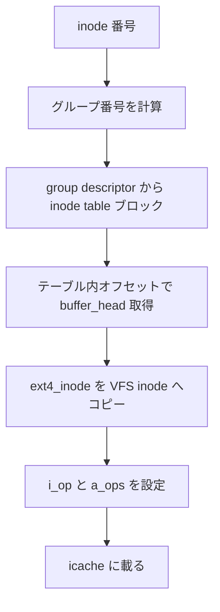

# 第5章 ext4 の inode と inode table

> **本章で読むソース**
>
> - [`fs/ext4/ext4.h` L787-L814](https://github.com/gregkh/linux/blob/v6.18.38/fs/ext4/ext4.h#L787-L814)
> - [`fs/ext4/inode.c` L5197-L5249](https://github.com/gregkh/linux/blob/v6.18.38/fs/ext4/inode.c#L5197-L5249)
> - [`fs/ext4/inode.c` L5237-L5249](https://github.com/gregkh/linux/blob/v6.18.38/fs/ext4/inode.c#L5237-L5249)
> - [`fs/ext4/ext4.h` L1530-L1545](https://github.com/gregkh/linux/blob/v6.18.38/fs/ext4/ext4.h#L1530-L1545)
> - [`fs/ext4/inode.c` L5240-L5248](https://github.com/gregkh/linux/blob/v6.18.38/fs/ext4/inode.c#L5240-L5248)
> - [`fs/ext4/namei.c` L1787-L1788](https://github.com/gregkh/linux/blob/v6.18.38/fs/ext4/namei.c#L1787-L1788)

## この章の狙い

on-disk の `struct ext4_inode` が VFS の `struct inode` へどう載るかを `ext4_iget` 経路で追う。
inode 番号からグループ内テーブル位置を引き、メタデータをメモリへ展開する流れを押さえる。

## 前提

- 前章：[ext4 の super block と block group](04-ext4-super-block-group.md)
- [inode のライフサイクル](../../vfs/part02-mount-inode/09-inode-lifecycle.md)

## on-disk inode 構造

ディスク上の inode はモード、サイズ、タイムスタンプ、ブロックポインタ配列 `i_block` を持つ。
extent 使用時は `i_block` 先頭が `ext4_extent_header` として解釈される。

[`fs/ext4/ext4.h` L787-L814](https://github.com/gregkh/linux/blob/v6.18.38/fs/ext4/ext4.h#L787-L814)

```c
struct ext4_inode {
	__le16	i_mode;		/* File mode */
	__le16	i_uid;		/* Low 16 bits of Owner Uid */
	__le32	i_size_lo;	/* Size in bytes */
	__le32	i_atime;	/* Access time */
	__le32	i_ctime;	/* Inode Change time */
	__le32	i_mtime;	/* Modification time */
	__le32	i_dtime;	/* Deletion Time */
	__le16	i_gid;		/* Low 16 bits of Group Id */
	__le16	i_links_count;	/* Links count */
	__le32	i_blocks_lo;	/* Blocks count */
	__le32	i_flags;	/* File flags */
	union {
		struct {
			__le32  l_i_version;
		} linux1;
		struct {
			__u32  h_i_translator;
		} hurd1;
		struct {
			__u32  m_i_reserved1;
		} masix1;
	} osd1;				/* OS dependent 1 */
	__le32	i_block[EXT4_N_BLOCKS];/* Pointers to blocks */
	__le32	i_generation;	/* File version (for NFS) */
	__le32	i_file_acl_lo;	/* File ACL */
	__le32	i_size_high;
	__le32	i_obso_faddr;	/* Obsoleted fragment address */
```

`i_flags` の `EXT4_INODE_EXTENTS` が立っているファイルは indirect ブロックではなく extent ツリーを使う。
次章で extent ヘッダと葉の対応を読む。

## ext4_inode_info と super_block 側のキャッシュ

カーネル内では `struct ext4_inode_info` が `struct inode` に埋め込まれ、ディスク位置や予約ブロック数を保持する。
`ext4_sb_info` は on-disk super block へのポインタ `s_es` を持つ。

[`fs/ext4/ext4.h` L1530-L1545](https://github.com/gregkh/linux/blob/v6.18.38/fs/ext4/ext4.h#L1530-L1545)

```c
	unsigned long s_overhead;  /* # of fs overhead clusters */
	unsigned int s_cluster_ratio;	/* Number of blocks per cluster */
	unsigned int s_cluster_bits;	/* log2 of s_cluster_ratio */
	loff_t s_bitmap_maxbytes;	/* max bytes for bitmap files */
	struct buffer_head * s_sbh;	/* Buffer containing the super block */
	struct ext4_super_block *s_es;	/* Pointer to the super block in the buffer */
	/* Array of bh's for the block group descriptors */
	struct buffer_head * __rcu *s_group_desc;
	unsigned int s_mount_opt;
	unsigned int s_mount_opt2;
	unsigned long s_mount_flags;
	unsigned int s_def_mount_opt;
	unsigned int s_def_mount_opt2;
	ext4_fsblk_t s_sb_block;
	atomic64_t s_resv_clusters;
	kuid_t s_resuid;
```

`s_group_desc` が group descriptor テーブルへのキャッシュであり、inode 番号からグループを引くたびに参照される。

## ext4_iget の入口

`ext4_iget` は inode 番号の範囲検査のあと `iget_locked` で VFS inode を取得する。
新規 inode なら `__ext4_get_inode_loc_noinmem` でディスク上の inode レコード位置を解決する。

[`fs/ext4/inode.c` L5197-L5249](https://github.com/gregkh/linux/blob/v6.18.38/fs/ext4/inode.c#L5197-L5249)

```c
struct inode *__ext4_iget(struct super_block *sb, unsigned long ino,
			  ext4_iget_flags flags, const char *function,
			  unsigned int line)
{
	struct ext4_iloc iloc;
	struct ext4_inode *raw_inode;
	struct ext4_inode_info *ei;
	struct ext4_super_block *es = EXT4_SB(sb)->s_es;
	struct inode *inode;
	journal_t *journal = EXT4_SB(sb)->s_journal;
	long ret;
	loff_t size;
	int block;
	uid_t i_uid;
	gid_t i_gid;
	projid_t i_projid;

	if ((!(flags & EXT4_IGET_SPECIAL) && is_special_ino(sb, ino)) ||
	    (ino < EXT4_ROOT_INO) ||
	    (ino > le32_to_cpu(es->s_inodes_count))) {
		if (flags & EXT4_IGET_HANDLE)
			return ERR_PTR(-ESTALE);
		__ext4_error(sb, function, line, false, EFSCORRUPTED, 0,
			     "inode #%lu: comm %s: iget: illegal inode #",
			     ino, current->comm);
		return ERR_PTR(-EFSCORRUPTED);
	}

	inode = iget_locked(sb, ino);
	if (!inode)
		return ERR_PTR(-ENOMEM);
	if (!(inode->i_state & I_NEW)) {
		ret = check_igot_inode(inode, flags, function, line);
		if (ret) {
			iput(inode);
			return ERR_PTR(ret);
		}
		return inode;
	}

	ei = EXT4_I(inode);
	iloc.bh = NULL;

	ret = __ext4_get_inode_loc_noinmem(inode, &iloc);
	if (ret < 0)
		goto bad_inode;
	raw_inode = ext4_raw_inode(&iloc);

	if ((flags & EXT4_IGET_HANDLE) &&
	    (raw_inode->i_links_count == 0) && (raw_inode->i_mode == 0)) {
		ret = -ESTALE;
		goto bad_inode;
	}
```

`I_NEW` が立っていない inode は icache 命中であり、ディスク読取を省略できる。
`iloc` は inode が載った `buffer_head` とテーブル内オフセットを保持する。

## inode 番号からテーブルブロックへの変換

`__ext4_get_inode_loc` は inode 番号から block group、テーブル内オフセット、格納ブロック番号を計算する。
group descriptor の `bg_inode_table` を起点に、inode table 上の `buffer_head` を取得する。

[`fs/ext4/inode.c` L4815-L4850](https://github.com/gregkh/linux/blob/v6.18.38/fs/ext4/inode.c#L4815-L4850)

```c
static int __ext4_get_inode_loc(struct super_block *sb, unsigned long ino,
				struct inode *inode, struct ext4_iloc *iloc,
				ext4_fsblk_t *ret_block)
{
	struct ext4_group_desc	*gdp;
	struct buffer_head	*bh;
	ext4_fsblk_t		block;
	struct blk_plug		plug;
	int			inodes_per_block, inode_offset;

	iloc->bh = NULL;
	if (ino < EXT4_ROOT_INO ||
	    ino > le32_to_cpu(EXT4_SB(sb)->s_es->s_inodes_count))
		return -EFSCORRUPTED;

	iloc->block_group = (ino - 1) / EXT4_INODES_PER_GROUP(sb);
	gdp = ext4_get_group_desc(sb, iloc->block_group, NULL);
	if (!gdp)
		return -EIO;

	/*
	 * Figure out the offset within the block group inode table
	 */
	inodes_per_block = EXT4_SB(sb)->s_inodes_per_block;
	inode_offset = ((ino - 1) %
			EXT4_INODES_PER_GROUP(sb));
	iloc->offset = (inode_offset % inodes_per_block) * EXT4_INODE_SIZE(sb);

	block = ext4_inode_table(sb, gdp);
	if ((block <= le32_to_cpu(EXT4_SB(sb)->s_es->s_first_data_block)) ||
	    (block >= ext4_blocks_count(EXT4_SB(sb)->s_es))) {
		ext4_error(sb, "Invalid inode table block %llu in "
			   "block_group %u", block, iloc->block_group);
		return -EFSCORRUPTED;
	}
	block += (inode_offset / inodes_per_block);
```

## on-disk inode の検証とメモリへの展開

ディスクから読んだ `raw_inode` は checksum と `i_extra_isize` を検証してから VFS フィールドへ写される。
`metadata_csum` feature 有効時は `i_csum_seed` を事前計算する。

[`fs/ext4/inode.c` L5267-L5284](https://github.com/gregkh/linux/blob/v6.18.38/fs/ext4/inode.c#L5267-L5284)

```c
	/* Precompute checksum seed for inode metadata */
	if (ext4_has_feature_metadata_csum(sb)) {
		struct ext4_sb_info *sbi = EXT4_SB(inode->i_sb);
		__u32 csum;
		__le32 inum = cpu_to_le32(inode->i_ino);
		__le32 gen = raw_inode->i_generation;
		csum = ext4_chksum(sbi->s_csum_seed, (__u8 *)&inum,
				   sizeof(inum));
		ei->i_csum_seed = ext4_chksum(csum, (__u8 *)&gen, sizeof(gen));
	}

	if ((!ext4_inode_csum_verify(inode, raw_inode, ei) ||
	    ext4_simulate_fail(sb, EXT4_SIM_INODE_CRC)) &&
	     (!(EXT4_SB(sb)->s_mount_state & EXT4_FC_REPLAY))) {
		ext4_error_inode_err(inode, function, line, 0,
				EFSBADCRC, "iget: checksum invalid");
		ret = -EFSBADCRC;
		goto bad_inode;
```

## 名前解決からの iget 呼び出し

ディレクトリエントリに格納された inode 番号は `ext4_iget` で実体化される。
lookup 経路はパス解決の末端で inode を初めてメモリへ載せる。

[`fs/ext4/namei.c` L1787-L1788](https://github.com/gregkh/linux/blob/v6.18.38/fs/ext4/namei.c#L1787-L1788)

```c
		inode = ext4_iget(dir->i_sb, ino, EXT4_IGET_NORMAL);
		if (inode == ERR_PTR(-ESTALE)) {
```

`EXT4_IGET_NORMAL` はジャーナルリカバリ中でない通常パスを示す。
特殊 inode（ジャーナル inode 等）は `EXT4_IGET_SPECIAL` で別検査を通す。

## 処理の流れ



inode table はグループごとに連続ブロックとして配置され、番号の高位がグループを決める。
これにより局所性の高い割当が可能になる。

## 高速化と最適化の工夫

`iget_locked` と icache により同一 inode の重複読取を避ける。
`s_inode_readahead_blks` はマウント時に設定され、連続 inode の先読みでテーブル走査 I/O をまとめる。
inode checksum と `EXT4_BG_INODE_ZEROED` は未使用領域の検証コストを削り、安全な遅延初期化を可能にする。

## まとめ

ext4 の inode は group descriptor が指す inode table 上の固定サイズレコードである。
`ext4_iget` が on-disk 形式を VFS inode へ写し、以降の read/write はメモリ上の `inode` を起点に動く。

## 関連する章

- 前章：[ext4 の super block と block group](04-ext4-super-block-group.md)
- 次章：[ext4 の extent ツリー](06-ext4-extent-tree.md)
- [inode のライフサイクル](../../vfs/part02-mount-inode/09-inode-lifecycle.md)
