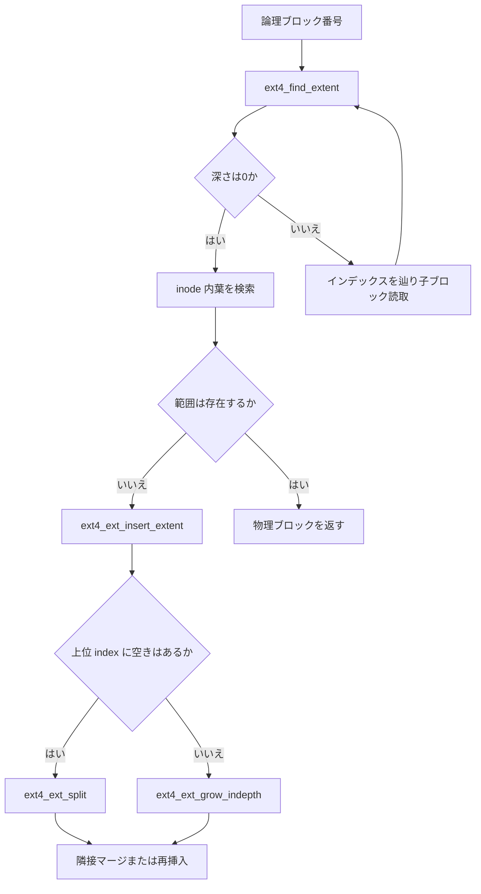

# 第6章 ext4 の extent ツリー

> **本章で読むソース**
>
> - [`fs/ext4/ext4_extents.h` L56-L83](https://github.com/gregkh/linux/blob/v6.18.38/fs/ext4/ext4_extents.h#L56-L83)
> - [`fs/ext4/extents.c` L892-L934](https://github.com/gregkh/linux/blob/v6.18.38/fs/ext4/extents.c#L892-L934)
> - [`fs/ext4/extents.c` L1997-L2064](https://github.com/gregkh/linux/blob/v6.18.38/fs/ext4/extents.c#L1997-L2064)
> - [`fs/ext4/ext4_extents.h` L33-L39](https://github.com/gregkh/linux/blob/v6.18.38/fs/ext4/ext4_extents.h#L33-L39)
> - [`fs/ext4/extents.c` L880-L889](https://github.com/gregkh/linux/blob/v6.18.38/fs/ext4/extents.c#L880-L889)
> - [`fs/ext4/extents.c` L2046-L2064](https://github.com/gregkh/linux/blob/v6.18.38/fs/ext4/extents.c#L2046-L2064)

## この章の狙い

論理ブロック番号から物理ブロックへの写像を担う extent ツリーの on-disk 形式と、`ext4_find_extent`、`ext4_ext_insert_extent` の動きを追う。
大ファイルでも indirect チェーンより浅い木でランダムアクセスを支える仕組みを機構レベルで読む。

## 前提

- 前章：[ext4 の directory、htree、rename](05-ext4-directory-htree-rename.md)
- [read 経路と iov_iter](../../vfs/part03-file-io/11-read-path.md)

## inode 内の extent 領域

`ext4_inode` の `i_block` 60 バイトは、先頭 12 バイトが `ext4_extent_header`、残りが葉の `ext4_extent` 配列として使われる。
浅いファイルは inode 内インラインの葉だけで完結し、深くなると別ブロックのインデックスノードへ伸びる。

[`fs/ext4/ext4_extents.h` L33-L39](https://github.com/gregkh/linux/blob/v6.18.38/fs/ext4/ext4_extents.h#L33-L39)

```c
/*
 * ext4_inode has i_block array (60 bytes total).
 * The first 12 bytes store ext4_extent_header;
 * the remainder stores an array of ext4_extent.
 * For non-inode extent blocks, ext4_extent_tail
 * follows the array.
 */
```

## 葉とインデックスの on-disk 形式

葉の `ext4_extent` は論理開始ブロック `ee_block`、長さ `ee_len`、物理開始の下位と上位を持つ。
インデックス `ext4_extent_idx` は子ノードへのポインタである。

[`fs/ext4/ext4_extents.h` L56-L83](https://github.com/gregkh/linux/blob/v6.18.38/fs/ext4/ext4_extents.h#L56-L83)

```c
struct ext4_extent {
	__le32	ee_block;	/* first logical block extent covers */
	__le16	ee_len;		/* number of blocks covered by extent */
	__le16	ee_start_hi;	/* high 16 bits of physical block */
	__le32	ee_start_lo;	/* low 32 bits of physical block */
};

/*
 * This is index on-disk structure.
 * It's used at all the levels except the bottom.
 */
struct ext4_extent_idx {
	__le32	ei_block;	/* index covers logical blocks from 'block' */
	__le32	ei_leaf_lo;	/* pointer to the physical block of the next *
				 * level. leaf or next index could be there */
	__le16	ei_leaf_hi;	/* high 16 bits of physical block */
	__u16	ei_unused;
};

/*
 * Each block (leaves and indexes), even inode-stored has header.
 */
struct ext4_extent_header {
	__le16	eh_magic;	/* probably will support different formats */
	__le16	eh_entries;	/* number of valid entries */
	__le16	eh_max;		/* capacity of store in entries */
	__le16	eh_depth;	/* has tree real underlying blocks? */
	__le32	eh_generation;	/* generation of the tree */
```

`ee_len` の最上位ビットは **unwritten extent** を示し、割当済みだがデータ未書き込みの範囲を表す。
読取時はゼロ埋め、書込時に written extent へ変換する。

## ext4_find_extent による木走査

論理ブロック番号を含む葉を探すとき、`ext4_find_extent` がヘッダから深さ `depth` を取り、インデックスを辿る。
深さ 0 の葉ではインラインキャッシュ `ext4_cache_extents` が任意で走る。

[`fs/ext4/extents.c` L892-L934](https://github.com/gregkh/linux/blob/v6.18.38/fs/ext4/extents.c#L892-L934)

```c
ext4_find_extent(struct inode *inode, ext4_lblk_t block,
		 struct ext4_ext_path *path, int flags)
{
	struct ext4_extent_header *eh;
	struct buffer_head *bh;
	short int depth, i, ppos = 0;
	int ret;
	gfp_t gfp_flags = GFP_NOFS;

	if (flags & EXT4_EX_NOFAIL)
		gfp_flags |= __GFP_NOFAIL;

	eh = ext_inode_hdr(inode);
	depth = ext_depth(inode);
	if (depth < 0 || depth > EXT4_MAX_EXTENT_DEPTH) {
		EXT4_ERROR_INODE(inode, "inode has invalid extent depth: %d",
				 depth);
		ret = -EFSCORRUPTED;
		goto err;
	}

	if (path) {
		ext4_ext_drop_refs(path);
		if (depth > path[0].p_maxdepth) {
			kfree(path);
			path = NULL;
		}
	}
	if (!path) {
		/* account possible depth increase */
		path = kcalloc(depth + 2, sizeof(struct ext4_ext_path),
				gfp_flags);
		if (unlikely(!path))
			return ERR_PTR(-ENOMEM);
		path[0].p_maxdepth = depth + 1;
	}
	path[0].p_hdr = eh;
	path[0].p_bh = NULL;

	i = depth;
	if (!(flags & EXT4_EX_NOCACHE) && depth == 0)
		ext4_cache_extents(inode, eh);
	/* walk through the tree */
```

返却される `ext4_ext_path` は各レベルのヘッダと `buffer_head` 参照を保持し、更新時のジャーナル操作に使う。

## 新規 extent の挿入と隣接マージ

書き込みで新しい論理範囲が必要になると `ext4_ext_insert_extent` が葉へ挿入する。
隣接する既存 extent と物理的に連続なら長さを伸ばしてエントリ数を増やさない。

[`fs/ext4/extents.c` L1997-L2064](https://github.com/gregkh/linux/blob/v6.18.38/fs/ext4/extents.c#L1997-L2064)

```c
ext4_ext_insert_extent(handle_t *handle, struct inode *inode,
		       struct ext4_ext_path *path,
		       struct ext4_extent *newext, int gb_flags)
{
	struct ext4_extent_header *eh;
	struct ext4_extent *ex, *fex;
	struct ext4_extent *nearex; /* nearest extent */
	int depth, len, err = 0;
	ext4_lblk_t next;
	int mb_flags = 0, unwritten;

	if (gb_flags & EXT4_GET_BLOCKS_DELALLOC_RESERVE)
		mb_flags |= EXT4_MB_DELALLOC_RESERVED;
	if (unlikely(ext4_ext_get_actual_len(newext) == 0)) {
		EXT4_ERROR_INODE(inode, "ext4_ext_get_actual_len(newext) == 0");
		err = -EFSCORRUPTED;
		goto errout;
	}
	depth = ext_depth(inode);
	ex = path[depth].p_ext;
	eh = path[depth].p_hdr;
	if (unlikely(path[depth].p_hdr == NULL)) {
		EXT4_ERROR_INODE(inode, "path[%d].p_hdr == NULL", depth);
		err = -EFSCORRUPTED;
		goto errout;
	}

	/* try to insert block into found extent and return */
	if (ex && !(gb_flags & EXT4_GET_BLOCKS_PRE_IO)) {

		/*
		 * Try to see whether we should rather test the extent on
		 * right from ex, or from the left of ex. This is because
		 * ext4_find_extent() can return either extent on the
		 * left, or on the right from the searched position. This
		 * will make merging more effective.
		 */
		if (ex < EXT_LAST_EXTENT(eh) &&
		    (le32_to_cpu(ex->ee_block) +
		    ext4_ext_get_actual_len(ex) <
		    le32_to_cpu(newext->ee_block))) {
			ex += 1;
			goto prepend;
		} else if ((ex > EXT_FIRST_EXTENT(eh)) &&
			   (le32_to_cpu(newext->ee_block) +
			   ext4_ext_get_actual_len(newext) <
			   le32_to_cpu(ex->ee_block)))
			ex -= 1;

		/* Try to append newex to the ex */
		if (ext4_can_extents_be_merged(inode, ex, newext)) {
			ext_debug(inode, "append [%d]%d block to %u:[%d]%d"
				  "(from %llu)\n",
				  ext4_ext_is_unwritten(newext),
				  ext4_ext_get_actual_len(newext),
				  le32_to_cpu(ex->ee_block),
				  ext4_ext_is_unwritten(ex),
				  ext4_ext_get_actual_len(ex),
				  ext4_ext_pblock(ex));
			err = ext4_ext_get_access(handle, inode,
						  path + depth);
			if (err)
				goto errout;
			unwritten = ext4_ext_is_unwritten(ex);
			ex->ee_len = cpu_to_le16(ext4_ext_get_actual_len(ex)
					+ ext4_ext_get_actual_len(newext));
			if (unwritten)
				ext4_ext_mark_unwritten(ex);
```

マージによりメタデータ更新とジャーナルトランザクションのコストを抑える。

## 木の初期化

extent 機能へ初めて切り替える inode では `ext4_ext_tree_init` が inode 内ヘッダを初期化する。

[`fs/ext4/extents.c` L880-L889](https://github.com/gregkh/linux/blob/v6.18.38/fs/ext4/extents.c#L880-L889)

```c
	struct ext4_extent_header *eh;

	eh = ext_inode_hdr(inode);
	eh->eh_depth = 0;
	eh->eh_entries = 0;
	eh->eh_magic = EXT4_EXT_MAGIC;
	eh->eh_max = cpu_to_le16(ext4_ext_space_root(inode, 0));
	eh->eh_generation = 0;
	ext4_mark_inode_dirty(handle, inode);
}
```

## ext4_ext_create_new_leaf による分岐

葉が満杯で新規 extent を挿入できないとき、`ext4_ext_insert_extent` は `ext4_ext_create_new_leaf` を呼ぶ。
上位インデックスに空きがあれば `ext4_ext_split` で新 leaf または subtree を作り、空きがなければ `ext4_ext_grow_indepth` で深さだけを増やす。

[`fs/ext4/extents.c` L1404-L1439](https://github.com/gregkh/linux/blob/v6.18.38/fs/ext4/extents.c#L1404-L1439)

```c
static struct ext4_ext_path *
ext4_ext_create_new_leaf(handle_t *handle, struct inode *inode,
			 unsigned int mb_flags, unsigned int gb_flags,
			 struct ext4_ext_path *path,
			 struct ext4_extent *newext)
{
	struct ext4_ext_path *curp;
	int depth, i, err = 0;
	ext4_lblk_t ee_block = le32_to_cpu(newext->ee_block);

repeat:
	i = depth = ext_depth(inode);

	/* walk up to the tree and look for free index entry */
	curp = path + depth;
	while (i > 0 && !EXT_HAS_FREE_INDEX(curp)) {
		i--;
		curp--;
	}

	/* we use already allocated block for index block,
	 * so subsequent data blocks should be contiguous */
	if (EXT_HAS_FREE_INDEX(curp)) {
		/* if we found index with free entry, then use that
		 * entry: create all needed subtree and add new leaf */
		err = ext4_ext_split(handle, inode, mb_flags, path, newext, i);
		if (err)
			goto errout;

		/* refill path */
		path = ext4_find_extent(inode, ee_block, path, gb_flags);
		return path;
	}

	/* tree is full, time to grow in depth */
	err = ext4_ext_grow_indepth(handle, inode, mb_flags);
```

深さ増加後も葉が満杯なら `repeat` で再度 `ext4_ext_split` へ進む。

## ext4_ext_split による葉分割

`ext4_ext_split` は同一深さのまま新ブロックへ葉またはインデックスを分割する。
分割位置は通常、現在の extent 境界か新規 extent の開始ブロックである。

[`fs/ext4/extents.c` L1058-L1097](https://github.com/gregkh/linux/blob/v6.18.38/fs/ext4/extents.c#L1058-L1097)

```c
static int ext4_ext_split(handle_t *handle, struct inode *inode,
			  unsigned int flags,
			  struct ext4_ext_path *path,
			  struct ext4_extent *newext, int at)
{
	struct buffer_head *bh = NULL;
	int depth = ext_depth(inode);
	struct ext4_extent_header *neh;
	struct ext4_extent_idx *fidx;
	int i = at, k, m, a;
	ext4_fsblk_t newblock, oldblock;
	__le32 border;
	ext4_fsblk_t *ablocks = NULL; /* array of allocated blocks */
	gfp_t gfp_flags = GFP_NOFS;
	int err = 0;
	size_t ext_size = 0;

	if (flags & EXT4_EX_NOFAIL)
		gfp_flags |= __GFP_NOFAIL;

	/* make decision: where to split? */
	/* FIXME: now decision is simplest: at current extent */

	/* if current leaf will be split, then we should use
	 * border from split point */
	if (unlikely(path[depth].p_ext > EXT_MAX_EXTENT(path[depth].p_hdr))) {
		EXT4_ERROR_INODE(inode, "p_ext > EXT_MAX_EXTENT!");
		return -EFSCORRUPTED;
	}
	if (path[depth].p_ext != EXT_MAX_EXTENT(path[depth].p_hdr)) {
		border = path[depth].p_ext[1].ee_block;
		ext_debug(inode, "leaf will be split."
				" next leaf starts at %d\n",
				  le32_to_cpu(border));
	} else {
		border = newext->ee_block;
		ext_debug(inode, "leaf will be added."
				" next leaf starts at %d\n",
				le32_to_cpu(border));
	}
```

## ext4_ext_grow_indepth による深さ増加

上位インデックスに空きがないときだけ `ext4_ext_grow_indepth` が呼ばれる。
既存のトップレベル葉またはインデックスを新ブロックへ移し、inode 内ヘッダから1段深いインデックスを作る。

[`fs/ext4/extents.c` L1317-L1356](https://github.com/gregkh/linux/blob/v6.18.38/fs/ext4/extents.c#L1317-L1356)

```c
static int ext4_ext_grow_indepth(handle_t *handle, struct inode *inode,
				 unsigned int flags)
{
	struct ext4_extent_header *neh;
	struct buffer_head *bh;
	ext4_fsblk_t newblock, goal = 0;
	struct ext4_super_block *es = EXT4_SB(inode->i_sb)->s_es;
	int err = 0;
	size_t ext_size = 0;

	/* Try to prepend new index to old one */
	if (ext_depth(inode))
		goal = ext4_idx_pblock(EXT_FIRST_INDEX(ext_inode_hdr(inode)));
	if (goal > le32_to_cpu(es->s_first_data_block)) {
		flags |= EXT4_MB_HINT_TRY_GOAL;
		goal--;
	} else
		goal = ext4_inode_to_goal_block(inode);
	newblock = ext4_new_meta_blocks(handle, inode, goal, flags,
					NULL, &err);
	if (newblock == 0)
		return err;

	bh = sb_getblk_gfp(inode->i_sb, newblock, __GFP_MOVABLE | GFP_NOFS);
	if (unlikely(!bh))
		return -ENOMEM;
	lock_buffer(bh);

	err = ext4_journal_get_create_access(handle, inode->i_sb, bh,
					     EXT4_JTR_NONE);
	if (err) {
		unlock_buffer(bh);
		goto out;
	}

	ext_size = sizeof(EXT4_I(inode)->i_data);
	/* move top-level index/leaf into new block */
	memmove(bh->b_data, EXT4_I(inode)->i_data, ext_size);
	/* zero out unused area in the extent block */
	memset(bh->b_data + ext_size, 0, inode->i_sb->s_blocksize - ext_size);
```

## 処理の流れ



read/write の `get_block` 相当処理はこの木走査と更新の上に載る。

## 高速化と最適化の工夫

inode 内インライン葉により小ファイルは追加メタデータブロックを不要にする。
隣接 extent のマージはエントリ数と木の深さ増加を遅らせ、走査コストを抑える。
`ext4_cache_extents` は浅い木のヒット範囲をメモリに載せ、連続 read の二分探索回数を減らす。

## まとめ

ext4 の extent ツリーは論理から物理への写像を B 木風の浅い構造で保持する。
`ext4_find_extent` が読取位置を、`ext4_ext_insert_extent` が書き込み時の更新とマージを担う。
葉満杯時は `ext4_ext_split` と `ext4_ext_grow_indepth` が別経路で呼ばれる。

## 関連する章

- 次章：[jbd2 のジャーナリング](07-jbd2-journaling.md)
- 次章：[ext4 の delayed allocation](08-ext4-delayed-allocation.md)
- [ext4 の inode と inode table](04-ext4-inode-table.md)
