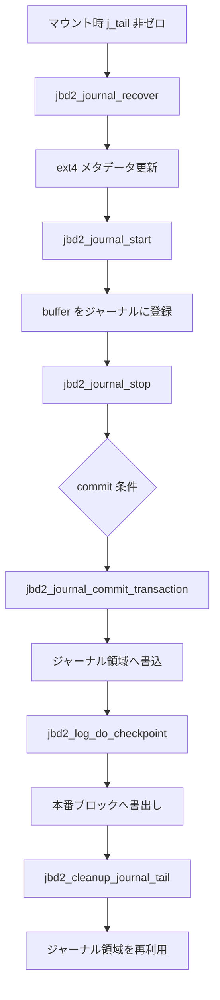

# 第7章 jbd2 のジャーナリング

> **本章で読むソース**
>
> - [`fs/jbd2/transaction.c` L538-L542](https://github.com/gregkh/linux/blob/v6.18.38/fs/jbd2/transaction.c#L538-L542)
> - [`fs/jbd2/transaction.c` L580-L589](https://github.com/gregkh/linux/blob/v6.18.38/fs/jbd2/transaction.c#L580-L589)
> - [`fs/jbd2/commit.c` L343-L385](https://github.com/gregkh/linux/blob/v6.18.38/fs/jbd2/commit.c#L343-L385)
> - [`fs/ext4/super.c` L5782-L5801](https://github.com/gregkh/linux/blob/v6.18.38/fs/ext4/super.c#L5782-L5801)
> - [`include/linux/jbd2.h` L87-L105](https://github.com/gregkh/linux/blob/v6.18.38/include/linux/jbd2.h#L87-L105)
> - [`fs/jbd2/commit.c` L387-L395](https://github.com/gregkh/linux/blob/v6.18.38/fs/jbd2/commit.c#L387-L395)

## この章の狙い

ext4 が依存する jbd2 の **handle**、**transaction**、**commit** の関係をソースから追う。
メタデータ更新がジャーナルに記録され、クラッシュ後に整合が回復するまでの経路を機構レベルで読む。

## 前提

- [ext4 の extent ツリー](06-ext4-extent-tree.md)
- [同期と RCU](../../locking/README.md) のロック一般論

## handle と transaction の開始

ファイルシステムのメタデータ更新は `jbd2_journal_start` で handle を取得してから行う。
handle は実行中 transaction へのクレジット予約を表し、更新ブロック数の上限を渡す。

[`fs/jbd2/transaction.c` L538-L542](https://github.com/gregkh/linux/blob/v6.18.38/fs/jbd2/transaction.c#L538-L542)

```c
handle_t *jbd2_journal_start(journal_t *journal, int nblocks)
{
	return jbd2__journal_start(journal, nblocks, 0, 0, GFP_NOFS, 0, 0);
}
EXPORT_SYMBOL(jbd2_journal_start);
```

予約済み handle は `jbd2_journal_start_reserved` で実行中 transaction に接続する。
commit 待ちでブロックしない点が通常の `journal_start` との差である。

[`fs/jbd2/transaction.c` L580-L589](https://github.com/gregkh/linux/blob/v6.18.38/fs/jbd2/transaction.c#L580-L589)

```c
int jbd2_journal_start_reserved(handle_t *handle, unsigned int type,
				unsigned int line_no)
{
	journal_t *journal = handle->h_journal;
	int ret = -EIO;

	if (WARN_ON(!handle->h_reserved)) {
		/* Someone passed in normal handle? Just stop it. */
		jbd2_journal_stop(handle);
		return ret;
```

ext4 の `ext4_journal_start` はこの層への薄いラッパーである。

## ext4 から jbd2 への接続

ext4 はマクロ `ext4_journal_start` 経由で `__ext4_journal_start_sb` を呼び、マウント状態を検査したうえで `jbd2__journal_start` へ委譲する。
ジャーナル未使用時は `ext4_get_nojournal` で nojournal handle を返す。

[`fs/ext4/ext4_jbd2.c` L93-L116](https://github.com/gregkh/linux/blob/v6.18.38/fs/ext4/ext4_jbd2.c#L93-L116)

```c
handle_t *__ext4_journal_start_sb(struct inode *inode,
				  struct super_block *sb, unsigned int line,
				  int type, int blocks, int rsv_blocks,
				  int revoke_creds)
{
	journal_t *journal;
	int err;
	if (inode)
		trace_ext4_journal_start_inode(inode, blocks, rsv_blocks,
					revoke_creds, type,
					_RET_IP_);
	else
		trace_ext4_journal_start_sb(sb, blocks, rsv_blocks,
					revoke_creds, type,
					_RET_IP_);
	err = ext4_journal_check_start(sb);
	if (err < 0)
		return ERR_PTR(err);

	journal = EXT4_SB(sb)->s_journal;
	if (!journal || (EXT4_SB(sb)->s_mount_state & EXT4_FC_REPLAY))
		return ext4_get_nojournal();
	return jbd2__journal_start(journal, blocks, rsv_blocks, revoke_creds,
				   GFP_NOFS, type, line);
```

extent 更新やディレクトリ操作は、この handle を得てから `ext4_mark_inode_dirty` 等を呼ぶ。

## commit スレッドの役割

`jbd2_journal_commit_transaction` はジャーナルスレッドから呼ばれ、実行中 transaction をディスク上のジャーナル領域へ書き出す。
最初に進行中更新の完了を待ち、ログレコードを組み立てる。

[`fs/jbd2/commit.c` L343-L385](https://github.com/gregkh/linux/blob/v6.18.38/fs/jbd2/commit.c#L343-L385)

```c
 * jbd2_journal_commit_transaction
 *
 * The primary function for committing a transaction to the log.  This
 * function is called by the journal thread to begin a complete commit.
 */
void jbd2_journal_commit_transaction(journal_t *journal)
{
	struct transaction_stats_s stats;
	transaction_t *commit_transaction;
	struct journal_head *jh;
	struct buffer_head *descriptor;
	struct buffer_head **wbuf = journal->j_wbuf;
	int bufs;
	int escape;
	int err;
	unsigned long long blocknr;
	ktime_t start_time;
	u64 commit_time;
	char *tagp = NULL;
	journal_block_tag_t *tag = NULL;
	int space_left = 0;
	int first_tag = 0;
	int tag_flag;
	int i;
	int tag_bytes = journal_tag_bytes(journal);
	struct buffer_head *cbh = NULL; /* For transactional checksums */
	__u32 crc32_sum = ~0;
	struct blk_plug plug;
	/* Tail of the journal */
	unsigned long first_block;
	tid_t first_tid;
	int update_tail;
	int csum_size = 0;
	LIST_HEAD(io_bufs);
	LIST_HEAD(log_bufs);

	if (jbd2_journal_has_csum_v2or3(journal))
		csum_size = sizeof(struct jbd2_journal_block_tail);

	/*
	 * First job: lock down the current transaction and wait for
	 * all outstanding updates to complete.
	 */
```

commit 完了後、checkpoint 処理が古いジャーナル領域を再利用可能にする。

## ext4 側のジャーナルパラメータ

ext4 はマウント時と再マウント時に `ext4_init_journal_params` で commit 間隔やバリアフラグを journal へ渡す。

[`fs/ext4/super.c` L5782-L5801](https://github.com/gregkh/linux/blob/v6.18.38/fs/ext4/super.c#L5782-L5801)

```c
static void ext4_init_journal_params(struct super_block *sb, journal_t *journal)
{
	struct ext4_sb_info *sbi = EXT4_SB(sb);

	journal->j_commit_interval = sbi->s_commit_interval;
	journal->j_min_batch_time = sbi->s_min_batch_time;
	journal->j_max_batch_time = sbi->s_max_batch_time;
	ext4_fc_init(sb, journal);

	write_lock(&journal->j_state_lock);
	if (test_opt(sb, BARRIER))
		journal->j_flags |= JBD2_BARRIER;
	else
		journal->j_flags &= ~JBD2_BARRIER;
	/*
	 * Always enable journal cycle record option, letting the journal
	 * records log transactions continuously between each mount.
	 */
	journal->j_flags |= JBD2_CYCLE_RECORD;
	write_unlock(&journal->j_state_lock);
```

`JBD2_BARRIER` はコミット時のフラッシュ順序を制御し、電源断時の不整合リスクと性能のトレードオフを決める。

## journal_head と buffer の結合

更新対象の `buffer_head` は `journal_head` でジャーナルに登録される。
`b_jlist` 状態が checkpoint や commit キューでの位置を表す。

[`include/linux/jbd2.h` L87-L105](https://github.com/gregkh/linux/blob/v6.18.38/include/linux/jbd2.h#L87-L105)

```c
 * outstanding updates on a transaction might possibly touch.
 *
 * This is an opaque datatype.
 **/
typedef struct jbd2_journal_handle handle_t;	/* Atomic operation type */


/**
 * typedef journal_t - The journal_t maintains all of the journaling state information for a single filesystem.
 *
 * journal_t is linked to from the fs superblock structure.
 *
 * We use the journal_t to keep track of all outstanding transaction
 * activity on the filesystem, and to manage the state of the log
 * writing process.
 *
 * This is an opaque datatype.
 **/
typedef struct journal_s	journal_t;	/* Journal control structure */
```

## リカバリの入口

マウント時にジャーナル tail が非ゼロなら `jbd2_journal_recover` が走る。
3パスでログ末尾の特定、revoke ブロックの収集、未 revoke ブロックの replay を行う。

[`fs/jbd2/recovery.c` L271-L310](https://github.com/gregkh/linux/blob/v6.18.38/fs/jbd2/recovery.c#L271-L310)

```c
 * jbd2_journal_recover - recovers a on-disk journal
 * @journal: the journal to recover
 *
 * The primary function for recovering the log contents when mounting a
 * journaled device.
 *
 * Recovery is done in three passes.  In the first pass, we look for the
 * end of the log.  In the second, we assemble the list of revoke
 * blocks.  In the third and final pass, we replay any un-revoked blocks
 * in the log.
 */
int jbd2_journal_recover(journal_t *journal)
{
	int			err, err2;
	struct recovery_info	info;

	memset(&info, 0, sizeof(info));

	/*
	 * The journal superblock's s_start field (the current log head)
	 * is always zero if, and only if, the journal was cleanly
	 * unmounted. We use its in-memory version j_tail here because
	 * jbd2_journal_wipe() could have updated it without updating journal
	 * superblock.
	 */
	if (!journal->j_tail) {
		journal_superblock_t *sb = journal->j_superblock;

		jbd2_debug(1, "No recovery required, last transaction %d, head block %u\n",
			  be32_to_cpu(sb->s_sequence), be32_to_cpu(sb->s_head));
		journal->j_transaction_sequence = be32_to_cpu(sb->s_sequence) + 1;
		journal->j_head = be32_to_cpu(sb->s_head);
		return 0;
	}

	err = do_one_pass(journal, &info, PASS_SCAN);
	if (!err)
		err = do_one_pass(journal, &info, PASS_REVOKE);
	if (!err)
		err = do_one_pass(journal, &info, PASS_REPLAY);
```

クリーンアンマウント時は `j_tail == 0` で replay を省略する。

## checkpoint による本番ブロックへの反映

commit 完了後、古い transaction は checkpoint キューへ載る。
`jbd2_log_do_checkpoint` は tail を `jbd2_cleanup_journal_tail` で進めつつ、checkpoint list の dirty バッファをファイルシステム本体へ書き出す。

[`fs/jbd2/checkpoint.c` L154-L200](https://github.com/gregkh/linux/blob/v6.18.38/fs/jbd2/checkpoint.c#L154-L200)

```c
int jbd2_log_do_checkpoint(journal_t *journal)
{
	struct journal_head	*jh;
	struct buffer_head	*bh;
	transaction_t		*transaction;
	tid_t			this_tid;
	int			result, batch_count = 0;

	jbd2_debug(1, "Start checkpoint\n");

	/*
	 * First thing: if there are any transactions in the log which
	 * don't need checkpointing, just eliminate them from the
	 * journal straight away.
	 */
	result = jbd2_cleanup_journal_tail(journal);
	trace_jbd2_checkpoint(journal, result);
	jbd2_debug(1, "cleanup_journal_tail returned %d\n", result);
	if (result <= 0)
		return result;

	/*
	 * OK, we need to start writing disk blocks.  Take one transaction
	 * and write it.
	 */
	spin_lock(&journal->j_list_lock);
	if (!journal->j_checkpoint_transactions)
		goto out;
	transaction = journal->j_checkpoint_transactions;
	if (transaction->t_chp_stats.cs_chp_time == 0)
		transaction->t_chp_stats.cs_chp_time = jiffies;
	this_tid = transaction->t_tid;
restart:
	/*
	 * If someone cleaned up this transaction while we slept, we're
	 * done (maybe it's a new transaction, but it fell at the same
	 * address).
	 */
	if (journal->j_checkpoint_transactions != transaction ||
	    transaction->t_tid != this_tid)
		goto out;

	/* checkpoint all of the transaction's buffers */
	while (transaction->t_checkpoint_list) {
		jh = transaction->t_checkpoint_list;
		bh = jh2bh(jh);

```

## tail 回収とジャーナル領域の再利用

checkpoint 済み transaction をログから除去するとき `jbd2_cleanup_journal_tail` が tail を更新する。
バリア有効時は本番ブロックのフラッシュ後に `__jbd2_update_log_tail` へ進む。

[`fs/jbd2/checkpoint.c` L326-L352](https://github.com/gregkh/linux/blob/v6.18.38/fs/jbd2/checkpoint.c#L326-L352)

```c
int jbd2_cleanup_journal_tail(journal_t *journal)
{
	tid_t		first_tid;
	unsigned long	blocknr;

	if (is_journal_aborted(journal))
		return -EIO;

	if (!jbd2_journal_get_log_tail(journal, &first_tid, &blocknr))
		return 1;
	if (WARN_ON_ONCE(blocknr == 0)) {
		jbd2_journal_abort(journal, -EFSCORRUPTED);
		return -EFSCORRUPTED;
	}

	/*
	 * We need to make sure that any blocks that were recently written out
	 * --- perhaps by jbd2_log_do_checkpoint() --- are flushed out before
	 * we drop the transactions from the journal. It's unlikely this will
	 * be necessary, especially with an appropriately sized journal, but we
	 * need this to guarantee correctness.  Fortunately
	 * jbd2_cleanup_journal_tail() doesn't get called all that often.
	 */
	if (journal->j_flags & JBD2_BARRIER)
		blkdev_issue_flush(journal->j_fs_dev);

	return __jbd2_update_log_tail(journal, first_tid, blocknr);
```

## 処理の流れ



データジャーナリングモードではデータブロックも同じ transaction に載るが、既定はメタデータのみである。

## 高速化と最適化の工夫

transaction へ複数更新をまとめることでジャーナル I/O 回数を減らす。
`j_commit_interval` と batch time は commit 頻度を遅らせ、短時間のバースト更新を1回のディスクフラッシュにまとめる。
チェックサム付きジャーナルブロックはログ破損検出のコストを増やすが、誤リカバリによる広範囲破壊を防ぐ。

## まとめ

jbd2 は ext4 のメタデータ更新を transaction 単位でジャーナルへ記録し、commit と checkpoint でディスクへ反映する。
handle が更新の単位、commit がログ書き込みの単位、checkpoint が本番ブロックへの反映と tail 回収を担う。

## 関連する章

- 次章：[ext4 の delayed allocation](08-ext4-delayed-allocation.md)
- [ext4 の extent ツリー](06-ext4-extent-tree.md)
- [fsync、sync](../../vfs/part05-writeback/18-fsync-sync.md)
