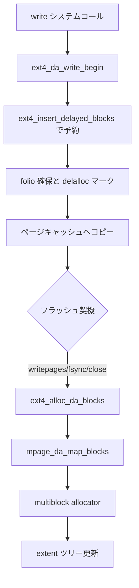

# 第8章 ext4 の delayed allocation

> **本章で読むソース**
>
> - [`fs/ext4/inode.c` L3121-L3183](https://github.com/gregkh/linux/blob/v6.18.38/fs/ext4/inode.c#L3121-L3183)
> - [`fs/ext4/inode.c` L3307-L3346](https://github.com/gregkh/linux/blob/v6.18.38/fs/ext4/inode.c#L3307-L3346)
> - [`fs/ext4/inode.c` L4018-L4025](https://github.com/gregkh/linux/blob/v6.18.38/fs/ext4/inode.c#L4018-L4025)
> - [`fs/ext4/ext4.h` L3094-L3097](https://github.com/gregkh/linux/blob/v6.18.38/fs/ext4/ext4.h#L3094-L3097)
> - [`fs/ext4/file.c` L165-L170](https://github.com/gregkh/linux/blob/v6.18.38/fs/ext4/file.c#L165-L170)
> - [`fs/ext4/inode.c` L3137-L3143](https://github.com/gregkh/linux/blob/v6.18.38/fs/ext4/inode.c#L3137-L3143)

## この章の狙い

書き込み時に物理ブロック割当を遅延する **delayed allocation** の経路を `ext4_da_write_begin` と `ext4_alloc_da_blocks` から追う。
ページキャッシュへの書き込みと実ブロック割当を分離し、連続書き込みをまとめて extent 化する仕組みを読む。

## 前提

- [ext4 の extent ツリー](06-ext4-extent-tree.md)
- [書き込みと dirty ページ](../../vfs/part04-page-cache/16-write-dirty.md)

## write_begin への接続

ext4 の address_space 操作では `write_begin` に `ext4_da_write_begin` が登録される。
通常の delalloc 有効時はここから遅延割当経路に入る。

[`fs/ext4/inode.c` L4018-L4025](https://github.com/gregkh/linux/blob/v6.18.38/fs/ext4/inode.c#L4018-L4025)

```c
static const struct address_space_operations ext4_da_aops = {
	.read_folio		= ext4_read_folio,
	.readahead		= ext4_readahead,
	.writepages		= ext4_writepages,
	.write_begin		= ext4_da_write_begin,
	.write_end		= ext4_da_write_end,
	.dirty_folio		= ext4_dirty_folio,
	.bmap			= ext4_bmap,
```

`ext4_nonda_switch` や verity 進行中は従来の即時割当 `ext4_write_begin` へフォールバックする。

## ext4_insert_delayed_blocks による予約

`ext4_da_get_block_prep` は物理割当前に `ext4_insert_delayed_blocks` を呼ぶ。
ここで `ext4_da_reserve_space` が `ext4_claim_free_clusters` を通じて空きクラスタを確保し、`i_reserved_data_blocks` を増やす。
予約に失敗すると delayed extent 登録前に ENOSPC が返る。

[`fs/ext4/inode.c` L1837-L1861](https://github.com/gregkh/linux/blob/v6.18.38/fs/ext4/inode.c#L1837-L1861)

```c
static int ext4_insert_delayed_blocks(struct inode *inode, ext4_lblk_t lblk,
				      ext4_lblk_t len)
{
	struct ext4_sb_info *sbi = EXT4_SB(inode->i_sb);
	int ret;
	bool lclu_allocated = false;
	bool end_allocated = false;
	ext4_lblk_t resv_clu;
	ext4_lblk_t end = lblk + len - 1;

	/*
	 * If the cluster containing lblk or end is shared with a delayed,
	 * written, or unwritten extent in a bigalloc file system, it's
	 * already been accounted for and does not need to be reserved.
	 * A pending reservation must be made for the cluster if it's
	 * shared with a written or unwritten extent and doesn't already
	 * have one.  Written and unwritten extents can be purged from the
	 * extents status tree if the system is under memory pressure, so
	 * it's necessary to examine the extent tree if a search of the
	 * extents status tree doesn't get a match.
	 */
	if (sbi->s_cluster_ratio == 1) {
		ret = ext4_da_reserve_space(inode, len);
		if (ret != 0)   /* ENOSPC */
			return ret;
```

[`fs/ext4/inode.c` L1627-L1650](https://github.com/gregkh/linux/blob/v6.18.38/fs/ext4/inode.c#L1627-L1650)

```c
static int ext4_da_reserve_space(struct inode *inode, int nr_resv)
{
	struct ext4_sb_info *sbi = EXT4_SB(inode->i_sb);
	struct ext4_inode_info *ei = EXT4_I(inode);
	int ret;

	/*
	 * We will charge metadata quota at writeout time; this saves
	 * us from metadata over-estimation, though we may go over by
	 * a small amount in the end.  Here we just reserve for data.
	 */
	ret = dquot_reserve_block(inode, EXT4_C2B(sbi, nr_resv));
	if (ret)
		return ret;

	spin_lock(&ei->i_block_reservation_lock);
	if (ext4_claim_free_clusters(sbi, nr_resv, 0)) {
		spin_unlock(&ei->i_block_reservation_lock);
		dquot_release_reservation_block(inode, EXT4_C2B(sbi, nr_resv));
		return -ENOSPC;
	}
	ei->i_reserved_data_blocks += nr_resv;
	trace_ext4_da_reserve_space(inode, nr_resv);
	spin_unlock(&ei->i_block_reservation_lock);
```

## ext4_da_write_begin の流れ

`ext4_da_write_begin` は folio を確保し、`ext4_block_write_begin` に `ext4_da_get_block_prep` を渡す。
この時点では物理ブロックを割り当てず、buffer head に遅延割当マークを付ける。

[`fs/ext4/inode.c` L3121-L3183](https://github.com/gregkh/linux/blob/v6.18.38/fs/ext4/inode.c#L3121-L3183)

```c
static int ext4_da_write_begin(const struct kiocb *iocb,
			       struct address_space *mapping,
			       loff_t pos, unsigned len,
			       struct folio **foliop, void **fsdata)
{
	int ret, retries = 0;
	struct folio *folio;
	pgoff_t index;
	struct inode *inode = mapping->host;

	ret = ext4_emergency_state(inode->i_sb);
	if (unlikely(ret))
		return ret;

	index = pos >> PAGE_SHIFT;

	if (ext4_nonda_switch(inode->i_sb) || ext4_verity_in_progress(inode)) {
		*fsdata = (void *)FALL_BACK_TO_NONDELALLOC;
		return ext4_write_begin(iocb, mapping, pos,
					len, foliop, fsdata);
	}
	*fsdata = (void *)0;
	trace_ext4_da_write_begin(inode, pos, len);

	if (ext4_test_inode_state(inode, EXT4_STATE_MAY_INLINE_DATA)) {
		ret = ext4_generic_write_inline_data(mapping, inode, pos, len,
						     foliop, fsdata, true);
		if (ret < 0)
			return ret;
		if (ret == 1)
			return 0;
	}

retry:
	folio = write_begin_get_folio(iocb, mapping, index, len);
	if (IS_ERR(folio))
		return PTR_ERR(folio);

	if (pos + len > folio_pos(folio) + folio_size(folio))
		len = folio_pos(folio) + folio_size(folio) - pos;

	ret = ext4_block_write_begin(NULL, folio, pos, len,
				     ext4_da_get_block_prep);
	if (ret < 0) {
		folio_unlock(folio);
		folio_put(folio);
		/*
		 * ext4_block_write_begin may have instantiated a few blocks
		 * outside i_size.  Trim these off again. Don't need
		 * i_size_read because we hold inode lock.
		 */
		if (pos + len > inode->i_size)
			ext4_truncate_failed_write(inode);

		if (ret == -ENOSPC &&
		    ext4_should_retry_alloc(inode->i_sb, &retries))
			goto retry;
		return ret;
	}

	*foliop = folio;
	return ret;
}
```

## 遅延ブロックの確定

fsync、close、明示的なフラッシュなどで `ext4_alloc_da_blocks` が呼ばれると、遅延予約が実ブロックへ変換される。
現実装は `filemap_flush` で writeback 経路を起動し、そこでマッピングが走る。

[`fs/ext4/inode.c` L3307-L3346](https://github.com/gregkh/linux/blob/v6.18.38/fs/ext4/inode.c#L3307-L3346)

```c
int ext4_alloc_da_blocks(struct inode *inode)
{
	trace_ext4_alloc_da_blocks(inode);

	if (!EXT4_I(inode)->i_reserved_data_blocks)
		return 0;

	/*
	 * We do something simple for now.  The filemap_flush() will
	 * also start triggering a write of the data blocks, which is
	 * not strictly speaking necessary (and for users of
	 * laptop_mode, not even desirable).  However, to do otherwise
	 * would require replicating code paths in:
	 *
	 * ext4_writepages() ->
	 *    write_cache_pages() ---> (via passed in callback function)
	 *        __mpage_da_writepage() -->
	 *           mpage_add_bh_to_extent()
	 *           mpage_da_map_blocks()
	 *
	 * The problem is that write_cache_pages(), located in
	 * mm/page-writeback.c, marks pages clean in preparation for
	 * doing I/O, which is not desirable if we're not planning on
	 * doing I/O at all.
	 *
	 * We could call write_cache_pages(), and then redirty all of
	 * the pages by calling redirty_page_for_writepage() but that
	 * would be ugly in the extreme.  So instead we would need to
	 * replicate parts of the code in the above functions,
	 * simplifying them because we wouldn't actually intend to
	 * write out the pages, but rather only collect contiguous
	 * logical block extents, call the multi-block allocator, and
	 * then update the buffer heads with the block allocations.
	 *
	 * For now, though, we'll cheat by calling filemap_flush(),
	 * which will map the blocks, and start the I/O, but not
	 * actually wait for the I/O to complete.
	 */
	return filemap_flush(inode->i_mapping);
}
```

コメントが示すとおり、割当だけ欲しい場面でも writeback 層と共有コードを使う設計上の妥協がある。

## ファイルクローズ時のフラッシュ

`ext4_release` でも遅延割当ブロックが残っていれば `ext4_alloc_da_blocks` を呼ぶ。
プロセスが fd を閉じるタイミングでマッピングが確定しうる。

[`fs/ext4/file.c` L165-L170](https://github.com/gregkh/linux/blob/v6.18.38/fs/ext4/file.c#L165-L170)

```c
 */
static int ext4_release_file(struct inode *inode, struct file *filp)
{
	if (ext4_test_inode_state(inode, EXT4_STATE_DA_ALLOC_CLOSE)) {
		ext4_alloc_da_blocks(inode);
		ext4_clear_inode_state(inode, EXT4_STATE_DA_ALLOC_CLOSE);
```

## writepages によるマッピング確定

`ext4_writepages` は `mpage_da_data` を組み立て、`ext4_do_writepages` で遅延割当済みページを走査する。
ここで連続論理ブロックがまとめられ、multiblock allocator へ渡される。

[`fs/ext4/inode.c` L3018-L3045](https://github.com/gregkh/linux/blob/v6.18.38/fs/ext4/inode.c#L3018-L3045)

```c
static int ext4_writepages(struct address_space *mapping,
			   struct writeback_control *wbc)
{
	struct super_block *sb = mapping->host->i_sb;
	struct mpage_da_data mpd = {
		.inode = mapping->host,
		.wbc = wbc,
		.can_map = 1,
	};
	int ret;
	int alloc_ctx;

	ret = ext4_emergency_state(sb);
	if (unlikely(ret))
		return ret;

	alloc_ctx = ext4_writepages_down_read(sb);
	ret = ext4_do_writepages(&mpd);
	/*
	 * For data=journal writeback we could have come across pages marked
	 * for delayed dirtying (PageChecked) which were just added to the
	 * running transaction. Try once more to get them to stable storage.
	 */
	if (!ret && mpd.journalled_more_data)
		ret = ext4_do_writepages(&mpd);
	ext4_writepages_up_read(sb, alloc_ctx);

	return ret;
```

## 外部からの宣言

他ファイルからも `ext4_alloc_da_blocks` が参照される。

[`fs/ext4/ext4.h` L3094-L3097](https://github.com/gregkh/linux/blob/v6.18.38/fs/ext4/ext4.h#L3094-L3097)

```c
extern int ext4_punch_hole(struct file *file, loff_t offset, loff_t length);
extern void ext4_set_inode_flags(struct inode *, bool init);
extern int ext4_alloc_da_blocks(struct inode *inode);
extern void ext4_set_aops(struct inode *inode);
```

## 処理の流れ



書き込みパターンが見えたあとでまとめて割当するため、断片化を減らしやすい。

## 高速化と最適化の工夫

遅延割当は短寿命の一時ファイルで物理ブロックを消費せず、メタデータ更新も避けられる。
`mpage_da_map_blocks` は連続論理ブロックを1つの extent として割当し、マルチブロック allocator へ渡す。
予約カウンタ `i_reserved_data_blocks` により、割当前でも ENOSPC を早期に検出できる。

## まとめ

ext4 の delayed allocation は write_begin で物理割当を先送りし、フラッシュ契機で extent として確定する。
データのページキャッシュ書き込みとブロック割当のタイミングを分離するのが核心である。

## 関連する章

- [ext4 の extent ツリー](06-ext4-extent-tree.md)
- [jbd2 のジャーナリング](07-jbd2-journaling.md)
- [書き込み経路](../../vfs/part03-file-io/12-write-path.md)
