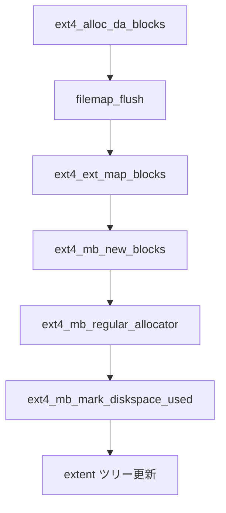

# 第9章 ext4 の multiblock allocator

> **本章で読むソース**
>
> - [`fs/ext4/mballoc.c` L435-L453](https://github.com/gregkh/linux/blob/v6.18.38/fs/ext4/mballoc.c#L435-L453)
> - [`fs/ext4/mballoc.c` L532-L554](https://github.com/gregkh/linux/blob/v6.18.38/fs/ext4/mballoc.c#L532-L554)
> - [`fs/ext4/mballoc.c` L6233-L6301](https://github.com/gregkh/linux/blob/v6.18.38/fs/ext4/mballoc.c#L6233-L6301)
> - [`fs/ext4/mballoc.c` L6301-L6343](https://github.com/gregkh/linux/blob/v6.18.38/fs/ext4/mballoc.c#L6301-L6343)
> - [`fs/ext4/mballoc.c` L2998-L3095](https://github.com/gregkh/linux/blob/v6.18.38/fs/ext4/mballoc.c#L2998-L3095)
> - [`fs/ext4/inode.c` L3307-L3346](https://github.com/gregkh/linux/blob/v6.18.38/fs/ext4/inode.c#L3307-L3346)
> - [`fs/ext4/extents.c` L4429-L4446](https://github.com/gregkh/linux/blob/v6.18.38/fs/ext4/extents.c#L4429-L4446)

## この章の狙い

**multiblock allocator**（`mballoc.c`）が buddy ビットマップ、goal、preallocation を使って物理ブロックを選ぶ経路を追う。
第8章の delayed allocation が予約したクラスタを、実際のディスクブロックへ写像する本体が `ext4_mb_new_blocks` である。

## 前提

- [ext4 の delayed allocation](08-ext4-delayed-allocation.md)
- [ext4 の super block と block group](03-ext4-super-block-group.md)

## buddy ビットマップと per-CPU シーケンス

mballoc は block group ごとに buddy 構造で空きブロックを管理する。
`discard_pa_seq` は preallocation の破棄と割当の競合を検出し、割当失敗時の再試行を制御する。

[`fs/ext4/mballoc.c` L435-L453](https://github.com/gregkh/linux/blob/v6.18.38/fs/ext4/mballoc.c#L435-L453)

```c
/*
 * The algorithm using this percpu seq counter goes below:
 * 1. We sample the percpu discard_pa_seq counter before trying for block
 *    allocation in ext4_mb_new_blocks().
 * 2. We increment this percpu discard_pa_seq counter when we either allocate
 *    or free these blocks i.e. while marking those blocks as used/free in
 *    mb_mark_used()/mb_free_blocks().
 * 3. We also increment this percpu seq counter when we successfully identify
 *    that the bb_prealloc_list is not empty and hence proceed for discarding
 *    of those PAs inside ext4_mb_discard_group_preallocations().
 *
 * Now to make sure that the regular fast path of block allocation is not
 * affected, as a small optimization we only sample the percpu seq counter
 * on that cpu. Only when the block allocation fails and when freed blocks
 * found were 0, that is when we sample percpu seq counter for all cpus using
 * below function ext4_get_discard_pa_seq_sum(). This happens after making
 * sure that all the PAs on grp->bb_prealloc_list got freed or if it's empty.
 */
static DEFINE_PER_CPU(u64, discard_pa_seq);
```

`mb_find_buddy` は order ごとの buddy ビットマップ領域を返す。

[`fs/ext4/mballoc.c` L532-L554](https://github.com/gregkh/linux/blob/v6.18.38/fs/ext4/mballoc.c#L532-L554)

```c
static void *mb_find_buddy(struct ext4_buddy *e4b, int order, int *max)
{
	char *bb;

	BUG_ON(e4b->bd_bitmap == e4b->bd_buddy);
	BUG_ON(max == NULL);

	if (order > e4b->bd_blkbits + 1) {
		*max = 0;
		return NULL;
	}

	/* at order 0 we see each particular block */
	if (order == 0) {
		*max = 1 << (e4b->bd_blkbits + 3);
		return e4b->bd_bitmap;
	}

	bb = e4b->bd_buddy + EXT4_SB(e4b->bd_sb)->s_mb_offsets[order];
	*max = EXT4_SB(e4b->bd_sb)->s_mb_maxs[order];

	return bb;
}
```

## ext4_mb_new_blocks の入口

`ext4_mb_new_blocks` は割当要求 `ext4_allocation_request` を受け、`ext4_allocation_context` を初期化する。
delayed allocation 済みの要求は `EXT4_MB_DELALLOC_RESERVED` が立ち、クォータ検査を省略できる。

[`fs/ext4/mballoc.c` L6233-L6301](https://github.com/gregkh/linux/blob/v6.18.38/fs/ext4/mballoc.c#L6233-L6301)

```c
ext4_fsblk_t ext4_mb_new_blocks(handle_t *handle,
				struct ext4_allocation_request *ar, int *errp)
{
	struct ext4_allocation_context *ac = NULL;
	struct ext4_sb_info *sbi;
	struct super_block *sb;
	ext4_fsblk_t block = 0;
	unsigned int inquota = 0;
	unsigned int reserv_clstrs = 0;
	int retries = 0;
	u64 seq;

	might_sleep();
	sb = ar->inode->i_sb;
	sbi = EXT4_SB(sb);

	trace_ext4_request_blocks(ar);
	if (sbi->s_mount_state & EXT4_FC_REPLAY)
		return ext4_mb_new_blocks_simple(ar, errp);

	/* Allow to use superuser reservation for quota file */
	if (ext4_is_quota_file(ar->inode))
		ar->flags |= EXT4_MB_USE_ROOT_BLOCKS;

	if ((ar->flags & EXT4_MB_DELALLOC_RESERVED) == 0) {
		/* Without delayed allocation we need to verify
		 * there is enough free blocks to do block allocation
		 * and verify allocation doesn't exceed the quota limits.
		 */
		while (ar->len &&
			ext4_claim_free_clusters(sbi, ar->len, ar->flags)) {

			/* let others to free the space */
			cond_resched();
			ar->len = ar->len >> 1;
		}
		if (!ar->len) {
			ext4_mb_show_pa(sb);
			*errp = -ENOSPC;
			return 0;
		}
		reserv_clstrs = ar->len;
		if (ar->flags & EXT4_MB_USE_ROOT_BLOCKS) {
			dquot_alloc_block_nofail(ar->inode,
						 EXT4_C2B(sbi, ar->len));
		} else {
			while (ar->len &&
				dquot_alloc_block(ar->inode,
						  EXT4_C2B(sbi, ar->len))) {

				ar->flags |= EXT4_MB_HINT_NOPREALLOC;
				ar->len--;
			}
		}
		inquota = ar->len;
		if (ar->len == 0) {
			*errp = -EDQUOT;
			goto out;
		}
	}

	ac = kmem_cache_zalloc(ext4_ac_cachep, GFP_NOFS);
	if (!ac) {
		ar->len = 0;
		*errp = -ENOMEM;
		goto out;
	}

	ext4_mb_initialize_context(ac, ar);
```

## ext4_mb_regular_allocator

preallocation が使えない場合は `ext4_mb_normalize_request` で goal を整え、`ext4_mb_regular_allocator` がグループをスキャンする。
まず goal 近傍を試し、失敗時は `ext4_mb_scan_groups` で criteria を切り替えながら buddy を走査する。

[`fs/ext4/mballoc.c` L2998-L3095](https://github.com/gregkh/linux/blob/v6.18.38/fs/ext4/mballoc.c#L2998-L3095)

```c
ext4_mb_regular_allocator(struct ext4_allocation_context *ac)
{
	ext4_group_t i;
	int err = 0;
	struct super_block *sb = ac->ac_sb;
	struct ext4_sb_info *sbi = EXT4_SB(sb);
	struct ext4_buddy e4b;

	BUG_ON(ac->ac_status == AC_STATUS_FOUND);

	/* first, try the goal */
	err = ext4_mb_find_by_goal(ac, &e4b);
	if (err || ac->ac_status == AC_STATUS_FOUND)
		goto out;

	if (unlikely(ac->ac_flags & EXT4_MB_HINT_GOAL_ONLY))
		goto out;

	/*
	 * ac->ac_2order is set only if the fe_len is a power of 2
	 * if ac->ac_2order is set we also set criteria to CR_POWER2_ALIGNED
	 * so that we try exact allocation using buddy.
	 */
	i = fls(ac->ac_g_ex.fe_len);
	ac->ac_2order = 0;
	/*
	 * We search using buddy data only if the order of the request
	 * is greater than equal to the sbi_s_mb_order2_reqs
	 * You can tune it via /sys/fs/ext4/<partition>/mb_order2_req
	 * We also support searching for power-of-two requests only for
	 * requests upto maximum buddy size we have constructed.
	 */
	if (i >= sbi->s_mb_order2_reqs && i <= MB_NUM_ORDERS(sb)) {
		if (is_power_of_2(ac->ac_g_ex.fe_len))
			ac->ac_2order = array_index_nospec(i - 1,
							   MB_NUM_ORDERS(sb));
	}

	/* if stream allocation is enabled, use global goal */
	if (ac->ac_flags & EXT4_MB_STREAM_ALLOC) {
		int hash = ac->ac_inode->i_ino % sbi->s_mb_nr_global_goals;

		ac->ac_g_ex.fe_group = READ_ONCE(sbi->s_mb_last_groups[hash]);
		ac->ac_g_ex.fe_start = -1;
		ac->ac_flags &= ~EXT4_MB_HINT_TRY_GOAL;
	}

	/*
	 * Let's just scan groups to find more-less suitable blocks We
	 * start with CR_GOAL_LEN_FAST, unless it is power of 2
	 * aligned, in which case let's do that faster approach first.
	 */
	ac->ac_criteria = CR_GOAL_LEN_FAST;
	if (ac->ac_2order)
		ac->ac_criteria = CR_POWER2_ALIGNED;

	ac->ac_e4b = &e4b;
	ac->ac_prefetch_ios = 0;
	ac->ac_first_err = 0;
repeat:
	while (ac->ac_criteria < EXT4_MB_NUM_CRS) {
		err = ext4_mb_scan_groups(ac);
		if (err)
			goto out;

		if (ac->ac_status != AC_STATUS_CONTINUE)
			break;
	}

	if (ac->ac_b_ex.fe_len > 0 && ac->ac_status != AC_STATUS_FOUND &&
	    !(ac->ac_flags & EXT4_MB_HINT_FIRST)) {
		/*
		 * We've been searching too long. Let's try to allocate
		 * the best chunk we've found so far
		 */
		ext4_mb_try_best_found(ac, &e4b);
		if (ac->ac_status != AC_STATUS_FOUND) {
			int lost;

			/*
			 * Someone more lucky has already allocated it.
			 * The only thing we can do is just take first
			 * found block(s)
			 */
			lost = atomic_inc_return(&sbi->s_mb_lost_chunks);
			mb_debug(sb, "lost chunk, group: %u, start: %d, len: %d, lost: %d\n",
				 ac->ac_b_ex.fe_group, ac->ac_b_ex.fe_start,
				 ac->ac_b_ex.fe_len, lost);

			ac->ac_b_ex.fe_group = 0;
			ac->ac_b_ex.fe_start = 0;
			ac->ac_b_ex.fe_len = 0;
			ac->ac_status = AC_STATUS_CONTINUE;
			ac->ac_flags |= EXT4_MB_HINT_FIRST;
			ac->ac_criteria = CR_ANY_FREE;
			goto repeat;
		}
	}
```

成功時は `ext4_mb_mark_diskspace_used` で buddy とグループビットマップを更新する。

[`fs/ext4/mballoc.c` L6301-L6343](https://github.com/gregkh/linux/blob/v6.18.38/fs/ext4/mballoc.c#L6301-L6343)

```c
	ext4_mb_initialize_context(ac, ar);

	ac->ac_op = EXT4_MB_HISTORY_PREALLOC;
	seq = this_cpu_read(discard_pa_seq);
	if (!ext4_mb_use_preallocated(ac)) {
		ac->ac_op = EXT4_MB_HISTORY_ALLOC;
		ext4_mb_normalize_request(ac, ar);

		*errp = ext4_mb_pa_alloc(ac);
		if (*errp)
			goto errout;
repeat:
		/* allocate space in core */
		*errp = ext4_mb_regular_allocator(ac);
		/*
		 * pa allocated above is added to grp->bb_prealloc_list only
		 * when we were able to allocate some block i.e. when
		 * ac->ac_status == AC_STATUS_FOUND.
		 * And error from above mean ac->ac_status != AC_STATUS_FOUND
		 * So we have to free this pa here itself.
		 */
		if (*errp) {
			ext4_mb_pa_put_free(ac);
			ext4_discard_allocated_blocks(ac);
			goto errout;
		}
		if (ac->ac_status == AC_STATUS_FOUND &&
			ac->ac_o_ex.fe_len >= ac->ac_f_ex.fe_len)
			ext4_mb_pa_put_free(ac);
	}
	if (likely(ac->ac_status == AC_STATUS_FOUND)) {
		*errp = ext4_mb_mark_diskspace_used(ac, handle);
		if (*errp) {
			ext4_discard_allocated_blocks(ac);
			goto errout;
		} else {
			block = ext4_grp_offs_to_block(sb, &ac->ac_b_ex);
			ar->len = ac->ac_b_ex.fe_len;
		}
	} else {
		if (++retries < 3 &&
		    ext4_mb_discard_preallocations_should_retry(sb, ac, &seq))
			goto repeat;
```

## delayed allocation からの接続

`ext4_alloc_da_blocks` は `i_reserved_data_blocks` が残っていれば `filemap_flush` を呼び、writeback 経路で delalloc を物理ブロックへ変換する。
実際のブロック選定は writeback 内の `ext4_ext_map_blocks` が `ext4_mb_new_blocks` を呼ぶ。

[`fs/ext4/inode.c` L3307-L3346](https://github.com/gregkh/linux/blob/v6.18.38/fs/ext4/inode.c#L3307-L3346)

```c
int ext4_alloc_da_blocks(struct inode *inode)
{
	trace_ext4_alloc_da_blocks(inode);

	if (!EXT4_I(inode)->i_reserved_data_blocks)
		return 0;

	/*
	 * We do something simple for now.  The filemap_flush() will
	 * also start triggering a write of the data blocks, which is
	 * not strictly speaking necessary (and for users of
	 * laptop_mode, not even desirable).  However, to do otherwise
	 * would require replicating code paths in:
	 *
	 * ext4_writepages() ->
	 *    write_cache_pages() ---> (via passed in callback function)
	 *        __mpage_da_writepage() -->
	 *           mpage_add_bh_to_extent()
	 *           mpage_da_map_blocks()
	 *
	 * The problem is that write_cache_pages(), located in
	 * mm/page-writeback.c, marks pages clean in preparation for
	 * doing I/O, which is not desirable if we're not planning on
	 * doing I/O at all.
	 *
	 * We could call write_cache_pages(), and then redirty all of
	 * the pages by calling redirty_page_for_writepage() but that
	 * would be ugly in the extreme.  So instead we would need to
	 * replicate parts of the code in the above functions,
	 * simplifying them because we wouldn't actually intend to
	 * write out the pages, but rather only collect contiguous
	 * logical block extents, call the multi-block allocator, and
	 * then update the buffer heads with the block allocations.
	 *
	 * For now, though, we'll cheat by calling filemap_flush(),
	 * which will map the blocks, and start the I/O, but not
	 * actually wait for the I/O to complete.
	 */
	return filemap_flush(inode->i_mapping);
}
```

writeback 中のマッピングでは `ext4_mb_new_blocks` が呼ばれる。

[`fs/ext4/extents.c` L4429-L4446](https://github.com/gregkh/linux/blob/v6.18.38/fs/ext4/extents.c#L4429-L4446)

```c
	if (S_ISREG(inode->i_mode))
		ar.flags = EXT4_MB_HINT_DATA;
	else
		/* disable in-core preallocation for non-regular files */
		ar.flags = 0;
	if (flags & EXT4_GET_BLOCKS_NO_NORMALIZE)
		ar.flags |= EXT4_MB_HINT_NOPREALLOC;
	if (flags & EXT4_GET_BLOCKS_DELALLOC_RESERVE)
		ar.flags |= EXT4_MB_DELALLOC_RESERVED;
	if (flags & EXT4_GET_BLOCKS_METADATA_NOFAIL)
		ar.flags |= EXT4_MB_USE_RESERVED;
	newblock = ext4_mb_new_blocks(handle, &ar, &err);
	if (!newblock)
		goto out;
	allocated_clusters = ar.len;
	ar.len = EXT4_C2B(sbi, ar.len) - offset;
	ext_debug(inode, "allocate new block: goal %llu, found %llu/%u, requested %u\n",
		  ar.goal, newblock, ar.len, allocated);
```

## 処理の流れ



## 高速化と最適化の工夫

preallocation は連続書き込み向けにブロックを先取りし、割当のたびに buddy スキャンするコストを下げる。
`ext4_mb_normalize_request` は goal 近傍へ要求長を揃え、断片化を抑えながら extent 化しやすい連続領域を選ぶ。
per-CPU `discard_pa_seq` は通常パスでは自 CPU だけをサンプルし、失敗時だけ全 CPU を集計して再試行コストを限定する。

## まとめ

mballoc は buddy と preallocation で物理ブロックを選び、`ext4_mb_new_blocks` が delayed allocation の予約を実ブロックへ落とす。
goal とグループスキャンは連続性と断片化のバランスを取る。

## 関連する章

- [ext4 の delayed allocation](08-ext4-delayed-allocation.md)
- [ext4 の extent ツリー](06-ext4-extent-tree.md)
- [ext4 の super block と block group](03-ext4-super-block-group.md)
