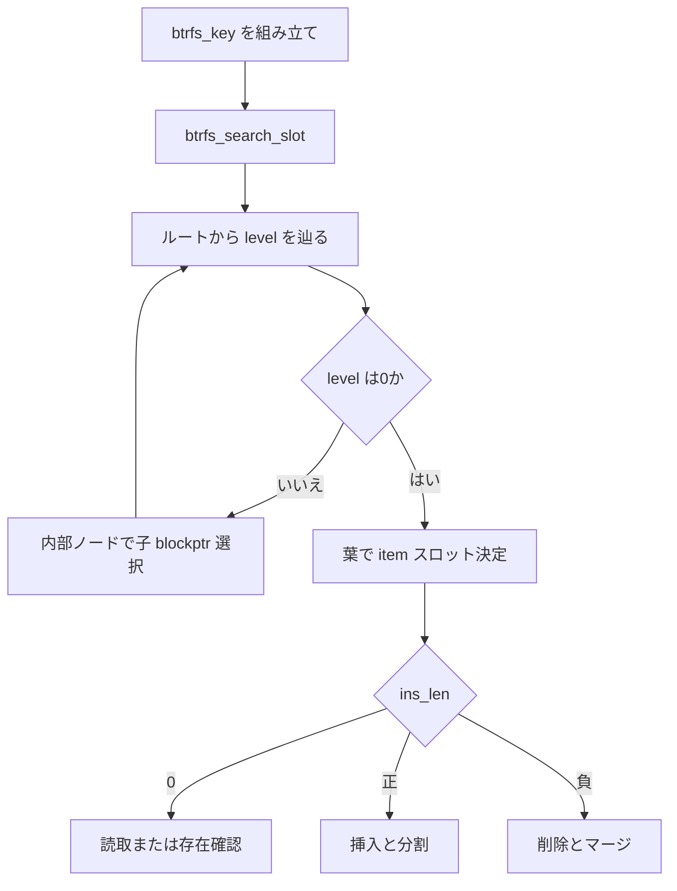

# 第9章 btrfs の B-tree とキー

> **本章で読むソース**
>
> - [`include/uapi/linux/btrfs_tree.h` L472-L476](https://github.com/gregkh/linux/blob/v6.18.38/include/uapi/linux/btrfs_tree.h#L472-L476)
> - [`include/uapi/linux/btrfs_tree.h` L481-L496](https://github.com/gregkh/linux/blob/v6.18.38/include/uapi/linux/btrfs_tree.h#L481-L496)
> - [`include/uapi/linux/btrfs_tree.h` L548-L564](https://github.com/gregkh/linux/blob/v6.18.38/include/uapi/linux/btrfs_tree.h#L548-L564)
> - [`fs/btrfs/ctree.c` L716-L731](https://github.com/gregkh/linux/blob/v6.18.38/fs/btrfs/ctree.c#L716-L731)
> - [`fs/btrfs/ctree.c` L1996-L2044](https://github.com/gregkh/linux/blob/v6.18.38/fs/btrfs/ctree.c#L1996-L2044)
> - [`fs/btrfs/ctree.c` L2064-L2069](https://github.com/gregkh/linux/blob/v6.18.38/fs/btrfs/ctree.c#L2064-L2069)

## この章の狙い

btrfs のメタデータ索引が B-tree でどう表現されるかを、`btrfs_key`、ノードヘッダ、`btrfs_search_slot` から追う。
ext4 の固定レイアウトとは異なり、すべてのメタデータがキー付きアイテムとして木に載る前提を押さえる。

## 前提

- [ディスクレイアウトの読み方](../part00-overview/03-on-disk-layout-reading.md)
- [全体像と横断基盤](../../foundation/part03-datastructures/12-maple-tree.md) の木構造一般論

## btrfs_key の三要素

btrfs のキーは `objectid`、`type`、`offset` の三元組である。
inode、ディレクトリエントリ、extent、ルート参照など、種別は `type` で区別する。

[`include/uapi/linux/btrfs_tree.h` L472-L476](https://github.com/gregkh/linux/blob/v6.18.38/include/uapi/linux/btrfs_tree.h#L472-L476)

```c
struct btrfs_key {
	__u64 objectid;
	__u8 type;
	__u64 offset;
} __attribute__ ((__packed__));
```

`objectid` が subvolume 内 inode 番号やツリー ID を表す場合が多い。
同一 objectid でも `type` が違えば別アイテムとして共存する。

## ノード共通ヘッダ

葉でも内部ノードでもブロック先頭は `btrfs_header` で始まる。
チェックサム、fsid、論理アドレス `bytenr`、世代 `generation`、所有者ルート `owner` が共通である。

[`include/uapi/linux/btrfs_tree.h` L481-L496](https://github.com/gregkh/linux/blob/v6.18.38/include/uapi/linux/btrfs_tree.h#L481-L496)

```c
struct btrfs_header {
	/* These first four must match the super block */
	__u8 csum[BTRFS_CSUM_SIZE];
	/* FS specific uuid */
	__u8 fsid[BTRFS_FSID_SIZE];
	/* Which block this node is supposed to live in */
	__le64 bytenr;
	__le64 flags;

	/* Allowed to be different from the super from here on down */
	__u8 chunk_tree_uuid[BTRFS_UUID_SIZE];
	__le64 generation;
	__le64 owner;
	__le32 nritems;
	__u8 level;
} __attribute__ ((__packed__));
```

`level` が 0 なら葉、それより大きいほど内部ノードである。

## 葉の item 配列

葉ブロックは `btrfs_item` 配列とデータ領域に分かれる。
キー配列とデータ配列を分離し、検索時のキャッシュ効率を上げる。

[`include/uapi/linux/btrfs_tree.h` L548-L564](https://github.com/gregkh/linux/blob/v6.18.38/include/uapi/linux/btrfs_tree.h#L548-L564)

```c
struct btrfs_item {
	struct btrfs_disk_key key;
	__le32 offset;
	__le32 size;
} __attribute__ ((__packed__));

/*
 * Leaves have an item area and a data area:
 * [item0, item1....itemN] [free space] [dataN...data1, data0]
 *
 * The data is separate from the items to get the keys closer together during
 * searches.
 */
struct btrfs_leaf {
	struct btrfs_header header;
	struct btrfs_item items[];
} __attribute__ ((__packed__));
```

## キー比較

木内の位置決めは `btrfs_comp_cpu_keys` による辞書式比較である。
objectid、type、offset の順に大小を判定する。

[`fs/btrfs/ctree.c` L716-L731](https://github.com/gregkh/linux/blob/v6.18.38/fs/btrfs/ctree.c#L716-L731)

```c
int __pure btrfs_comp_cpu_keys(const struct btrfs_key *k1, const struct btrfs_key *k2)
{
	if (k1->objectid > k2->objectid)
		return 1;
	if (k1->objectid < k2->objectid)
		return -1;
	if (k1->type > k2->type)
		return 1;
	if (k1->type < k2->type)
		return -1;
	if (k1->offset > k2->offset)
		return 1;
	if (k1->offset < k2->offset)
		return -1;
	return 0;
}
```

## btrfs_search_slot による木走査

`btrfs_search_slot` は指定ルートからキーを探し、結果を `btrfs_path` に残す。
挿入長 `ins_len` と CoW フラグ `cow` により、読取専用検索と更新用検索を分ける。

[`fs/btrfs/ctree.c` L1996-L2044](https://github.com/gregkh/linux/blob/v6.18.38/fs/btrfs/ctree.c#L1996-L2044)

```c
int btrfs_search_slot(struct btrfs_trans_handle *trans, struct btrfs_root *root,
		      const struct btrfs_key *key, struct btrfs_path *p,
		      int ins_len, int cow)
{
	struct btrfs_fs_info *fs_info;
	struct extent_buffer *b;
	int slot;
	int ret;
	int level;
	int lowest_unlock = 1;
	/* everything at write_lock_level or lower must be write locked */
	int write_lock_level = 0;
	u8 lowest_level = 0;
	int min_write_lock_level;
	int prev_cmp;

	if (!root)
		return -EINVAL;

	fs_info = root->fs_info;
	might_sleep();

	lowest_level = p->lowest_level;
	WARN_ON(lowest_level && ins_len > 0);
	WARN_ON(p->nodes[0] != NULL);
	BUG_ON(!cow && ins_len);

	/*
	 * For now only allow nowait for read only operations.  There's no
	 * strict reason why we can't, we just only need it for reads so it's
	 * only implemented for reads.
	 */
	ASSERT(!p->nowait || !cow);

	if (ins_len < 0) {
		lowest_unlock = 2;

		/* when we are removing items, we might have to go up to level
		 * two as we update tree pointers  Make sure we keep write
		 * for those levels as well
		 */
		write_lock_level = 2;
	} else if (ins_len > 0) {
		/*
		 * for inserting items, make sure we have a write lock on
		 * level 1 so we can update keys
		 */
		write_lock_level = 1;
	}
```

キー未存在時は挿入すべきスロット位置を返し、更新系はそこへ item を追加する。

## 処理の流れ



fs ツリー、extent ツリー、chunk ツリーなど、用途別に複数のルートが同じ走査 API を共有する。

## 葉内の二分探索

`btrfs_bin_search` は extent buffer 内の item 配列を二分探索し、挿入または参照すべきスロットを返す。
葉（level 0）と内部ノードで item サイズが異なる。

[`fs/btrfs/ctree.c` L747-L775](https://github.com/gregkh/linux/blob/v6.18.38/fs/btrfs/ctree.c#L747-L775)

```c
int btrfs_bin_search(const struct extent_buffer *eb, int first_slot,
		     const struct btrfs_key *key, int *slot)
{
	unsigned long p;
	int item_size;
	/*
	 * Use unsigned types for the low and high slots, so that we get a more
	 * efficient division in the search loop below.
	 */
	u32 low = first_slot;
	u32 high = btrfs_header_nritems(eb);
	int ret;
	const int key_size = sizeof(struct btrfs_disk_key);

	if (unlikely(low > high)) {
		btrfs_err(eb->fs_info,
		 "%s: low (%u) > high (%u) eb %llu owner %llu level %d",
			  __func__, low, high, eb->start,
			  btrfs_header_owner(eb), btrfs_header_level(eb));
		return -EINVAL;
	}

	if (btrfs_header_level(eb) == 0) {
		p = offsetof(struct btrfs_leaf, items);
		item_size = sizeof(struct btrfs_item);
	} else {
		p = offsetof(struct btrfs_node, ptrs);
		item_size = sizeof(struct btrfs_key_ptr);
	}
```

## 高速化と最適化の工夫

葉でキー配列とデータ配列を分離し、二分探索が触る領域を狭くする。
`btrfs_path` は走査中の `extent_buffer` 参照を保持し、同一 transaction 内の再検索でブロック再読込を避ける。
`nowait` 読取はロック取得失敗時に `-EAGAIN` を返し、待機せずリトライできる。

## まとめ

btrfs のメタデータはキー付き B-tree に統一され、`btrfs_search_slot` が検索と更新位置の特定を担う。
ext4 のテーブル型レイアウトより柔軟だが、すべての操作が木走査と CoW 更新に依存する。

## 関連する章

- 次章：[btrfs の CoW と extent 管理](10-btrfs-cow-extent.md)
- [ディスクレイアウトの読み方](../part00-overview/03-on-disk-layout-reading.md)
