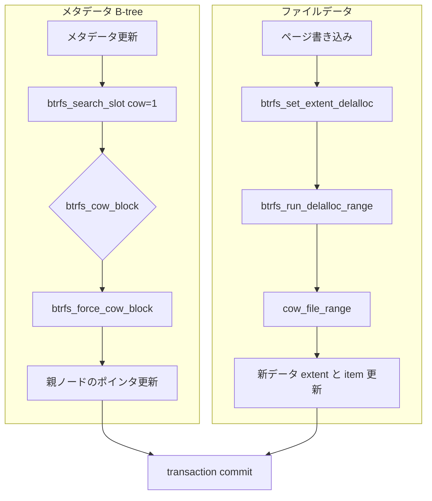

# 第10章 btrfs の CoW と extent 管理

> **本章で読むソース**
>
> - [`fs/btrfs/ctree.c` L660-L710](https://github.com/gregkh/linux/blob/v6.18.38/fs/btrfs/ctree.c#L660-L710)
> - [`fs/btrfs/ctree.c` L694-L709](https://github.com/gregkh/linux/blob/v6.18.38/fs/btrfs/ctree.c#L694-L709)
> - [`fs/btrfs/ctree.c` L1996-L2000](https://github.com/gregkh/linux/blob/v6.18.38/fs/btrfs/ctree.c#L1996-L2000)
> - [`include/uapi/linux/btrfs_tree.h` L472-L476](https://github.com/gregkh/linux/blob/v6.18.38/include/uapi/linux/btrfs_tree.h#L472-L476)
> - [`fs/btrfs/file-item.c` L218-L219](https://github.com/gregkh/linux/blob/v6.18.38/fs/btrfs/file-item.c#L218-L219)
> - [`fs/btrfs/ctree.c` L683-L692](https://github.com/gregkh/linux/blob/v6.18.38/fs/btrfs/ctree.c#L683-L692)

## この章の狙い

btrfs の **Copy-on-Write** がメタデータ B-tree ブロックとファイルデータでどう分かれるかを追う。
`btrfs_cow_block` はツリーブロックの複製であり、ファイルデータ本体の CoW は delalloc と ordered extent の別経路である。

## 前提

- 前章：[btrfs の B-tree とキー](09-btrfs-btree-key.md)
- [同期と RCU](../../locking/part04-rcu/12-rcu-basics.md)

## btrfs_cow_block によるメタデータブロックの CoW

`btrfs_cow_block` が複製するのは `extent_buffer` で表される B-tree ブロックである。
ファイルデータの物理ブロックは別ルートの extent 管理と ordered extent で扱う。

[`fs/btrfs/ctree.c` L660-L710](https://github.com/gregkh/linux/blob/v6.18.38/fs/btrfs/ctree.c#L660-L710)

```c
int btrfs_cow_block(struct btrfs_trans_handle *trans,
		    struct btrfs_root *root, struct extent_buffer *buf,
		    struct extent_buffer *parent, int parent_slot,
		    struct extent_buffer **cow_ret,
		    enum btrfs_lock_nesting nest)
{
	struct btrfs_fs_info *fs_info = root->fs_info;
	u64 search_start;

	if (unlikely(test_bit(BTRFS_ROOT_DELETING, &root->state))) {
		btrfs_abort_transaction(trans, -EUCLEAN);
		btrfs_crit(fs_info,
		   "attempt to COW block %llu on root %llu that is being deleted",
			   buf->start, btrfs_root_id(root));
		return -EUCLEAN;
	}

	/*
	 * COWing must happen through a running transaction, which always
	 * matches the current fs generation (it's a transaction with a state
	 * less than TRANS_STATE_UNBLOCKED). If it doesn't, then turn the fs
	 * into error state to prevent the commit of any transaction.
	 */
	if (unlikely(trans->transaction != fs_info->running_transaction ||
		     trans->transid != fs_info->generation)) {
		btrfs_abort_transaction(trans, -EUCLEAN);
		btrfs_crit(fs_info,
"unexpected transaction when attempting to COW block %llu on root %llu, transaction %llu running transaction %llu fs generation %llu",
			   buf->start, btrfs_root_id(root), trans->transid,
			   fs_info->running_transaction->transid,
			   fs_info->generation);
		return -EUCLEAN;
	}

	if (!should_cow_block(trans, root, buf)) {
		*cow_ret = buf;
		return 0;
	}

	search_start = round_down(buf->start, SZ_1G);

	/*
	 * Before CoWing this block for later modification, check if it's
	 * the subtree root and do the delayed subtree trace if needed.
	 *
	 * Also We don't care about the error, as it's handled internally.
	 */
	btrfs_qgroup_trace_subtree_after_cow(trans, root, buf);
	return btrfs_force_cow_block(trans, root, buf, parent, parent_slot,
				     cow_ret, search_start, 0, nest);
}
```

transaction と generation の不一致はファイルシステムエラーへ落とす。
古い世代のブロックを誤って共有更新しないための安全弁である。

transaction と generation の不一致はファイルシステムエラーへ落とす。
共有メタデータブロックを誤って上書きしないための安全弁である。

## search_slot の cow フラグは path 上のメタデータ用

`btrfs_search_slot(..., cow=1)` は辿った B-tree ノードを CoW する。
`file-item.c` の `cow` 引数も、extent item を格納する fs ツリーのメタデータブロック更新用であり、ファイルデータブロックの複製そのものではない。

[`fs/btrfs/file-item.c` L218-L219](https://github.com/gregkh/linux/blob/v6.18.38/fs/btrfs/file-item.c#L218-L219)

```c
	ret = btrfs_search_slot(trans, root, &file_key, path, 0, cow);
	if (ret < 0)
```

item 挿入前に path 上のノードが CoW され、新世代のツリーへ item が載る。

## ファイルデータの CoW 経路

ページ書き込みでは `btrfs_set_extent_delalloc` が論理範囲を `io_tree` 上で追跡する。
writeback 時の `btrfs_run_delalloc_range` が NOCOW でなければ `cow_file_range` で新しいデータ extent を割り当てる。

[`fs/btrfs/inode.c` L2719-L2743](https://github.com/gregkh/linux/blob/v6.18.38/fs/btrfs/inode.c#L2719-L2743)

```c
int btrfs_set_extent_delalloc(struct btrfs_inode *inode, u64 start, u64 end,
			      unsigned int extra_bits,
			      struct extent_state **cached_state)
{
	WARN_ON(PAGE_ALIGNED(end));

	if (start >= i_size_read(&inode->vfs_inode) &&
	    !(inode->flags & BTRFS_INODE_PREALLOC)) {
		/*
		 * There can't be any extents following eof in this case so just
		 * set the delalloc new bit for the range directly.
		 */
		extra_bits |= EXTENT_DELALLOC_NEW;
	} else {
		int ret;

		ret = btrfs_find_new_delalloc_bytes(inode, start,
						    end + 1 - start,
						    cached_state);
		if (ret)
			return ret;
	}

	return btrfs_set_extent_bit(&inode->io_tree, start, end,
				    EXTENT_DELALLOC | extra_bits, cached_state);
```

[`fs/btrfs/inode.c` L2347-L2374](https://github.com/gregkh/linux/blob/v6.18.38/fs/btrfs/inode.c#L2347-L2374)

```c
int btrfs_run_delalloc_range(struct btrfs_inode *inode, struct folio *locked_folio,
			     u64 start, u64 end, struct writeback_control *wbc)
{
	const bool zoned = btrfs_is_zoned(inode->root->fs_info);
	int ret;

	/*
	 * The range must cover part of the @locked_folio, or a return of 1
	 * can confuse the caller.
	 */
	ASSERT(!(end <= folio_pos(locked_folio) || start >= folio_end(locked_folio)));

	if (should_nocow(inode, start, end)) {
		ret = run_delalloc_nocow(inode, locked_folio, start, end);
		return ret;
	}

	if (btrfs_inode_can_compress(inode) &&
	    inode_need_compress(inode, start, end) &&
	    run_delalloc_compressed(inode, locked_folio, start, end, wbc))
		return 1;

	if (zoned)
		ret = run_delalloc_cow(inode, locked_folio, start, end, wbc,
				       true);
	else
		ret = cow_file_range(inode, locked_folio, start, end, NULL, 0);
	return ret;
```

## extent item と物理 extent の対応

ファイルの論理アドレスは fs ツリー上の `BTRFS_EXTENT_DATA_KEY` 等の item として保持される。
キーの `offset` はファイル内オフセットを表し、item データが物理 extent へのマップを持つ。

[`include/uapi/linux/btrfs_tree.h` L472-L476](https://github.com/gregkh/linux/blob/v6.18.38/include/uapi/linux/btrfs_tree.h#L472-L476)

```c
struct btrfs_key {
	__u64 objectid;
	__u8 type;
	__u64 offset;
} __attribute__ ((__packed__));
```

extent ツリーは論理アドレスから物理チャンクへの参照を別ルートで管理する。
ファイルデータの新物理 extent は `cow_file_range` 側で割り当て、fs ツリーの item 更新は `btrfs_cow_block` 側で行う。

## btrfs_force_cow_block によるブロック複製

`should_cow_block` が真のとき、`btrfs_force_cow_block` が新ツリーブロックを割り当て、内容を複製する。
レベル 0 なら先頭 item のキーを新ブロックのキーとして使う。

[`fs/btrfs/ctree.c` L478-L521](https://github.com/gregkh/linux/blob/v6.18.38/fs/btrfs/ctree.c#L478-L521)

```c
int btrfs_force_cow_block(struct btrfs_trans_handle *trans,
			  struct btrfs_root *root,
			  struct extent_buffer *buf,
			  struct extent_buffer *parent, int parent_slot,
			  struct extent_buffer **cow_ret,
			  u64 search_start, u64 empty_size,
			  enum btrfs_lock_nesting nest)
{
	struct btrfs_fs_info *fs_info = root->fs_info;
	struct btrfs_disk_key disk_key;
	struct extent_buffer *cow;
	int level, ret;
	int last_ref = 0;
	int unlock_orig = 0;
	u64 parent_start = 0;
	u64 reloc_src_root = 0;

	if (*cow_ret == buf)
		unlock_orig = 1;

	btrfs_assert_tree_write_locked(buf);

	WARN_ON(test_bit(BTRFS_ROOT_SHAREABLE, &root->state) &&
		trans->transid != fs_info->running_transaction->transid);
	WARN_ON(test_bit(BTRFS_ROOT_SHAREABLE, &root->state) &&
		trans->transid != btrfs_get_root_last_trans(root));

	level = btrfs_header_level(buf);

	if (level == 0)
		btrfs_item_key(buf, &disk_key, 0);
	else
		btrfs_node_key(buf, &disk_key, 0);

	if (btrfs_root_id(root) == BTRFS_TREE_RELOC_OBJECTID) {
		if (parent)
			parent_start = parent->start;
		reloc_src_root = btrfs_header_owner(buf);
	}
	cow = btrfs_alloc_tree_block(trans, root, parent_start,
				     btrfs_root_id(root), &disk_key, level,
				     search_start, empty_size, reloc_src_root, nest);
	if (IS_ERR(cow))
		return PTR_ERR(cow);
```

## 同一 transaction 内の重複 CoW 抑制

`should_cow_block` は同一 transaction 内で未書き込みブロックの二重 CoW を避ける。
コメントが示すとおり、1 transaction あたり1回の CoW に抑える最適化が入る。

[`fs/btrfs/ctree.c` L655-L659](https://github.com/gregkh/linux/blob/v6.18.38/fs/btrfs/ctree.c#L655-L659)

```c
/*
 * COWs a single block, see btrfs_force_cow_block() for the real work.
 * This version of it has extra checks so that a block isn't COWed more than
 * once per transaction, as long as it hasn't been written yet
 */
```

## 処理の流れ



読取側は古い世代のツリーを保持できるため、スナップショットと共存する。

## 高速化と最適化の工夫

CoW は安全だがブロック複製とツリー更新のコストを伴う。
`should_cow_block` による同一 transaction 内の抑制は不要な複製を避ける。
`search_start` を 1GiB 境界へ丸めることで、近傍の空き検索を局所化し、alloc 走査を短くする。

## まとめ

btrfs の CoW はメタデータ B-tree ブロックとファイルデータで経路が分かれる。
`btrfs_cow_block` は前者、`cow_file_range` と delalloc が後者を担う。

## 関連する章

- 前章：[btrfs の B-tree とキー](09-btrfs-btree-key.md)
- 次章：[btrfs のスナップショットと subvolume](11-btrfs-snapshot-subvolume.md)
- [btrfs のチェックサムと RAID 概観](12-btrfs-checksum-raid.md)
