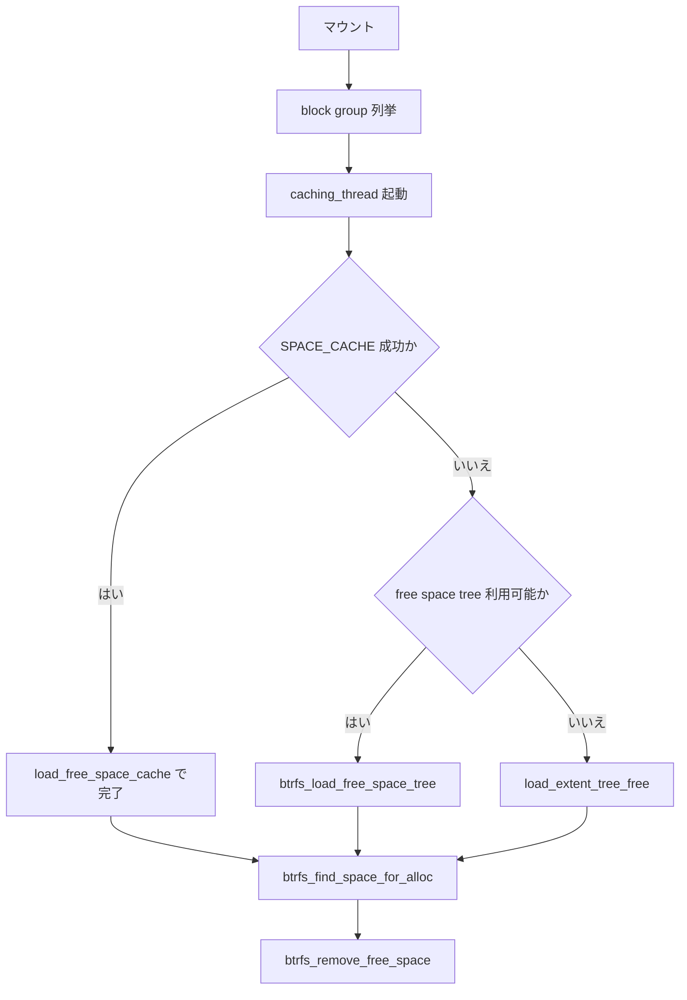

# 第11章 btrfs の block group と free space cache

> **本章で読むソース**
>
> - [`fs/btrfs/block-group.c` L852-L900](https://github.com/gregkh/linux/blob/v6.18.38/fs/btrfs/block-group.c#L852-L900)
> - [`fs/btrfs/free-space-cache.c` L2950-L2970](https://github.com/gregkh/linux/blob/v6.18.38/fs/btrfs/free-space-cache.c#L2950-L2970)
> - [`fs/btrfs/free-space-cache.c` L939-L960](https://github.com/gregkh/linux/blob/v6.18.38/fs/btrfs/free-space-cache.c#L939-L960)
> - [`fs/btrfs/block-group.c` L2305-L2312](https://github.com/gregkh/linux/blob/v6.18.38/fs/btrfs/block-group.c#L2305-L2312)
> - [`include/uapi/linux/btrfs_tree.h` L1153-L1159](https://github.com/gregkh/linux/blob/v6.18.38/include/uapi/linux/btrfs_tree.h#L1153-L1159)
> - [`fs/btrfs/free-space-cache.c` L3084-L3118](https://github.com/gregkh/linux/blob/v6.18.38/fs/btrfs/free-space-cache.c#L3084-L3118)
> - [`fs/btrfs/free-space-cache.c` L2800-L2842](https://github.com/gregkh/linux/blob/v6.18.38/fs/btrfs/free-space-cache.c#L2800-L2842)

## この章の狙い

btrfs が論理アドレス空間を **block group** に分割し、各グループ内の空き領域を **free space cache** で追跡する仕組みを読む。
chunk への写像（第12章）の前提となる空間会計の層である。

## 前提

- [btrfs の B-tree とキー](10-btrfs-btree-key.md)
- [ディスクレイアウトの読み方](../part00-overview/02-on-disk-layout-reading.md)

## block group のキャッシュスレッド

block group はマウント後にバックグラウンドで空き領域をキャッシュする。
`caching_thread` は `SPACE_CACHE` オプション時に on-disk キャッシュを読み、なければ extent ツリーを走査する。

[`fs/btrfs/block-group.c` L852-L900](https://github.com/gregkh/linux/blob/v6.18.38/fs/btrfs/block-group.c#L852-L900)

```c
static noinline void caching_thread(struct btrfs_work *work)
{
	struct btrfs_block_group *block_group;
	struct btrfs_fs_info *fs_info;
	struct btrfs_caching_control *caching_ctl;
	int ret;

	caching_ctl = container_of(work, struct btrfs_caching_control, work);
	block_group = caching_ctl->block_group;
	fs_info = block_group->fs_info;

	mutex_lock(&caching_ctl->mutex);
	down_read(&fs_info->commit_root_sem);

	load_block_group_size_class(caching_ctl, block_group);
	if (btrfs_test_opt(fs_info, SPACE_CACHE)) {
		ret = load_free_space_cache(block_group);
		if (ret == 1) {
			ret = 0;
			goto done;
		}

		/*
		 * We failed to load the space cache, set ourselves to
		 * CACHE_STARTED and carry on.
		 */
		spin_lock(&block_group->lock);
		block_group->cached = BTRFS_CACHE_STARTED;
		spin_unlock(&block_group->lock);
		wake_up(&caching_ctl->wait);
	}

	/*
	 * If we are in the transaction that populated the free space tree we
	 * can't actually cache from the free space tree as our commit root and
	 * real root are the same, so we could change the contents of the blocks
	 * while caching.  Instead do the slow caching in this case, and after
	 * the transaction has committed we will be safe.
	 */
	if (btrfs_fs_compat_ro(fs_info, FREE_SPACE_TREE) &&
	    !(test_bit(BTRFS_FS_FREE_SPACE_TREE_UNTRUSTED, &fs_info->flags)))
		ret = btrfs_load_free_space_tree(caching_ctl);
	else
		ret = load_extent_tree_free(caching_ctl);
done:
	spin_lock(&block_group->lock);
	block_group->caching_ctl = NULL;
	block_group->cached = ret ? BTRFS_CACHE_ERROR : BTRFS_CACHE_FINISHED;
	spin_unlock(&block_group->lock);
```

完了時は `BTRFS_CACHE_FINISHED` または `BTRFS_CACHE_ERROR` を立て、待機スレッドを起こす。

## free_space_ctl の初期化

`btrfs_init_free_space_ctl` は赤黒木とビットマップ閾値を初期化する。
空き領域の追跡 RAM は block group あたり 32KB に抑え、超過時はビットマップ表現へ変換する。

[`fs/btrfs/free-space-cache.c` L2950-L2970](https://github.com/gregkh/linux/blob/v6.18.38/fs/btrfs/free-space-cache.c#L2950-L2970)

```c
void btrfs_init_free_space_ctl(struct btrfs_block_group *block_group,
			       struct btrfs_free_space_ctl *ctl)
{
	struct btrfs_fs_info *fs_info = block_group->fs_info;

	spin_lock_init(&ctl->tree_lock);
	ctl->unit = fs_info->sectorsize;
	ctl->start = block_group->start;
	ctl->block_group = block_group;
	ctl->op = &free_space_op;
	ctl->free_space_bytes = RB_ROOT_CACHED;
	INIT_LIST_HEAD(&ctl->trimming_ranges);
	mutex_init(&ctl->cache_writeout_mutex);

	/*
	 * we only want to have 32k of ram per block group for keeping
	 * track of free space, and if we pass 1/2 of that we want to
	 * start converting things over to using bitmaps
	 */
	ctl->extents_thresh = (SZ_32K / 2) / sizeof(struct btrfs_free_space);
}
```

## on-disk キャッシュの読込

`load_free_space_cache` は inode 化されたキャッシュファイルから空き領域を復元する。
失敗時は extent ツリー走査へフォールバックする。

[`fs/btrfs/free-space-cache.c` L939-L960](https://github.com/gregkh/linux/blob/v6.18.38/fs/btrfs/free-space-cache.c#L939-L960)

```c
int load_free_space_cache(struct btrfs_block_group *block_group)
{
	struct btrfs_fs_info *fs_info = block_group->fs_info;
	struct btrfs_free_space_ctl *ctl = block_group->free_space_ctl;
	struct btrfs_free_space_ctl tmp_ctl = {};
	struct inode *inode;
	struct btrfs_path *path;
	int ret = 0;
	bool matched;
	u64 used = block_group->used;

	/*
	 * Because we could potentially discard our loaded free space, we want
	 * to load everything into a temporary structure first, and then if it's
	 * valid copy it all into the actual free space ctl.
	 */
	btrfs_init_free_space_ctl(block_group, &tmp_ctl);

	/*
	 * If this block group has been marked to be cleared for one reason or
	 * another then we can't trust the on disk cache, so just return.
```

## 割当要求への応答

キャッシュ構築後、割当は `btrfs_find_space_for_alloc` が赤黒木から空き領域を検索し、`btrfs_remove_free_space` が使用分を除去する。

[`fs/btrfs/free-space-cache.c` L3084-L3118](https://github.com/gregkh/linux/blob/v6.18.38/fs/btrfs/free-space-cache.c#L3084-L3118)

```c
u64 btrfs_find_space_for_alloc(struct btrfs_block_group *block_group,
			       u64 offset, u64 bytes, u64 empty_size,
			       u64 *max_extent_size)
{
	struct btrfs_free_space_ctl *ctl = block_group->free_space_ctl;
	struct btrfs_discard_ctl *discard_ctl =
					&block_group->fs_info->discard_ctl;
	struct btrfs_free_space *entry = NULL;
	u64 bytes_search = bytes + empty_size;
	u64 ret = 0;
	u64 align_gap = 0;
	u64 align_gap_len = 0;
	enum btrfs_trim_state align_gap_trim_state = BTRFS_TRIM_STATE_UNTRIMMED;
	bool use_bytes_index = (offset == block_group->start);

	ASSERT(!btrfs_is_zoned(block_group->fs_info));

	spin_lock(&ctl->tree_lock);
	entry = find_free_space(ctl, &offset, &bytes_search,
				block_group->full_stripe_len, max_extent_size,
				use_bytes_index);
	if (!entry)
		goto out;

	ret = offset;
	if (entry->bitmap) {
		bitmap_clear_bits(ctl, entry, offset, bytes, true);

		if (!btrfs_free_space_trimmed(entry))
			atomic64_add(bytes, &discard_ctl->discard_bytes_saved);

		if (!entry->bytes)
			free_bitmap(ctl, entry);
	} else {
		unlink_free_space(ctl, entry, true);
```

[`fs/btrfs/free-space-cache.c` L2800-L2842](https://github.com/gregkh/linux/blob/v6.18.38/fs/btrfs/free-space-cache.c#L2800-L2842)

```c
int btrfs_remove_free_space(struct btrfs_block_group *block_group,
			    u64 offset, u64 bytes)
{
	struct btrfs_free_space_ctl *ctl = block_group->free_space_ctl;
	struct btrfs_free_space *info;
	int ret;
	bool re_search = false;

	if (btrfs_is_zoned(block_group->fs_info)) {
		/*
		 * This can happen with conventional zones when replaying log.
		 * Since the allocation info of tree-log nodes are not recorded
		 * to the extent-tree, calculate_alloc_pointer() failed to
		 * advance the allocation pointer after last allocated tree log
		 * node blocks.
		 *
		 * This function is called from
		 * btrfs_pin_extent_for_log_replay() when replaying the log.
		 * Advance the pointer not to overwrite the tree-log nodes.
		 */
		if (block_group->start + block_group->alloc_offset <
		    offset + bytes) {
			block_group->alloc_offset =
				offset + bytes - block_group->start;
		}
		return 0;
	}

	spin_lock(&ctl->tree_lock);

again:
	ret = 0;
	if (!bytes)
		goto out_lock;

	info = tree_search_offset(ctl, offset, 0, 0);
	if (!info) {
		/*
		 * oops didn't find an extent that matched the space we wanted
		 * to remove, look for a bitmap instead
		 */
		info = tree_search_offset(ctl, offset_to_bitmap(ctl, offset),
					  1, 0);
```

## block group タイプ

block group はデータ、メタデータ、システムの各 `space_info` に属する。
タイプは chunk 割当時の RAID プロファイル選択にも影響する。

[`include/uapi/linux/btrfs_tree.h` L1153-L1159](https://github.com/gregkh/linux/blob/v6.18.38/include/uapi/linux/btrfs_tree.h#L1153-L1159)

```c
#define BTRFS_BLOCK_GROUP_DATA		(1ULL << 0)
#define BTRFS_BLOCK_GROUP_SYSTEM	(1ULL << 1)
#define BTRFS_BLOCK_GROUP_METADATA	(1ULL << 2)
#define BTRFS_BLOCK_GROUP_RAID0		(1ULL << 3)
#define BTRFS_BLOCK_GROUP_RAID1		(1ULL << 4)
#define BTRFS_BLOCK_GROUP_DUP		(1ULL << 5)
#define BTRFS_BLOCK_GROUP_RAID10	(1ULL << 6)
```

## 処理の流れ



## 高速化と最適化の工夫

on-disk free space cache はマウント直後のフルスキャンを省略し、大容量ボリュームの立ち上がりを短縮する。
32KB 閾値で extent リストからビットマップへ切り替えることで、細かい断片が多いグループでも RAM を抑える。
`commit_root_sem` の読み取りロック下でキャッシュすることで、コミット中の B-tree 更新と競合しない。

## まとめ

block group は btrfs の空間会計単位であり、free space cache が各グループ内の空き領域をインメモリで追跡する。
キャッシュスレッドは on-disk キャッシュ、free space tree、extent 走査のいずれかで情報を集め、割当時は find/remove で応答する。

## 関連する章

- [btrfs の chunk mapping と extent/device tree](12-btrfs-chunk-mapping-extent-tree.md)
- [btrfs の CoW と extent 管理](13-btrfs-cow-extent.md)
