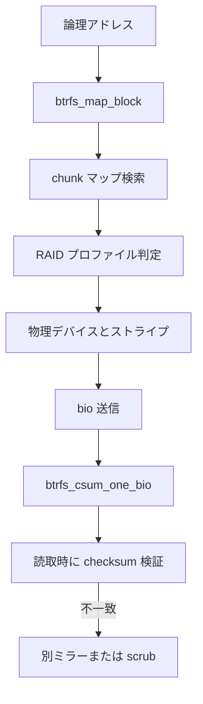

# 第12章 btrfs のチェックサムと RAID 概観

> **本章で読むソース**
>
> - [`fs/btrfs/file-item.c` L801-L833](https://github.com/gregkh/linux/blob/v6.18.38/fs/btrfs/file-item.c#L801-L833)
> - [`include/uapi/linux/btrfs_tree.h` L481-L484](https://github.com/gregkh/linux/blob/v6.18.38/include/uapi/linux/btrfs_tree.h#L481-L484)
> - [`fs/btrfs/volumes.c` L6733-L6770](https://github.com/gregkh/linux/blob/v6.18.38/fs/btrfs/volumes.c#L6733-L6770)
> - [`fs/btrfs/volumes.h` L714-L716](https://github.com/gregkh/linux/blob/v6.18.38/fs/btrfs/volumes.h#L714-L716)
> - [`fs/btrfs/bio.c` L548-L550](https://github.com/gregkh/linux/blob/v6.18.38/fs/btrfs/bio.c#L548-L550)
> - [`fs/btrfs/scrub.c` L1036-L1038](https://github.com/gregkh/linux/blob/v6.18.38/fs/btrfs/scrub.c#L1036-L1038)

## この章の狙い

btrfs のデータ整合性チェックサムと、論理アドレスから物理ストライプへの写像 `btrfs_map_block` を概観する。
RAID プロファイル下でミラー選択と読取経路がどう変わるかを機構レベルで読む。

## 前提

- [btrfs の CoW と extent 管理](10-btrfs-cow-extent.md)
- ブロック層の詳細は [ブロック層と io_uring](../../block/README.md) 分冊

## メタデータブロックのチェックサム

btrfs のツリーブロックはヘッダ先頭に `csum` を持つ。
super block と同型の先頭4フィールドが整合チェックの種になる。

[`include/uapi/linux/btrfs_tree.h` L481-L484](https://github.com/gregkh/linux/blob/v6.18.38/include/uapi/linux/btrfs_tree.h#L481-L484)

```c
struct btrfs_header {
	/* These first four must match the super block */
	__u8 csum[BTRFS_CSUM_SIZE];
	/* FS specific uuid */
```

## データ bio のチェックサム計算

書き込み bio に対して `btrfs_csum_one_bio` がセクター単位の checksum を計算し、`btrfs_ordered_sum` に格納する。
非同期パスでは workqueue で遅延計算できる。

[`fs/btrfs/file-item.c` L801-L833](https://github.com/gregkh/linux/blob/v6.18.38/fs/btrfs/file-item.c#L801-L833)

```c
int btrfs_csum_one_bio(struct btrfs_bio *bbio, bool async)
{
	struct btrfs_ordered_extent *ordered = bbio->ordered;
	struct btrfs_inode *inode = bbio->inode;
	struct btrfs_fs_info *fs_info = inode->root->fs_info;
	struct bio *bio = &bbio->bio;
	struct btrfs_ordered_sum *sums;
	unsigned nofs_flag;

	nofs_flag = memalloc_nofs_save();
	sums = kvzalloc(btrfs_ordered_sum_size(fs_info, bio->bi_iter.bi_size),
		       GFP_KERNEL);
	memalloc_nofs_restore(nofs_flag);

	if (!sums)
		return -ENOMEM;

	sums->logical = bio->bi_iter.bi_sector << SECTOR_SHIFT;
	sums->len = bio->bi_iter.bi_size;
	INIT_LIST_HEAD(&sums->list);
	bbio->sums = sums;
	btrfs_add_ordered_sum(ordered, sums);

	if (!async) {
		csum_one_bio(bbio, &bbio->bio.bi_iter);
		return 0;
	}
	init_completion(&bbio->csum_done);
	bbio->async_csum = true;
	bbio->csum_saved_iter = bbio->bio.bi_iter;
	INIT_WORK(&bbio->csum_work, csum_one_bio_work);
	schedule_work(&bbio->csum_work);
	return 0;
```

checksum は extent ツリー上のメタデータとして永続化され、読取時に検証される。

## btrfs_map_block の役割

論理アドレスと操作種別を渡すと、chunk マップから物理ストライプとミラー番号を決める。
読取、書込、ミラー列挙など `enum btrfs_map_op` で挙動が変わる。

[`fs/btrfs/volumes.h` L714-L716](https://github.com/gregkh/linux/blob/v6.18.38/fs/btrfs/volumes.h#L714-L716)

```c
int btrfs_map_block(struct btrfs_fs_info *fs_info, enum btrfs_map_op op,
		    u64 logical, u64 *length,
		    struct btrfs_io_context **bioc_ret,
```

実装冒頭では chunk マップ取得とミラー数検証を行う。

[`fs/btrfs/volumes.c` L6733-L6770](https://github.com/gregkh/linux/blob/v6.18.38/fs/btrfs/volumes.c#L6733-L6770)

```c
int btrfs_map_block(struct btrfs_fs_info *fs_info, enum btrfs_map_op op,
		    u64 logical, u64 *length,
		    struct btrfs_io_context **bioc_ret,
		    struct btrfs_io_stripe *smap, int *mirror_num_ret)
{
	struct btrfs_chunk_map *map;
	struct btrfs_io_geometry io_geom = { 0 };
	u64 map_offset;
	int ret = 0;
	int num_copies;
	struct btrfs_io_context *bioc = NULL;
	struct btrfs_dev_replace *dev_replace = &fs_info->dev_replace;
	bool dev_replace_is_ongoing = false;
	u16 num_alloc_stripes;
	u64 max_len;

	ASSERT(bioc_ret);

	io_geom.mirror_num = (mirror_num_ret ? *mirror_num_ret : 0);
	io_geom.num_stripes = 1;
	io_geom.stripe_index = 0;
	io_geom.op = op;

	map = btrfs_get_chunk_map(fs_info, logical, *length);
	if (IS_ERR(map))
		return PTR_ERR(map);

	num_copies = btrfs_chunk_map_num_copies(map);
	if (io_geom.mirror_num > num_copies) {
		ret = -EINVAL;
		goto out;
	}

	map_offset = logical - map->start;
	io_geom.raid56_full_stripe_start = (u64)-1;
	max_len = btrfs_max_io_len(map, map_offset, &io_geom);
	*length = min_t(u64, map->chunk_len - map_offset, max_len);
	io_geom.use_rst = btrfs_need_stripe_tree_update(fs_info, map->type);
```

RAID1 なら `num_copies` が2以上となり、読取失敗時に別ミラーへ切り替える余地が生まれる。

## bio 層での checksum 呼び出し

bio 送信前後で checksum 計算が挿入される。

[`fs/btrfs/bio.c` L548-L550](https://github.com/gregkh/linux/blob/v6.18.38/fs/btrfs/bio.c#L548-L550)

```c
	return btrfs_csum_one_bio(bbio, true);
#else
	return btrfs_csum_one_bio(bbio, false);
```

## scrub でのミラー読取

scrub は `btrfs_map_block` でミラー一覧を取得し、各コピーを検証する。

[`fs/btrfs/scrub.c` L1036-L1038](https://github.com/gregkh/linux/blob/v6.18.38/fs/btrfs/scrub.c#L1036-L1038)

```c
		ret = btrfs_map_block(fs_info, BTRFS_MAP_GET_READ_MIRRORS,
				      stripe->logical, &mapped_len, &bioc,
				      NULL, NULL);
```

## 処理の流れ



## 高速化と最適化の工夫

非同期 checksum 計算は書き込み経路のクリティカルセクションを短くする。
`btrfs_map_block` は一度に扱う長さ `max_len` を RAID ストライプ境界へ合わせ、余分な分割 bio を避ける。
ミラー読取は最初の成功コピーで完了でき、障害ディスクを避けた経路選択が可能である。

## まとめ

btrfs はデータとメタデータの両方に checksum を持ち、`btrfs_map_block` が RAID プロファイル下の物理配置を解決する。
整合性検証と冗長読取はこの2層の組み合わせで実現される。

## 関連する章

- [btrfs の CoW と extent 管理](10-btrfs-cow-extent.md)
- [btrfs のスナップショットと subvolume](11-btrfs-snapshot-subvolume.md)
