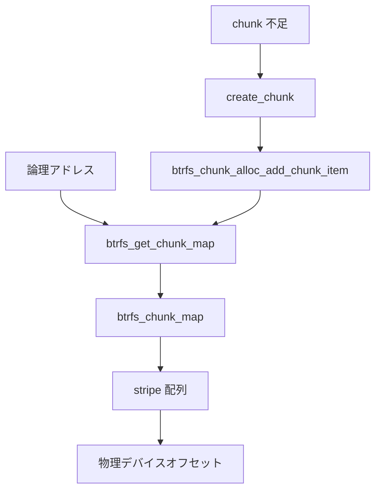

# 第12章 btrfs の chunk mapping と extent/device tree

> **本章で読むソース**
>
> - [`fs/btrfs/volumes.c` L3324-L3348](https://github.com/gregkh/linux/blob/v6.18.38/fs/btrfs/volumes.c#L3324-L3348)
> - [`fs/btrfs/volumes.c` L5639-L5682](https://github.com/gregkh/linux/blob/v6.18.38/fs/btrfs/volumes.c#L5639-L5682)
> - [`fs/btrfs/volumes.c` L5688-L5717](https://github.com/gregkh/linux/blob/v6.18.38/fs/btrfs/volumes.c#L5688-L5717)
> - [`fs/btrfs/ctree.c` L1527-L1543](https://github.com/gregkh/linux/blob/v6.18.38/fs/btrfs/ctree.c#L1527-L1543)
> - [`include/uapi/linux/btrfs_tree.h` L214-L220](https://github.com/gregkh/linux/blob/v6.18.38/include/uapi/linux/btrfs_tree.h#L214-L220)
> - [`include/uapi/linux/btrfs_tree.h` L280-L281](https://github.com/gregkh/linux/blob/v6.18.38/include/uapi/linux/btrfs_tree.h#L280-L281)
> - [`fs/btrfs/volumes.c` L5787-L5875](https://github.com/gregkh/linux/blob/v6.18.38/fs/btrfs/volumes.c#L5787-L5875)

## この章の狙い

論理アドレスから物理デバイスとストライプへの写像を、**chunk map** と **extent/device tree** から追う。
第11章の block group が論理空間を区切るのに対し、本章はその区間がどのデバイス上のどの物理位置かを解決する。

## 前提

- [btrfs の block group と free space cache](11-btrfs-block-group-free-space.md)
- [btrfs の B-tree とキー](10-btrfs-btree-key.md)

## btrfs_get_chunk_map

`btrfs_get_chunk_map` は論理アドレスと長さから `btrfs_chunk_map` を引く。
範囲外や不整合な map は `-EINVAL` で拒否する。

[`fs/btrfs/volumes.c` L3324-L3348](https://github.com/gregkh/linux/blob/v6.18.38/fs/btrfs/volumes.c#L3324-L3348)

```c
struct btrfs_chunk_map *btrfs_get_chunk_map(struct btrfs_fs_info *fs_info,
					    u64 logical, u64 length)
{
	struct btrfs_chunk_map *map;

	map = btrfs_find_chunk_map(fs_info, logical, length);

	if (unlikely(!map)) {
		btrfs_crit(fs_info,
			   "unable to find chunk map for logical %llu length %llu",
			   logical, length);
		return ERR_PTR(-EINVAL);
	}

	if (unlikely(map->start > logical || map->start + map->chunk_len <= logical)) {
		btrfs_crit(fs_info,
			   "found a bad chunk map, wanted %llu-%llu, found %llu-%llu",
			   logical, logical + length, map->start,
			   map->start + map->chunk_len);
		btrfs_free_chunk_map(map);
		return ERR_PTR(-EINVAL);
	}

	/* Callers are responsible for dropping the reference. */
	return map;
}
```

## chunk 割当と stripe 配置

`create_chunk` は `btrfs_alloc_chunk_map` で map を確保し、各デバイスの物理オフセットへ stripe を配置する。
完了後 `btrfs_add_chunk_map` でインメモリ木へ登録し、対応する block group を生成する。

[`fs/btrfs/volumes.c` L5639-L5682](https://github.com/gregkh/linux/blob/v6.18.38/fs/btrfs/volumes.c#L5639-L5682)

```c
struct btrfs_chunk_map *btrfs_alloc_chunk_map(int num_stripes, gfp_t gfp)
{
	struct btrfs_chunk_map *map;

	map = kmalloc(btrfs_chunk_map_size(num_stripes), gfp);
	if (!map)
		return NULL;

	refcount_set(&map->refs, 1);
	RB_CLEAR_NODE(&map->rb_node);

	return map;
}

static struct btrfs_block_group *create_chunk(struct btrfs_trans_handle *trans,
			struct alloc_chunk_ctl *ctl,
			struct btrfs_device_info *devices_info)
{
	struct btrfs_fs_info *info = trans->fs_info;
	struct btrfs_chunk_map *map;
	struct btrfs_block_group *block_group;
	u64 start = ctl->start;
	u64 type = ctl->type;
	int ret;

	map = btrfs_alloc_chunk_map(ctl->num_stripes, GFP_NOFS);
	if (!map)
		return ERR_PTR(-ENOMEM);

	map->start = start;
	map->chunk_len = ctl->chunk_size;
	map->stripe_size = ctl->stripe_size;
	map->type = type;
	map->io_align = BTRFS_STRIPE_LEN;
	map->io_width = BTRFS_STRIPE_LEN;
	map->sub_stripes = ctl->sub_stripes;
	map->num_stripes = ctl->num_stripes;

	for (int i = 0; i < ctl->ndevs; i++) {
		for (int j = 0; j < ctl->dev_stripes; j++) {
			int s = i * ctl->dev_stripes + j;
			map->stripes[s].dev = devices_info[i].dev;
			map->stripes[s].physical = devices_info[i].dev_offset +
						   j * ctl->stripe_size;
		}
	}
```

[`fs/btrfs/volumes.c` L5688-L5717](https://github.com/gregkh/linux/blob/v6.18.38/fs/btrfs/volumes.c#L5688-L5717)

```c
	ret = btrfs_add_chunk_map(info, map);
	if (ret) {
		btrfs_free_chunk_map(map);
		return ERR_PTR(ret);
	}

	block_group = btrfs_make_block_group(trans, ctl->space_info, type, start,
					     ctl->chunk_size);
	if (IS_ERR(block_group)) {
		btrfs_remove_chunk_map(info, map);
		return block_group;
	}

	for (int i = 0; i < map->num_stripes; i++) {
		struct btrfs_device *dev = map->stripes[i].dev;

		btrfs_device_set_bytes_used(dev,
					    dev->bytes_used + ctl->stripe_size);
		if (list_empty(&dev->post_commit_list))
			list_add_tail(&dev->post_commit_list,
				      &trans->transaction->dev_update_list);
	}

	atomic64_sub(ctl->stripe_size * map->num_stripes,
		     &info->free_chunk_space);

	check_raid56_incompat_flag(info, type);
	check_raid1c34_incompat_flag(info, type);

	return block_group;
}
```

## extent tree と chunk tree のキー

extent tree は論理ブロックの参照カウントを、chunk tree は chunk item を保持する。
device item は device tree がデバイスメタデータを載せる。

[`include/uapi/linux/btrfs_tree.h` L214-L220](https://github.com/gregkh/linux/blob/v6.18.38/include/uapi/linux/btrfs_tree.h#L214-L220)

```c
#define BTRFS_EXTENT_ITEM_KEY	168

/*
 * The same as the BTRFS_EXTENT_ITEM_KEY, except it's metadata we already know
 * the length, so we save the level in key->offset instead of the length.
 */
#define BTRFS_METADATA_ITEM_KEY	169
```

[`include/uapi/linux/btrfs_tree.h` L280-L281](https://github.com/gregkh/linux/blob/v6.18.38/include/uapi/linux/btrfs_tree.h#L280-L281)

```c
#define BTRFS_DEV_ITEM_KEY	216
#define BTRFS_CHUNK_ITEM_KEY	228
```

## chunk item の永続化

インメモリ `create_chunk` の後、`btrfs_chunk_alloc_add_chunk_item` が device item を更新し chunk tree へ `BTRFS_CHUNK_ITEM_KEY` を挿入する。

[`fs/btrfs/volumes.c` L5787-L5875](https://github.com/gregkh/linux/blob/v6.18.38/fs/btrfs/volumes.c#L5787-L5875)

```c
int btrfs_chunk_alloc_add_chunk_item(struct btrfs_trans_handle *trans,
				     struct btrfs_block_group *bg)
{
	struct btrfs_fs_info *fs_info = trans->fs_info;
	struct btrfs_root *chunk_root = fs_info->chunk_root;
	struct btrfs_key key;
	struct btrfs_chunk *chunk;
	struct btrfs_stripe *stripe;
	struct btrfs_chunk_map *map;
	size_t item_size;
	int i;
	int ret;

	/*
	 * We take the chunk_mutex for 2 reasons:
	 *
	 * 1) Updates and insertions in the chunk btree must be done while holding
	 *    the chunk_mutex, as well as updating the system chunk array in the
	 *    superblock. See the comment on top of btrfs_chunk_alloc() for the
	 *    details;
	 *
	 * 2) To prevent races with the final phase of a device replace operation
	 *    that replaces the device object associated with the map's stripes,
	 *    because the device object's id can change at any time during that
	 *    final phase of the device replace operation
	 *    (dev-replace.c:btrfs_dev_replace_finishing()), so we could grab the
	 *    replaced device and then see it with an ID of BTRFS_DEV_REPLACE_DEVID,
	 *    which would cause a failure when updating the device item, which does
	 *    not exists, or persisting a stripe of the chunk item with such ID.
	 *    Here we can't use the device_list_mutex because our caller already
	 *    has locked the chunk_mutex, and the final phase of device replace
	 *    acquires both mutexes - first the device_list_mutex and then the
	 *    chunk_mutex. Using any of those two mutexes protects us from a
	 *    concurrent device replace.
	 */
	lockdep_assert_held(&fs_info->chunk_mutex);

	map = btrfs_get_chunk_map(fs_info, bg->start, bg->length);
	if (IS_ERR(map)) {
		ret = PTR_ERR(map);
		btrfs_abort_transaction(trans, ret);
		return ret;
	}

	item_size = btrfs_chunk_item_size(map->num_stripes);

	chunk = kzalloc(item_size, GFP_NOFS);
	if (unlikely(!chunk)) {
		ret = -ENOMEM;
		btrfs_abort_transaction(trans, ret);
		goto out;
	}

	for (i = 0; i < map->num_stripes; i++) {
		struct btrfs_device *device = map->stripes[i].dev;

		ret = btrfs_update_device(trans, device);
		if (ret)
			goto out;
	}

	stripe = &chunk->stripe;
	for (i = 0; i < map->num_stripes; i++) {
		struct btrfs_device *device = map->stripes[i].dev;
		const u64 dev_offset = map->stripes[i].physical;

		btrfs_set_stack_stripe_devid(stripe, device->devid);
		btrfs_set_stack_stripe_offset(stripe, dev_offset);
		memcpy(stripe->dev_uuid, device->uuid, BTRFS_UUID_SIZE);
		stripe++;
	}

	btrfs_set_stack_chunk_length(chunk, bg->length);
	btrfs_set_stack_chunk_owner(chunk, BTRFS_EXTENT_TREE_OBJECTID);
	btrfs_set_stack_chunk_stripe_len(chunk, BTRFS_STRIPE_LEN);
	btrfs_set_stack_chunk_type(chunk, map->type);
	btrfs_set_stack_chunk_num_stripes(chunk, map->num_stripes);
	btrfs_set_stack_chunk_io_align(chunk, BTRFS_STRIPE_LEN);
	btrfs_set_stack_chunk_io_width(chunk, BTRFS_STRIPE_LEN);
	btrfs_set_stack_chunk_sector_size(chunk, fs_info->sectorsize);
	btrfs_set_stack_chunk_sub_stripes(chunk, map->sub_stripes);

	key.objectid = BTRFS_FIRST_CHUNK_TREE_OBJECTID;
	key.type = BTRFS_CHUNK_ITEM_KEY;
	key.offset = bg->start;

	ret = btrfs_insert_item(trans, chunk_root, &key, chunk, item_size);
	if (ret)
		goto out;
```

## extent 読取と検証

extent ツリー走査中のブロック読取は `btrfs_read_extent_buffer` でチェックサム検証する。
device 写像の下で論理ブロックがどの物理位置かは、後段の `btrfs_map_block`（第17章）が解決する。

[`fs/btrfs/ctree.c` L1527-L1543](https://github.com/gregkh/linux/blob/v6.18.38/fs/btrfs/ctree.c#L1527-L1543)

```c
		/* Now we're allowed to do a blocking uptodate check. */
		ret2 = btrfs_read_extent_buffer(tmp, &check);
		if (ret2) {
			ret = ret2;
			goto out;
		}

		if (ret == 0) {
			ASSERT(!tmp_locked);
			*eb_ret = tmp;
			tmp = NULL;
		}
		goto out;
	} else if (p->nowait) {
		ret = -EAGAIN;
		goto out;
	}
```

## btrfs_map_block 宣言

I/O 層は `btrfs_map_block` で chunk map から物理 stripe を選ぶ。
第17章で RAID 読取とミラー選択を読む。

[`fs/btrfs/volumes.h` L714-L716](https://github.com/gregkh/linux/blob/v6.18.38/fs/btrfs/volumes.h#L714-L716)

```c
int btrfs_map_block(struct btrfs_fs_info *fs_info, enum btrfs_map_op op,
		    u64 logical, u64 *length,
		    struct btrfs_io_context **bioc_ret,
```

## 処理の流れ



## 高速化と最適化の工夫

chunk map は赤黒木でキャッシュされ、同一論理範囲への繰り返し写像を O(log n) で解決する。
`btrfs_alloc_chunk_map` は stripe 数に応じた可変サイズ割当で、小さな chunk ほどメタデータ RAM を節約する。
新規 chunk 割当は新しい論理区間を確保するものであり、既存 chunk の stripe をその場で拡張する動作ではない。

## まとめ

論理アドレスは chunk map を経由してデバイス上の物理 stripe へ写像される。
chunk 割当はインメモリ map 作成の後、chunk tree へ chunk item を挿入し block group と連動する。

## 関連する章

- [btrfs の block group と free space cache](11-btrfs-block-group-free-space.md)
- [btrfs の CoW と extent 管理](13-btrfs-cow-extent.md)
- [btrfs の RAID、scrub、mirror retry](17-btrfs-raid-scrub-mirror-retry.md)
