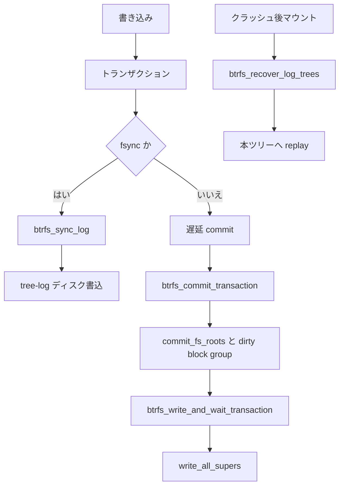

# 第14章 btrfs の transaction、tree-log、recovery

> **本章で読むソース**
>
> - [`fs/btrfs/transaction.c` L2198-L2234](https://github.com/gregkh/linux/blob/v6.18.38/fs/btrfs/transaction.c#L2198-L2234)
> - [`fs/btrfs/transaction.c` L2381-L2411](https://github.com/gregkh/linux/blob/v6.18.38/fs/btrfs/transaction.c#L2381-L2411)
> - [`fs/btrfs/transaction.c` L2460-L2479](https://github.com/gregkh/linux/blob/v6.18.38/fs/btrfs/transaction.c#L2460-L2479)
> - [`fs/btrfs/transaction.c` L1384-L1398](https://github.com/gregkh/linux/blob/v6.18.38/fs/btrfs/transaction.c#L1384-L1398)
> - [`fs/btrfs/transaction.c` L2492-L2511](https://github.com/gregkh/linux/blob/v6.18.38/fs/btrfs/transaction.c#L2492-L2511)
> - [`fs/btrfs/transaction.c` L1258-L1278](https://github.com/gregkh/linux/blob/v6.18.38/fs/btrfs/transaction.c#L1258-L1278)
> - [`fs/btrfs/transaction.c` L2544-L2568](https://github.com/gregkh/linux/blob/v6.18.38/fs/btrfs/transaction.c#L2544-L2568)
> - [`fs/btrfs/tree-log.c` L3310-L3366](https://github.com/gregkh/linux/blob/v6.18.38/fs/btrfs/tree-log.c#L3310-L3366)
> - [`fs/btrfs/disk-io.c` L2031-L2092](https://github.com/gregkh/linux/blob/v6.18.38/fs/btrfs/disk-io.c#L2031-L2092)
> - [`fs/btrfs/tree-log.c` L7666-L7719](https://github.com/gregkh/linux/blob/v6.18.38/fs/btrfs/tree-log.c#L7666-L7719)
> - [`fs/btrfs/file.c` L1768-L1775](https://github.com/gregkh/linux/blob/v6.18.38/fs/btrfs/file.c#L1768-L1775)

## この章の狙い

btrfs の耐久性を支える **transaction commit**、**tree-log**（fsync 用の部分ログ）、マウント時 **recovery** を追う。
CoW FS ではメタデータ更新がコミットとログ replay でディスクへ固定される。

## 前提

- [btrfs の CoW と extent 管理](13-btrfs-cow-extent.md)
- [btrfs の chunk mapping と extent/device tree](12-btrfs-chunk-mapping-extent-tree.md)

## btrfs_commit_transaction

`btrfs_commit_transaction` は遅延参照のフラッシュ、dirty block group の書出、writer 待ちを順に処理する。
`clear_bit(BTRFS_FS_NEED_TRANS_COMMIT)` は非同期 commit 要求フラグを下ろすもので、commit 直列化は transaction state と writer 待ちが担う。

[`fs/btrfs/transaction.c` L2198-L2234](https://github.com/gregkh/linux/blob/v6.18.38/fs/btrfs/transaction.c#L2198-L2234)

```c
int btrfs_commit_transaction(struct btrfs_trans_handle *trans)
{
	struct btrfs_fs_info *fs_info = trans->fs_info;
	struct btrfs_transaction *cur_trans = trans->transaction;
	struct btrfs_transaction *prev_trans = NULL;
	int ret;

	ASSERT(refcount_read(&trans->use_count) == 1);
	btrfs_trans_state_lockdep_acquire(fs_info, BTRFS_LOCKDEP_TRANS_COMMIT_PREP);

	clear_bit(BTRFS_FS_NEED_TRANS_COMMIT, &fs_info->flags);

	/* Stop the commit early if ->aborted is set */
	if (TRANS_ABORTED(cur_trans)) {
		ret = cur_trans->aborted;
		goto lockdep_trans_commit_start_release;
	}

	btrfs_trans_release_metadata(trans);
	trans->block_rsv = NULL;

	/*
	 * We only want one transaction commit doing the flushing so we do not
	 * waste a bunch of time on lock contention on the extent root node.
	 */
	if (!test_and_set_bit(BTRFS_DELAYED_REFS_FLUSHING,
			      &cur_trans->delayed_refs.flags)) {
		/*
		 * Make a pass through all the delayed refs we have so far.
		 * Any running threads may add more while we are here.
		 */
		ret = btrfs_run_delayed_refs(trans, 0);
		if (ret)
			goto lockdep_trans_commit_start_release;
	}

	btrfs_create_pending_block_groups(trans);
```

コミット本体では pending snapshot を載せ、`TRANS_STATE_COMMIT_DOING` へ遷移し、他 writer の完了を待ってから B-tree と super を書き出す。

[`fs/btrfs/transaction.c` L2381-L2411](https://github.com/gregkh/linux/blob/v6.18.38/fs/btrfs/transaction.c#L2381-L2411)

```c
	spin_lock(&fs_info->trans_lock);
	add_pending_snapshot(trans);
	cur_trans->state = TRANS_STATE_COMMIT_DOING;
	spin_unlock(&fs_info->trans_lock);

	/*
	 * The thread has started/joined the transaction thus it holds the
	 * lockdep map as a reader. It has to release it before acquiring the
	 * lockdep map as a writer.
	 */
	btrfs_lockdep_release(fs_info, btrfs_trans_num_writers);
	btrfs_might_wait_for_event(fs_info, btrfs_trans_num_writers);
	wait_event(cur_trans->writer_wait,
		   atomic_read(&cur_trans->num_writers) == 1);

	/*
	 * Make lockdep happy by acquiring the state locks after
	 * btrfs_trans_num_writers is released. If we acquired the state locks
	 * before releasing the btrfs_trans_num_writers lock then lockdep would
	 * complain because we did not follow the reverse order unlocking rule.
	 */
	btrfs_trans_state_lockdep_acquire(fs_info, BTRFS_LOCKDEP_TRANS_COMPLETED);
	btrfs_trans_state_lockdep_acquire(fs_info, BTRFS_LOCKDEP_TRANS_SUPER_COMMITTED);
	btrfs_trans_state_lockdep_acquire(fs_info, BTRFS_LOCKDEP_TRANS_UNBLOCKED);

	/*
	 * We've started the commit, clear the flag in case we were triggered to
	 * do an async commit but somebody else started before the transaction
	 * kthread could do the work.
	 */
	clear_bit(BTRFS_FS_COMMIT_TRANS, &fs_info->flags);
```

## roots 確定と dirty block group

writer 待ちの後、`commit_fs_roots` と `commit_cowonly_roots` が各 B-tree root を確定する。
`commit_cowonly_roots` 内では dirty block group を `btrfs_write_dirty_block_groups` で書き出し、遅延参照を再フラッシュするループを回す。

[`fs/btrfs/transaction.c` L2460-L2479](https://github.com/gregkh/linux/blob/v6.18.38/fs/btrfs/transaction.c#L2460-L2479)

```c
	ret = commit_fs_roots(trans);
	if (ret)
		goto unlock_reloc;

	/* commit_fs_roots gets rid of all the tree log roots, it is now
	 * safe to free the root of tree log roots
	 */
	btrfs_free_log_root_tree(trans, fs_info);

	/*
	 * Since fs roots are all committed, we can get a quite accurate
	 * new_roots. So let's do quota accounting.
	 */
	ret = btrfs_qgroup_account_extents(trans);
	if (ret < 0)
		goto unlock_reloc;

	ret = commit_cowonly_roots(trans);
	if (ret)
		goto unlock_reloc;
```

[`fs/btrfs/transaction.c` L1384-L1398](https://github.com/gregkh/linux/blob/v6.18.38/fs/btrfs/transaction.c#L1384-L1398)

```c
	while (!list_empty(dirty_bgs) || !list_empty(io_bgs)) {
		ret = btrfs_write_dirty_block_groups(trans);
		if (ret)
			return ret;

		/*
		 * We're writing the dirty block groups, which could generate
		 * delayed refs, which could generate more dirty block groups,
		 * so we want to keep this flushing in this loop to make sure
		 * everything gets run.
		 */
		ret = btrfs_run_delayed_refs(trans, U64_MAX);
		if (ret)
			return ret;
	}
```

`switch_commit_roots` で commit root を切り替え、super block 用の root item を更新してから dirty extent を書き出す。

[`fs/btrfs/transaction.c` L2492-L2511](https://github.com/gregkh/linux/blob/v6.18.38/fs/btrfs/transaction.c#L2492-L2511)

```c
	btrfs_set_root_node(&fs_info->tree_root->root_item,
			    fs_info->tree_root->node);
	list_add_tail(&fs_info->tree_root->dirty_list,
		      &cur_trans->switch_commits);

	btrfs_set_root_node(&fs_info->chunk_root->root_item,
			    fs_info->chunk_root->node);
	list_add_tail(&fs_info->chunk_root->dirty_list,
		      &cur_trans->switch_commits);

	switch_commit_roots(trans);

	ASSERT(list_empty(&cur_trans->dirty_bgs));
	ASSERT(list_empty(&cur_trans->io_bgs));
	update_super_roots(fs_info);

	btrfs_set_super_log_root(fs_info->super_copy, 0);
	btrfs_set_super_log_root_level(fs_info->super_copy, 0);
	memcpy(fs_info->super_for_commit, fs_info->super_copy,
	       sizeof(*fs_info->super_copy));
```

## dirty extent の書出と super 更新

commit 本体は dirty extent を書き出し、super block を更新してから `TRANS_STATE_SUPER_COMMITTED` へ遷移する。

[`fs/btrfs/transaction.c` L1258-L1278](https://github.com/gregkh/linux/blob/v6.18.38/fs/btrfs/transaction.c#L1258-L1278)

```c
static int btrfs_write_and_wait_transaction(struct btrfs_trans_handle *trans)
{
	int ret;
	int ret2;
	struct extent_io_tree *dirty_pages = &trans->transaction->dirty_pages;
	struct btrfs_fs_info *fs_info = trans->fs_info;
	struct blk_plug plug;

	blk_start_plug(&plug);
	ret = btrfs_write_marked_extents(fs_info, dirty_pages, EXTENT_DIRTY);
	blk_finish_plug(&plug);
	ret2 = btrfs_wait_extents(fs_info, dirty_pages);

	if (ret)
		return ret;
	if (ret2)
		return ret2;

	btrfs_extent_io_tree_release(&trans->transaction->dirty_pages);
	return 0;
}
```

[`fs/btrfs/transaction.c` L2544-L2568](https://github.com/gregkh/linux/blob/v6.18.38/fs/btrfs/transaction.c#L2544-L2568)

```c
	ret = btrfs_write_and_wait_transaction(trans);
	if (ret) {
		btrfs_handle_fs_error(fs_info, ret,
				      "Error while writing out transaction");
		mutex_unlock(&fs_info->tree_log_mutex);
		goto scrub_continue;
	}

	ret = write_all_supers(fs_info, 0);
	/*
	 * the super is written, we can safely allow the tree-loggers
	 * to go about their business
	 */
	mutex_unlock(&fs_info->tree_log_mutex);
	if (ret)
		goto scrub_continue;

	update_commit_stats(fs_info);
	/*
	 * We needn't acquire the lock here because there is no other task
	 * which can change it.
	 */
	cur_trans->state = TRANS_STATE_SUPER_COMMITTED;
	wake_up(&cur_trans->commit_wait);
	btrfs_trans_state_lockdep_release(fs_info, BTRFS_LOCKDEP_TRANS_SUPER_COMMITTED);
```

完了時は `TRANS_STATE_COMPLETED` へ遷移し、待機中の joiner を起こす。

[`fs/btrfs/transaction.c` L2577-L2584](https://github.com/gregkh/linux/blob/v6.18.38/fs/btrfs/transaction.c#L2577-L2584)

```c
	btrfs_set_last_trans_committed(fs_info, cur_trans->transid);
	/*
	 * We needn't acquire the lock here because there is no other task
	 * which can change it.
	 */
	cur_trans->state = TRANS_STATE_COMPLETED;
	wake_up(&cur_trans->commit_wait);
	btrfs_trans_state_lockdep_release(fs_info, BTRFS_LOCKDEP_TRANS_COMPLETED);
```

## btrfs_sync_log

fsync はファイル単位の tree-log へ変更を書き、全トランザクション commit を避ける。
`btrfs_need_log_full_commit` が真ならフル commit へフォールバックする。

[`fs/btrfs/tree-log.c` L3310-L3366](https://github.com/gregkh/linux/blob/v6.18.38/fs/btrfs/tree-log.c#L3310-L3366)

```c
int btrfs_sync_log(struct btrfs_trans_handle *trans,
		   struct btrfs_root *root, struct btrfs_log_ctx *ctx)
{
	int index1;
	int index2;
	int mark;
	int ret;
	struct btrfs_fs_info *fs_info = root->fs_info;
	struct btrfs_root *log = root->log_root;
	struct btrfs_root *log_root_tree = fs_info->log_root_tree;
	struct btrfs_root_item new_root_item;
	int log_transid = 0;
	struct btrfs_log_ctx root_log_ctx;
	struct blk_plug plug;
	u64 log_root_start;
	u64 log_root_level;

	mutex_lock(&root->log_mutex);
	log_transid = ctx->log_transid;
	if (root->log_transid_committed >= log_transid) {
		mutex_unlock(&root->log_mutex);
		return ctx->log_ret;
	}

	index1 = log_transid % 2;
	if (atomic_read(&root->log_commit[index1])) {
		wait_log_commit(root, log_transid);
		mutex_unlock(&root->log_mutex);
		return ctx->log_ret;
	}
	ASSERT(log_transid == root->log_transid);
	atomic_set(&root->log_commit[index1], 1);

	/* wait for previous tree log sync to complete */
	if (atomic_read(&root->log_commit[(index1 + 1) % 2]))
		wait_log_commit(root, log_transid - 1);

	while (1) {
		int batch = atomic_read(&root->log_batch);
		/* when we're on an ssd, just kick the log commit out */
		if (!btrfs_test_opt(fs_info, SSD) &&
		    test_bit(BTRFS_ROOT_MULTI_LOG_TASKS, &root->state)) {
			mutex_unlock(&root->log_mutex);
			schedule_timeout_uninterruptible(1);
			mutex_lock(&root->log_mutex);
		}
		wait_for_writer(root);
		if (batch == atomic_read(&root->log_batch))
			break;
	}

	/* bail out if we need to do a full commit */
	if (btrfs_need_log_full_commit(trans)) {
		ret = BTRFS_LOG_FORCE_COMMIT;
		mutex_unlock(&root->log_mutex);
		goto out;
	}
```

`btrfs_file_fsync` はトランザクション内で `btrfs_sync_log` を呼ぶ。

[`fs/btrfs/file.c` L1768-L1775](https://github.com/gregkh/linux/blob/v6.18.38/fs/btrfs/file.c#L1768-L1775)

```c
	/* We successfully logged the inode, attempt to sync the log. */
	if (!ret) {
		ret = btrfs_sync_log(trans, root, &ctx);
		if (!ret) {
			ret = btrfs_end_transaction(trans);
			goto out;
		}
	}
```

## マウント時のログ recovery

`open_ctree` 後、未 replay の tree-log があれば `btrfs_replay_log` が log tree を読み、`btrfs_recover_log_trees` で fsync 済み変更を本ツリーへ反映する。
fsync 前の未ログ変更は対象外である。

[`fs/btrfs/disk-io.c` L2031-L2092](https://github.com/gregkh/linux/blob/v6.18.38/fs/btrfs/disk-io.c#L2031-L2092)

```c
static int btrfs_replay_log(struct btrfs_fs_info *fs_info,
			    struct btrfs_fs_devices *fs_devices)
{
	int ret;
	struct btrfs_tree_parent_check check = { 0 };
	struct btrfs_root *log_tree_root;
	struct btrfs_super_block *disk_super = fs_info->super_copy;
	u64 bytenr = btrfs_super_log_root(disk_super);
	int level = btrfs_super_log_root_level(disk_super);

	if (unlikely(fs_devices->rw_devices == 0)) {
		btrfs_warn(fs_info, "log replay required on RO media");
		return -EIO;
	}

	log_tree_root = btrfs_alloc_root(fs_info, BTRFS_TREE_LOG_OBJECTID,
					 GFP_KERNEL);
	if (!log_tree_root)
		return -ENOMEM;

	check.level = level;
	check.transid = fs_info->generation + 1;
	check.owner_root = BTRFS_TREE_LOG_OBJECTID;
	log_tree_root->node = read_tree_block(fs_info, bytenr, &check);
	if (IS_ERR(log_tree_root->node)) {
		btrfs_warn(fs_info, "failed to read log tree");
		ret = PTR_ERR(log_tree_root->node);
		log_tree_root->node = NULL;
		btrfs_put_root(log_tree_root);
		return ret;
	}
	if (unlikely(!extent_buffer_uptodate(log_tree_root->node))) {
		btrfs_err(fs_info, "failed to read log tree");
		btrfs_put_root(log_tree_root);
		return -EIO;
	}

	/* returns with log_tree_root freed on success */
	ret = btrfs_recover_log_trees(log_tree_root);
	btrfs_put_root(log_tree_root);
	if (ret) {
		btrfs_handle_fs_error(fs_info, ret,
				      "Failed to recover log tree");
		return ret;
	}

	if (sb_rdonly(fs_info->sb)) {
		ret = btrfs_commit_super(fs_info);
		if (ret)
			return ret;
	}

	return 0;
}
```

## btrfs_recover_log_trees

recovery は log ツリーを walk し、各 subvolume の log root を本ツリーへ統合する。
`BTRFS_FS_LOG_RECOVERING` フラグで通常 I/O と区別する。

[`fs/btrfs/tree-log.c` L7666-L7719](https://github.com/gregkh/linux/blob/v6.18.38/fs/btrfs/tree-log.c#L7666-L7719)

```c
int btrfs_recover_log_trees(struct btrfs_root *log_root_tree)
{
	int ret;
	struct btrfs_path *path;
	struct btrfs_trans_handle *trans;
	struct btrfs_key key;
	struct btrfs_fs_info *fs_info = log_root_tree->fs_info;
	struct walk_control wc = {
		.process_func = process_one_buffer,
		.stage = LOG_WALK_PIN_ONLY,
	};

	path = btrfs_alloc_path();
	if (!path)
		return -ENOMEM;

	set_bit(BTRFS_FS_LOG_RECOVERING, &fs_info->flags);

	trans = btrfs_start_transaction(fs_info->tree_root, 0);
	if (IS_ERR(trans)) {
		ret = PTR_ERR(trans);
		goto error;
	}

	wc.trans = trans;
	wc.pin = true;
	wc.log = log_root_tree;

	ret = walk_log_tree(&wc);
	wc.log = NULL;
	if (unlikely(ret)) {
		btrfs_abort_transaction(trans, ret);
		goto error;
	}

again:
	key.objectid = BTRFS_TREE_LOG_OBJECTID;
	key.type = BTRFS_ROOT_ITEM_KEY;
	key.offset = (u64)-1;

	while (1) {
		struct btrfs_key found_key;

		ret = btrfs_search_slot(NULL, log_root_tree, &key, path, 0, 0);

		if (unlikely(ret < 0)) {
			btrfs_abort_transaction(trans, ret);
			goto error;
		}
		if (ret > 0) {
			if (path->slots[0] == 0)
				break;
			path->slots[0]--;
		}
```

## 処理の流れ



## 高速化と最適化の工夫

tree-log は fsync 単位の部分永続化で、全トランザクション commit を避ける。
`blk_start_plug` でログ書込 bio をまとめ、ディスクへの通知回数を減らす。
二重バッファ `log_commit[2]` はログ書込と並行する書き込みを許し、fsync 待ちを短縮する。

## まとめ

btrfs の耐久性は transaction commit が全体を、tree-log が fsync を担う。
マウント時 recovery は未統合の tree-log を本ツリーへ replay し、fsync で log へ永続化済みの変更を反映する。

## 関連する章

- [btrfs の CoW と extent 管理](13-btrfs-cow-extent.md)
- [btrfs のスナップショットと subvolume](15-btrfs-snapshot-subvolume.md)
- [fsync、sync](../../vfs/part05-writeback/18-fsync-sync.md)
