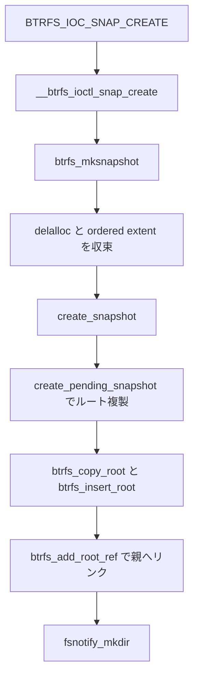

# 第15章 btrfs のスナップショットと subvolume

> **本章で読むソース**
>
> - [`fs/btrfs/ioctl.c` L902-L943](https://github.com/gregkh/linux/blob/v6.18.38/fs/btrfs/ioctl.c#L902-L943)
> - [`fs/btrfs/ioctl.c` L707-L732](https://github.com/gregkh/linux/blob/v6.18.38/fs/btrfs/ioctl.c#L707-L732)
> - [`fs/btrfs/ioctl.c` L956-L985](https://github.com/gregkh/linux/blob/v6.18.38/fs/btrfs/ioctl.c#L956-L985)
> - [`fs/btrfs/ioctl.c` L1190-L1220](https://github.com/gregkh/linux/blob/v6.18.38/fs/btrfs/ioctl.c#L1190-L1220)
> - [`fs/btrfs/ioctl.c` L935-L943](https://github.com/gregkh/linux/blob/v6.18.38/fs/btrfs/ioctl.c#L935-L943)
> - [`fs/btrfs/inode.c` L6496-L6500](https://github.com/gregkh/linux/blob/v6.18.38/fs/btrfs/inode.c#L6496-L6500)

## この章の狙い

btrfs における **subvolume** と **スナップショット** の作成経路を `btrfs_mksubvol` と `create_snapshot` から追う。
CoW によりルートツリーを複製するだけで時点コピーが成立する仕組みを読む。

## 前提

- 前章：[btrfs の transaction、tree-log、recovery](14-btrfs-transaction-tree-log-recovery.md)
- [btrfs の CoW と extent 管理](13-btrfs-cow-extent.md)
- [マウント namespace](../../vfs/part02-mount-inode/08-mount-namespace.md)

## subvolume 作成の入口

`btrfs_mksubvol` は親ディレクトリ配下に新しい subvolume ルートを作る。
`snap_src` が NULL なら空の subvolume、非 NULL ならスナップショット作成へ分岐する。

[`fs/btrfs/ioctl.c` L902-L943](https://github.com/gregkh/linux/blob/v6.18.38/fs/btrfs/ioctl.c#L902-L943)

```c
static noinline int btrfs_mksubvol(struct dentry *parent,
				   struct mnt_idmap *idmap,
				   struct qstr *qname, struct btrfs_root *snap_src,
				   bool readonly,
				   struct btrfs_qgroup_inherit *inherit)
{
	struct inode *dir = d_inode(parent);
	struct btrfs_fs_info *fs_info = inode_to_fs_info(dir);
	struct dentry *dentry;
	struct fscrypt_str name_str = FSTR_INIT((char *)qname->name, qname->len);
	int ret;

	ret = down_write_killable_nested(&dir->i_rwsem, I_MUTEX_PARENT);
	if (ret == -EINTR)
		return ret;

	dentry = lookup_one(idmap, qname, parent);
	ret = PTR_ERR(dentry);
	if (IS_ERR(dentry))
		goto out_unlock;

	ret = btrfs_may_create(idmap, dir, dentry);
	if (ret)
		goto out_dput;

	/*
	 * even if this name doesn't exist, we may get hash collisions.
	 * check for them now when we can safely fail
	 */
	ret = btrfs_check_dir_item_collision(BTRFS_I(dir)->root, dir->i_ino, &name_str);
	if (ret)
		goto out_dput;

	down_read(&fs_info->subvol_sem);

	if (btrfs_root_refs(&BTRFS_I(dir)->root->root_item) == 0)
		goto out_up_read;

	if (snap_src)
		ret = create_snapshot(snap_src, dir, dentry, readonly, inherit);
	else
		ret = create_subvol(idmap, dir, dentry, inherit);
```

`subvol_sem` は subvolume 一覧変更の並行性を制御する。

## create_snapshot の準備

スナップショットはソース subvolume のルートツリーを CoW 複製して新ルートを作る。
開始前に delalloc を flush し、進行中書き込みを COW モードへ寄せる。

[`fs/btrfs/ioctl.c` L707-L732](https://github.com/gregkh/linux/blob/v6.18.38/fs/btrfs/ioctl.c#L707-L732)

```c
static int create_snapshot(struct btrfs_root *root, struct inode *dir,
			   struct dentry *dentry, bool readonly,
			   struct btrfs_qgroup_inherit *inherit)
{
	struct btrfs_fs_info *fs_info = inode_to_fs_info(dir);
	struct inode *inode;
	struct btrfs_pending_snapshot *pending_snapshot;
	unsigned int trans_num_items;
	struct btrfs_trans_handle *trans;
	struct btrfs_block_rsv *block_rsv;
	u64 qgroup_reserved = 0;
	int ret;

	/* We do not support snapshotting right now. */
	if (btrfs_fs_incompat(fs_info, EXTENT_TREE_V2)) {
		btrfs_warn(fs_info,
			   "extent tree v2 doesn't support snapshotting yet");
		return -EOPNOTSUPP;
	}

	if (btrfs_root_refs(&root->root_item) == 0)
		return -ENOENT;

	if (!test_bit(BTRFS_ROOT_SHAREABLE, &root->state))
		return -EINVAL;

```

swapfile 稼働中の subvolume はスナップショット不可である。
extent tree v2 など未対応機能フラグでも拒否する。

## btrfs_mksnapshot の直列化

ioctl 経路の `btrfs_mksnapshot` はソースルートへ `snapshot_lock` を取り、ordered extent を待ってから `btrfs_mksubvol` を呼ぶ。

[`fs/btrfs/ioctl.c` L956-L985](https://github.com/gregkh/linux/blob/v6.18.38/fs/btrfs/ioctl.c#L956-L985)

```c
static noinline int btrfs_mksnapshot(struct dentry *parent,
				   struct mnt_idmap *idmap,
				   struct qstr *qname,
				   struct btrfs_root *root,
				   bool readonly,
				   struct btrfs_qgroup_inherit *inherit)
{
	int ret;

	/*
	 * Force new buffered writes to reserve space even when NOCOW is
	 * possible. This is to avoid later writeback (running delalloc) to
	 * fallback to COW mode and unexpectedly fail with ENOSPC.
	 */
	btrfs_drew_read_lock(&root->snapshot_lock);

	ret = btrfs_start_delalloc_snapshot(root, false);
	if (ret)
		goto out;

	/*
	 * All previous writes have started writeback in NOCOW mode, so now
	 * we force future writes to fallback to COW mode during snapshot
	 * creation.
	 */
	atomic_inc(&root->snapshot_force_cow);

	btrfs_wait_ordered_extents(root, U64_MAX, NULL);

	ret = btrfs_mksubvol(parent, idmap, qname, root, readonly, inherit);
```

スナップショット時点の整合のため、進行中 I/O と delalloc を先に収束させる。

## ioctl からのユーザー操作

ユーザー空間は `BTRFS_IOC_SNAP_CREATE` 等で `__btrfs_ioctl_snap_create` に入る。
ソース fd と親ディレクトリ上の名前を渡す。

[`fs/btrfs/ioctl.c` L1190-L1220](https://github.com/gregkh/linux/blob/v6.18.38/fs/btrfs/ioctl.c#L1190-L1220)

```c
static noinline int __btrfs_ioctl_snap_create(struct file *file,
				struct mnt_idmap *idmap,
				const char *name, unsigned long fd, bool subvol,
				bool readonly,
				struct btrfs_qgroup_inherit *inherit)
{
	int ret = 0;
	struct qstr qname = QSTR_INIT(name, strlen(name));

	if (!S_ISDIR(file_inode(file)->i_mode))
		return -ENOTDIR;

	ret = mnt_want_write_file(file);
	if (ret)
		goto out;

	if (strchr(name, '/')) {
		ret = -EINVAL;
		goto out_drop_write;
	}

	if (qname.name[0] == '.' &&
	   (qname.len == 1 || (qname.name[1] == '.' && qname.len == 2))) {
		ret = -EEXIST;
		goto out_drop_write;
	}

	if (subvol) {
		ret = btrfs_mksubvol(file_dentry(file), idmap, &qname, NULL,
				     readonly, inherit);
	} else {
```

スナップショット元は同一ファイルシステム内の subvolume ルート inode でなければならない。

## create_subvol による空 subvolume

新規 subvolume は `create_subvol` が空き objectid を取り、`btrfs_new_inode` でディレクトリ inode を作る。
qgroup レベルが 0 でない objectid は拒否する。

[`fs/btrfs/ioctl.c` L499-L539](https://github.com/gregkh/linux/blob/v6.18.38/fs/btrfs/ioctl.c#L499-L539)

```c
static noinline int create_subvol(struct mnt_idmap *idmap,
				  struct inode *dir, struct dentry *dentry,
				  struct btrfs_qgroup_inherit *inherit)
{
	struct btrfs_fs_info *fs_info = inode_to_fs_info(dir);
	struct btrfs_trans_handle *trans;
	struct btrfs_key key;
	struct btrfs_root_item *root_item;
	struct btrfs_inode_item *inode_item;
	struct extent_buffer *leaf;
	struct btrfs_root *root = BTRFS_I(dir)->root;
	struct btrfs_root *new_root;
	struct btrfs_block_rsv block_rsv;
	struct timespec64 cur_time = current_time(dir);
	struct btrfs_new_inode_args new_inode_args = {
		.dir = dir,
		.dentry = dentry,
		.subvol = true,
	};
	unsigned int trans_num_items;
	int ret;
	dev_t anon_dev;
	u64 objectid;
	u64 qgroup_reserved = 0;

	root_item = kzalloc(sizeof(*root_item), GFP_KERNEL);
	if (!root_item)
		return -ENOMEM;

	ret = btrfs_get_free_objectid(fs_info->tree_root, &objectid);
	if (ret)
		goto out_root_item;

	/*
	 * Don't create subvolume whose level is not zero. Or qgroup will be
	 * screwed up since it assumes subvolume qgroup's level to be 0.
	 */
	if (btrfs_qgroup_level(objectid)) {
		ret = -ENOSPC;
		goto out_root_item;
	}
```

## create_pending_snapshot によるルート複製

transaction commit 時に `create_pending_snapshots` が `create_pending_snapshot` を呼ぶ。
ソース subvolume のルートノードだけを `btrfs_cow_block` と `btrfs_copy_root` で複製し、新 objectid として tree root へ登録する。
配下のデータブロックとメタデータブロックは参照カウントで共有される。

[`fs/btrfs/transaction.c` L1787-L1828](https://github.com/gregkh/linux/blob/v6.18.38/fs/btrfs/transaction.c#L1787-L1828)

```c
	old = btrfs_lock_root_node(root);
	ret = btrfs_cow_block(trans, root, old, NULL, 0, &old,
			      BTRFS_NESTING_COW);
	if (unlikely(ret)) {
		btrfs_tree_unlock(old);
		free_extent_buffer(old);
		btrfs_abort_transaction(trans, ret);
		goto fail;
	}

	ret = btrfs_copy_root(trans, root, old, &tmp, objectid);
	/* clean up in any case */
	btrfs_tree_unlock(old);
	free_extent_buffer(old);
	if (unlikely(ret)) {
		btrfs_abort_transaction(trans, ret);
		goto fail;
	}
	/* see comments in should_cow_block() */
	set_bit(BTRFS_ROOT_FORCE_COW, &root->state);
	smp_mb__after_atomic();

	btrfs_set_root_node(new_root_item, tmp);
	/* record when the snapshot was created in key.offset */
	key.objectid = objectid;
	key.type = BTRFS_ROOT_ITEM_KEY;
	key.offset = trans->transid;
	ret = btrfs_insert_root(trans, tree_root, &key, new_root_item);
	btrfs_tree_unlock(tmp);
	free_extent_buffer(tmp);
	if (unlikely(ret)) {
		btrfs_abort_transaction(trans, ret);
		goto fail;
	}

	/*
	 * insert root back/forward references
	 */
	ret = btrfs_add_root_ref(trans, objectid,
				 btrfs_root_id(parent_root),
				 btrfs_ino(parent_inode), index,
				 &fname.disk_name);
```

作成時にコピーするのはルート B-tree ブロックと root item 等のメタデータであり、ファイルデータ全体の複製ではない。

> **7.x 系での変化（v7.1.3）**
>
> [`create_pending_snapshot`](https://github.com/gregkh/linux/blob/v7.1.3/fs/btrfs/transaction.c#L1666) のルート複製は実装が変わっている。
> v6.18.38 では [`btrfs_lock_root_node` のあと `btrfs_cow_block` を挟んでから `btrfs_copy_root` を呼ぶ](https://github.com/gregkh/linux/blob/v6.18.38/fs/btrfs/transaction.c#L1787-L1797)が、v7.1.3 では [`btrfs_copy_root(trans, root, root_eb, ...)` を L1820 で直呼び](https://github.com/gregkh/linux/blob/v7.1.3/fs/btrfs/transaction.c#L1819-L1826)する。
> その後の [`btrfs_insert_root`](https://github.com/gregkh/linux/blob/v7.1.3/fs/btrfs/transaction.c#L1836-L1838) と [`btrfs_add_root_ref`（L1847 付近）](https://github.com/gregkh/linux/blob/v7.1.3/fs/btrfs/transaction.c#L1847-L1850) は継続する。

## create_snapshot の transaction commit

スナップショットは `pending_snapshot` を transaction に載せ、`btrfs_commit_transaction` でルートツリー複製を確定する。
メタデータ予約は `btrfs_subvolume_reserve_metadata` で先行する。

[`fs/btrfs/ioctl.c` L774-L789](https://github.com/gregkh/linux/blob/v6.18.38/fs/btrfs/ioctl.c#L774-L789)

```c
	trans = btrfs_start_transaction(root, 0);
	if (IS_ERR(trans)) {
		ret = PTR_ERR(trans);
		goto fail;
	}
	ret = btrfs_record_root_in_trans(trans, BTRFS_I(dir)->root);
	if (ret) {
		btrfs_end_transaction(trans);
		goto fail;
	}
	btrfs_qgroup_convert_reserved_meta(root, qgroup_reserved);
	qgroup_reserved = 0;

	trans->pending_snapshot = pending_snapshot;

	ret = btrfs_commit_transaction(trans);
```

## 処理の流れ



空 subvolume は `create_subvol` が新ルートを生成する点だけが異なる。

## 高速化と最適化の工夫

スナップショットはルート B-tree ブロックと root メタデータだけを CoW 複製するため、作成コストはファイルサイズに比例しない。
`snapshot_force_cow` は作成中の NOCOW 書き込みを抑え、共有ブロック破壊を防ぐ。
`btrfs_wait_ordered_extents` で I/O 完了を待つコストはあるが、不整合な中間状態の公開を避ける。

## まとめ

btrfs の subvolume は独立したルートツリーを持つ名前空間単位である。
スナップショットはルートノードを CoW 複製して新 subvolume を作り、データとメタデータブロックは共有のまま時点を固定する。

## 関連する章

- [btrfs の transaction、tree-log、recovery](14-btrfs-transaction-tree-log-recovery.md)
- 次章：[btrfs の checksum と read repair](16-btrfs-checksum-read-repair.md)
